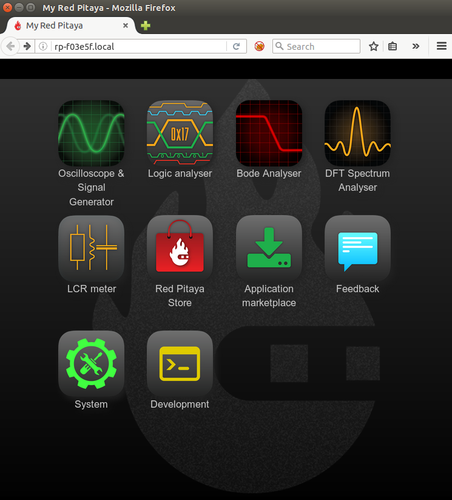

Quick start
###########

.. note::

    USERS THAT ARE RUNNING OS 0.96 ARE ALSO ABLE TO CONNECT TO THE RED PITAYA WITHOUT USING ONLINE DISCOVERY SERVICE


.. note::
    
    If you are Windows user make sure to install Bonjour Print Services available `here <www.redpitaya.com/bonjour>`_.

.. note::

   Make shure that your SD card is programmed and inserted into RED PITAYA. However older versions were shipped with 
   blank SD cards. To properly preapare it please follow the steps in the Prepare SD card paragraph.    
    
This is the most common and recommended way of connecting and using your Red Pitaya STEMLab boards. Your LAN network 
needs to have DHCP settings enabled which is the case in majority of the local networks,  whit this,  simple “plug and
play”  approach is enabled. Having STEMLab board connected the local network will enable quick access to all Red 
Pitaya applications using only your web browser. Simply follow this 3 simple steps:

    
    1. Connect power supply to the Red Pitaya STEMlab board
    2. Connect STEMlab board to the router or direc to the PC ethernet socket
    3. Open your web browser and in the URL filed type:   ``rp-xxxxxx.local/``
       
.. note::

    ``xxxxxx`` are the last 6 characters from MAC address of your STEMlab board. MAC address is written on the 
    Ethernet connector.
    
.. figure:: connect-2.png
    
    Figure 1: Connecting your STEMlab board to the LAN network.

After the **third step** you will get a Red Pitaya STEMlab main page as shown below.

    Figure 2: STEMlab main page user interface.
    
.. TODO dodaj referenco na Prepare SD card

   
