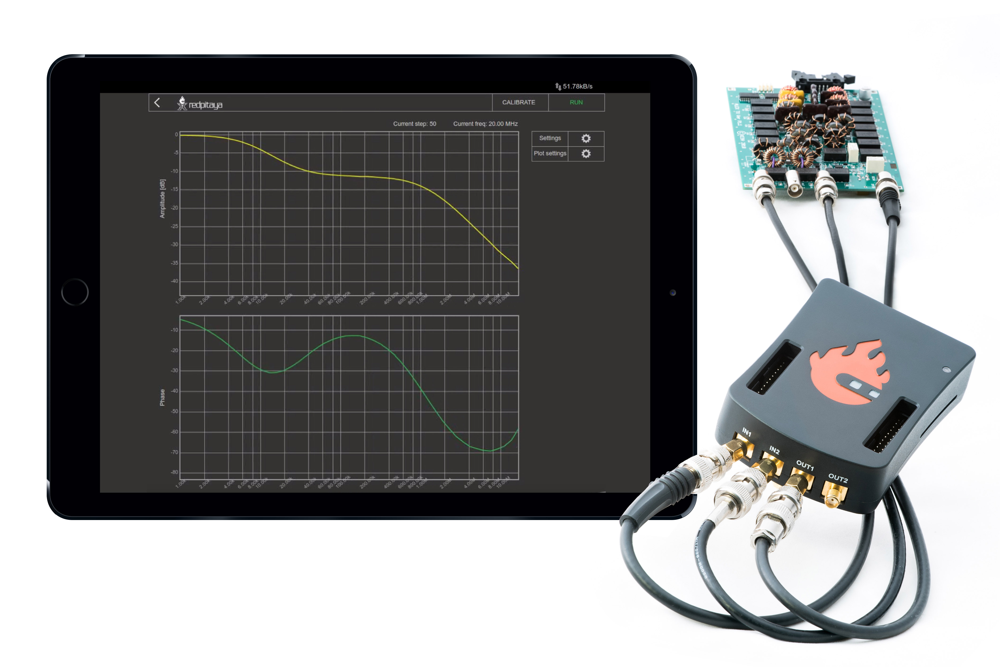
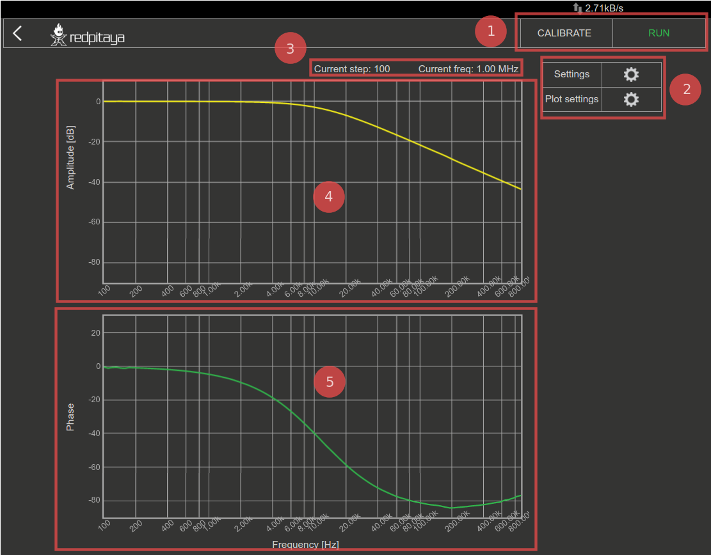
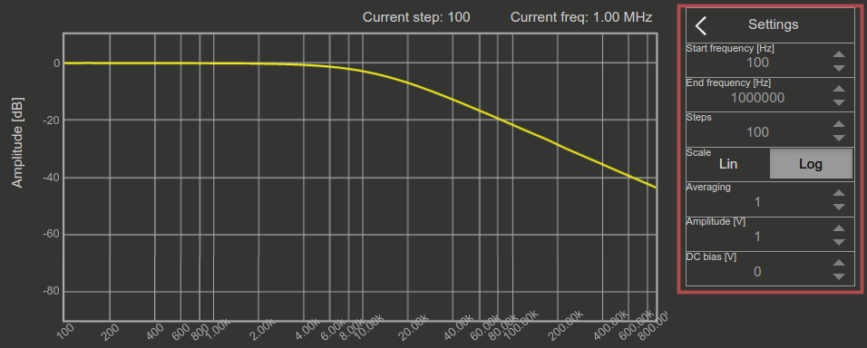
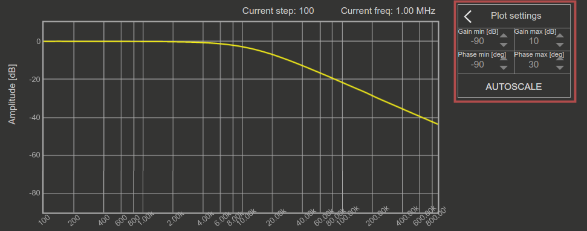
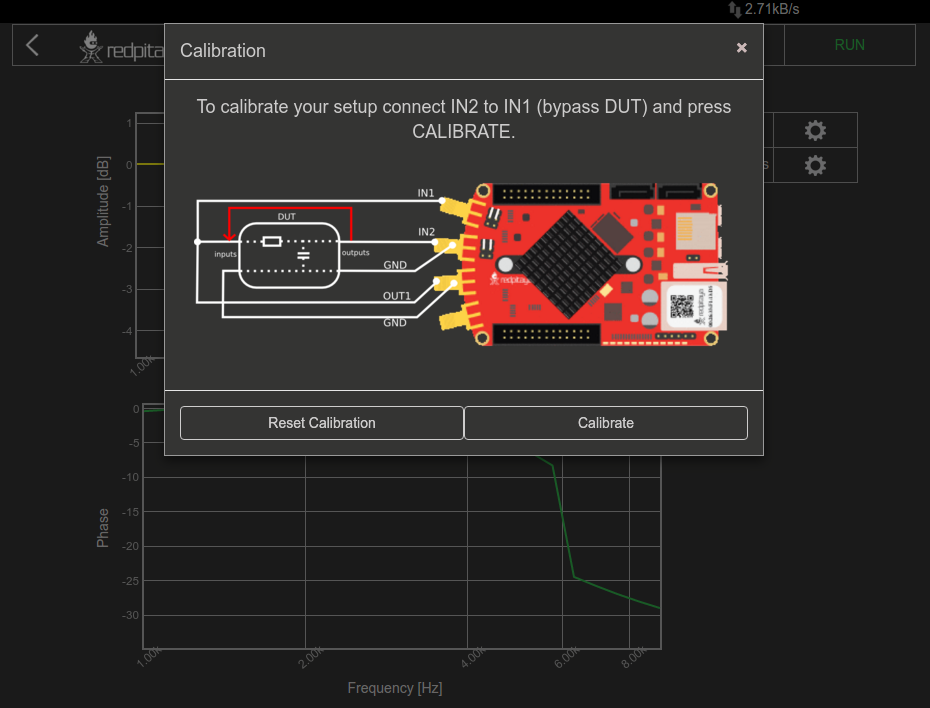
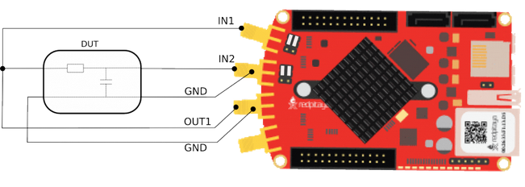

Bode Analyzer
#############

This application will turn your RedPitaya into an affordable Bode analyzer. It is the perfect tool for educators, 
students, makers, hobbyists and professionals seeking affordable, highly functional test and measurement equipment. 
The Bode analyzer is an ideal application for measuring frequency responses of the passive/active filters, complex 
impedances and any other electronic circuit. The Gain/Phase frequency response can be used to characterize any device
under test completely, you can perform linear and logarithmic sweeps. Gain and Phase can be measured from 1Hz to 
60MHz. The basic user interface enables quick interaction and parameter settings. The Bode analyzer can be used for 
the measurement of Stability of control circuits such as the DC/DC converters in power supplies, Influence of 
termination on amplifiers or filters, Ultrasonic and piezo electric systems and similar. All Red Pitaya applications 
are web-based and don’t require the installation of any native software. Users can access them via a browser using 
their smartphone, tablet or a PC running any popular operating system (MAC, Linux, Windows, Android and iOS). 
The graphical user interface of the Bode analyzer application is shown below.

The graphical interface is divided into 5 areas:

1. **Stop/Run button:** It is used to start and stop measurement. **Calibrate button:** When the selected calibration 
   of the setup is started.
2. **Measurement settings panel:** It is used for setting the measurement parameters such as the frequency range, 
   scale, number of steps, excitation signal amplitude, excitation signal DC bias and averaging number.

3. **Plot settings panel:** It is used to set the Gain and Phase graph ranges as also manual or auto scale mode.

4. **Gain graph:** The Gain frequency response of the DUT (device under test) is plotted for the selected frequency 
   range.
#. **Phase graph:** The Phase frequency response of the DUT (device under test) is plotted for the selected frequency 
   range.

FEATURES
********

Main feature of the Bode analyzer application are described below:

    - Measured parameters: Gain, Phase
    - The Bode analyzer application will enable you to measure the gain and phase frequency response for the desired 
      DUT (device under test)
    - The frequency sweep range of the Bode analyzer application is from 1Hz to 60MHz with a 1Hz resolution
    - Linear and Logarithmic Frequency sweep modes are available. The Logarithmic sweep mode (scale) enables 
      measurements in large frequencies range, while the linear sweep mode is used for measurement in the small 
      frequencies range.
    - excitation signal parameters (amplitude and DC bias) can be adjusted to make measurements in different 
      sensitivities and conditions (amplifiers etc.).
    - The calibration function enables calibrating long leads and to remove leads and cables effect on final 
      measurements. The calibration will also calibrate your RedPitaya if any parasitics effects are present.   
   

   
   
Specifications
**************  

+--------------------------------------------+-------------------------------+--------------------------------+
|                                            | STEMlab 125 - 10              |  STEMlab 125 - 14              |
+--------------------------------------------+-------------------------------+--------------------------------+
| Frequency span                             | 1Hz-50MHz                     |  1Hz-60MHz                     |
+--------------------------------------------+-------------------------------+--------------------------------+
| Frequency resolution                       | 1Hz                           |  1Hz                           |
+--------------------------------------------+-------------------------------+--------------------------------+
| Excitation signal amplitude                | 0 - 1 V                       |  0 - 1 V                       |
+--------------------------------------------+-------------------------------+--------------------------------+
| Excitation signal DC bias                  | 0 - 0.5 V                     |  0 - 0.5 V                     |
+--------------------------------------------+-------------------------------+--------------------------------+
| Resolution                                 | 10bit                         |  14bit                         |
+--------------------------------------------+-------------------------------+--------------------------------+
| Maximum number of steps per measurement    | 1000                          |  1000                          |
+--------------------------------------------+-------------------------------+--------------------------------+
| Max input amplitude                        | | ± 1 V (LV jumper settings), | |  ± 1 V (LV jumper settings), |
|                                            | | ± 20 V (HV jumper settings) | |  ± 20 V (HV jumper settings) |
+--------------------------------------------+-------------------------------+--------------------------------+
| Measured parameters                        | Gain, Phase                   |  Gain, Phase                   |
+--------------------------------------------+-------------------------------+--------------------------------+
| Frequency sweep modes                      | Linear/Logarithmic            |  Linear/Logarithmic            |
+--------------------------------------------+-------------------------------+--------------------------------+

.. note::

    Plese take care that :ref:`position <anain>` are set to the correct input rage!
    

HW connections
**************

When using the Bode analyzer application, please follow the connection diagram described below. Also use the 50 Ohm 
termination on the OUT1.

