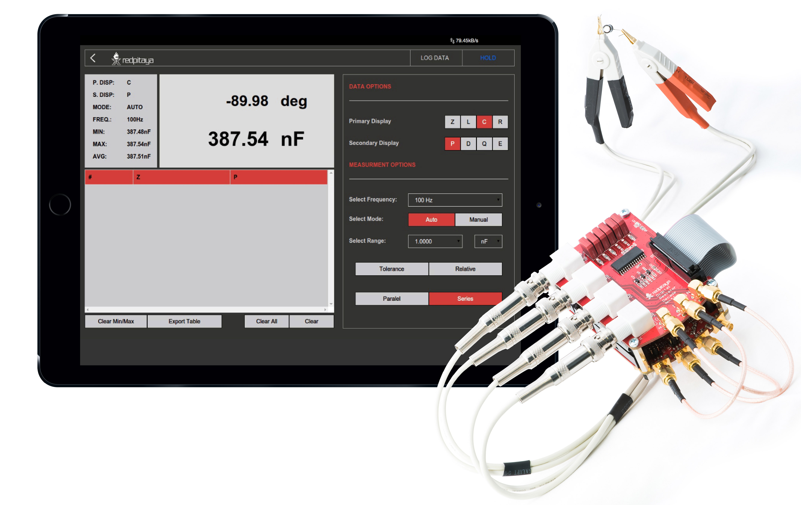
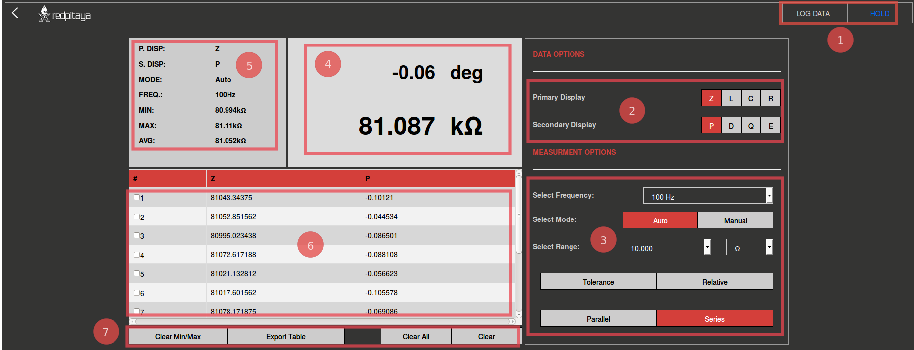
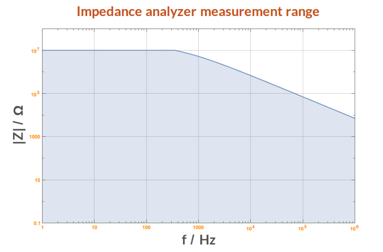
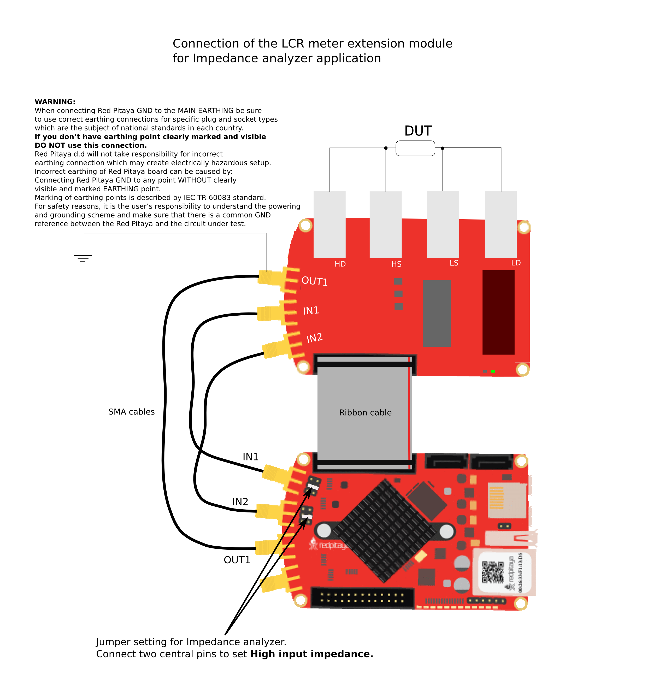
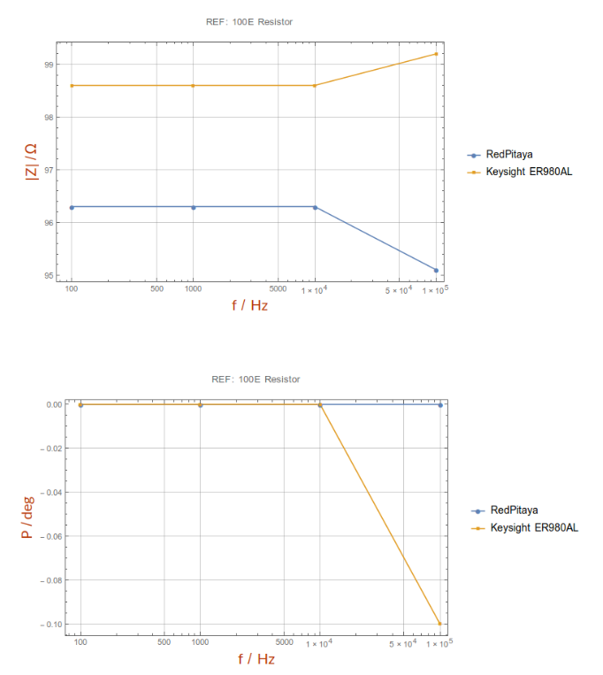
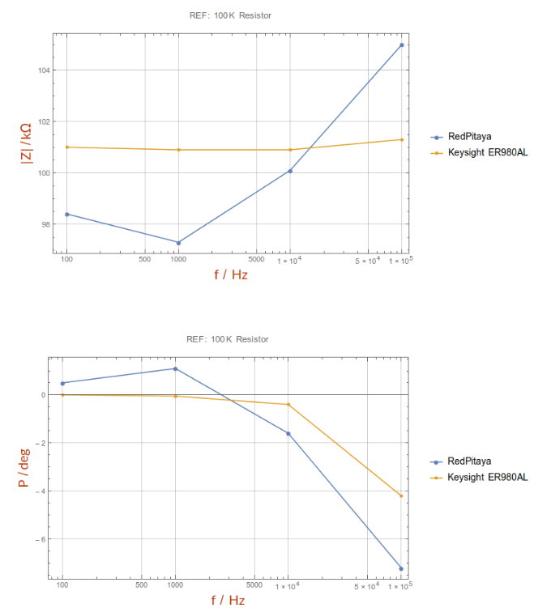
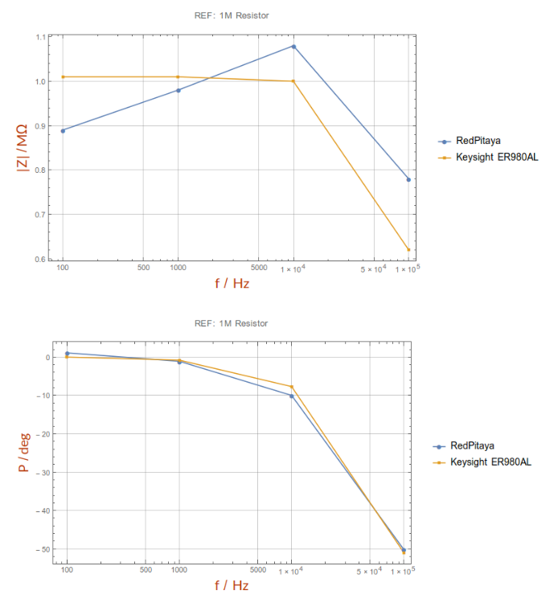
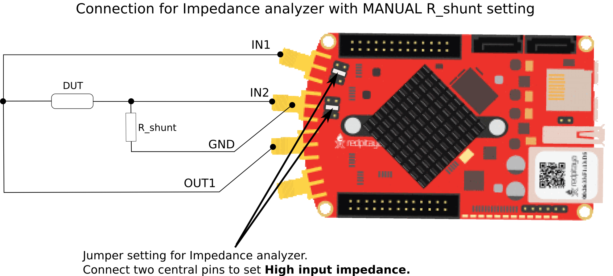

*********
LCR meter
*********

This application will turn your STEMLab into an affordable LCR meter. It is the perfect tool for educators, students, 
makers, hobbyists and professionals seeking affordable, highly functional test and measurement equipment. The 
Resistor, Capacitors and Inductors are basic components of all electrical circuits and working on your projects you 
will definitely need to measure some components laying around on your working bench. The STEMLab LCR meter will enable 
you to do that quickly and accurately just by switching from one application to another. 

.. note:: 

    To use the LCR meter application an additional extension module is needed. The LCR meter 
    `extension module <http://store.redpitaya.com/red-pitaya-shield-23.html>`_ is available on our web store, 
    `http://store.redpitaya.com/ <http://store.redpitaya.com/>`. 
    
All Red Pitaya applications are web-based and don’t require the installation of any native software. Users can access 
them via a browser using their smartphone, tablet or a PC running any popular operating system (MAC, Linux, Windows,
Android and iOS). The elements on the LCR meter application are arranged logically and offer a familiar user interface
similar to bench LCR meters.

The graphical interface is divided into 6 main areas:

    1. **Hold/Run button:** It is used to start and stop measuring. Log data button: When selected, the measurements 
       of parameters selected in the “Data options” field are logged in the table shown in area 6.
       
    2. **Data options panel:** It is used for selecting the desired parameter for which the measurement will be
       displayed on the Main window panel shown on area 4.
       
    3. **Measurement option panel:** It is used to select a measuring frequency, range mode and range value. The user
       can select between the Parallel and Series measuring modes as well as between the Tolerance, Relative or Normal 
       modes (modes described in the features section)   
       
    4. **Main display:** On this panel the measurements of parameter selected in “Data option” field are shown. Where 
       the Primary parameter is shown with a larger font and the secondary parameter with smaller one. This is a very 
       common practice since by reading values from the display the user can automatically see the most important 
       results.   
    5. **Secondary display:** On the secondary display the main settings are shown: current selected parameters,
       measuring frequency and range mode. Also the Min, Max and Average value or Primary parameters are shown.   
       
    6. **Logging table:** Is used to log and export measured data. Logging is started by selecting the “Log data” 
       button.
       
    7. **Option buttons field:** I used to manipulate with the table. The “Clear Min/Max” button will reset the Min 
       and Max value on the Secondary display.
       
       
       
FEATURES
********

The main features of the LCR meter applications are described below:

MEASURED PRIMARY PARAMETERS: Z, L, C, R
=======================================

LCR meter application will enable you to measure basic parameters of the passive electrical components: 
R – resistance, C – capacitance, L – inductance and Z – impedance.

MEASURED SECONDARY PARAMETERS: P, D, Q, E
=========================================

Alongside main parameters the secondary parameters are also measured and calculated. These parameters are common in 
describing the properties and the quality of the passive components. P – phase of the impedance (phase between current 
and voltage on measured component), D – dissipation factor (often used to quantify the quality of the capacitor), 
Q – quality factor (often used to quantify the quality of the inductor), ESR – equivalent series resistance

SELECTABLE FREQUENCIES: 100HZ, 1KHZ, 10KHZ, 100KHZ
==================================================

LCR meter enables measurements at 4 different frequencies (100Hz, 1kHz, 10kHz, 100kHz). The user can select desired
frequency and the LCR application will use sine signals with the selected frequency to measure the impedance.

RANGE MODES: AUTO, MANUAL
=========================

Since the measured values are unknown, the LCR meter will adjust the measuring range providing the best accuracy. If 
the user expects some value in creating ranges, then the Manual mode can be used.

    - Measurements modes: Tolerance, Relative, Normal The “Tolerance” and “Relative” buttons are used for measuring in
      the Tolerance and Relative mode. When deselected, the LCR meter measures in the Normal mode.
    - Tolerance mode: the last value measured before clicking the Tolerance button is saved and used to calculate the 
      percentage difference between the new value and the saved one.
    - Relative mode: the last value measured before clicking the Relative button is saved and used to calculate
      relative difference between the new value and the saved one. Equivalent Parameters calculation circuit:
      Parallel, Series The Parallel and Series measuring modes refer to using the Series or Parallel equivalent 
      circuit for the parameters (R, C, L...) calculation from the measured Impedance Z \*. LCR meters will only 
      measure Z as the complex value Z=\|Z\|e^(jP) where P is the measured phase and \|Z\| is the impedance amplitude.
      All other parameters are calculated from the Series or the Parallel equivalent circuit.
    - Export of measured data in .csv format
    - Min, Max, Average measurements       

Frequency response analyzer enables measurements of frequency amplitude response of desired DUT (Device Under Test).
The measurements of frequency response are in range from 0Hz to 60MHz.
Measurements are in real time and the frequency range is NOT adjustable.
Measurement can be done for each channel independently, i.e it enables simultaneously measurements of two DUTs.
How to connect DUT to the Red Pitaya when using Frequency Response analyser is shown in picture below.

On pictures below are shown comparison measurements of the selected DUT. Measurements are taken with Red Pitaya and 
Keysight precision LCR meter. From this plots you can extract basic Red Pitaya accuracy. Notice Red Pitaya LCR meter / Impedance analyzer are not certificated for certain accuracy or range.

   
Impedance analyzer application can be used without LCR Extension module using manual setting of shunt resistor. This option is described below. Notice that you will need to change “C_cable” parameter in the code when using your setup.

