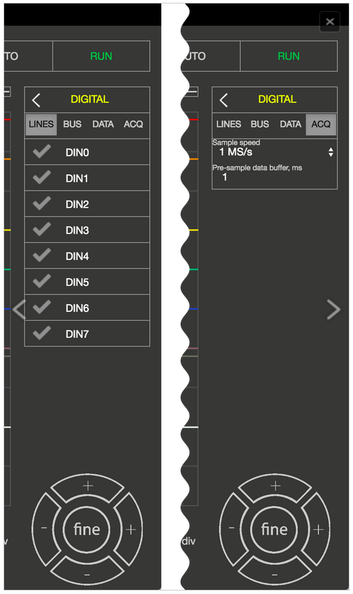

Logic Analyzer
##############

The Logic Analyzer application enables the representation of the binary states of digital signals. The Logic Analyzer 
can both deal with purely binary signals, such as GPIO outputs of the Raspberry Pi or Arduino board, as well as 
analyze different bus (I2C, SPI, and UART) and decode the transmitted data. All Red Pitaya applications are web-based 
and do not require the installation of any native software. Users can access them via a web browser using their 
smartphone, tablet or a PC running any popular operating system (MAC, Linux, Windows, Android, and iOS).

.. note:: 

     To use the Logic analyzer PRO application an additional extension module is needed. Module can be purchased from
     Red Pitaya `store <http://store.redpitaya.com/>`_. 

Logic Analyzer application possibilities:

   1. **Logic Analyzer Basic - Logic Analyzer extension module not reacquired** – Using directly the GPIO expansion 
      connector of the STEMLab board. **Works only with STEMlab 125-10!**
   2. **Logic Analyzer PRO - Logic Analyzer extension module reacquired** – Enabling different logic levels, board 
      protection and higher performances. **Works with STEMlab 125-14 & STEMlab 125-10**

The graphical user interface of the Logic Analyzer fits well into the overall design of the Red Pitaya applications 
providing the same operating concept. The Logic Analyzer user interface is shown below.

Apart from the actual graph, there are again 5 key areas/elements, in which the surface is divided:
   
   1. **Auto:** Resets the zoom and brings the trigger event in the middle of the graph.
   #. **Run / Stop:** Starts recording the input signals, and interrupts it when the recording is active.
   #. **Channels / trigger / Measuring Tools:** This menu provides controls for inputs, triggers, and guides.
   #. **Axis control panel:** The horizontal +/- buttons enable you to select the scaling of the X axis and to change 
      it, and to select the time range displayed in the graph. The vertical +/- buttons change the Y axis, and thus 
      the height of the graph display. In addition, the setting for the time frame, trigger and sampling rate are 
      displayed.
   #. **Status Display:** Displays information about the current state of the recording (stop, wait, ready).
   
FEATURES
********

ANALYZING BINARY SIGNALS
========================

By selecting the gear button behind the DIGITAL selection field you enter the menu for the channel configuration. In 
the LINES register, the channels can be activated or deactivated by simply clicking the check mark. As long as no bus 
systems have been configured, the channels operate as purely digital inputs and correspondingly show the progress. The 
tab ACQ opens the selection field for the Sample rate settings. When selecting the values there is one thing to note: 
the sample rate has a significant influence on the time section, which can be represented. The memory depth of the 
Logic Analyzer applications is 1 MS, so it can store and display 1,000,000 binary values. From this it is clear that 
the sampling rate determines how many values are recorded per second. If we choose the highest sampling rate 
(125MS/s), 125,000,000 values would be recorded per second. Since 1,000,000 values can be stored is the time memory, 
we get a 0.008 second time window. With a sampling rate of 1MS/s, the time window of the recorded signal will be one 
full second.

When the Pre-sample data buffer value is set, at which point of the recording the trigger event is located. This makes
particular sense if you want to find out what happened before the defined trigger event. To illustrate with an 
example: the sample rate is set to 4MS / s, the stored time segment thus amounts to approximately 0.25s = 250ms. If 
the Pre-sample data buffer is set to 10ms, then the recorded signal shows what has happened 10ms before the event, and
240ms after the event.

TRIGGER:
========

By clicking the gear behind TRIG settings, the trigger menu is opened. Each channel can be set as a trigger source
with the desired condition. For acquisition to start, the Trigger source and Rising Edge needs to be defined.
The possible criteria for Trigger event are next:

**X - Ignore** no event
**R - Rising** rising edge
**F - Falling** Falling edge
**E - Either** Edge change (rising or falling edge)

By clicking the RUN button the recording is started. The status display informs you whether the process is still
running (WAITING) or has already been completed (DONE). After finishing the acquisition, the results are displayed in
a graph. Additional trigger options LOW and HIGH are used for the so called Patterned triggering. For example: If you 
set the trigger source to be DIN0 – Rising edge (to have one channel defined as a trigger source with a rising or 
falling edge is a mandatory condition for the acquisition to start), DIN1 to HIGH and DIN2 to LOW this will cause such
a behavior that the application logic will wait for the state where DIN0 goes from 0 to 1, DIN1 is 1 and DIN2 is 0 to 
start the acquisition.

DECODE BUS DATA:
================

In the DIGITAL → BUS menu the decoding of the desired lines can be selected. Up to 4 buses can be defined. The 
available decoding protocols are I2C, UART, and SPI. By selecting the desired protocol, the setting menu for the 
selected protocol is opened.

Two options are possible for the display of the decoded data: firstly, the data is placed as a separate layer in the 
graph directly on the signal. Secondly, using the DIGITAL → DATA menu where the decoded data are represented in a 
table format. You can select ASCII, DEC, BIN and HEX data formatting. With the EXPORT button the decoded data can be 
packed into a CSV file. This then ends up directly in the download folder and can be used for further analysis.

CURSORS:
========

As with the Oscilloscope the Logic Analyzer App also provides CURSORS for quick measurements. Because there are no 
variable amplitude readings but only discrete signal levels, the cursors are available exclusively for the X axis. 
When enabled, the cursors will show the relative time respectively to zero point (trigger event) and the difference 
between the two.

SPECIFICATIONS
**************

+-------------------------+----------------------+----------------------+
|                         | Logic Analyzer Basic | Logic Analyzer PRO   |
+-------------------------+----------------------+----------------------+
| Channels                | 8th                  | 8th                  |
+-------------------------+----------------------+----------------------+
| Sampling rate (max.)    | 12MS/s               | 125MS/s              |
+-------------------------+----------------------+----------------------+
| Maximum Input Frequency | 3MHz                 | 50MHz                |
+-------------------------+----------------------+----------------------+
| Supported bus protocols | I2C, SPI, UART       | I2C, SPI, UART       |
+-------------------------+----------------------+----------------------+
| Input voltage           | 3.3V                 | 2.5 ... 5.5V         |
+-------------------------+----------------------+----------------------+
| Overload protection     | not available        | integrated           |
+-------------------------+----------------------+----------------------+
| Level thresholds        | | 0.8V (low)         | | 0.8V (low)         |
|                         | | 2.0V (high)        | | 2.0V (high)        |
+-------------------------+----------------------+----------------------+
| Input impedance         | 100k, 3 pF           | 100k, 3 pF           |
+-------------------------+----------------------+----------------------+
| Trigger types           | Level, edge, pattern | Level, edge, pattern |
+-------------------------+----------------------+----------------------+
| Memory depth            | 1 MS (typical)       | 1 MS (typical)       |
+-------------------------+----------------------+----------------------+
| Sampling interval       | 84ns                 | 8ns                  |
+-------------------------+----------------------+----------------------+
| Minimum pulse duration  | 100ns                | 10ns                 |
+-------------------------+----------------------+----------------------+

Hardware/Connections
====================

Alongside the Logic analyzer application for maximal performance and protection of your STEMLab board the Logic 
analyzer extension module (Logic Analyzer PRO) is recommended. Using the LA extension module is straightforward, just 
plug it on your STEMLab and connect the leads to the desired measurement points.

To use the Logic analyzer without the extension module (Logic Analyzer Basic) you need to be more careful in 
connecting the Logic analyzer probes to the extension connector :ref:`E1 <E1>` on the STEMLab board. The pins used for Logic 
analyzer board are shown in picture below.

.. note:: 
    
    Using directly the GPIO expansion connector :ref:`E1 <E1>` pins of the STEMLab board w orks only with STEMlab 125-10! Picture 
    bellow(left) shows connection for the STEMlab 125 – 10 board.
    

