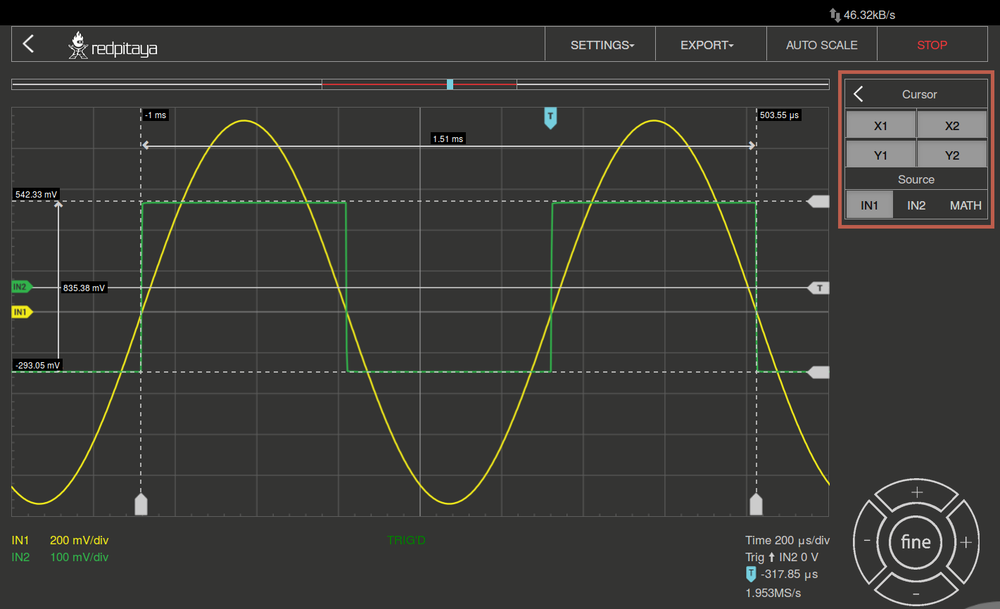

Oscilloscope & Signal Generator
###############################

This application will turn your Red Pitaya board into a 2-channel Oscilloscope and 2-channel Signal generator. It is the
perfect tool for educators, students, makers, hobbyists and professionals seeking affordable, highly functional test 
and measurement equipment. The simple and intuitive user interface provides all the necessary tools for signal analysis and measurements. 
High end specifications will satisfy more demanding users looking for powerful tools for their working benches. The application
is web-based and doesn’t require installation of any native software. Users can access them via any web browser 
(Google Chrome is recommended) using their smartphone, tablet or a PC running any popular operating system (MAC, 
Linux, Windows, Android and iOS). The elements on the Oscilloscope&Sig. Generator application are arranged logically 
and offer a familiar user interface.

.. image:: Slika_02_OSC.png

Apart from the graph there are five areas in which the surface is divided:

    1. Autoscale: Automatically sets up the Oscilloscope settings for the optimal display of the input signals. By 
       pressing the button the voltage axis and time axis are set so that at least one full period of the signal will
       fill the screen.
    #. Channels / Trigger / Measuring Tools: This menu provides controls for inputs / outputs, Trigger, guides, and 
       measurements.
    #. Axis control panel: By pressing the horizontal ± buttons the scaling of the X axis is changed and thus the 
       selected time range which is displayed in the graph. The vertical ± buttons change the Y axis, and thus the 
       displayed voltage range of the signal. In addition, the setting for the time frame, trigger, zero point of the 
       X axis and the sampling rate are displayed.
    #. Channel Setting display: Indicates the scale of the Y axis for all channels that are switched.

    
Features
********

Oscilloscope & signal generator main features are listed below:
    - Run/stop and auto set functionality
    - Signals position and scale controls
    - Trigger controls (source, level, slope)
    - Trigger modes: auto, normal and single triggering
    - Input calibration wizard
    - Cursors
    - Measurements
    - Math operations
    - Signal generator controls (waveform, amplitude, frequency, phase)
    
Autoscale
=========

Automatically sets up the Oscilloscope to best display the input signal. By pressing this button, the voltage axis and
the time axis are set so that at least one full period of the signal will fill the screen.

.. image:: Slika_03_OSC_left.png
    :width: 49%

Inputs
======

    
On the right side of the Oscilloscope&Sig. Generator application interface the IN1 and IN2 channels are listed. By a 
simple click on the name of a channel (not the gear) the channel gets highlighted and you can simply control all the 
settings of the respective channel.
The available settings by device model:

.. tabs::

  .. group-tab:: STEMlab 125-10, 125-14
           
      .. image:: Slika_05_OSC_125.png
          :height: 280px

      - **SHOW:** Shows or hides the curve associated with the channel.
      - **INVERT:** Reflects the graph on the X axis.
      - **Probe attenuation:** (must be selected manually) The division that was set on the probe.
      - **Vertical offset:** Moves the curve up or down.
      - **LV and HV:** Must be selected according to the jumper :ref:`position <anain>` on each channel.

  .. group-tab:: SDRlab 122-16
     
      .. image:: Slika_05_OSC_122.png
          :height: 280px
          

      - **SHOW:** Shows or hides the curve associated with the channel.
      - **INVERT:** Reflects the graph on the X axis.
      - **Probe attenuation:** (must be selected manually) The division that was set on the probe.
      - **Vertical offset:** Moves the curve up or down.

  .. group-tab:: SIGNALlab 250-12

      .. image:: Slika_05_OSC_250.png
          :height: 280px

      - **SHOW:** Shows or hides the curve associated with the channel.
      - **INVERT:** Reflects the graph on the X axis.
      - **Probe attenuation:** (must be selected manually) The division that was set on the probe.
      - **Vertical offset:** Moves the curve up or down.
      - **Input attenuation:** 1:1 (± 1V) / 1:20 (± 20V) is selected automatically when adjusting V/div setting, user can also select range manually through WEB interface settings.
      - **AC/DC coupling**

    
Outputs
=======

On the right side of the Oscilloscope&Sig. Generator application interface the OUT1 and OUT2 channels are listed. By a 
simple click on the name of a channel (not the gear) the channel gets highlighted and you can simply control all the 
settings of the respective channel. 
The available settings are the following: 

.. tabs::

  .. group-tab:: STEMlab 125-10, 125-14
           
      .. image:: Slika_06_OSC_125.png
          :height: 360px

      - **ON:** Turns output of generator ON/OFF.
      - **SHOW:** Shows signal preview (notice that signal is not phase aligned with the input/output signal).
      - **Type:** Various waveforms are available for output: SINE (sinus), SQUARE (rectangle), TRIANGLE (triangle), SAWU (rising sawtooth), SAWD (falling sawtooth), DC and PWM (Pulse Width Modulation).
      - **Trigger:** Enables user to select internal or external trigger for the generator.
      - **Frequency:** Frequency of output signal.
      - **Amplitude:** Amplitude of output signal.
      - **Offset:** DC offset.
      - **Phase:** Phase between both output signals.
      - **Duty cycle:** PWM signal duty cycle.

  .. group-tab:: SDRlab 122-16
     
      .. image:: Slika_06_OSC_122.png
          :height: 360px
          

      - **ON:** Turns output of generator ON/OFF.
      - **SHOW:** Shows signal preview (notice that signal is not phase aligned with the input/output signal).
      - **Type:** Various waveforms are available for output: SINE (sinus).
      - **Trigger:** Enables user to select internal or external trigger for the generator.
      - **Frequency:** Frequency of output signal.
      - **Amplitude:** Amplitude of output signal.
      - **Phase:** Phase between both output signals.

  .. group-tab:: SIGNALlab 250-12

      .. image:: Slika_06_OSC_250.png
          :height: 360px

      - **ON:** Turns output of generator ON/OFF.
      - **SHOW:** Shows signal preview (notice that signal is not phase aligned with the input/output signal).
      - **Type:** Various waveforms are available for output: SINE (sinus), SQUARE (rectangle), TRIANGLE (triangle), SAWU (rising sawtooth), SAWD (falling sawtooth), DC and PWM (Pulse Width Modulation).
      - **Trigger:** Enables user to select internal or external trigger for the generator.
      - **Frequency:** Frequency of output signal.
      - **Amplitude:** Amplitude of output signal.
      - **Offset:** DC offset.
      - **Gain:**  Displays status of the output gain stage.
      - **Phase:** Phase between both output signals.
      - **Duty cycle:** PWM signal duty cycle.
      - **Load:** Output load.

Trigger
=======

The Trigger is used to enable the scope to display changing waveforms to be displayed on the screen of the scope in a
steady fashion. The parameter Source defines the trigger source used for this. The trigger source can be input channel
1 (IN1) or input channel 2 (IN2) or an external source. The available settings are the following:

    - **LEVEL** Trigger level value is used to determinate at which value of signal amplitude the trigger condition will be 
      satisfied(true). When signal amplitude achieves/cross this value the trigger state is set to “true”. Following “true” 
      trigger condition the acquisition and signal plotting will be executed.
    - **EGDE** Since during the time sweep(acquisition) signal amplitude can cross trigger level from higher value to the 
      lowest one or vice versa. The edge setting will determinate at which case the trigger condition will be set to “true”.
    - **NORMAL** The acquisition(trace (re)plotting) is executed only if the trigger state is “true”. In other words; signal
      needs to satisfy trigger condition in order to be acquired and (re)plotted by the Oscilloscope.
    - **SINGLE** After trigger conditions are satisfied by the observed signal the acquisition is executed only once and 
      trace re-plotting is stopped regardless of the repetitive “true” trigger states. 
    - **AUTO** Trigger state and conditions are disregarded. Signal acquisition and signal trace re-plotting are executed in
      repetitive(continuous) manner. This setting is default one.
    - **STOP** Pause triggers.
    - **RUN** Starts/continues triggering.

The Source parameter defines the source used for this purpose. With the IN1 or the IN2 the signal at the
respective input is selected; with the EXT you can invoke the trigger from outside through:

.. tabs::

   .. group-tab:: STEMlab 125-10, 125-14, SDRlab 122-16

      Pin 3 on the header row :ref:`E1 <E1>`.

   .. group-tab:: SIGNALlab 250-12

      BNC connector available on the front panel

External ref. clock (only SIGNALlab 250-12)
===========================================

External ref. Clock input can be enabled through the settings menu, once enabled it’s status is displayed
in the main interface. Green status indicates that the sampling clock is locked to external ref. clock.

.. image:: Silka_EXT_CLOCK.png
    :width: 30%

Math
=====

Among the more interesting features of a digital oscilloscope is the "math" channel. The available settings are the following:

    - **\+** Adds the selected channels. 
    - **\-** Subtract the selected channels. 
    - **\*** Multiply selected channels.
    - **ABS** Gives an absolute value of the selected signal.
    - **dy/dt** Gives an time derivation of the selected signal.
    - **ydt** Gives an time integration of the selected signal. 
    - **INVERT** Inverts the signal.

Cursor
======

This feature enables the user to easily get the data of relevant basic measurements such is: signal period, amplitude,
time delay, amplitude difference between two points, time difference between two points and etc.

Navigate
========

When you have a lot of data to analyze, it is very important to get through them easily. Navigate left and right by 
dragging the data where you want and effortlessly zoom in and out by using your mouse scroll wheel.

Measurements
============

The menu can be found under the MEAS button. Here you can select up to 4 measured values in total, then provide the
corresponding values. In the Operator field select the desired measurement and then set the Signal from which channel 
the value should be taken. One click on DONE shows the value in the bottom of the channel settings. You may choose 
among the following:

 - **P2P:** The difference between the lowest and the highest measured voltage value. 
 - **MEAN:** The calculated average of the signal.
 - **MAX:** The highest measured voltage value. 
 - **MIN:** The lowest measured voltage value.
 - **RMS:** The calculated RMS (root mean square) of the signal.
 - **DUTY CYCLE:** The Signal’s duty cycle (ratio of the pulse duration and period length). 
 - **PERIOD:** Displays the period length, the time length of a vibration. 
 - **FREQ:** The frequency of the signal.

Specifications
**************

Oscilloscope
============

.. tabularcolumns:: |p{70mm}|p{50mm}|p{50mm}|p{50mm}|p{50mm}|

+-----------------------------+---------------------------------+------------------------------+------------------------------+------------------------------+
|                             | STEMlab 125 - 10                | STEMlab 125 - 14             | SDRlab 122 - 16              | SIGNALlab 250 - 12           |
+-----------------------------+---------------------------------+------------------------------+------------------------------+------------------------------+
| Input channels              | 2                               | 2                            | 2                            | 2                            |
+-----------------------------+---------------------------------+------------------------------+------------------------------+------------------------------+
| Bandwidth                   | 40MHz                           | 50MHz                        | 300 kHz - 50 MHz             | 60 MHz                       |
+-----------------------------+---------------------------------+------------------------------+------------------------------+------------------------------+
| Resolution                  | 10bit                           | 14bit                        | 16bit                        | 12bit                        |
+-----------------------------+---------------------------------+------------------------------+------------------------------+------------------------------+
| Memory depth                | 16k samples                     | 16k samples                  | 16k samples                  | 16k samples                  |
+-----------------------------+---------------------------------+------------------------------+------------------------------+------------------------------+
| Input range                 | ± 1V (LV) and ± 20V (HV) [#f1]_ | ± 1V (LV) and ± 20V (HV)*    | ± 0.25V / -2 dBm             | ± 1V / ± 20V [#f2]_          |
+-----------------------------+---------------------------------+------------------------------+------------------------------+------------------------------+
| Input coupling              | DC                              | DC                           | AC                           | AC/DC                        |
+-----------------------------+---------------------------------+------------------------------+------------------------------+------------------------------+
| Minimal Voltage Sensitivity | ± 1.95mV / ± 39mV               | ± 0.122mV / ± 2.44mV         | ± 7.6uV                      | ± 0.488mV / ± 9.76mV         |
+-----------------------------+---------------------------------+------------------------------+------------------------------+------------------------------+
| External Trigger            | through extension connector     | through extension connector  | through extension connector  | through BNC connector        |
+-----------------------------+---------------------------------+------------------------------+------------------------------+------------------------------+
| Input impedance             | 1 MΩ                            | 1 MΩ                         | 50 Ω                         | 1 MΩ                         |
+-----------------------------+---------------------------------+------------------------------+------------------------------+------------------------------+

.. [#f1] jumper selectable
.. [#f2] software selectable

Signal generator
================

.. tabularcolumns:: |p{70mm}|p{50mm}|p{50mm}|p{50mm}|p{50mm}|

+------------------+----------------------+----------------------+----------------------+-----------------------------------------+
|                  | STEMlab 125 - 10     | STEMlab 125 - 14     | SDRlab 122 - 16      | SIGNALlab 250 - 12                      |
+------------------+----------------------+----------------------+----------------------+-----------------------------------------+
| Output channels  | 2                    | 2                    | 2                    | 2                                       |
+------------------+----------------------+----------------------+----------------------+-----------------------------------------+
| Frequency Range  | 0-50MHz              | 0-50MHz              |                      | 0-60Mhz                                 |
+------------------+----------------------+----------------------+----------------------+-----------------------------------------+
| Resolution       | 10bit                | 14bit                | 14bit                | 12bit                                   |
+------------------+----------------------+----------------------+----------------------+-----------------------------------------+
| Signal buffer    | 16k samples          | 16k samples          | 16k samples          | 16k samples                             |
+------------------+----------------------+----------------------+----------------------+-----------------------------------------+
| Output range     | ± 1V                 | ± 1V                 | ± 0.5V/ +4dBm        | | ± 1V / ± 5V (into 50 ohm load) [#f3]_ |
|                  |                      |                      |                      | | ± 2V / ± 10V (Hi-Z load) [#f3]_       | 
+------------------+----------------------+----------------------+----------------------+-----------------------------------------+
| Coupling         | DC                   | DC                   | AC                   | DC                                      |
+------------------+----------------------+----------------------+----------------------+-----------------------------------------+
| Output load      | 50 Ω                 | 50 Ω                 | 50 Ω                 | 50 Ω                                    |
+------------------+----------------------+----------------------+----------------------+-----------------------------------------+

.. [#f3] software selectable

