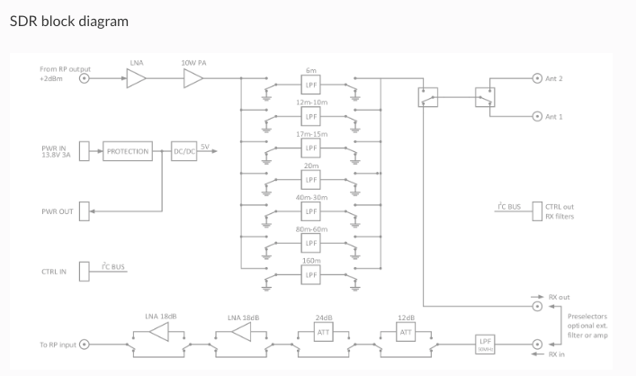

SDR transceiver
###############

Receiver Specifications
***********************

+-------------------------------+-------------------------------------------------+
| Architecture:                 | Direct Digital Sampling                         |
+-------------------------------+-------------------------------------------------+
| ADC Sampling Rate:            | 125Msps                                         |
+-------------------------------+-------------------------------------------------+
| ADC Resolution:               | 14 bits                                         | 
+-------------------------------+-------------------------------------------------+
| Wideband Frequency Coverage:  | 25 kHz - 62.25 MHz                              |
+-------------------------------+-------------------------------------------------+
| MDS (min. detectable signal): | MDS (typ)@ 500Hz BW                             |
+-------------------------------+-------------------------------------------------+
| Preamp OFF at 14MHz           | -113dBm                                         |
+-------------------------------+-------------------------------------------------+
| Preamp +15dB at 14MHz         | -130dBm                                         |
+-------------------------------+-------------------------------------------------+
| Preamp +30dB at 50MHz         | -135dBm                                         |
+-------------------------------+-------------------------------------------------+
|                               | More MDS measurements.                          |
+-------------------------------+-------------------------------------------------+
| Preselectors:                 | Available as add-on module (comming soon)       |
+-------------------------------+-------------------------------------------------+
|                               | User can also connect own preselectors/filters  |   
+-------------------------------+-------------------------------------------------+

Transmitter Specifications		
**************************

+-------------------------------+--------------------------------------------------------------------------------------+
| Architecture:                 | Direct Digital Up-conversion                                                         |
+-------------------------------+--------------------------------------------------------------------------------------+
| TX DAC Sampling Rate:         | 125 Msps                                                                             |
+-------------------------------+--------------------------------------------------------------------------------------+
| TX DAC Resolution:            | 14 bits                                                                              |
+-------------------------------+--------------------------------------------------------------------------------------+
| RF Output Power:              | up to 10 W CW and SSB at @ 13.8 V input voltage (max. 15 V)                          |
+-------------------------------+--------------------------------------------------------------------------------------+
| Transmitter Frequency Range:  | 160 - 10 m (amateur bands only)*                                                     |
+-------------------------------+--------------------------------------------------------------------------------------+
| Low Pass PA Filter Bands:     | 160m / 80 m / 40 m / 30m / 20 m / 17m / 15m / 12m / 10m / 6 m                        |
+-------------------------------+--------------------------------------------------------------------------------------+
|                               | (possibility to changed it to any range 1.8 - 50 MHz)                                |
+-------------------------------+--------------------------------------------------------------------------------------+
| Emission Modes Types:         | A1A (CWU, CWL), J3E (USB, LSB), A3E (AM), F3E (FM), DIGITAL (DIGU, DIGL)             |
+-------------------------------+--------------------------------------------------------------------------------------+
|                               | DIGITAL (DIGU, DIGL)                                                                 | 
+-------------------------------+--------------------------------------------------------------------------------------+
| Harmonic Radiation:           | better than -45 dB                                                                   |
+-------------------------------+--------------------------------------------------------------------------------------+
| 3rd-Order IMD:                | better than -35 dB below PEP @ 14.2 MHz 10 Watts PEP                                 |
+-------------------------------+--------------------------------------------------------------------------------------+
| Cooling:                      | copper heat spreader                                                                 |
+-------------------------------+--------------------------------------------------------------------------------------+

.. note::
	C25 also supports 6m operation and has all necessary output filters for 6m, anyhow STEMlab 125-14 ouput signal is not pure enough to comply harmonic regulations for 6m

What is in the box 
******************

The following accessories and materials are included with your STEMlab SDR transceiver module.

	* SDR transceiver 160-10 10W module
	* DC power cord with Anderson Power Pole™ connector
	* 4 x SMA cable for connecting C25 module with STEMlab 125-14 and antenna   
	* impedance transformer board

.. _Hercules: https://www.hercules.com/uk/leisure-controllers/bdd/p/248/djcontrol-instinct-s-series/

Other additional requirements
*****************************

In addition to the supplied accessories, software and cables supplied with STEMlab SDR transceiver kit, you will need to provide the following:

	* An **HF-Antenna** or dummy load with BNC
	* good RF **ground**	
	* A stabilized DC 13.8 VDC, 3A **Power Supply**

SDR application requirements:

	* Personal computer (PC) running Windows 7 or later. Either 32 or 64-bit operating systems are supported. 

Start using STEMlab as Radio Station - SDR transceiver
******************************************************

Connecting the cables
---------------------

.. image :: 16_RedPitaya_Combo2.jpg
   :alt: icon
   :align: center
   
.. note::
	
	Before connecting Red Pitaya to SDR transceiver module, turn Red Pitaya off, by removing power supply cable.
	

1. connect Tx of SDR transciver module to Red Pitaya OUT1
2. connect Rx of SDR ransciver module to Red Pitaya IN1 (notice this cable has a transformer)
3. connect control cable from SDR transceiver to Red Pitaya

identify pin with arrow and connect the cable as on the image bellow.

.. image :: 18_RedPitaya_Close.jpg
   :alt: icon
   :align: center
   
4. Make sure jumper is set as shown on image above.
5. Make sure your SD card is still inserted
6. Make sure your ethernet cable is still plugged in
7. Connect power supply 5V 2A to turn Red Pitaya back on.
8. Connect antenna
9. Connect SDR transceiver to 13.8V 3A power supply

.. note::
	
	STEMlab SDR transceiver module should be powered by DC 13.8V Power Supply that can provide at least 3 A of constant power. 
	Make sure that is turned off and then use DC power cord with Anderson Power Pole™ connector **(9)** to connect it with module. 
	RED wire is positive (+) while BLACK wire is negative (-), double check to not mix the colours or polarity! 

	
10. Turn on 13.8V power supply

Power SDR installation and SDR configuration
********************************************

.. _here: http://downloads.redpitaya.com/hamlab/powersdr/Setup_PowerSDR_Charly_25_HAMlab_STEMlab_Edition.exe

Click here_ to download Power SDR installation package.

1. Start the installation by double clicking on the Setup_PowerSDR_STEMlab_HAMlab_Edition.exe file.

	.. image :: PowerSDRinstallation1.PNG
		:align: center

2. If you are asked for extended user access rights during the installation click Yes! Running installer with administration rights will work as well. 
	
	.. image :: PowerSDRinstallation2.png
		:scale: 70%
   		:align: center
		
On Windows 10 you might get warning of Unknown Publisher you can procede with installation by clicking on "more info" and then "Run anyway".
 
	.. image:: PowerSDRinstallation3.PNG
		:scale: 75 %
   		:align: center
	
	.. image:: PowerSDRinstallation4.PNG
		:scale: 75 %
   		:align: center
	

3. Follow the instructions of the setup routine and accept the license agreements if asked for.

	.. image:: Capture1.PNG
		:scale: 75 %
   		:align: center

	.. image:: Capture2.PNG
		:scale: 75 %
   		:align: center
		
	.. image:: Capture3.PNG
		:scale: 75 %
   		:align: center

	.. image:: Capture4.PNG
		:scale: 75 %
   		:align: center

	.. image:: Capture5.PNG
		:scale: 75 %
   		:align: center

	.. image:: Capture6.PNG
		:scale: 75 %
   		:align: center

	.. image:: Capture7.PNG
		:scale: 75 %
   		:align: center

	.. image:: Capture8.PNG
		:scale: 75 %
		:align: center

4. At the end of the installation you are asked if you want to run PowerSDR software immediately, feel free to do so.

	.. image:: Capture9.PNG
		:scale: 75 %
   		:align: center

5. PowerSDR software will start with the calculation of the FFT wisdom file, **which will take a while** depending on the CPU power of your computer. This is only done once, even after updating the software to a new version in the future:

	.. image:: Capture10.PNG
		:scale: 75 %
   		:align: center

6. After starting the PowerSDR software you will be led through the PowerSDR software specific setup wizard which lets you configure the software to use it with your STEMlab. Pick the HAMlab/STEMlab radio model.

	.. image:: Capture11.PNG
		:scale: 75 %
   		:align: center

7. Select the region where you are using your STEMlab, this is important due to the different frequency ranges your are allowed to transmit in the different countries all over the world:

	.. image:: Capture12.PNG
		:scale: 75 %
   		:align: center

8. Your initial setup is completed click finish.

	.. image:: Capture13.PNG
		:scale: 75 %
   		:align: center

9. Click Power to connect Power SDR with STEMlab. On the screen the input singnal should appear.

	.. image:: Capture20.PNG
		:scale: 75 %
   		:align: center

General Specifications
**********************

+-----------------------------------------------+-------------------------------------------------------------------------------------+
|Antenna Connector:                             | ANT1 and ANT2 available on SMA connectors Included one cable with SMA to SO-239 UHF |
+-----------------------------------------------+-------------------------------------------------------------------------------------+
|Antenna Impedance:                             | 50 Ohm Unbalanced                                                                   |
+-----------------------------------------------+-------------------------------------------------------------------------------------+
|RF Output Power:                               | up to 10 W CW and SSB at 13.8 V input voltage (max. 15 V)                           |
+-----------------------------------------------+-------------------------------------------------------------------------------------+
|Maximum Interconnect Cable Length Ethernet:    | 100 meters (328 feet), Category 5 cable                                             |
+-----------------------------------------------+-------------------------------------------------------------------------------------+
|Power connector:                               | PowerPole                                                                           |
+-----------------------------------------------+-------------------------------------------------------------------------------------+

Measurement instruments specifications
######################################

Oscilloscope
************

+-------------------------------+-----------------------+
| Input channels		| 2			|
+-------------------------------+-----------------------+
| Input channels connector	| BNC			|
+-------------------------------+-----------------------+
| Bandwidth			| 50 MHz		|
+-------------------------------+-----------------------+
| Resolution			| 14 bit		|
+-------------------------------+-----------------------+
| Memory depth			| 16384 Samples Max.	|
+-------------------------------+-----------------------+
| Sampling Rate			| 125 MS/s		|
+-------------------------------+-----------------------+
| Input range			| +/- 1 V or +/- 20 V	|
+-------------------------------+-----------------------+
| Input coupling		| AC/DC			|
+-------------------------------+-----------------------+
| Minimal Voltage Sensitivity	| ±0.244 mV / ±2.44 mV  |
+-------------------------------+-----------------------+
| External Trigger connector	|	BNC		|
+-------------------------------+-----------------------+
| Input coupling		| AC/DC 		|
+-------------------------------+-----------------------+

Signal generator
****************

+---------------------------------------+-----------------------+
| Output channels			| 2			|
+---------------------------------------+-----------------------+
| Output channels connector		| BNC			|
+---------------------------------------+-----------------------+
| Bandwidth				| 50 MHz		|
+---------------------------------------+-----------------------+
| Resolution				| 14 bit		|
+---------------------------------------+-----------------------+
| Signal buffer				| 16384 Samples Max.	|
+---------------------------------------+-----------------------+
| Sampling Rate				| 125 MS/s		|
+---------------------------------------+-----------------------+
| Output range				| +/- 1V		|
+---------------------------------------+-----------------------+
| Frequency Range			| 0 - 50 MHz		|
+---------------------------------------+-----------------------+
| Output impedance			| 50 ohm		|
+---------------------------------------+-----------------------+
| External Trigger connector		| BNC			|
+---------------------------------------+-----------------------+

Spectrum analyzer
*****************

+-------------------------------+--------------------+
| Input channels		|	2	     |
+-------------------------------+--------------------+
| Input channels connector	|	BNC	     |
+-------------------------------+--------------------+
| Bandwidth			| 0 - 62 MHz	     |
+-------------------------------+--------------------+
| Dynamic Range			| -80dBm	     |
+-------------------------------+--------------------+
| Input noise level             | < -119 dBm/Hz      |
+-------------------------------+--------------------+
| Input range			| +/- 1V	     |
+-------------------------------+--------------------+
| Frequency Range		| 0 - 50 MHz	     |
+-------------------------------+--------------------+
| Input impedance		| 1 MΩ / 10 pF	     |
+-------------------------------+--------------------+
| Spurious frequency components	| -90 dBFS Typically |
+-------------------------------+--------------------+

Logic analyzer
**************

+-----------------------------------------------+-----------------------------------------------------------------------------------------------+
| Input channels				| 8                                                                                             |
+-----------------------------------------------+-----------------------------------------------------------------------------------------------+
| Max. sample rate				| 125 MS/s											|	
+-----------------------------------------------+-----------------------------------------------------------------------------------------------+
| Fastest input signal				| 50 MHz											|
+-----------------------------------------------+-----------------------------------------------------------------------------------------------+
| Supported protocols:				| I2C, SPI, UART										|
+-----------------------------------------------+-----------------------------------------------------------------------------------------------+
| Input voltage levels				| 2.5 V - 5.5 V											|
+-----------------------------------------------+-----------------------------------------------------------------------------------------------+
| Threshold:					| 0.8 V for logic low										|
+-----------------------------------------------+-----------------------------------------------------------------------------------------------+
|						| 2.0 V for logic high										|
+-----------------------------------------------+-----------------------------------------------------------------------------------------------+
| Input impedance				| 100 kohm 3 pF											|
+-----------------------------------------------+-----------------------------------------------------------------------------------------------+
| Sample depth					| 1 MS (typical*)										|
+-----------------------------------------------+-----------------------------------------------------------------------------------------------+
| Trigger resolution				| 8 ns												|				
+-----------------------------------------------+-----------------------------------------------------------------------------------------------+
| Min. detectable pulse length			| 10 ns												|
+-----------------------------------------------+-----------------------------------------------------------------------------------------------+
																			

.. note::

	Acquired data is compressed therefore the size of data than can be captured depends on activity of signal on LA inputs. 
	For I2C, SPI & UART signals 1MS is typical sample depth.											
	All instrumentation applications are WEB based and don’t require the installation of any native software.					
	Users can access them via a browser using their smartphone, tablet or a PC running any popular operating systems (MAC, Linux, Windows, Android and iOS).	

General Electrical specifications
#################################

+-----------------------+-----------------------------------------------------------------------+
| Power Requirements:	| +13.8 V DC nominal ± 15 % (Transmitter output specified at 13.8 V DC)	|
+-----------------------+-----------------------------------------------------------------------+
| Power Consumption:	| 2 A                                                                   |
+-----------------------+-----------------------------------------------------------------------+

Mechanical specifications
#########################

+---------------------------+----------------+
| Height:                   |  100 mm        |
+---------------------------+----------------+
| Width:                    | 340 mm         |
+---------------------------+----------------+
| Depth:                    | 215 mm         |
+---------------------------+----------------+
| Weight:                   | 5 kg           |
+---------------------------+----------------+
| Operating temperature:    | -10*C to +50*C |
+---------------------------+----------------+

.. .. _front:

.. Front panel controls and connections 
.. ####################################
.. 
.. 
.. .. image:: Front_panel_controls_and_connections.png
.. 
.. Power button
.. ************ 
.. 
.. Momentarily pressing power button **(1)** will turn the HAMlab ON. It normally takes 30s from the button press until the HAMlab is ready to be used. Once HAMlab is ON, holding the power button pressed will cause the proper shut down of the device. Blue LED indication on the power button indicates that device is turned on.
.. 
.. .. note::
.. 	In case that system halts and becomes unresponsive, device can be turned off by holding power button for a few seconds / until the blue LED is turned off. 

.. SDR
.. ***
.. 
.. Microphone connector (RJ45)
.. ---------------------------
.. 
.. The HAMlab 80-10 10W front microphone connector **(2)** can support Kenwood KMC 30 electret microphone
.. or compatible types.
.. 
.. .. image:: microfono-kmc-30-ml.jpg
.. 
.. Front panel view microphone pinout
.. 
.. +-----+----------+
.. + Pin | Function +
.. +=====+==========+
.. | 1   | NC 	 |
.. +-----+----------+
.. | 2   | 8V DC	 |
.. +-----+----------+
.. | 3   | Ground	 |
.. +-----+----------+
.. | 4   | PTT 	 |
.. +-----+----------+
.. | 5   | Ground	 |
.. +-----+----------+
.. | 6   | MIC	 |
.. +-----+----------+
.. | 7   | NC	 |
.. +-----+----------+
.. | 8   | NC	 |
.. +-----+----------+
.. 
.. CW Key / paddle jack
.. --------------------
.. 
.. The CW key/paddle jack **(3)** is a ¼ inch TRS phone plug. 
.. Tip - DOT
.. Ring - DASH
.. The common is connected to the sleeve. 
.. 
.. 
.. .. note::
.. 	3.3V Max input.
.. 
.. 
.. For an iambic paddle, the tip is connected to the dot paddle, the ring is connected to the dash paddle and the sleeve is connected to the common. For a straight key or a keyer output, connect to the tip and leave the ring floating. The common is connected to the sleeve. 
.. 
.. .. note::
.. 
.. 	Currently keyer is not supported by software. Software support for it will be availabe in one of incomming software updates. 
.. 
.. 
.. Phones
.. ------
.. 
.. The HAMlab 80-10 10W supports a stereo headset with headphone ¼ inch TRS phone plug **(4)** .
.. Mono or TS connector that grounds the “ring” portion of the connector should not be used!
.. 
.. 
.. 
.. Logic analyzer
.. --------------
.. 
.. 0-7 are logic analyzer inputs. 
.. G - common ground. 
.. 
.. 
.. .. note::
.. 	
.. 	Logic analyzer inputs **(5)** can only be used when running Logic analyzer WEB app.
.. 
.. 
.. 
.. Oscilloscope
.. ------------
.. 
.. 	**(6)** - IN1
.. 	**(7)** - IN2
.. 	**(8)** - EXT. TRIG.
.. 
.. IN1, IN2 and EXT. TRIG. are oscilloscope inputs. 
.. 
.. .. note::
.. 
.. 	These inputs are active and can be used only when Oscilloscope+Signal generator WEB application is running. 
.. 
.. 
.. Signal generator
.. ----------------
.. 
.. 	**(9)** - OUT1
.. 	**(10)** - OUT2
.. 
.. OUT1 and OUT2 are signal generator outputs. 
.. 
.. .. note::
.. 
.. 	These two outputs are active and can be controlled only when Oscilloscope+Signal generator WEB application is running.
.. 
.. 
.. .. note::
.. 
.. 	To get expected signals from the signal generator, outputs must be 50ohm terminated.
.. 
.. 
.. 
.. 
.. .. _back:
.. 
.. Back panel controls and connections 
.. ###################################
.. 
.. 
.. .. image:: Back_panel_controls_and_connections.png
.. 
.. 
.. ANT - TRANSCEIVER ANTENNA PORTS [1,2]
.. ************************************* 
.. 
.. ANT1 **(1)** is SO-239 50 ohm connector, while ANT2 **(2)** is BNC 50 ohm connector. 
.. 
.. 
.. User can connect transmitter output to ANT1 or ANT2 by properly connecting SMA cable inside the chassis to one of ANT connectors. Software switching between ANT1 and ANT2 is not available in HAMlab 80-10 10W version.
.. 
.. .. danger::
.. 
.. 	THIS UNIT GENERATES RADIO FREQUENCY (RF) ENERGY. USE CAUTION AND OBSERVE PROPER SAFETY PRACTICES REGARDING YOUR SYSTEM CONFIGURATION. WHEN ATTACHED TO AN ANTENNA, THIS RADIO IS CAPABLE OF GENERATING RF ELECTROMAGNETIC FIELDS WHICH REQUIRE EVALUATION ACCORDING TO YOUR NATIONAL LAW TO PROVIDE ANY NECESSARY ISOLATION OR PROTECTION REQUIRED, WITH RESPECT TO HUMAN EXPOSURE! 
.. 
.. .. danger::
.. 
.. 	NEVER CONNECT OR DISCONNECT ANTENNAS WHILE IN TRANSMIT MODE. THIS MAY CAUSE ELECTRICAL SHOCK OR RF BURNS TO YOUR SKIN AND DAMAGE TO THE UNIT. 
.. 
.. 
.. AUX1
.. ****
.. 
.. RX1 IN - direct feed to the first receiver pre-amp and attenuators.
.. 
.. RX1 OUT - an output from the antenna feeding 
.. 
.. 
.. By default HAMlab 80-10 10W comes with loopback cable connected from RX1 IN to RX1 OUT. User can also use this two connectors to insert external filters or preamplifier.
.. 
.. 
.. .. note::
.. 	This input is not protected by any ESD circuitry, therefore device connected to the RX1 OUT Output is susceptible to possible damage by ESD from an EMP event if the connected device does not have adequate ESD protection circuitry. 
.. 
.. .. warning::
.. 	Be aware that Preamp1 and Preamp 2 are both wide band amplifiers covering the whole bandwidth of 55MHz. 
.. 	It is not recommended to use the Preamps on a large Antenna without a Preselector connected (this would cause overload and intermodulation from strong broadcast signals outside the Amateur Radio Bands)!
.. 
.. AUX2
.. ****
.. 
.. RX2 IN - secondary 50ohm receiver input that can be used as a second panadapter in Power SDR software
.. or to as feedback signal for pre-distortions (Pure Signal tool). 
.. 
.. 
.. XVTR (TX2 OUT)  - secondary transmitter can be used to drive external PA
.. Max. output power is around 10 dBm @ 50ohm.
.. 
.. However, currently there is no support in HPSDR for a second TX output.
.. 
.. Power and Fuses
.. ***************
.. 
.. The HAMlab 80-10 10W  is designed to operate from a 13.8 volt nominal DC supply and required at least 4A.
.. 
.. .. danger::
.. 
..     This unit must only be operated with the electrical power described in this manual. NEVER CONNECT THE +13.8VDC POWER CONNECTOR DIRECTLY TO AN AC OUTLET. This may cause a fire, injury, or electrical shock. 
.. 
.. 
.. The HAMlab 80-10 10W requires 13.8 VDC @ 4 A measured at the radio in order to transmit maximum wattage. Multiple power cable connections between the power supply and the HAMlab 80-10 10W, a poorly regulated power supply, undersized power cable and very long power cable lengths will result in a voltage drop, especially under load. Any voltage deviation from 13.8 VDC will result in lower power output that the 10W nominal specification. 
.. 
.. 
.. For best results, select a linear or switching power supply that is well regulated and free of internally generated radio frequency noise. “Birdies” generated by a poorly filtered supply can often appear as signals in the Power SDR Panadapter display. 
.. 
.. 
.. The Anderson Powerpole™ connector contains 45 Amp pins to minimize voltage drop during transmit. The RED connection should be connected to the positive (+) lead of the power source. The BLACK connection should be connected to the negative (-) lead of the power source. 
.. 
.. 
.. I - If you choose to use your own Powerpole cabling, be sure to properly size the wire and the Powerpole connector to minimize voltage drop during transmit. Excessive voltage drop can cause lower transmit power output levels. 
.. 
.. 
.. There are two internal fuses in the HAMlab. One is protecting whole system while the other one is just for the transceiver. If you ever need to replace the internal fuse, remove the top cover and the shield of the power board.  
.. 
.. 
.. .. image:: IMG_20161202_105403.jpg
.. 
.. .. image:: IMG_20161202_105424.jpg
.. 
.. .. danger::
.. 
.. 	FUSE CURRENT RATING SHOULD NOT BE HIGHER THAN 3.15A AMPS! FAILURE TO PROPERLY USE THIS SAFETY DEVICE COULD RESULT IN DAMAGE TO YOUR RADIO, POWER SUPPLY, OR CREATE A FIRE RISK. 
.. 
.. 
.. Chassis ground
.. **************
.. 
.. This is a thumbscrew for attaching an earth ground to the chassis of the radio. Grounding is the most important safety enhancement you can make to your shack. Always ground the HAMlab to your station RF ground using high quality wiring with the length being as short as possible.
.. Braided wire is considered the best for ground applications. Your station ground should be a common point where all grounds come together. You will likely be using a PC and a DC power source so be sure to ground these devices together as well. 
.. 
.. 
.. AUDIO
.. *****
.. 
.. Audio USB connector
.. USB 2.0 Cable - A-Male to Mini-B must be used to connect HAMlab audio sound card with the PC in order to be able to use Phone, MIC and speaker connector for voice communication.
.. 
.. .. note::
.. 	USB connector is only available on HAMlab 80-10 10W model. For new models audio codec is used / audio is transferred over ethernet.
.. 
.. Speaker connector 
.. 1/8” TRS stereo connector can be used to connect stereo powered computer speakers.
.. 
.. .. note::
..     Do not use a mono or TS connector that grounds the “ring” portion of the connector. 
.. 
.. 
.. CTRL
.. ****
.. 
.. DB9 connector is used to control external equipment.
.. PTT OUT relay is connected between pins 6 and 7. 
.. 
.. .. note::
.. 
.. 	Other pins are at the moment not in use and should be left unconnected.
.. 
.. 
.. DATA
.. ****
.. 
.. LAN 
.. This is network connection to the HAMlab. It is an auto-sensing 100 megabit or 1 gigabit Ethernet port that enables you to connect HAMlab to your local network or directly to PC.
.. 
.. 
.. USB
.. This USB port is used to connect WIFI dongle when user would like to connect to HAMlab wirelessly.
.. 
.. .. note::
.. 
.. 	Recommended WIFI USB dongle is Edimax EW7811Un. In general all WIFI USB dongles that use RTL8188CUS chipset should work.
.. 
.. 
.. SD card 
.. HAMlab software is running from SD card. 
.. 
.. .. note:: 
.. 	
.. 	HAMlab comes with pre installed SD card HAMlab OS. Upgrade can be done using OS upgrade application from the HAMlab application menu and there is no need to remove the SD card. Therefore user should remove the SD card and reinstall SD card software only if system gets corrupted or stops working due to SD card failure reason. In this case only official HAMlab OS should be installed on the SD card for proper operation.

	
SDR Specifications
##################

Highlights
**********

+-------------------------------+-------------------------------------------------------------------------------------------------------------+
| Architecture:                 | direct sampling / internal high performance 14-bit A/D and D/A 125 Msps converters (no sound card required) |
+-------------------------------+-------------------------------------------------------------------------------------------------------------+
| Band coverage:                | All band receiver and 160-6m transmitter                                                                    |
+-------------------------------+-------------------------------------------------------------------------------------------------------------+
| Transmit power:               | up to 10 W                                                                                                  |
+-------------------------------+-------------------------------------------------------------------------------------------------------------+
| Wideband Frequency Coverage:  | 25 kHz - 62.25 MHz                                                                                          |
+-------------------------------+-------------------------------------------------------------------------------------------------------------+
| Connection to PC:             | 1 Gbit ethernet or WIFI connection                                                                          |
+-------------------------------+-------------------------------------------------------------------------------------------------------------+
| Software:                     | Power SDR HAMlab edition                                                                                    |
+-------------------------------+-------------------------------------------------------------------------------------------------------------+
| Phones and MIC connection:    | available on the front panel                                                                                |
+-------------------------------+-------------------------------------------------------------------------------------------------------------+
| Secondary Rx and Tx channel:  | available through back panel BNC connectors (RX2 IN, XVTX)                                                  |
+-------------------------------+-------------------------------------------------------------------------------------------------------------+
| CW key and paddle input:      | available through front panel jack connector                                                                |
+-------------------------------+-------------------------------------------------------------------------------------------------------------+
