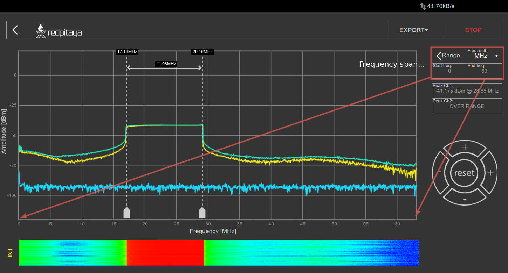

Spectrum Analyzer
#################

This application will turn your RedPitaya board into a 2-channel DFT Spectrum Analyzer. It is the perfect tool for 
educators, students, makers, hobbyists and professionals seeking affordable, highly functional test and measurement
equipment. The DFT Spectrum analyzer application enables a quick and powerful spectrum analysis using a DFT algorithm.
Frequency span is form DC up to 62.5MHz where the frequency range can be arbitrarily selected. You can easily measure
the quality of your signals, signal harmonics, spurious and power. All Red Pitaya applications are web-based and do 
not require the installation of any native software. Users can access them via a web browser using their smartphone, 
tablet or a PC running any popular operating system (MAC, Linux, Windows, Android, and iOS). The elements on the DFT 
Spectrum analyzer application are arranged logically and offer a familiar user interface.

The graphical interface is divided into 4 main areas:

    1. **Run/Stop** and **Export button:** The “Run/Stop” button is used to start and stop measurements. With the 
       “Export” button you can select in which format you want to download the measured data (plotted spectrum). Two 
       formats are available: .png and .csv.
    #. **Inputs / Cursors / Range / Axis control panel:** This menu provides controls for inputs, cursors, and 
       frequency range settings. Horizontal +/- buttons are used to select the span of the X (frequency) axis (zooming
       in/out). The vertical +/- buttons change the Y (amplitude)-axis range.

    #. **Graph area:** Here, the currently calculated signal spectrum is plotted in the selected frequency range.
    #. **Waterfall plots:** Waterfall plots are a different way of the signal spectrum representation where the color 
       on the plot defines the signal amplitude for a certain frequency. The waterfall plot is also useful to enable 
       the representation of a signal spectrum in a time dependency.

FEATURES
********

The main features of the DFT Spectrum analyzer are described below:

INPUTS:
=======

Inputs controls are shown in the picture below. With the “SHOW” select button displaying the spectrum of the selected 
input can be enabled or disabled. The “FREEZE” button is used for stopping the measurements of the selected input. The 
“MIN” and “MAX” select buttons are used to enable/disable the persist mode for the spectrum plot. The “MIN” signal 
spectrum plot will show the lowest values of the signal spectrum taken after enabling the “MIN” button. The same logic
is used for the “MAX” signal where the MAX values of the signal spectrum are shown. This feature is mostly used for 
detecting signal glitches and the max/min spectrum amplitude values during the measurement.

For SIGNALlab 250-12 there are additional settings available where user can select:
- **Input attenuation**
- **Coupling**

.. image:: Slika_09_SA.png

CURSORS:
========

The cursors are an additional vertical and horizontal pair of lines useful for extracting the values of the spectrum 
plots.

The cursors are interactive and they can be set on any part of the graph while the frequency value is shown 
corresponding to the place where the X cursors are set, and the amplitude value where the Y cursors are set. Cursor 
delta values are useful for measuring signal harmonics and relative ratios between amplitudes and frequencies.

RANGE:
======

The range settings are used to set a frequency span. This feature is useful when the frequency range of interest is 
smaller than the full frequency range of the Spectrum analyzer application.

PEAK DETECTION:
===============

During the measurement, peak values of the signal spectrum are measured and shown on the “Peak Values” field. Peak
values are max values of the signals spectrum regardless of the selected frequency range. This peak finding prevents 
not seeing peak values which are outside the selected frequency span.

WATERFALL PLOTS:
================

Waterfall plots are a different way of the signal spectrum representation where the color on the plot defines the
signal amplitude for a certain frequency. The waterfall plot is also useful when enabling the representation of the 
signal spectrum in a time dependency.

AXIS CONTROLS:
==============

Horizontal +/- buttons are used to select the span of the X (frequency) axis (zooming in/out). The vertical +/- 
buttons change the Y (amplitude)-axis range. Reset button when selected reset frequency and amplitude span do default
values.

OUTPUTS:
========

Spectrum analyzer WEB also includes a signal generator, so users can simultaneously generate signal & observe signal
spectrum. For the signal generator setting and specifications refer to :ref:`outputs <outputs>`

External ref. Clock (only SIGNALlab 250-12):
============================================

External ref. Clock input can be enabled through the settings menu, once enabled it’s status is displayed
in the main interface. Green status indicates that the sampling clock is locked to external ref. clock.

.. image:: Slika_08_SA.png
    :width: 30%

SPECIFICATIONS
**************

+-------------------------------+----------------------+----------------------+----------------------+--------------------------------+
|                               | STEMlab 125 - 10     | STEMlab 125 - 14     | SDRlab 122 - 16      | SIGNALlab 250 - 12             | 
+-------------------------------+----------------------+----------------------+----------------------+--------------------------------+
| Input channels                | 2                    | 2                    | 2                    | 2                              | 
+-------------------------------+----------------------+----------------------+----------------------+--------------------------------+
| Bandwidth                     | 0 - 50MHz            | 0 - 60MHz            | 0 - 60MHz            | 0 - 60MHz                      | 
+-------------------------------+----------------------+----------------------+----------------------+--------------------------------+
| Resolution                    | 10 bit               | 14 bit               | 16 bit               | 12 bit                         | 
+-------------------------------+----------------------+----------------------+----------------------+--------------------------------+
| DFT buffer                    | 16384                | 16384                | 16384                | 16384                          | 
+-------------------------------+----------------------+----------------------+----------------------+--------------------------------+
| Dynamic Range                 | 60 dB                | 80 dB                | 96 dB                | 74 dB                          | 
+-------------------------------+----------------------+----------------------+----------------------+--------------------------------+
| Input noise level             | < -100 dBm/Hz        | < -119 dBm/Hz        |                      |                                | 
+-------------------------------+----------------------+----------------------+----------------------+--------------------------------+
| Input range                   | 10dBm                | 10dBm                | -2dBm                | 10dBm (when att. is disabled)  | 
+-------------------------------+----------------------+----------------------+----------------------+--------------------------------+
| Input impedance               | 1 MΩ / 10 pF         | 1 MΩ / 10 pF         | 50ohm                | 1 MΩ / 10 pF                   | 
+-------------------------------+----------------------+----------------------+----------------------+--------------------------------+
| Input coupling                | DC                   | DC                   | AC                   | DC/AC                          | 
+-------------------------------+----------------------+----------------------+----------------------+--------------------------------+
| Spurious frequency components | < -70 dBFS Typically | < -90 dBFS Typically |                      |                                | 
+-------------------------------+----------------------+----------------------+----------------------+--------------------------------+
