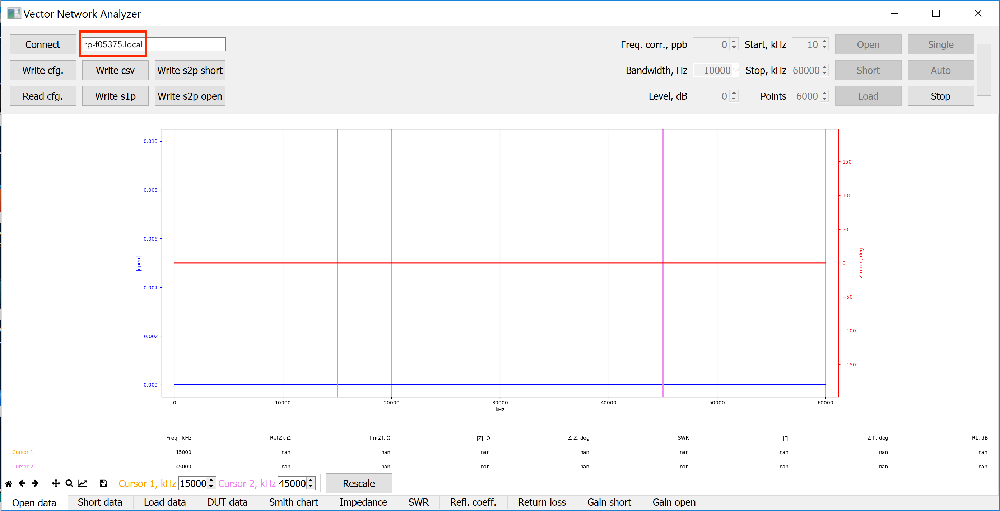
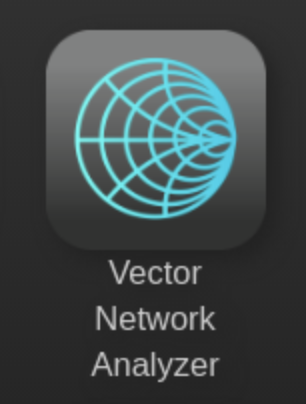
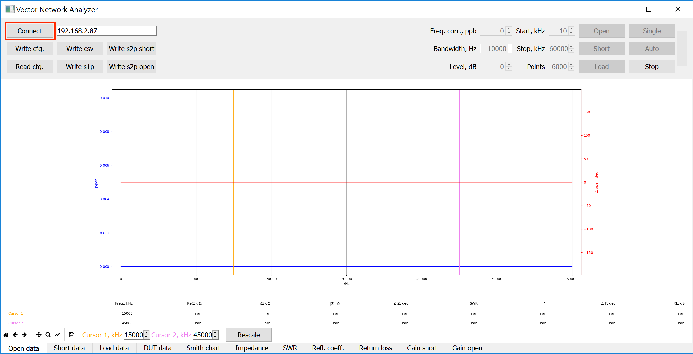
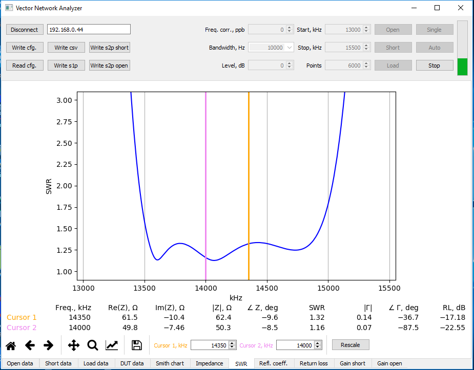
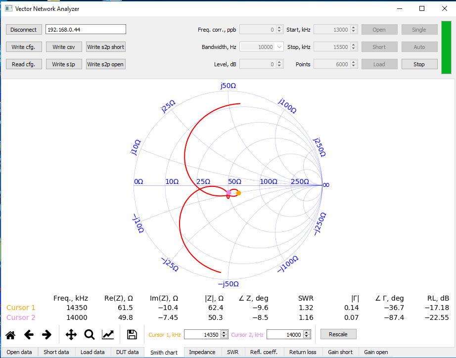

#######################
Vector network analyzer
#######################

******************************
What do I need before I start?
******************************

1. VNA application requirements:

    * Personal computer (PC) running Windows or Linux.

2. The following accessories and materials that are available in Red Pitaya store:

    * any kit that includes STEMlab 125-14 or 125-10 board
    * Vector network analyzer bridge module

*************************************************
Start using Red Pitaya as vector network analyzer
*************************************************

====================================================
Connect vector network analyzer bridge to Red Pitaya
====================================================

    * connect OUT of VNA module to Red Pitaya IN1
    * connect IN of VNA module to Red Pitaya OUT1
    * set IN1 jumpers on Red Pitaya to LV position

Coming soon: image that shows connections (trenutno vna bridge module connections.png).

=================================================
Install & run network vector analyzer control app
=================================================

.. contents::
    :local:
    :backlinks: none
    :depth: 1

------------------
Windows users only
------------------

    * Download and unpack the `control program <http://downloads.redpitaya.com/downloads/vna/vna-windows-tool.zip>`__.
    * Run the ``vna.exe`` program.

----------------
Linux users only
----------------

    * Install Python 3 and all the required libraries:

        .. code-block:: shell-session

            sudo apt-get install python3-dev python3-pip python3-numpy python3-pyqt5 libfreetype6-dev
            sudo pip3 install matplotlib mpldatacursor

    * Download and unpack the `control program <http://downloads.redpitaya.com/downloads/vna/vna-windows-tool.zip>`__.
    * Run the control program:

        .. code-block:: shell-session

            python3 vna.py

====================================================
Type in the IP or URL address of the RedPitaya board
====================================================

---------------------------------
Connect by entering RedPitaya IP:
---------------------------------

To find our IP address of the RedPitaya board first connect to RedPitaya
by following this `instructions <http://redpitaya.readthedocs.io/en/latest/quickStart/first.html>`_.

Then go to System->Network manager. IP is written next to label
Address: xxx.xxx.xxx.xxx .

----------------------------------
Connect by entering RedPitaya URL:
----------------------------------

=====================================================
Run vector network analyzer application on RedPitaya.
=====================================================

=========================================================
Click Connect inside network vector analyzer control app.
=========================================================

***************************************
Perform calibration and start measuring
***************************************

    .. image::  img/3_calibrate.PNG

#. ) Connect SMA OPEN calibration connector marked with letter O to DUT SMA connector of the network vector analyzer bridge module. Click button “Open” and wait for calibration procedure to complete.

    .. image:: img/04_Calibration_O.jpg

#. ) Connect SMA SHORT calibration connector marked with letter S to DUT SMA connector of the network vector analyzer bridge module. Click button “Short” and wait for calibration procedure to complete.

    .. image:: img/03_Calibration_S.jpg

#. ) Connect SMA LOAD calibration connector marked with letter L to DUT SMA connector of the network vector analyzer bridge module. Click button “Load” and wait for calibration procedure to complete.

    .. image:: img/05_Calibration_L.jpg

#. ) Select Smith chart tab at the bottom and then click Single button to perform a single measurement of the DUT. Dot in the middle of the Smith chart circle (@ 50ohm) will indicate that VNA is properly measuring reference 50ohm LOAD.

    .. image::  img/4-load_DUT_smith_chart.PNG

#. ) Disconnect LOAD SMA connector and connect whatever DUT you’d like to measure.

    .. image::  img/07_Product_Combo.jpg

=========
Examples:
=========

#. ) Measurement of 21m vertical antenna.
    Antenna is not well tuned (at freq. 14, 21MHz SWR should be <= 1.5)

    .. image::  img/antenna.png

#. ) HAM RADIO 20m band bandpass filter
    SWR is better than 1.5 between start and stop band frequency.
    Filter load is around 50ohm between start and stop band frequency.

.. admonition:: Credits

    | Original developer of the vector network analyzer RedPitaya application is Pavel Demin.
    | Repositories used by our builds:

        * https://github.com/RedPitaya/red-pitaya-notes

.. .. image::  img/vna_bridge_module_connections.png