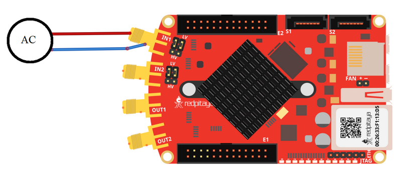
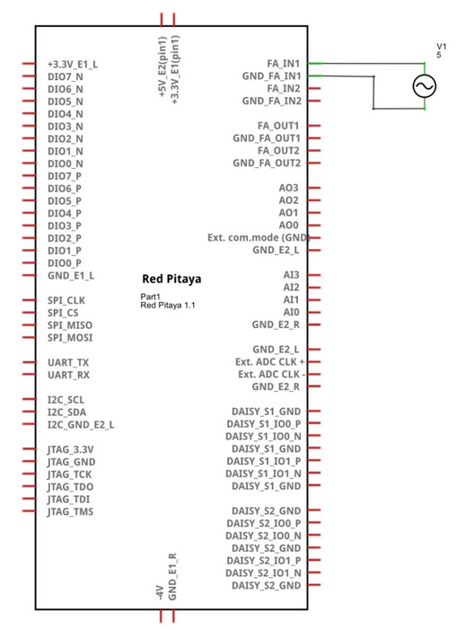
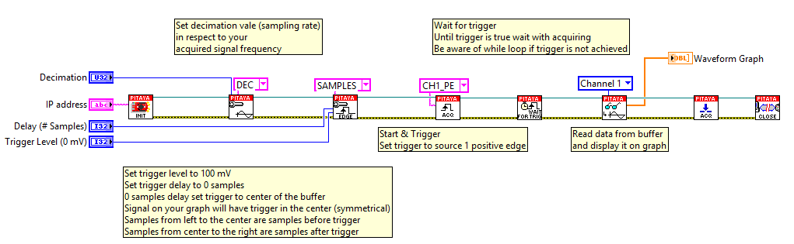

On trigger signal acquisition
#############################

.. http://blog.redpitaya.com/examples-new/single-buffer-acquire/

Description
***********

This example shows how to acquire 16k samples of signal on fast analog inputs. Signal will be acquired when the
internal trigger condition is meet. Time length of the acquired signal depends on the time scale of a buffer that can
be set with a decimation factor. Decimations and time scales of a buffer are given in the table below. Voltage range 
of fast analog inputs on the Red Pitaya depends on gain setting that can be set by jumpers. HV setting is for input 
range to ±20V, while LV sets input range to ±1V.

+-------------+----------------+-------------------------------+--------------------------+--------------------------+
| Decimation  | Sampling Rate  | Time scale/length of a buffer | Trigger delay in samples | Trigger delay in seconds | 
+-------------+----------------+-------------------------------+--------------------------+--------------------------+
| 1           | 125 MS/s       | 131.072 us                    | from - 8192 to x         | -6.554E-5 to x           | 
+-------------+----------------+-------------------------------+--------------------------+--------------------------+
| 8           | 15.6 MS/s      | 1.049 ms                      | from - 8192 to x         | -5.243E-4 to x           | 
+-------------+----------------+-------------------------------+--------------------------+--------------------------+
| 64          | 1.9 MS/s       | 8.389 ms                      | from - 8192 to x         | -4.194E-3 to x           | 
+-------------+----------------+-------------------------------+--------------------------+--------------------------+
| 1024        | 122.0 kS/s     | 134.218 ms                    | from - 8192 to x         | -6.711E-2 to x           | 
+-------------+----------------+-------------------------------+--------------------------+--------------------------+
| 8192        | 15.2 kS/s      | 1.074 s                       | from - 8192 to x         | -5.369E-1 to x           | 
+-------------+----------------+-------------------------------+--------------------------+--------------------------+
| 65536       | 1.9 kS/s       | 8.590 s                       | from - 8192 to x         | -4.295E+0 to x           | 
+-------------+----------------+-------------------------------+--------------------------+--------------------------+

Required hardware
*****************

    - Red Pitaya
    - Signal (function) generator

Cicuit
******

Code - MATLAB®
**************

The code is written in MATLAB. In the code we use SCPI commands and TCP/IP communication. Copy code to MATLAB editor
and press run.

.. code-block:: matlab

   %% Define Red Pitaya as TCP/IP object
   clear all
   close all
   clc
   IP= '192.168.178.111';                % Input IP of your Red Pitaya...
   port = 5000;
   tcpipObj = tcpip(IP, port);
   tcpipObj.InputBufferSize = 16384*32;
   
   %% Open connection with your Red Pitaya
   
   fopen(tcpipObj);
   tcpipObj.Terminator = 'CR/LF';
   
   flushinput(tcpipObj);
   flushoutput(tcpipObj);
   
   % Set decimation vale (sampling rate) in respect to you 
   % acquired signal frequency
   
   fprintf(tcpipObj,'ACQ:RST');
   fprintf(tcpipObj,'ACQ:DEC 1');
   fprintf(tcpipObj,'ACQ:TRIG:LEV 0');
   
   % Set trigger delay to 0 samples
   % 0 samples delay set trigger to center of the buffer
   % Signal on your graph will have trigger in the center (symmetrical)
   % Samples from left to the center are samples before trigger 
   % Samples from center to the right are samples after trigger
   
   fprintf(tcpipObj,'ACQ:TRIG:DLY 0');
   
   %% Start & Trigg
   % Trigger source setting must be after ACQ:START
   % Set trigger to source 1 positive edge
   
   fprintf(tcpipObj,'ACQ:START');
   % After acquisition is started some time delay is needed in order to acquire fresh samples in to buffer
   % Here we have used time delay of one second but you can calculate exact value taking in to account buffer
   % length and smaling rate
   pause(1)
   
   fprintf(tcpipObj,'ACQ:TRIG CH1_PE');  
   % Wait for trigger
   % Until trigger is true wait with acquiring
   % Be aware of while loop if trigger is not achieved
   % Ctrl+C will stop code executing in Matlab
   
   while 1
        trig_rsp=query(tcpipObj,'ACQ:TRIG:STAT?')
      
        if strcmp('TD',trig_rsp(1:2))  % Read only TD
      
        break
      
        end
    end
    
    
   % Read data from buffer 
   signal_str=query(tcpipObj,'ACQ:SOUR1:DATA?');
   signal_str_2=query(tcpipObj,'ACQ:SOUR2:DATA?');
   
   % Convert values to numbers.% First character in string is “{“   
   % and 2 latest are empty spaces and last is “}”.  
   
   signal_num=str2num(signal_str(1,2:length(signal_str)-3));
   signal_num_2=str2num(signal_str_2(1,2:length(signal_str_2)-3));
   
   plot(signal_num)
   hold on
   plot(signal_num_2,'r')
   grid on
   ylabel('Voltage / V')
   xlabel('samples')
   
   fclose(tcpipObj)

Code - C
********

.. code-block:: c

    /* Red Pitaya C API example Acquiring a signal from a buffer  
     * This application acquires a signal on a specific channel */
    
    #include <stdio.h>
    #include <stdlib.h>
    #include <unistd.h>
    #include "redpitaya/rp.h"
    
    int main(int argc, char **argv){
    
            /* Print error, if rp_Init() function failed */
            if(rp_Init() != RP_OK){
                    fprintf(stderr, "Rp api init failed!\n");
            }
    
            /*LOOB BACK FROM OUTPUT 2 - ONLY FOR TESTING*/
            rp_GenReset();
            rp_GenFreq(RP_CH_1, 20000.0);
            rp_GenAmp(RP_CH_1, 1.0);
            rp_GenWaveform(RP_CH_1, RP_WAVEFORM_SINE);
            rp_GenOutEnable(RP_CH_1);
    
    
            uint32_t buff_size = 16384;
            float *buff = (float *)malloc(buff_size * sizeof(float));
    
            rp_AcqReset();
            rp_AcqSetDecimation(1);
            rp_AcqSetTriggerLevel(0.1); //Trig level is set in Volts while in SCPI 
            rp_AcqSetTriggerDelay(0);
    
            rp_AcqStart();
    
            /* After acquisition is started some time delay is needed in order to acquire fresh samples in to buffer*/
            /* Here we have used time delay of one second but you can calculate exact value taking in to account buffer*/
            /*length and smaling rate*/
    
            sleep(1);
            rp_AcqSetTriggerSrc(RP_TRIG_SRC_CHA_PE);
            rp_acq_trig_state_t state = RP_TRIG_STATE_TRIGGERED;
    
            while(1){
                    rp_AcqGetTriggerState(&state);
                    if(state == RP_TRIG_STATE_TRIGGERED){
                    break;
                    }
            }
                    
            rp_AcqGetOldestDataV(RP_CH_1, &buff_size, buff);
            int i;
            for(i = 0; i < buff_size; i++){
                    printf("%f\n", buff[i]);
            }
            /* Releasing resources */
            free(buff);
            rp_Release();
            return 0;
    }
        
Code - Python
*************

.. code-block:: python

    #!/usr/bin/python

    import sys
    import redpitaya_scpi as scpi
    import matplotlib.pyplot as plot

    rp_s = scpi.scpi(sys.argv[1])

    rp_s.tx_txt('ACQ:START')
    rp_s.tx_txt('ACQ:TRIG NOW')

    while 1:
        rp_s.tx_txt('ACQ:TRIG:STAT?')
        if rp_s.rx_txt() == 'TD':
            break

    rp_s.tx_txt('ACQ:SOUR1:DATA?')
    buff_string = rp_s.rx_txt()
    buff_string = buff_string.strip('{}\n\r').replace("  ", "").split(',')
    buff = list(map(float, buff_string))

    plot.plot(buff)
    plot.ylabel('Voltage')
    plot.show()
    view rawacquire_trigger_posedge.py

Code - Scilab
*************

Scilab socket input buffer can read approximately 800 samples from Red Pitaya. This is the problem in contributed code
for Scilab sockets. How to set socket is described on Blink example.

.. code-block:: scilab

    clear all
    clc
    
    // Load SOCKET Toolbox. 
    exec(SCI+'contribsocket_toolbox_2.0.1loader.sce'); 
    SOCKET_init();
    
    // Define Red Pitaya as TCP/IP object
    IP= '192.168.178.56';            // Input IP of your Red Pitaya...
    port = 5000;                     // If you are using WiFi then IP is:               
    tcpipObj='RedPitaya';            // 192.168.128.1
    
    // Open connection with your Red Pitaya
    
    SOCKET_open(tcpipObj,IP,port);
    
    // Set decimation value (sampling rate) in respect to you 
    // acquired signal frequency
    
    SOCKET_write(tcpipObj,'ACQ:DEC 8');
    
    // Set trigger level to 100 mV
    
    SOCKET_write(tcpipObj,'ACQ:TRIG:LEV 0');
    
    // Set trigger delay to 0 samples
    // 0 samples delay set trigger to center of the buffer
    // Signal on your graph will have trigger in the center (symmetrical)
    // Samples from left to the center are samples before trigger 
    // Samples from center to the right are samples after trigger
    
    SOCKET_write(tcpipObj,'ACQ:TRIG:DLY 0');
    
    //// Start & Trigg
    // Trigger source setting must be after ACQ:START
    // Set trigger to source 1 positive edge
    
    SOCKET_write(tcpipObj,'ACQ:START');
    SOCKET_write(tcpipObj,'ACQ:TRIG NOW');  
    
    // Wait for trigger
    // Until trigger is true wait with acquiring
    // Be aware of while loop if trigger is not achieved
    // Ctrl+C will stop code executing 
    
    xpause(1E+6)
    
    // Read data from buffer 
    
    signal_str=SOCKET_query(tcpipObj,'ACQ:SOUR1:DATA:OLD:N? 800');
    
    // Convert values to numbers.// First character in string is “{“  
    // and 2 latest are empty spaces and last is “}”.  
    signal_str=part(signal_str, 2:length(signal_str)-3)
    signal_num=strtod(strsplit(signal_str,",",length(signal_str)))';
    
    plot(signal_num)
    
    SOCKET_close(tcpipObj);

Code - LabVIEW

`Download <https://dl.dropboxusercontent.com/sh/6g8608y9do7s0ly/AACA34cIKw3QkUskKoU7ZvTka/On%20trigger%20signal%20acquisition.vi?dl=0>`_
