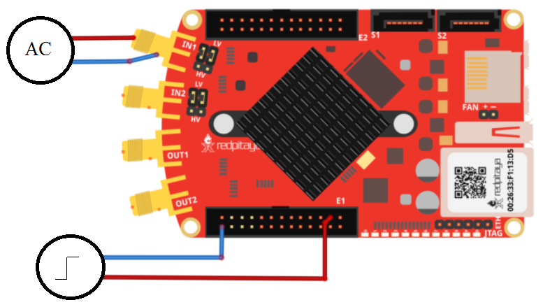
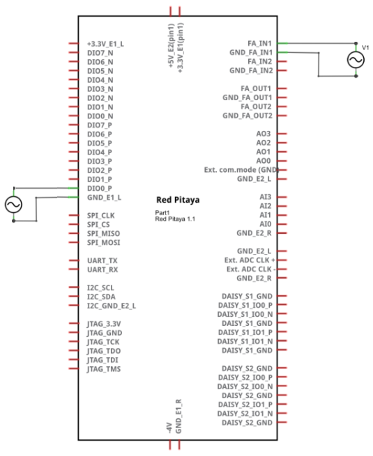
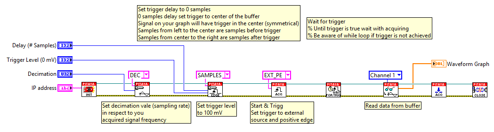

Signal acquisition on external trigger
######################################

.. http://blog.redpitaya.com/examples-new/on-given-external-trigger-acquire-signal-on-fast-analog-input/

Description
***********

This example shows how to acquire 16k samples of signal on fast analog inputs. Signal will be acquired when the 
external trigger condition is meet. Time length of the acquired signal depends on the time scale of a buffer that can 
be set with a decimation factor. Decimations and time scales of a buffer are given in the :ref:`table <s_rate_and_dec>`. Voltage and frequency ranges depends on Red Pitaya model. 

+-------------+----------------+-------------------------------+--------------------------+--------------------------+
| Decimation  | Sampling Rate  | Time scale/length of a buffer | Trigger delay in samples | Trigger delay in seconds | 
+-------------+----------------+-------------------------------+--------------------------+--------------------------+
| 1           | 125 MS/s       | 131.072 us                    | from - 8192 to x         | -6.554E-5 to x           | 
+-------------+----------------+-------------------------------+--------------------------+--------------------------+
| 8           | 15.6 MS/s      | 1.049 ms                      | from - 8192 to x         | -5.243E-4 to x           | 
+-------------+----------------+-------------------------------+--------------------------+--------------------------+
| 64          | 1.9 MS/s       | 8.389 ms                      | from - 8192 to x         | -4.194E-3 to x           | 
+-------------+----------------+-------------------------------+--------------------------+--------------------------+
| 1024        | 122.0 kS/s     | 134.218 ms                    | from - 8192 to x         | -6.711E-2 to x           | 
+-------------+----------------+-------------------------------+--------------------------+--------------------------+
| 8192        | 15.2 kS/s      | 1.074 s                       | from - 8192 to x         | -5.369E-1 to x           | 
+-------------+----------------+-------------------------------+--------------------------+--------------------------+
| 65536       | 7.6 kS/s       | 8.590 s                       | from - 8192 to x         | -4.295E+0 to x           | 
+-------------+----------------+-------------------------------+--------------------------+--------------------------+

Required hardware
*****************

    - Red Pitaya device
    - Signal (function) generator
    
Wiring example for STEMlab 125-14 & STEMlab 125-10:

Circuit
*******

Code - MATLAB®
**************

.. code-block:: matlab

    The code is written in MATLAB. In the code we use SCPI commands and TCP/IP communication. Copy code to MATLAB editor 
    and press run.

    %% Define Red Pitaya as TCP/IP object
    clear all
    close all
    clc
    IP= '192.168.178.111';                % Input IP of your Red Pitaya...
    port = 5000;
    tcpipObj = tcpip(IP, port);
    tcpipObj.InputBufferSize = 16384*32;

    %% Open connection with your Red Pitaya

    fopen(tcpipObj);
    tcpipObj.Terminator = 'CR/LF';

    flushinput(tcpipObj);
    flushoutput(tcpipObj);

    % Set decimation vale (sampling rate) in respect to you 
    % acquired signal frequency

    fprintf(tcpipObj,'ACQ:RST');
    fprintf(tcpipObj,'ACQ:DEC 1');
    fprintf(tcpipObj,'ACQ:TRIG:LEV 0');

    % Set trigger delay to 0 samples
    % 0 samples delay set trigger to center of the buffer
    % Signal on your graph will have trigger in the center (symmetrical)
    % Samples from left to the center are samples before trigger 
    % Samples from center to the right are samples after trigger

    fprintf(tcpipObj,'ACQ:TRIG:DLY 0');

    % for SIGNALlab device there is a possiblity to set trigger threshold 
    % fprintf(tcpipObj,'ACQ:TRIG:EXT:LEV 1')

    %% Start & Trigg
    % Trigger source setting must be after ACQ:START
    % Set trigger to source 1 positive edge

    fprintf(tcpipObj,'ACQ:START');
    % After acquisition is started some time delay is needed in order to acquire fresh samples in to buffer
    % Here we have used time delay of one second but you can calculate exact value taking in to account buffer
    % length and smaling rate
    pause(1)

    fprintf(tcpipObj,'ACQ:TRIG EXT_PE');  
    % Wait for trigger
    % Until trigger is true wait with acquiring
    % Be aware of while loop if trigger is not achieved
    % Ctrl+C will stop code executing in Matlab

    while 1
        trig_rsp=query(tcpipObj,'ACQ:TRIG:STAT?')
    
        if strcmp('TD',trig_rsp(1:2))  % Read only TD
    
        break
    
        end
    end
    
    
    % Read data from buffer 
    signal_str=query(tcpipObj,'ACQ:SOUR1:DATA?');
    signal_str_2=query(tcpipObj,'ACQ:SOUR2:DATA?');

    % Convert values to numbers.% First character in string is “{“   
    % and 2 latest are empty spaces and last is “}”.  

    signal_num=str2num(signal_str(1,2:length(signal_str)-3));
    signal_num_2=str2num(signal_str_2(1,2:length(signal_str_2)-3));

    plot(signal_num)
    hold on
    plot(signal_num_2,'r')
    grid on
    ylabel('Voltage / V')
    xlabel('samples')

    fclose(tcpipObj)
    
Code - Python
*************

.. code-block:: python

    #!/usr/bin/python

    import sys
    import redpitaya_scpi as scpi
    import matplotlib.pyplot as plot

    rp_s = scpi.scpi(sys.argv[1])

    rp_s.tx_txt('ACQ:DEC 8')
    rp_s.tx_txt('ACQ:TRIG:LEVEL 100')
    rp_s.tx_txt('ACQ:START')
    rp_s.tx_txt('ACQ:TRIG EXT_PE')

    while 1:
        rp_s.tx_txt('ACQ:TRIG:STAT?')
        if rp_s.rx_txt() == 'TD':
            break

    rp_s.tx_txt('ACQ:SOUR1:DATA?')
    buff_string = rp_s.rx_txt()
    buff_string = buff_string.strip('{}\n\r').replace("  ", "").split(',')
    buff = list(map(float, buff_string))

    plot.plot(buff)
    plot.ylabel('Voltage')
    plot.show()
    view rawacquire_trigger_external.py

Code - LabVIEW
**************

`Download <https://dl.dropboxusercontent.com/sh/6g8608y9do7s0ly/AABIk6wqlMPPjCoo6ZmvR5qJa/Signal%20acquisition%20on%20external%20trigger.vi>`_
