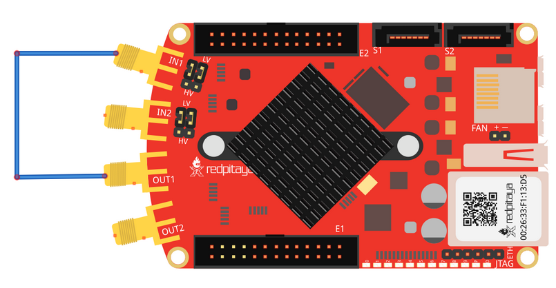
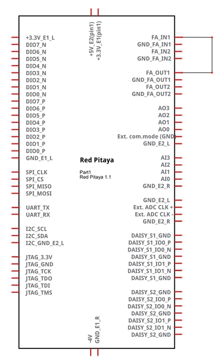
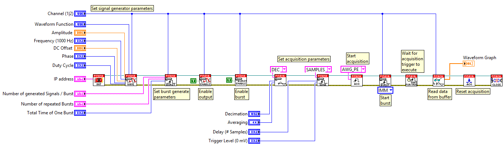

Synchronised one pulse signal generation and acquisition
########################################################

.. http://blog.redpitaya.com/examples-new/synchronized-one-pulse-generating-and-acquiring/

Description
***********

This example shows how to acquire 16k samples of signal on fast analog inputs. Signal will be acquired simultaneously 
with generated signal. Time length of the acquired signal depends on the time scale of a buffer that can be set with a
decimation factor. Decimations and time scales of a buffer you can found :ref:`here <s_rate_and_dec>`. Voltage range of fast analog
inputs on the Red Pitaya depends on gain setting that can be set by jumpers. HV setting is for input range to ±20V,
while LV sets input range to ±1V.

+-------------+----------------+-------------------------------+--------------------------+--------------------------+
| Decimation  | Sampling Rate  | Time scale/length of a buffer | Trigger delay in samples | Trigger delay in seconds | 
+-------------+----------------+-------------------------------+--------------------------+--------------------------+
| 1           | 125 MS/s       | 131.072 us                    | from - 8192 to x         | -6.554E-5 to x           | 
+-------------+----------------+-------------------------------+--------------------------+--------------------------+
| 8           | 15.6 MS/s      | 1.049 ms                      | from - 8192 to x         | -5.243E-4 to x           | 
+-------------+----------------+-------------------------------+--------------------------+--------------------------+
| 64          | 1.9 MS/s       | 8.389 ms                      | from - 8192 to x         | -4.194E-3 to x           | 
+-------------+----------------+-------------------------------+--------------------------+--------------------------+
| 1024        | 122.0 MS/s     | 134.218 ms                    | from - 8192 to x         | -6.711E-2 to x           | 
+-------------+----------------+-------------------------------+--------------------------+--------------------------+
| 8192        | 15.2 kS/s      | 1.074 s                       | from - 8192 to x         | -5.369E-1 to x           | 
+-------------+----------------+-------------------------------+--------------------------+--------------------------+
| 65536       | 7.6 kS/s       | 8.590 s                       | from - 8192 to x         | -4.295E+0 to x           | 
+-------------+----------------+-------------------------------+--------------------------+--------------------------+

Required hardware
*****************

    - Red Pitaya device

Wiring example for STEMlab 125-14 & STEMlab 125-10:    

Circuit
*******


Code - MATLAB®
**************

.. code-block:: matlab

    The code is written in MATLAB. In the code we use SCPI commands and TCP/IP communication. Copy code to MATLAB editor
    and press run.

    clc
    clear all
    close all

    IP= '192.168.178.111';           % Input IP of your Red Pitaya...
    port = 5000;
    tcpipObj=tcpip(IP, port);
    tcpipObj.InputBufferSize = 16384*32;
    tcpipObj.OutputBufferSize = 16384*32;

    %% Open connection with your Red Pitaya
    fopen(tcpipObj);
    tcpipObj.Terminator = 'CR/LF';
    flushinput(tcpipObj)
    flushoutput(tcpipObj)

    %% Loop back for testing Generate 

    %% The example generate sine bursts every 0.5 seconds indefinety
    fprintf(tcpipObj,'GEN:RST');
    fprintf(tcpipObj,'ACQ:RST');

    fprintf(tcpipObj,'SOUR1:FUNC SINE');                                                 
    fprintf(tcpipObj,'SOUR1:FREQ:FIX 1000');     % Set frequency of output signal
    fprintf(tcpipObj,'SOUR1:VOLT 1');          % Set amplitude of output signal

    fprintf(tcpipObj,'SOUR1:BURS:STAT ON');    % Set burst mode to ON
    fprintf(tcpipObj,'SOUR1:BURS:NCYC 1');       % Set 1 pulses of sine wave
    fprintf(tcpipObj,'OUTPUT1:STATE ON');         % Set output to ON

    %% Set Acquire

    fprintf(tcpipObj,'ACQ:DEC 64');
    fprintf(tcpipObj,'ACQ:TRIG:LEV 0');
    fprintf(tcpipObj,'ACQ:TRIG:DLY 0');

    %% Start gen % acq

    fprintf(tcpipObj,'ACQ:START');
    pause(1);
    fprintf(tcpipObj,'ACQ:TRIG AWG_PE');
    fprintf(tcpipObj,'SOUR1:TRIG:IMM');           % Set generator trigger to immediately

    %% Wait for trigger
    while 1
        trig_rsp=query(tcpipObj,'ACQ:TRIG:STAT?')
        if strcmp('TD',trig_rsp(1:2))
        break
        end
    end

    %% Read & plot

    signal_str=query(tcpipObj,'ACQ:SOUR1:DATA?');
    signal_num=str2num(signal_str(1,2:length(signal_str)-3));
    plot(signal_num)
    hold on
    grid on

    %% Close connection with Red Pitaya
    fclose(tcpipObj);

Code - LabVIEW
**************

`Download <https://dl.dropboxusercontent.com/sh/6g8608y9do7s0ly/AAD9FDHKJi0SISLJhCFtLyQpa/Synchronised%20one%20pulse%20signal%20generation%20and%20acquisition.vi>`_
