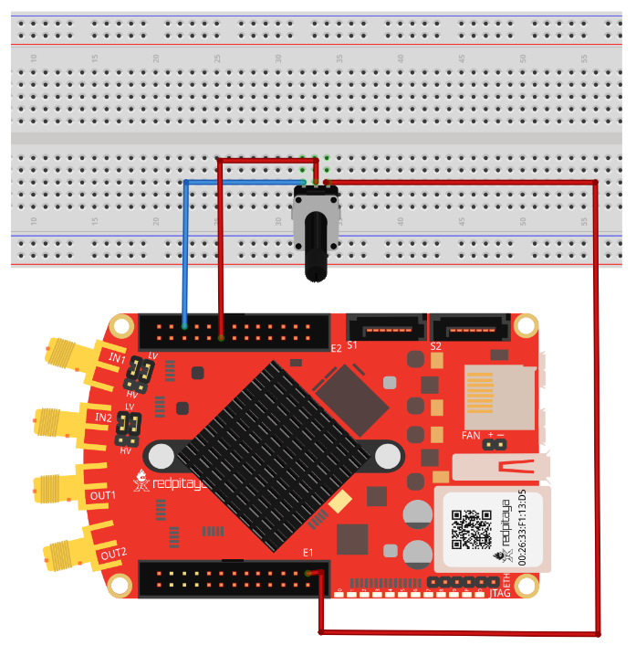
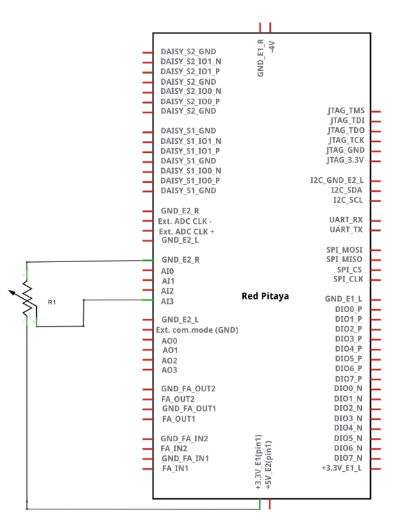
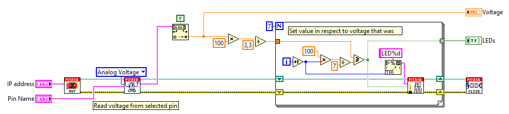

Read analog voltage on slow analog input
########################################

.. http://blog.redpitaya.com/examples-new/read-analog-voltage-on-slow-analog-input/

Description
***********

This example shows how to measure analog voltage of slow analog inputs on Red Pitaya extension connector. Analog
inputs on Red Pitaya are rated from 0-3.3 Volts.

Required hardware
*****************

    - Red Pitaya
    - R1 10K potentiometer

Circuit
*******

Code - MATLAB®
**************

The code is written in MATLAB. In the code we use SCPI commands and TCP/IP communication. Copy code from below to 
MATLAB editor, save project and press run.

.. code-block:: matlab

    %% Define Red Pitaya as TCP/IP object

    IP= '192.168.178.108';           % Input IP of your Red Pitaya...
    port = 5000;
    tcpipObj=tcpip(IP, port);

    %% Open connection with your Red Pitaya

    fopen(tcpipObj);
    tcpipObj.Terminator = 'CR/LF';

    volts0=str2num(query(tcpipObj,'ANALOG:PIN? AIN0'))
    volts1=str2num(query(tcpipObj,'ANALOG:PIN? AIN1'))
    volts2=str2num(query(tcpipObj,'ANALOG:PIN? AIN2'))
    volts3=str2num(query(tcpipObj,'ANALOG:PIN? AIN3'))

    %% Close connection with Red Pitaya

    fclose(tcpipObj);

Code - C
********

.. code-block:: c

    /* Read analog voltage on slow analog input */

    #include <stdio.h>
    #include <stdlib.h>

    #include "redpitaya/rp.h"

    int main (int argc, char **argv) {
        float value [4];

        // Initialization of API
        if (rp_Init() != RP_OK) {
            fprintf(stderr, "Red Pitaya API init failed!\n");
            return EXIT_FAILURE;
        }

        // Measure each XADC input voltage
        for (int i=0; i<4; i++) {
            rp_AIpinGetValue(i, &value[i]);
            printf("Measured voltage on AI[%i] = %1.2fV\n", i, value[i]);
        }

        // Releasing resources
        rp_Release();
        
        return EXIT_SUCCESS;
    }

    
Code - Python
*************

.. code-block:: python

    #!/usr/bin/python

    import sys
    import redpitaya_scpi as scpi

    rp_s = scpi.scpi(sys.argv[1])

    for i in range(4):
        rp_s.tx_txt('ANALOG:PIN? AIN' + str(i))
        value = float(rp_s.rx_txt())
        print ("Measured voltage on AI["+str(i)+"] = "+str(value)+"V")

Code - Scilab
*************

How to set sockets is described on Blink example

.. code-block:: scilab

    clc
    
    // Load SOCKET Toolbox
    exec(SCI+'contribsocket_toolbox_2.0.1loader.sce'); 
    SOCKET_init();
    
    
    // Define Red Pitaya as TCP/IP object
            
    IP= '192.168.178.56';            // Input IP of your Red Pitaya...
    port = 5000;                     // If you are using WiFi then IP is:               
    tcpipObj='RedPitaya';            // 192.168.128.1
    
    // Open connection with your Red Pitaya
    
    SOCKET_open(tcpipObj,IP,port);
    
    // Red value on analog input 3
    
    volts=strtod(SOCKET_query(tcpipObj,'ANALOG:PIN? AIN3'));
    disp(volts)
    
    // Define value p from 0 - 100 //
            
            p = volts *(100/3.3) ;   // Set value of p in respect to readed voltage
            
            if p >=(100/7)
            SOCKET_write(tcpipObj,'DIG:PIN LED1,1')
            else
            SOCKET_write(tcpipObj,'DIG:PIN LED1,0') 
            end   
            
            if p >=(100/7)*2
            SOCKET_write(tcpipObj,'DIG:PIN LED2,1')
            else
            SOCKET_write(tcpipObj,'DIG:PIN LED2,0') 
            end  
            
            if p >=(100/7)*3
            SOCKET_write(tcpipObj,'DIG:PIN LED3,1')        
            else
            SOCKET_write(tcpipObj,'DIG:PIN LED3,0') 
            end  
            
            if p >=(100/7)*4
            SOCKET_write(tcpipObj,'DIG:PIN LED4,1')        
            else
            SOCKET_write(tcpipObj,'DIG:PIN LED4,0') 
            end  
            
            if p >=(100/7)*5
            SOCKET_write(tcpipObj,'DIG:PIN LED5,1')        
            else
            SOCKET_write(tcpipObj,'DIG:PIN LED5,0') 
            end  
            
            if p >=(100/7)*6
            SOCKET_write(tcpipObj,'DIG:PIN LED6,1')        
            else
            SOCKET_write(tcpipObj,'DIG:PIN LED6,0') 
            end  
            
            if p >=(100/7)*7
            SOCKET_write(tcpipObj,'DIG:PIN LED7,1')        
            else
            SOCKET_write(tcpipObj,'DIG:PIN LED7,0') 
            end  
            
    // Close connection with Red Pitaya
    
    SOCKET_close(tcpipObj);

Code - LabVIEW

`Download <https://dl.dropboxusercontent.com/sh/6g8608y9do7s0ly/AAAi01EnApzCSEEGr3ksQz3ra/Read%20analog%20voltage%20on%20slow%20analog%20input.vi>`_
