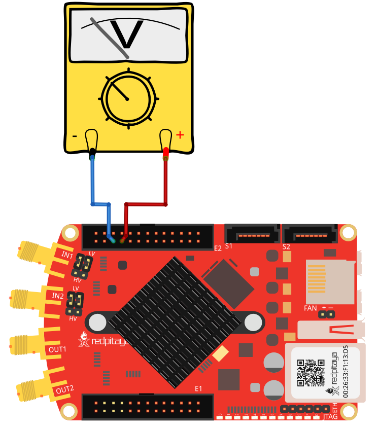
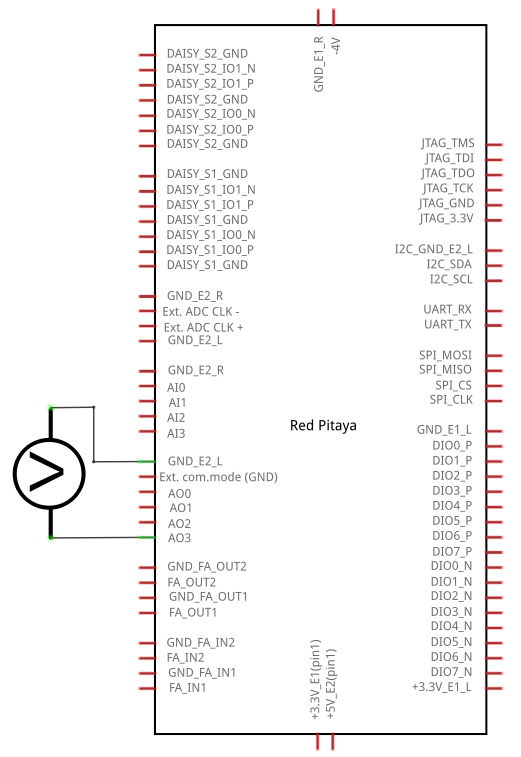
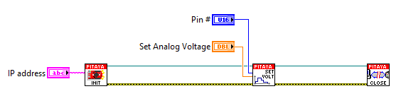

Interactive voltage setting on slow analog output
#################################################

..  http://blog.redpitaya.com/examples-new/interactive-voltage-setting-on-slow-analog-output-2/

Description
***********

This example shows how to set analog voltage on slow analog Red Pitaya outputs using MATLAB slider. Slow analog 
outputs on Red Pitaya are in range from 0 to 1.8 Volts.

Required hardware
*****************

    - Red Pitaya device
    - Voltmeter

Wiring example for STEMlab 125-14 & STEMlab 125-10:

Circuit
*******

Code - MATLAB®
**************

The code is written in MATLAB. In the code we use SCPI commands and TCP/IP communication. Copy code from below to 
MATLAB editor, save project and press run.

.. code-block:: matlab 

    function sliderDemo

    f = figure(1);
        global p
        
        
        %// initialize the slider
        h = uicontrol(...
            'parent'  , f,...        
            'units'   , 'normalized',...     %// pixels settings
            'style'   , 'slider',...
            'position', [0.05 0.05 0.9 0.05],...
            'min'     , 1,...                %// Make the "value" between min ...
            'max'     , 100,...              %// max 10, with initial value
            'value'   , 10,...               %// as set.
            'callback', @sliderCallback);    %// This is called when using the
                                            %// arrows
                                            %// and/or when clicking the slider bar

        hLstn = addlistener(h,'ContinuousValueChange',@sliderCallback);
        %// (variable appears unused, but not assigning it to anything means that
        %// the listener is stored in the 'ans' variable. If "ans" is overwritten,
        %// the listener goes out of scope and is thus destroyed, and thus, it no
        %// longer works.

        function  sliderCallback(~,~)
    
        p =(get(h,'value'))

        
        %% Define Red Pitaya as TCP/IP object

        IP= '192.168.178.108';           % Input IP of your Red Pitaya...
        port = 5000;
        tcpipObj=tcpip(IP, port);

        %% Open connection with your Red Pitaya

        fopen(tcpipObj);
        tcpipObj.Terminator = 'CR/LF';

            %% Set your output voltage value and pin

            out_voltage = num2str((1.8/100)*p)      % From 0 - 1.8 volts
            out_num = '2';                          % Analog outputs 0,1,2,3
            %% Set your SCPI command with strcat function

            scpi_command = strcat('ANALOG:PIN AOUT',out_num,',',out_voltage);

            %% Send SCPI command to Red Pitaya

            fprintf(tcpipObj,scpi_command);

            %% Close connection with Red Pitaya

        fclose(tcpipObj);
        end
    end

Code - LabVIEW
**************

`Download <https://dl.dropboxusercontent.com/sh/6g8608y9do7s0ly/AADBbIo7oTxWxluMoQ0KB0x6a/Interactive%20voltage%20setting%20on%20slow%20analog%20output.vi>`_

