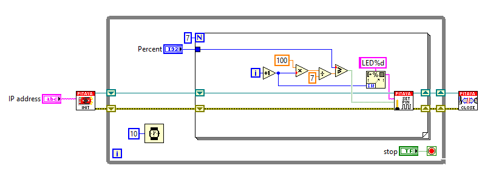

Bar graph with LEDs
###################

.. `Bar graph with LEDs <http://blog.redpitaya.com/examples-new/bar-graph-with-leds/>`_

Description
***********

This example shows how to make a bar graph by controlling Red Pitaya on board LEDs.
The number of LEDs that will be turned ON, corresponds to the value of variable p.

Required hardware
*****************

    -  Red Pitaya device

.. image:: RP-circuit-e1421258707736-300x212.png

Code - MATLAB®
**************

The code is written in MATLAB. In the code we use SCPI commands and TCP/IP communication. Copy code from below to 
MATLAB editor, input value p save project and press run. Change p from 0-100 and press run.

 .. code-block:: matlab
 
    IP= '192.168.178.56';           % Input IP of your Red Pitaya...
    port = 5000;
    tcpipObj=tcpip(IP, port);

    %% Open connection with your Red Pitaya

    fopen(tcpipObj);
    tcpipObj.Terminator = 'CR/LF';

            %% Define value p from 0 - 100 %
            p = 67;    % Set value of p

            if p >=(100/7)
            fprintf(tcpipObj,'DIG:PIN LED1,1')
            else
            fprintf(tcpipObj,'DIG:PIN LED1,0')
            end

            if p >=(100/7)*2
            fprintf(tcpipObj,'DIG:PIN LED2,1')
            else
            fprintf(tcpipObj,'DIG:PIN LED2,0') 
            end

            if p >=(100/7)*3
            fprintf(tcpipObj,'DIG:PIN LED3,1')
            else
            fprintf(tcpipObj,'DIG:PIN LED3,0') 
            end

            if p >=(100/7)*4
            fprintf(tcpipObj,'DIG:PIN LED4,1')
            else
            fprintf(tcpipObj,'DIG:PIN LED4,0') 
            end

            if p >=(100/7)*5
            fprintf(tcpipObj,'DIG:PIN LED5,1')
            else
            fprintf(tcpipObj,'DIG:PIN LED5,0') 
            end

            if p >=(100/7)*6
            fprintf(tcpipObj,'DIG:PIN LED6,1')
            else
            fprintf(tcpipObj,'DIG:PIN LED6,0') 
            end

            if p >=(100/7)*7
            fprintf(tcpipObj,'DIG:PIN LED7,1')
            else
            fprintf(tcpipObj,'DIG:PIN LED7,0') 
            end

    fclose(tcpipObj);

Code - Python
*************

.. code-block:: python

    #!/usr/bin/python

    import sys
    import redpitaya_scpi as scpi

    rp_s = scpi.scpi(sys.argv[1])

    if (len(sys.argv) > 2):
    percent = int(sys.argv[2])
    else:
    percent = 50

    print ("Bar showing "+str(percent)+"%")

    for i in range(8):
        if (percent > (i * (100.0/8))):
            rp_s.tx_txt('DIG:PIN LED' + str(i) + ',' + str(1))
        else:
            rp_s.tx_txt('DIG:PIN LED' + str(i) + ',' + str(0))

Code - LabVIEW
**************

`Download <http://downloads.redpitaya.com/downloads/labview/Bar%20graph%20with%20LEDs.vi>`_
