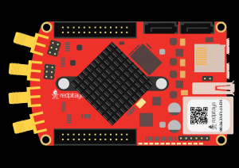
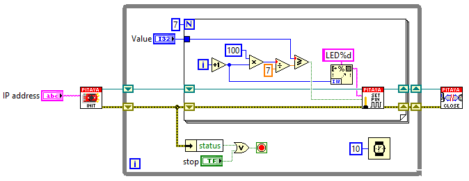

Interactive LED bar graph
#########################

.. http://blog.redpitaya.com/examples-new/interactive-led-bar-graph/

Description
***********

This example shows how to make a bar graph by controlling Red Pitaya on board LEDs.
The number of LEDs that will be turned ON, corresponds to the value of variable p
that can be set by MATLAB® slider bar.

Required hardware
*****************

    - Red Pitaya device

Code - MATLAB®
**************

The code is written in MATLAB. In the code we use SCPI commands and TCP/IP communication. Copy code from below to
MATLAB editor, input value p save project and press run. Change p with slider bar from 0-100.

.. code-block:: matlab

    function sliderDemo

        f = figure(1);
        global p
        
        %// initialize the slider
        h = uicontrol(...
            'parent'  , f,...
            'units'   , 'normalized',...                 %// pixels settings
            'style'   , 'slider',...
            'position', [0.05 0.05 0.9 0.05],...
            'min'     , 1,...                            %// Make the "value" between min ...
            'max'     , 100,...                          %// max 10, with initial value
            'value'   , 10,...                           %// as set.
            'callback', @sliderCallback);                %// This is called when using the
                                                        %// arrows
                                                        %// and/or when clicking the slider bar

        
    
        hLstn = handle.listener(h,'ActionEvent',@sliderCallback);
        %// (variable appears unused, but not assigning it to anything means that
        %// the listener is stored in the 'ans' variable. If "ans" is overwritten,
        %// the listener goes out of scope and is thus destroyed, and thus, it no 
        %// longer works.

        function  sliderCallback(~,~)

        p =(get(h,'value'))

        % Define Red Pitaya as TCP/IP object

        IP= '192.168.178.56';           % Input IP of your Red Pitaya...
        port = 5000;
        tcpipObj=tcpip(IP, port);

        %% Open connection with your Red Pitaya

        fopen(tcpipObj);
        tcpipObj.Terminator = 'CR/LF';

            if p >=(100/7)
            fprintf(tcpipObj,'DIG:PIN LED1,1')
            else
            fprintf(tcpipObj,'DIG:PIN LED1,0') 
            end

            if p >=(100/7)*2
            fprintf(tcpipObj,'DIG:PIN LED2,1')
            else
            fprintf(tcpipObj,'DIG:PIN LED2,0') 
            end

            if p >=(100/7)*3
            fprintf(tcpipObj,'DIG:PIN LED3,1')
            else
            fprintf(tcpipObj,'DIG:PIN LED3,0') 
            end

            if p >=(100/7)*4
            fprintf(tcpipObj,'DIG:PIN LED4,1')
            else
            fprintf(tcpipObj,'DIG:PIN LED4,0') 
            end

            if p >=(100/7)*5
            fprintf(tcpipObj,'DIG:PIN LED5,1')
            else
            fprintf(tcpipObj,'DIG:PIN LED5,0') 
            end

            if p >=(100/7)*6
            fprintf(tcpipObj,'DIG:PIN LED6,1')
            else
            fprintf(tcpipObj,'DIG:PIN LED6,0') 
            end

            if p >=(100/7)*7
            fprintf(tcpipObj,'DIG:PIN LED7,1')
            else
            fprintf(tcpipObj,'DIG:PIN LED7,0') 
            end

            if p >=(100/8)*7
            fprintf(tcpipObj,'DIG:PIN LED8,1')
            else
            fprintf(tcpipObj,'DIG:PIN LED8,0') 
            end
                
    fclose(tcpipObj);
    end
    end

Code - LabVIEW
**************

`Download <https://downloads.redpitaya.com/downloads/Clients/labview/Interactive%20LED%20bar%20graph.vi>`_
