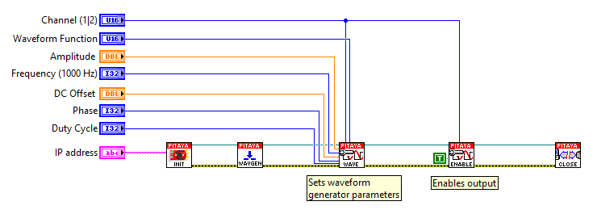

Generate continuous signal
##########################

.. http://blog.redpitaya.com/examples-new/generate-continuous-signal-on-fast-analog-outputs/

Description
***********

This example shows how to program Red Pitaya to generate analog 2kHz sine wave signal with 1V amplitude. Voltage and frequency ranges depends on Red Pitaya model.

Required hardware
*****************

    - Red Pitaya device

.. image:: output_y49qDi.gif

Code - MATLAB®
**************

The code is written in MATLAB. In the code we use SCPI commands and TCP/IP communication. Copy code from below to
MATLAB editor, save project and press run.

.. code-block:: matlab

    %% Define Red Pitaya as TCP/IP object

    IP= '192.168.178.111';           % Input IP of your Red Pitaya...
    port = 5000;
    tcpipObj=tcpip(IP, port);

    %% Open connection with your Red Pitaya

    fopen(tcpipObj);
    tcpipObj.Terminator = 'CR/LF';

    fprintf(tcpipObj,'GEN:RST');
    fprintf(tcpipObj,'SOUR1:FUNC SINE');       % Set function of output signal
                                            % {sine, square, triangle, sawu,sawd, pwm}
    fprintf(tcpipObj,'SOUR1:FREQ:FIX 2000');   % Set frequency of output signal
    fprintf(tcpipObj,'SOUR1:VOLT 1');          % Set amplitude of output signal
    fprintf(tcpipObj,'OUTPUT1:STATE ON');      % Set output to ON

    %% Close connection with Red Pitaya

    fclose(tcpipObj);
    
    
Code - C
********

.. code-block:: c

    /* Red Pitaya C API example Generating continuous signal  
    * This application generates a specific signal */

    #include <stdio.h>
    #include <stdint.h>
    #include <stdlib.h>
    #include <unistd.h>

    #include "redpitaya/rp.h"

    int main(int argc, char **argv){

        /* Print error, if rp_Init() function failed */
        if(rp_Init() != RP_OK){
            fprintf(stderr, "Rp api init failed!\n");
        }

        /* Generating frequency */
        rp_GenFreq(RP_CH_1, 10000.0);

        /* Generating amplitude */
        rp_GenAmp(RP_CH_1, 1.0);

        /* Generating wave form */
        rp_GenWaveform(RP_CH_1, RP_WAVEFORM_SINE);

        /* Enable channel */
        rp_GenOutEnable(RP_CH_1);

        /* Releasing resources */
        rp_Release();

        return 0;
    }
   
Code - Python
*************

    #!/usr/bin/python

    import sys
    import redpitaya_scpi as scpi

    rp_s = scpi.scpi(sys.argv[1])

    wave_form = 'sine'
    freq = 10000
    ampl = 1

    rp_s.tx_txt('GEN:RST')
    rp_s.tx_txt('SOUR1:FUNC ' + str(wave_form).upper())
    rp_s.tx_txt('SOUR1:FREQ:FIX ' + str(freq))
    rp_s.tx_txt('SOUR1:VOLT ' + str(ampl))

    #Enable output
    rp_s.tx_txt('OUTPUT1:STATE ON')

Code - LabVIEW
**************

`Download <https://dl.dropboxusercontent.com/sh/6g8608y9do7s0ly/AAD02Lsn5aXV7kRFFfaPi6eOa/Generate%20continuous%20signal.vi>`_
