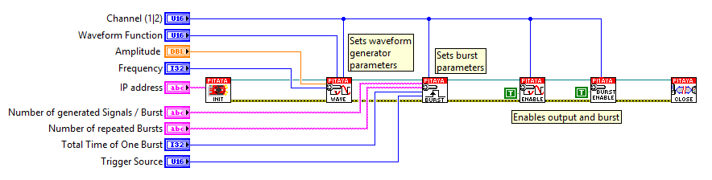

Generate signal pulses
######################

.. http://blog.redpitaya.com/examples-new/generate-signal-pulses/

Description
***********

This example shows how to generate signal pulses of predefined signal waveforms like sine, triangle, square, ramp up,
ramp down or pwm. Generated signal can be observed by an Oscilloscope.

Required hardware
*****************

    - Red Pitaya device

.. image:: output_y49qDi.gif

Code - MATLAB®
**************

The code is written in MATLAB. In the code we use SCPI commands and TCP/IP communication. Copy code from below to 
MATLAB editor, save project and press run.

.. code-block:: matlab

    %% Define Red Pitaya as TCP/IP object
    clc
    clear all
    close all
    IP= '192.168.178.111';          % Input IP of your Red Pitaya...
    port = 5000;                    % If you are using WiFi then IP is:              
    tcpipObj=tcpip(IP, port);       % 192.168.128.1

    fopen(tcpipObj);
    tcpipObj.Terminator = 'CR/LF';

    %% The example generate sine bursts every 0.5 seconds indefinety
    %fprintf(tcpipObj,'GEN:RST');

    fprintf(tcpipObj,'SOUR1:FUNC SINE');                                                 
    fprintf(tcpipObj,'SOUR1:FREQ:FIX 1000');     % Set frequency of output signal
    fprintf(tcpipObj,'SOUR1:VOLT 1');            % Set amplitude of output signal

    fprintf(tcpipObj,'SOUR1:BURS:STAT ON');      % Set burst mode to ON
    fprintf(tcpipObj,'SOUR1:BURS:NCYC 1');       % Set 1 pulses of sine wave
    fprintf(tcpipObj,'SOUR1:BURS:NOR 1000');     % Infinity number of sine wave pulses
    fprintf(tcpipObj,'SOUR1:BURS:INT:PER 5000'); % Set time of burst period in microseconds = 5 * 1/Frequency * 1000000
    fprintf(tcpipObj,'SOUR1:TRIG:IMM');          % Set generator trigger to immediately
    fprintf(tcpipObj,'OUTPUT1:STATE ON');        % Set output to ON

    %% Close connection with Red Pitaya

    fclose(tcpipObj);

Code - C
********
 
.. code-block:: c

    /* Red Pitaya C API example Generating signal pulse on an external trigger 
    * This application generates a specific signal */

    #include <stdio.h>
    #include <stdlib.h>
    #include <unistd.h>

    #include "redpitaya/rp.h"

    int main(int argc, char **argv){

            /* Burst count */

            /* Print error, if rp_Init() function failed */
            if(rp_Init() != RP_OK){
                    fprintf(stderr, "Rp api init failed!\n");
            }

            rp_GenWaveform(RP_CH_1, RP_WAVEFORM_SINE);
            rp_GenFreq(RP_CH_1, 1000);
            rp_GenAmp(RP_CH_1, 1.0);

            rp_GenMode(RP_CH_1, RP_GEN_MODE_BURST);
            rp_GenBurstCount(RP_CH_1, 1);
            rp_GenBurstRepetitions(RP_CH_1, 10000);
            rp_GenBurstPeriod(RP_CH_1, 5000);
            rp_GenTrigger(1);
            sleep(1);
            rp_GenOutEnable(RP_CH_1);
            rp_Release();
    }

Code - Python
*************

.. code-block:: python

    #!/usr/bin/python

    import sys
    import redpitaya_scpi as scpi

    rp_s = scpi.scpi(sys.argv[1])

    wave_form = 'sine'
    freq = 10000
    ampl = 1

    rp_s.tx_txt('GEN:RST')
    rp_s.tx_txt('SOUR1:FUNC ' + str(wave_form).upper())
    rp_s.tx_txt('SOUR1:FREQ:FIX ' + str(freq))
    rp_s.tx_txt('SOUR1:VOLT ' + str(ampl))
    rp_s.tx_txt('SOUR1:BURS:NCYC 2')
    rp_s.tx_txt('OUTPUT1:STATE ON')
    rp_s.tx_txt('SOUR1:BURS:STAT ON')
    rp_s.tx_txt('SOUR1:TRIG:SOUR INT')
    rp_s.tx_txt('SOUR1:TRIG:IMM')

Code - LabVIEW
**************

`Downloads <http://downloads.redpitaya.com/downloads/labview/Generate%20signal%20pulses.vi>`_
