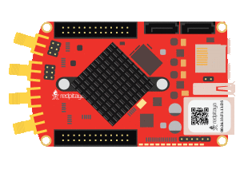
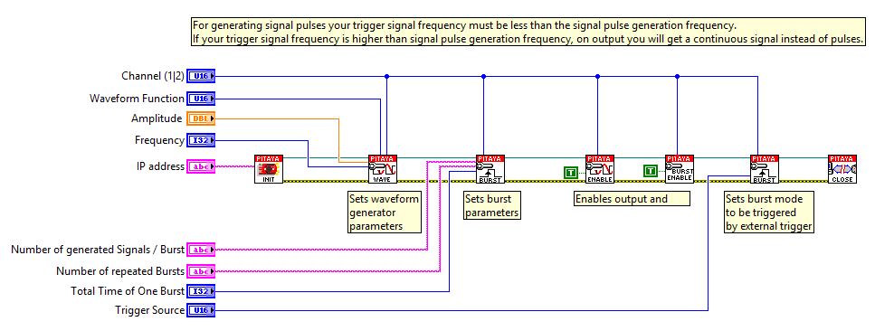

Generate signal on external trigger
###################################

.. http://blog.redpitaya.com/examples-new/generate-signal-on-fast-analog-outputs-with-external-triggering/

Description
***********

This example shows how to program Red Pitaya to generate analog signal on external trigger. Red Pitaya will first wait 
for trigger from external source and start generating desired signal right after trigger condition is met. Red Pitaya 
is able to generate signals in range from DC to 50 MHz with output voltage range from -1 to 1 Volt. Generated signal 
can be observed by an Oscilloscope.

Required hardware
*****************

    - Red Pitaya

Code - MATLAB®
**************

The code is written in MATLAB. In the code we use SCPI commands and TCP/IP communication. Copy code to MATLAB editor
and press run.

.. code-block:: matlab

    %% Define Red Pitaya as TCP/IP object
    clc
    clear all
    close all

    IP= '192.168.178.56';            % Input IP of your Red Pitaya...
    port = 5000;
    tcpipObj=tcpip(IP, port);

    %% Open connection with your Red Pitaya
    fopen(tcpipObj);
    tcpipObj.Terminator = 'CR/LF';
    flushinput(tcpipObj)
    flushoutput(tcpipObj)

    %% Generate

    fprintf(tcpipObj,'SOUR1:FUNC SINE');          % Set function of output signal {sine, square, triangle,sawu,sawd, pwm}
    fprintf(tcpipObj,'SOUR1:FREQ:FIX 200');       % Set frequency of output signal
    fprintf(tcpipObj,'SOUR1:VOLT 1');             % Set amplitude of output signal

    fprintf(tcpipObj,'SOUR1:BURS:NCYC 1');        % Set 1 pulses of sine wave
    fprintf(tcpipObj,'OUTPUT1:STATE ON');         % Set output to ON
    fprintf(tcpipObj,'SOUR1:BURS:STAT ON');       % Set burst mode to ON
    
    fprintf(tcpipObj,'SOUR1:TRIG:SOUR EXT_PE');   % Set generator trigger to external

    % For generating signal pulses you trigger signal frequency must be less than
    % frequency of generating signal pulses. If you have trigger signal frequency  
    % higher than frequency of generating signal pulses
    % on output you will get continuous  signal instead of pulses

    fclose(tcpipObj)

Code - C
********

.. code-block:: c

    /* Red Pitaya external trigger pulse generation Example */

    #include <stdio.h>
    #include <stdlib.h>
    #include <unistd.h>

    #include "redpitaya/rp.h"

    int main(int argc, char **argv){

        /* Print error, if rp_Init() function failed */
        if(rp_Init() != RP_OK){
            fprintf(stderr, "Rp api init failed!\n");
        }
        
        rp_GenWaveform(RP_CH_1, RP_WAVEFORM_SINE);
        rp_GenFreq(RP_CH_1, 200);
        rp_GenAmp(RP_CH_1, 1);

        rp_GenBurstCount(RP_CH_1, 1);
        /* Enable output channel */
        rp_GenOutEnable(RP_CH_1);
        rp_GenMode(RP_CH_1, RP_GEN_MODE_BURST);
        rp_GenTriggerSource(RP_CH_1, RP_GEN_TRIG_SRC_EXT_PE);

        /* Release rp resources */
        rp_Release();

        return 0;
    }

Code - Python
*************

.. code-block:: python

    #!/usr/bin/python

    import sys
    import redpitaya_scpi as scpi

    rp_s = scpi.scpi(sys.argv[1])

    wave_form = 'sine'
    freq = 10000
    ampl = 1

    rp_s.tx_txt('GEN:RST')
    rp_s.tx_txt('SOUR1:FUNC ' + str(wave_form).upper())
    rp_s.tx_txt('SOUR1:FREQ:FIX ' + str(freq))
    rp_s.tx_txt('SOUR1:VOLT ' + str(ampl))
    rp_s.tx_txt('SOUR1:BURS:NCYC 2')
    rp_s.tx_txt('OUTPUT1:STATE ON')
    rp_s.tx_txt('SOUR1:BURS:STAT ON')
    rp_s.tx_txt('SOUR1:TRIG:SOUR EXT_PE')

Code - LabVIEW
**************

`Download <https://dl.dropboxusercontent.com/sh/6g8608y9do7s0ly/AAAnwA85bcChcQJVHBkG9ZSla/Generate%20signal%20on%20external%20trigger.vi>`_
