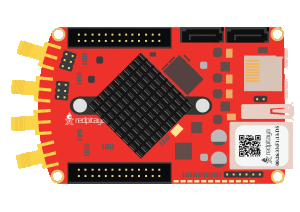

Custom waveform signal generation
#################################

.. http://blog.redpitaya.com/examples-new/custom-signal-generating

Description
***********

This example shows how to program Red Pitaya to generate custom waveform signal. Red Pitaya is able to generate
signals in range from DC to 50 MHz with output voltage range from -1 to 1 Volt. Generated signal can be observed by an
Oscilloscope.

Required hardware
*****************

    - Red Pitaya device

Code - MATLAB®
**************

The code is written in MATLAB. In the code we use SCPI commands and TCP/IP communication. Copy code to MATLAB editor 
and press run.

.. code-block:: matlab

    %% Define Red Pitaya as TCP/IP object
    clc
    clear all
    close all
    IP= '192.168.178.102';           % Input IP of your Red Pitaya...
    port = 5000;
    tcpipObj=tcpip(IP, port);

    tcpipObj.InputBufferSize = 16384*64;
    tcpipObj.OutputBufferSize = 16384*64;
    flushinput(tcpipObj)
    flushoutput(tcpipObj)

    %% Open connection with your Red Pitaya and close previous
    x=instrfind;
    fclose(x);
    fopen(tcpipObj);
    tcpipObj.Terminator = 'CR/LF';

    %% Calcualte arbitrary waveform with 16384 samples
    % Values of arbitrary waveform must be in range from -1 to 1.
    N=16383;
    t=0:(2*pi)/N:2*pi;
    x=sin(t)+1/3*sin(3*t);
    y=1/2*sin(t)+1/4*sin(4*t);
    plot(t,x,t,y)
    grid on

    %% Convert waveforms to string with 5 decimal places accuracy
    waveform_ch_1_0 =num2str(x,'%1.5f,');
    waveform_ch_2_0 =num2str(y,'%1.5f,');

    % latest are empty spaces  “,”.
    waveform_ch_1 =waveform_ch_1_0(1,1:length(waveform_ch_1_0)-3);
    waveform_ch_2 =waveform_ch_2_0(1,1:length(waveform_ch_2_0)-3);

    %%

    fprintf(tcpipObj,'GEN:RST')                     % Reset to default settings

    fprintf(tcpipObj,'SOUR1:FUNC ARBITRARY');       % Set function of output signal
    fprintf(tcpipObj,'SOUR2:FUNC ARBITRARY');       % {sine, square, triangle, sawu, sawd}

    fprintf(tcpipObj,['SOUR1:TRAC:DATA:DATA ' waveform_ch_1])  % Send waveforms to Red Pitya
    fprintf(tcpipObj,['SOUR2:TRAC:DATA:DATA ' waveform_ch_2])

    fprintf(tcpipObj,'SOUR1:VOLT 0.7');             % Set amplitude of output signal
    fprintf(tcpipObj,'SOUR2:VOLT 1');

    fprintf(tcpipObj,'SOUR1:FREQ:FIX 4000');        % Set frequency of output signal
    fprintf(tcpipObj,'SOUR2:FREQ:FIX 4000');

    fprintf(tcpipObj,'OUTPUT1:STATE ON');
    fprintf(tcpipObj,'OUTPUT2:STATE ON');

    fclose(tcpipObj);

Code - C
********

.. code-block:: c

    #include <stdio.h>
    #include <stdlib.h>
    #include <math.h>

    #include "redpitaya/rp.h"

    #define M_PI 3.14159265358979323846

    int main(int argc, char **argv){

        int i;
        int buff_size = 16384;

        /* Print error, if rp_Init() function failed */
        if(rp_Init() != RP_OK){
            fprintf(stderr, "Rp api init failed!\n");
        }

        float *t = (float *)malloc(buff_size * sizeof(float));
        float *x = (float *)malloc(buff_size * sizeof(float));
        float *y = (float *)malloc(buff_size * sizeof(float));

        for(i = 1; i < buff_size; i++){
            t[i] = (2 * M_PI) / buff_size * i;
        }

        for (int i = 0; i < buff_size; ++i){
            x[i] = sin(t[i]) + ((1.0/3.0) * sin(t[i] * 3));
            y[i] = (1.0/2.0) * sin(t[i]) + (1.0/4.0) * sin(t[i] * 4);
        }

        rp_GenWaveform(RP_CH_1, RP_WAVEFORM_ARBITRARY);
        rp_GenWaveform(RP_CH_2, RP_WAVEFORM_ARBITRARY);

        rp_GenArbWaveform(RP_CH_1, x, buff_size);
        rp_GenArbWaveform(RP_CH_2, y, buff_size);

        rp_GenAmp(RP_CH_1, 0.7);
        rp_GenAmp(RP_CH_2, 1.0);

        rp_GenFreq(RP_CH_1, 4000.0);
        rp_GenFreq(RP_CH_2, 4000.0);

        rp_GenOutEnable(RP_CH_1);
        rp_GenOutEnable(RP_CH_2);

        /* Releasing resources */
        free(y);
        free(x);
        free(t);
        rp_Release();
    }

Code - LabVIEW
**************

`Download <https://dl.dropboxusercontent.com/sh/6g8608y9do7s0ly/AABC9XVRlgqQCplTPWG9LiXOa/Custom%20waveform%20signal%20generation.vi>`_
