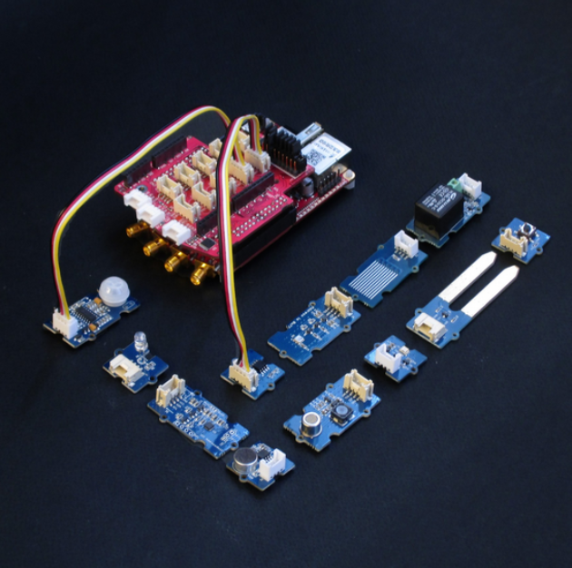
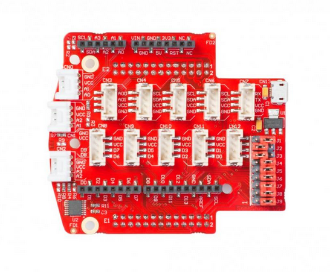

#################
Jupyter Notebook
#################

The Jupyter Notebook is an open-source web application that allows you to create and share documents that contain live
code, equations, visualizations, explanatory text and direct controll or monitor hardware. 
Uses include: data cleaning and transformation, numerical simulation, statistical modeling, machine learning and much 
more. 

********
Features
********

- In-browser editing of code, with automatic syntax highlighting, indentation, and tab completion/introspection.
- The ability to execute code from the browser, with the results of computations attached to the code which generated 
  them. 
- Displaying the result of computation using rich media representations, such as HTML, LaTeX, PNG, SVG, etc. For 
  example, publication-quality figures rendered by the `matplotlib <http://matplotlib.org/>`_ library, can be included
  inline.
- In-browser editing for rich text using the `Markdown <http://daringfireball.net/projects/markdown/syntax>`_ markup 
  language, which can provide commentary for the code, is not limited to plain text.
- The ability to easily include mathematical notation within markdown cells using LaTeX, and rendered natively by 
  `MathJax <http://www.mathjax.org/>`_.

==================
Notebook documents
==================

Notebook documents contains the inputs and outputs of a interactive session as well as additional text that 
accompanies the code but is not meant for execution. In this way, notebook files can serve as a complete computational
record of a session, interleaving executable code with explanatory text, mathematics, and rich representations of
resulting objects. These documents are internally `JSON <http://en.wikipedia.org/wiki/JSON>`_ files and are saved with 
the *.ipynb* extension. Since JSON is a plain text format, they can be version-controlled and shared with colleagues.

Notebooks may be exported to a range of static formats, including HTML (for example, for blog posts), 
reStructuredText, LaTeX, PDF, and slide shows, via the `nbconvert <https://nbconvert.readthedocs.io/en/latest/>`_ 
command.

Furthermore, any *.ipynb* notebook document available from a public URL can be shared via the Jupyter Notebook Viewer (nbviewer). This service loads the notebook document from the URL and renders it as a static web page. The results may thus be shared with a colleague, or as a public blog post, without other users needing to install the Jupyter notebook themselves. In effect, nbviewer is simply nbconvert as a web service, so you can do your own static conversions with nbconvert, without relying on nbviewer.

***************************
Hardware – Extension module
***************************

Although the usage of Jupyter notebook does not require any additional hardware except the STEMLab
board, getting started with electronics is way more fun and interesting when you have loads of sensors that you can
put to good use straight away. Whether you want to measure temperature, vibration, movement etc. we have 
an extension module compatible with **Grove** modules from `Seeed® <http://wiki.seeed.cc/Grove_System/>`_.  All you 
need is to select the desired module, find the correct connector and get going with your project. 
We have also placed Arduino shields headers on the Extension module.

The headers enable you to directly connect a variety of different Arduino Uno shields. There are a wide range of 
Arduino Uno shields.
The Extension module can be powered from the external power supply via a micro USB connector. A set of nine JUMPERS is
used for reconnecting certain extension module connectors to different :ref:`E1 <E1>` or :ref:`E2 <E2>` pins or 
changing power supply settings. For example: With J1 and J3 you can set the source of VCC- external or from 
Red Pitaya. A full schematic of the Extension module is available on our web page.

.. note:: 

    The extension module can be purchased from Red Pitaya `store <http://store.redpitaya.com/>`_. 
    
==========
Connectors
==========

The black connectors on the sides are compatible with Arduino,
white connectors on the front provide analog inputs,
and there are two rows of gray connectors at the center
which provide digital I/O, UART, I2C or analog outputs.
On the bottom there are connectors to the Red Pitaya board.

~~~~~~~~~~~~~~~~~~~~~~~
Grove module connectors
~~~~~~~~~~~~~~~~~~~~~~~

This are dedicated connectors compatible with `Grove modules <http://wiki.seeed.cc/Grove_System/>`_.

There are six connector types available:

* **AI** Analog input (0-3.3V)
* **AO** Analog output
* **I2C** (3.3V)
* **UART** (3.3V)
* **DIO** Digital input/output (3.3V, not 5V tolerant)

+-------+------+------+------+------+------+------+------+------+------+------+------+------+------+
| conn. | CN0  | CN1  | CN2  | CN3  | CN4  | CN5  | CN6  | CN7  | CN8  | CN9  | CN10 | CN11 | CN12 |
+-------+------+------+------+------+------+------+------+------+------+------+------+------+------+
| type  | AI   | AI   | AI   | AO   | I2C  | I2C  | I2C  | UART | DIO  | DIO  | DIO  | DIO  | DIO  |
+=======+======+======+======+======+======+======+======+======+======+======+======+======+======+
| ``1`` | AI0  | AI1  | AI2  | AO0  | SCL  | SCL  | SCL  | RX   | IO8  | IO6  | IO4  | IO2  | IO0  |
+-------+------+------+------+------+------+------+------+------+------+------+------+------+------+
| ``2`` | AI1  | AI2  | AI3  | AO1  | SDA  | SDA  | SDA  | TX   | IO9  | IO7  | IO5  | IO3  | IO1  |
+-------+------+------+------+------+------+------+------+------+------+------+------+------+------+
| ``3`` | VCC  | VCC  | VCC  | VCC  | VCC  | VCC  | VCC  | VCC  | VCC  | VCC  | VCC  | VCC  | VCC  |
+-------+------+------+------+------+------+------+------+------+------+------+------+------+------+
| ``4`` | GND  | GND  | GND  | GND  | GND  | GND  | GND  | GND  | GND  | GND  | GND  | GND  | GND  |
+-------+------+------+------+------+------+------+------+------+------+------+------+------+------+

~~~~~~~~~~~~~~~~~~~~~~~~~~~~~~~~~~~~
Arduino shield compatible connectors
~~~~~~~~~~~~~~~~~~~~~~~~~~~~~~~~~~~~

This set of connectors is partially compatible with the Arduino shield connector.

+----------+-------+---------------+
| function |  pin  | comment       |
+==========+=======+===============+
| IO0      | ``1`` | D[0]          |
+----------+-------+---------------+
| IO1      | ``2`` | D[1]          |
+----------+-------+---------------+
| IO2      | ``3`` | D[2]          |
+----------+-------+---------------+
| IO3      | ``4`` | D[3]          |
+----------+-------+---------------+
| IO4      | ``5`` | D[4]          |
+----------+-------+---------------+
| IO5      | ``6`` | D[5]          |
+----------+-------+---------------+
| IO6      | ``7`` | D[6]          |
+----------+-------+---------------+
| IO7      | ``8`` | D[7]          |
+----------+-------+---------------+

+----------+--------+---------------+
| function |   pin  | comment       |
+==========+========+===============+
| IO8      |  ``1`` | D[8]          |
+----------+--------+---------------+
| IO9      |  ``2`` | D[9]          |
+----------+--------+---------------+
| IO10     |  ``3`` | D[10]         |
+----------+--------+---------------+
| IO11     |  ``4`` | D[11]         |
+----------+--------+---------------+
| IO12     |  ``5`` | D[12]         |
+----------+--------+---------------+
| IO13     |  ``6`` | D[13]         |
+----------+--------+---------------+
| GND      |  ``7`` |               |
+----------+--------+---------------+
| AREF     |  ``8`` | not connected |
+----------+--------+---------------+
| SDA      |  ``9`` | I2C_SDA       |
+----------+--------+---------------+
| SCL      | ``10`` | I2C_SCL       |
+----------+--------+---------------+

+----------+-------+---------------+
| function |  pin  | comment       |
+==========+=======+===============+
| A6       | ``1`` | not connected |
+----------+-------+---------------+
| A7       | ``2`` | not connected |
+----------+-------+---------------+
| Reset    | ``3`` | not connected |
+----------+-------+---------------+
| +3.3V    | ``4`` |               |
+----------+-------+---------------+
| +5.0V    | ``5`` |               |
+----------+-------+---------------+
| GND      | ``6`` |               |
+----------+-------+---------------+
| GND      | ``7`` |               |
+----------+-------+---------------+
| +VIN     | ``8`` | not connected |
+----------+-------+---------------+

*******
Sensors
*******

========================================================================================    ============
Sensor information                                                                          Connector
========================================================================================    ============
`Temperature sensor <http://wiki.seeedstudio.com/wiki/Grove_-_Temperature_Sensor>`_         AI
`Motion sensor <http://wiki.seeedstudio.com/wiki/Grove_-_PIR_Motion_Sensor>`_               DIO
`Touch sensor <http://wiki.seeedstudio.com/wiki/Grove_-_Touch_Sensor>`_                     DIO
`Button <http://wiki.seeedstudio.com/wiki/Grove_-_Button>`_                                 DIO
Switch
Digital
`Tilt <http://wiki.seeedstudio.com/wiki/Grove_-_Tilt_Switch>`_                              DIO
`Potentiometer <http://wiki.seeedstudio.com/wiki/Grove_-_Rotary_Angle_Sensor>`_             AI
`Light sensor <http://wiki.seeed.cc/Grove-Light_Sensor/>`_                                  AI
`Air quality sensor <http://wiki.seeedstudio.com/wiki/Grove_-_Air_Quality_Sensor_v1.>`_     AI
`Vibration sensor <http://wiki.seeedstudio.com/wiki/Grove_-_Piezo_Vibration_Sensor>`_       AI
`Moisture sensor <http://wiki.seeedstudio.com/wiki/Grove_-_Moisture_Sensor>`_               AI
`Water sensor <http://wiki.seeedstudio.com/wiki/Grove_-_Water_Sensor>`_                     AI
`Alcohol sensor <http://wiki.seeedstudio.com/wiki/Grove_-_Alcohol_Sensor>`_                 AI
Barometer ``not supported at the moment``                                                   I2C
`Sound sensor <http://wiki.seeed.cc/Grove-Sound_Sensor/>`_                                  AI
`UV sensor <http://wiki.seeedstudio.com/wiki/Grove_-_UV_Sensor>`_                           AI
Accelerometer ``not supported at the moment``                                               I2C
========================================================================================    ============

========================================================================================    ============
Actuators                                                                                   Connector
========================================================================================    ============
`Relay <http://wiki.seeedstudio.com/wiki/Grove_-_Relay>`_                                   DIO
========================================================================================    ============

========================================================================================    ============
Indicators                                                                                  Connector
========================================================================================    ============
`Buzzer <http://wiki.seeedstudio.com/wiki/Grove_-_Buzzer>`_                                 DIO
`LED <https://www.seeedstudio.com/grove-led-p-767.html?cPath=156_157>`_                     DIO
7 segment display                                                                           Digital pins
LED bar                                                                                     Digital pins
Groove LCD                                                                                  Digital pins
LCD                                                                                         Digital pins
========================================================================================    ============

********
Examples
********

1. `Drive LEDs <https://github.com/RedPitaya/jupyter/blob/9f3cfd3e20c2b4ddae8bdc1762ed6154f917f3ff/examples/led.ipynb>`_
#. `Control GPIO s <https://github.com/RedPitaya/jupyter/blob/9f3cfd3e20c2b4ddae8bdc1762ed6154f917f3ff/examples/gpio.ipynb>`_
#. `Write slow analog I/Os <https://github.com/RedPitaya/jupyter/blob/9f3cfd3e20c2b4ddae8bdc1762ed6154f917f3ff/examples/analog_output.ipynb>`_
#. `Read slow analog I/Os <https://github.com/RedPitaya/jupyter/blob/9f3cfd3e20c2b4ddae8bdc1762ed6154f917f3ff/examples/analog_input.ipynb>`_
#. Generator:
    #. `Generate periodic sine wave <https://github.com/RedPitaya/jupyter/blob/9f3cfd3e20c2b4ddae8bdc1762ed6154f917f3ff/examples/gen_sine_signal.ipynb>`_
    #. `Generate periodic arbitrary signal <https://github.com/RedPitaya/jupyter/blob/9f3cfd3e20c2b4ddae8bdc1762ed6154f917f3ff/examples/gen_arbitrary_signal.ipynb>`_
    #. `Two synchronized generators <https://github.com/RedPitaya/jupyter/blob/9f3cfd3e20c2b4ddae8bdc1762ed6154f917f3ff/examples/gen_sync_two_channel.ipynb>`_
    #. `Burst mode <https://github.com/RedPitaya/jupyter/blob/9f3cfd3e20c2b4ddae8bdc1762ed6154f917f3ff/examples/gen_bursts.ipynb>`_
#. Oscilloscope:
    #. `Forced trigger <https://github.com/RedPitaya/jupyter/blob/9f3cfd3e20c2b4ddae8bdc1762ed6154f917f3ff/examples/osc_trigger_forced.ipynb>`_
    #. `Level trigger <https://github.com/RedPitaya/jupyter/blob/9f3cfd3e20c2b4ddae8bdc1762ed6154f917f3ff/examples/osc_trigger_level.ipynb>`_
    #. `Two synchronized channels <https://github.com/RedPitaya/jupyter/blob/9f3cfd3e20c2b4ddae8bdc1762ed6154f917f3ff/examples/osc_sync_two_channel.ipynb>`_
    #. `Synchronized with generator <https://github.com/RedPitaya/jupyter/blob/9f3cfd3e20c2b4ddae8bdc1762ed6154f917f3ff/examples/osc_sync_with_gen.ipynb>`_
#. Demo applications using widgets:
    #. `Generator <https://github.com/RedPitaya/jupyter/blob/9f3cfd3e20c2b4ddae8bdc1762ed6154f917f3ff/examples/generator_widget.ipynb>`_
    #. `Oscilloscope <https://github.com/RedPitaya/jupyter/blob/9f3cfd3e20c2b4ddae8bdc1762ed6154f917f3ff/examples/oscilloscope_widget.ipynb>`_
#. Grove sensors
    #. `Temperature sensor <https://github.com/RedPitaya/jupyter/blob/9f3cfd3e20c2b4ddae8bdc1762ed6154f917f3ff/examples/exam_temp.ipynb>`__
    #. `Home heating automation <https://github.com/RedPitaya/jupyter/blob/9f3cfd3e20c2b4ddae8bdc1762ed6154f917f3ff/examples/home_automation.ipynb>`_
    
