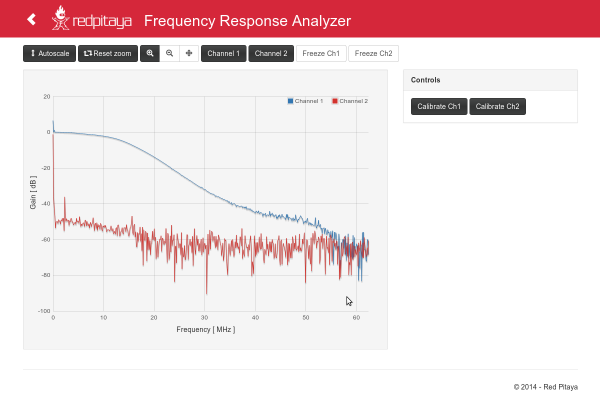
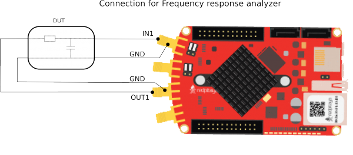
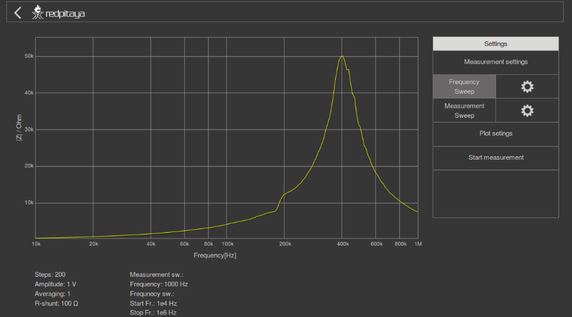
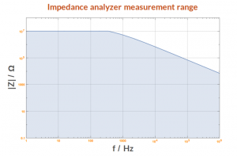
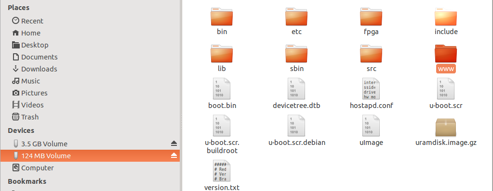
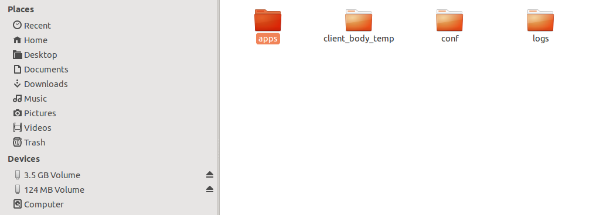
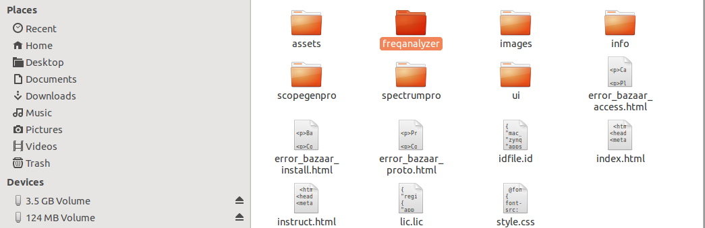

###########
Marketplace
###########

********
Overview
********

The Marketplace contains applications that were developed by the Red Pitaya community.
Please note that the contributed applications are not supplied and tested by the Red Pitaya team.
However, we are constantly in contact with the application developers
and we strive to make these applications work in the best possible way.
What do I need to use the Marketplace? To use the Red Pitaya STEMlab Marketplace
only one version of the Red Pitaya STEM board is needed (STEM 125-10 or STEM 125-14).
Some applications may require additional hardware/software.
For additional guidance and information get in touch with the
Red Pitaya community via the Forum http://forum.redpitaya.com/
Applications

==============
PID controller
==============

A proportional–integral–derivative controller (PID controller) is a
control loop feedback mechanism (controller) commonly used in industrial control systems.
A PID controller continuously calculates an error value
as the difference between a desired set point
and a measured process variable and applies a correction
based on proportional, integral, and derivative terms respectively
(sometimes denoted P, I, and D) which give their name to the controller type.
The MIMO PID controller consists of 4 standard PID controllers
with P, I, and D parameter settings and integrator reset control.
The output of each controller is summed with the output of the arbitrary signal generator.
The PID can be controlled through FPGA registers that are described
inside the PID controller section of the FPGA register map.

========================================
Network Vector Analyzer (by Pavel Demin)
========================================

A vector network analyzer is an instrument that measures
the network parameters of electrical networks (commonly s-parameters).
Network analyzers are often used to characterize two-port networks
such as amplifiers and filters, but they can be used on
networks with an arbitrary number of ports.
This application will enable measurements of the desired DUT (Device Under Test)
providing the measured results/parameters, such as:

* Impedance
* SWR
* Reflection coefficient - Gama
* Return loss.

The measurements are nicely represented on the Smith chart.
You can find more about the Vector Network analyzer on this link:

   http://pavel-demin.github.io/red-pitaya-notes/vna/

=============================================
SDR – Software Defined Radio (by Pavel Demin)
=============================================

Alongside other instruments, the Red Pitaya STEM board can be used as a SDR platform.
A simple installation of the SDR Transceiver application will transform your STEM board into a SDR platform.
To run the SDR on the STEM board you will need to install
one of the following types of SDR software such as HPSDR, SDR#, PowerSDR, GNURadio or similar.

You can find more about the SDR on the Red Pitaya STEM on the links below:

   http://redpitaya.com/red-pitaya-as-sdr-transceiver/

   http://pavel-demin.github.io/red-pitaya-notes/ 

============================
RadioBox - (by Urlich Habel)
============================

The RadioBox is a complete transmitter and receiver done in the FPGA.
You can directly connect an antenna at the SMA RF In 2 port for receiving.
At the SMA RF Out 2 port you can listen to the demodulated signal.
The transmitter does it at the same time on the SMA In/Out 1 connectors.
When an external SDR-software is desired, you can select the Linux AC97 sound driver
as stereo channels in both directions to feed the FPGA or to grab the data streams.
To connect a SDR you can set the two AC97 channels to the I- and Q-signals of the QMIXers modulation.

More details about the project can be found at the Wiki of RadioBox at the following link: 

   https://github.com/DF4IAH/RedPitaya_RadioBox/wiki

=================
LTI DSP Workbench
=================

This application will model a physical system,
turning the Red Pitaya STEM board into almost any linear system
that can be included into a measuring and control circuitry.
The modeling of the physical system is done by simulating
the system H(z) transfer function with the Red Pitaya STEM board.
In the application there are some predefined H(z) functions
which will help you describe/simulate the desired system.
Changing the parameters of the H(z) transfer function
is done quickly through the application’s web interface.

More about this application can be fund here:

   http://redpitaya.com/physical-system-modelling/

===========================
Frequency Response analyzer
===========================

The Frequency Response analyzer enables the measurements of
the frequency amplitude response of the desired DUT (Device Under Test).
The measurements of the frequency response are in the range from 0Hz to 60MHz.
The measurements are done in real time and the frequency range is NOT adjustable.
Measuring can be done for each channel independently,
i.e. it enables simultaneous measurements of two DUTs.
The application works in such way that it is generating band noise signals on OUT1 and OUT2,
this signal is fed to the DUT where the DUT’s response is acquired on IN1 and IN2.
The acquired signals are analyzed using the DFT algorithm and
the frequency response of the DUT is plotted on the GUI.
This application is very useful for filter measurements and similar.

Frequency response analyzer enables measurements of frequency amplitude response of desired DUT (Device Under Test).
The measurements of frequency response are in range from 0Hz to 60MHz.
Measurements are in real time and the frequency range is NOT adjustable.
Measurement can be done for each channel independently, i.e it enables simultaneously measurements of two DUTs.
How to connect DUT to the Red Pitaya when using Frequency Response analyser is shown in picture below.

==========
Teslameter
==========

EMC or electromagnetic compatibility is the property of the equipment
telling us about the devices' emission of unwanted electromagnetic energy
and how they behave in an interfered environment.
It also tells us what effects the emitted energy induces.
This application is used for measuring the magnetic field
that is part of unintended or unwanted electromagnetic emissions.
When using this application, an additional front-end is needed
where the application (trough gain parameters) can be adjusted to the users of front-ends.

More about this application can be found here:

   http://redpitaya.com/emc-measurements-teslameter-project/

==================
Impedance analyzer
==================

The Impedance analyzer application enables measurements of
Impedance, Phase and other parameters of the selected DUT (Device Under Test).
Measurements can be performed in the **Frequency sweep** mode
with 1Hz frequency resolution or in the **Measurements sweep** mode
with the desired number of measurements at constant frequency.
The selectable frequency range is from 1Hz to 60MHz,
although the recommended frequency range is up to 1MHz.
The impedance range is from 0.1 Ohm to 10 Mohm.
When using the Impedance analyzer application with the LCR Extension module,
insert 0 in the shunt resistor field.

Impedance analyzer application enables measurements of Impedance,
Phase and other parameters of selected DUT (Device Under Test).
Measurements can be performed in *Frequency sweep* mode
with 1Hz of frequency resolution or in *Measurements sweep* mode
with desired numbers of measurement at constant frequency.
Selectable frequency range is from 1Hz to 60MHz,
although the recommended frequency range is up to 1MHz*.
Impedance range is from 0.1 Ohm – 10 MOhm*.
When using Impedance analyzer application with LCR Extension module
insert 0 in the shunt resistor field.

.. note::

   Impedance range is dependent on the selected frequency and maximum accuracy
   and suitable measurement can not be performed at all frequencies and impedance ranges.
   Impedance range is given in picture bellow. Range for Capacitors or Inductors
   can be extrapolated from given picture. Basic accuracy of the Impedance analyzer is 5%.
   Impedance analyzer application is calibrated for 1 m Kelvin probes.
   More accurate measurements can be performed in Measurement sweep at constant frequency.

When using Impedance analyzer application optimal results are achieved wheni
the Red Pitaya GND is connected to your mains EARTH lead as is shown below.
We also recommend shielding of Red Pitaya and LCR extension module.

.. image:: E_module_connection.png

On pictures below are shown comparison measurements of the selected DUT.
Measurements are taken with Red Pitaya and Keysight precision LCR meter.
From this plots you can extract basic Red Pitaya accuracy.

.. note::

    Red Pitaya LCR meter/Impedance analyzer are not certificated for certain accuracy or range.

.. image:: LCR_100R.png
.. image:: LCR_100K.png
.. image:: LCR_1M.png

Impedance analyzer application can be used without LCR Extension module
using manual setting of shunt resistor. This option is described below.

.. note::

   You will need to change ``C_cable`` parameter in the code when using your setup.

.. image:: Impedance_analyzer_manaul_R_Shunt.png

==================================================
Multichannel Pule High analyzer – (by Pavel Demin)
==================================================

The Pulse Height Analyzer (PHA) is an instrument used for the analysis of electrical signals
in the form of pulses of varying heights which may come from different sensors and similar.
The pulse signals are acquired where the number of pulses
of each height is saved and the histogram plot is given
where the X axis represents number of pulses,
and the Y axis represents the pulses’ amplitude.
With the Red Pitaya STEM board, you can acquire pulses
whose period can be in the range from 20ns to 1s.

More about this application can be found here:

   http://pavel-demin.github.io/red-pitaya-notes/

*****************************************************
Manually downloading and installing free applications
*****************************************************

If you have problems with installing free applications via
Bazaar web page or your Red Pitaya doesn’t have an internet access,
here are the instructions on how to install free applications manually.

   #. Download zip folder of the desired application
   #. Unzip application folder
   #. Insert SD card in to your PC, navigate to the “www/apps” folder
   #. Copy unziped application folder to the “apps” folder
    

