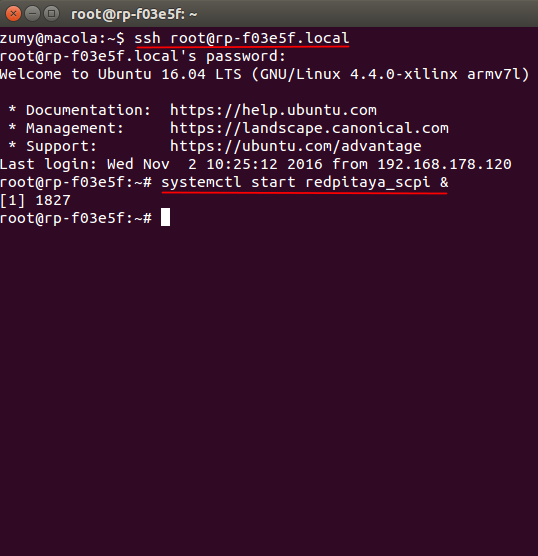

##############
Remote control
##############

.. https://owncloud.redpitaya.com/index.php/apps/files/?dir=%2FWEB%20page%2Fapps%2FSCPI

.. image:: SCPI_web_lr.png

STEMlab board can be controlled remotely over LAN or wireless interface
using Matlab, Labview, Scilab or Python via Red Pitaya
SCPI (Standard Commands for Programmable Instrumentation) list of commands.
SCPI interface/environment is commonly used to control T&M instruments
for development, research or test automation purposes.
SCPI uses a set of SCPI commands that are recognized by the instruments
to enable specific actions to be taken
(e.g.: acquiring data from fast analog inputs, generating signals and
controlling other periphery of the Red Pitaya STEMLab platform).
The SCPI commands are extremely useful when complex signal analysis
is required where SW environment such as MATLAB provides powerful data analysis tools
and SCPI commands simple access to raw data acquired on STEMLab board.

********
Features
********

- Quickly write control routines and programs using  Matlab, Labview, Scilab or Python
- Use powerful data analysis tools of Matlab, Labview, Scilab or Python to analyze raw signals
  acquired by STEMLab board
- Write testing scripts and routines
- Incorporate your STEMLab and Labview  into testing and production lines
- Take quick measurements directly with your PC 

********
Examples
********

In order to execute your Matlab, Labview, Scilab or Python
scripts on the STEMLab board first you need to start SCPI server.
This is done simply by selecting SCPI server icon and starting the SCPI server.
When SCPI server is started the IP of your board will be shown.
This IP you need to input in to your scripts. 
Starting SCPI server can be also done manually via Terminal(check bellow).

To run an examples follow instructions bellow:

#. Go to your STEMlab main page and Select SCPI server.

   .. image:: scpi-homepage.png

   .. image:: scpi-development.png

#. Start SCPI server by selecting RUN button.

   .. image:: scpi-app-run.png

   .. image:: scpi-app-stop.png

   Copy the code examples into your control environment, set STEMlab IP & run it.

   .. note::

      It is not possible to run SCPI commands/programs in parallel with web applications. 

   Once you have SCPI server running you can execute your SCPI programs.
   How to run your code in all environments is explained below:

======
MATLAB
======

#. Open MATLAB on your computer
#. Copy the Code from blink tutorial example to MATLAB workspace
#. Replace the IP in the example with the IP of your STEMlab board
#. Hit RUN or F5 on your keyboard to run the code

Check demo video here:  http://redpitaya.com/apps/scpi/

======
Python
======

#. Open the blink tutorial and copy the code to your favorite text editor
#. Save the file as ``blink.py`` to your working folder → for example ``examples_py``
#. Copy and save the ``redpitaya_scpi.py`` script in to the same folder
   where you have saved ``blink.py`` example (in our case it will be ``examples_py``).

   .. note::

      ``redpitaya_scpi.py`` script is a standard script needed to
      establish the connection between your PC and STEMlab board.
      Without having this script in the same folder as your python script
      the execution of your script will fail.   

   .. image:: scpi-examples.png

#. Open the Terminal and go to the folder containing your python script
   (``examples_py``) and run: ``python blink.py IP`` where you give an STEMlab IP
   as the argument when calling an execution of the ``blink.py`` example.
   Example is given bellow where ``192.168.178.108`` is the IP of the STEMlab board.

   .. code-block:: shell-session

      cd /home/zumy/Desktop/exmples_py 
      python blink.py 192.168.178.108

   .. image:: scpi-example-cli.png

=======
LabVIEW
=======

To set up the LabVIEW driver for Red Pitaya,
download the ``Red_Pitaya_LabVIEW_Driver&Examples.zip`` file.
Unpack it and copy the RedPitaya folder to your LabVIEW installations ``instr.lib`` folder
e.g. ``C:/Program Files/National Instruments/LabVIEW 2010/instr.lib``.
The RedPitaya driver should appear after restarting LabVIEW in
Block Diagram -> Instrument I/O -> Instr Drivers -> RedPitaya.
Depending on your settings Instrument I/O may be hidden.
Please consult LabVIEW Help on how to activate/deactivate those categories.
You can access example VIs by going to:

#. Help -> Find Examples...
#. click Search tab
#. Enter **RedPitaya** in Enter keyword(s) field

======
SCILAB
======

To use the SCPI commands you will need to set up Scilab sockets. The procedure is described below.

#. Go to Scilab download page and download and Install Scilab for your OS
#. Go to Scilab socket toolbox page and download the basic socket function for Scilab.
#. Go to the extracted Scilab folder then to folder named ``contrib``
#. Copy socket_toolbox zip file to contrib folder
#. Extract socket_toolbox zip file inside the contrib folder
#. Delete socket_toolbox zip file because we dont need it any more
#. Go to socket_toolbox folder
#. Open loader.sce with your Scilab and press RUN (grey run button on SCILAB editor gui)

These last two steps must be executed each time you start Scilab.
To install installing you must have an internet connection.
Running the examples is same as on MATALB

#. Copy the Code from blink tutorial example to MATLAB workspace
#. Replace the IP in the example with the IP of your STEMlab board
#. Press  RUN to run the code

------------------------------------------------------

Different code examples can be found on the Examples page.

.. note::

   Communicating with scpi server and working with web based instruments
   at the same time can diminish the performance of your Red Pitaya.
   This is because the same resource is used for both tasks.

******************************
Starting SCPI server  manually
******************************

Assuming you have successfully connected to your STEMlab board using these instructions.
Remotely connect using Putty on Windows machines or
with SSH using Terminal on UNIX (macOSX/Linux) machines.

TODO: link to SSH instructions

Connect to your STEMlab board via terminal on a Linux machine
and start SCPI server with the following command:

.. code-block:: shell-session

   systemctl start redpitaya_scpi &

.. include:: SCPI_commands.rst
