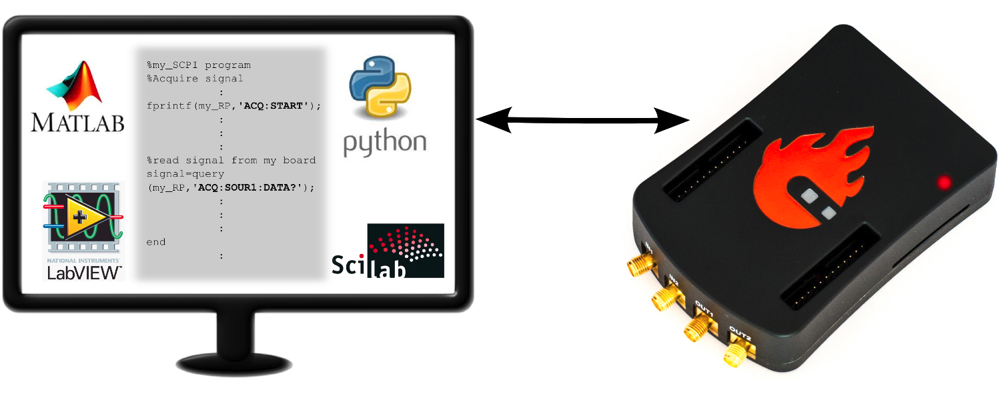

##############
Remote control
##############

.. https://owncloud.redpitaya.com/index.php/apps/files/?dir=%2FWEB%20page%2Fapps%2FSCPI

The STEMLab board can be controlled remotely over LAN or wireless interface
using Matlab, Labview, Scilab or Python via the Red Pitaya
SCPI (Standard Commands for Programmable Instrumentation) list of commands.
The SCPI interface/environment is commonly used to control T&M instruments
for development, research or test automation purposes.
SCPI uses a set of SCPI commands that are recognized by the instruments
to enable specific actions to be taken
(e.g.: acquiring data from fast analog inputs, generating signals and
controlling other periphery of the Red Pitaya STEMLab platform).
The SCPI commands are extremely useful when complex signal analysis
is required where SW environment such as MATLAB provides powerful data analysis tools
and SCPI commands simple access to raw data acquired on STEMLab board.

**Features**

- Quickly write control routines and programs using Matlab, Labview, Scilab or Python
- Use powerful data analysis tools of Matlab, Labview, Scilab or Python to analyze raw signals
  acquired by the STEMLab board
- Write testing scripts and routines
- Incorporate your STEMLab and Labview into testing and production lines
- Take quick measurements directly with your PC 

With SCPI commands you will be able to control all STEMlab features such us 
Digital Inputs/Outputs, 
Digital Communication interfaces (I2C, SPI, UART), 
Slow Analog Inputs/Outputs & 
Fast Analog Inputs/Outputs.
            
quick start
***********

.. TODO oblikuj

**Connect to your Red Pitaya remotely**

Assuming you have successfully connected to your Red Pitaya using :ref: these instructions.

Remotely connect using Putty on Windows machines or with SSH using Terminal on UNIX(OSX/Linux) machines.

In this example we have our Red Pitaya connected using a WIFI dongle directly to our computer (our Pitayas' IP is therefore 192.168.128.1).

By default the username is root and password is root.

.. TODO - page missing
                how to start server from WEB interface or manualy from shell
                    dodam notri v dokument (http://redpitaya.com/control/?with=matlab)
                    WEB (zumi)
                
                how to start controling Red Pitaya using
                    (http://redpitaya.com/control/?with=matlab spodaj)
                    MATLAB  ( zumi )
                    LABVIEW ( zumi )
                    Python  ( zumi )
                    SCILAB  ( zumi )
                exampli (link - http://redpitaya.com/examples-new/ )

.. include:: SCPI_commands.rst
