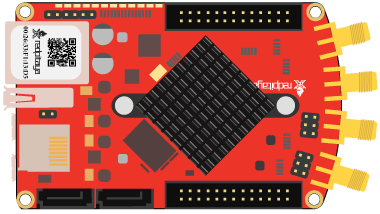

---------------------
Example 1 - LED blink
---------------------

Every developer facing a new toy (development board) starts with simple tasks, like lighting a LED.

~~~~~~
Wiring
~~~~~~

Components:
1. Red Pitaya

This example does not require the extension module yet,
there are 8 LEDs on the Red Pitaya board, which can be turn ``ON`` or ``OFF``.

~~~~~~~~~~~
Description
~~~~~~~~~~~

.. image:: blocks.png
   :alt: Program blocks for LED blink

To light an LED we need the *Red Pitaya* > **Set [] Led on pin []** block.
The first entry in the block is used to choose one of the eight yellow LEDs.
The second entry specifies if the LED should be turned ``ON`` or ``OFF``.
In the example the first *Set Led* block turns the led ``ON`` while the second turns it ``OFF``.

There are *Program* > *Timing* > **delay [] []** blocks after *Set Led*.
The *delay* block provides a time delay of the specified amount of seconds/milliseconds.
The first delay specifies for how long the LED will be shining,
while the second delay specifies for how long the LED will be dark.

*Set Led* an *delay* blocks are wrapped into a *Program* > *Loops* > **repeat while [] []** block,
this will repeat the LED ``ON``, delay, LED ``OFF``,
delay sequence indefinitely, this causing the LED to blink.

~~~~~~~~~~~~~~~
Experimentation
~~~~~~~~~~~~~~~

You can set another LED to blink instead of LED ``0``,
by changing the first entry in both *Set Led* blocks to a different number.
If the two blocks are set to control different LEDs,
then one LED will always shine, and the other will always be dark.

You can change the rhythm of blinking by changing the values in *delay* blocks.
Try it and see what happens.

You can also change everything else.
In most cases, the program will not work.
If this happens, just undo your changes, and try something else.
