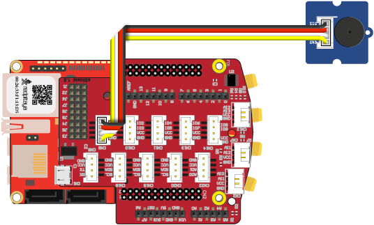

------------------
Example 2 - Buzzer
------------------

This example introduces the extension module, the Grove Buzzer, *Dashboard* block *Switch* and variables.
We will be able to use an on screen switch is used to turn a buzzer ``ON`` and ``OFF``.

~~~~~~
Wiring
~~~~~~

Components:

1. Red Pitaya
2. extension module
3. `Grove Buzzer <http://www.seeedstudio.com/wiki/Grove_-_Buzzer>`_

Connect the extension module to Red Pitaya.
Connect the Buzzer to the *CN12* connector on the extension module
which is part of a group of connectors providing digital input/output signals.

~~~~~~~~~~~
Description
~~~~~~~~~~~

.. image:: blocks.png
   :alt: Program blocks for Buzzer

.. image:: switch.png
   :alt: Dashboard block for Buzzer

To sound the buzzer we need *Indicators* > *Buzzer* > **Set buzzer [] on pin []** block.
We can set it to ``HIGH`` (buzzing) or ``LOW`` (silent).
We also have to specify to which data signal the buzzer is connected, in out example this is ``D0``,
the first of 16 digital IO (input/output) signals available on the *CN9* extension module connector.

The **Switch** block from the *Dashboard* generates a named signal each time it is toggled,
additionally is sends the ``ON`` and ``OFF`` status after the change.
To receive this signal the *Signal* > **On receive signal [] with signal value [] Do** block is used.
The switch and the receiver must use the same signal name.
When the switch is toggled the receiver will execute the code inside the block,
but first it will set the variable ``buzz_state`` to the state of the switch.
The *Program* > *Logic* > **if [] do [] else []** block is used to turn ``HIGH`` the buzzer only if the switch is set to ``ON``,
else the buzzer will be turned to ``LOW``. 

~~~~~~~~~~~~~~~
Experimentation
~~~~~~~~~~~~~~~

An important programming concept introduced in this example is a variable.
Variables are used by programs to memorize numbers, ON/OFF states, text and many other things.
When choosing a name for a variable, find something meaningful, so the name will remind you of the variables purpose.
The same program can be used to control a LED, try to add a *Set Led* block, so it will shine while the buzzer is silent.
