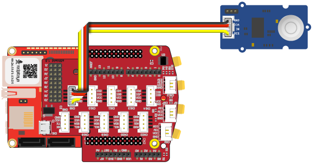
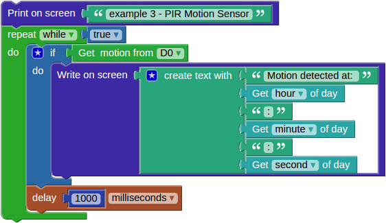

-----------------------------
Example 3 - PIR Motion Sensor
-----------------------------

The previous examples only used indicators, LED and buzzer.
This example is using an infra red sensor to detect motion,
so the program knows, if somebody is moving in the sensors vicinity.
The program will check for motion every second, and if the motion is detected,
it will report it by printing a line containing the current time on the screen.

~~~~~~
Wiring
~~~~~~

Components:

1. Red Pitaya
2. extension module
3. `Grove PIR Motion Sensor <http://www.seeedstudio.com/wiki/Grove_-_PIR_Motion_Sensor>`_

Connect the PIR Motion Sensor to the *CN12* connector on the extension module.

~~~~~~~~~~~
Description
~~~~~~~~~~~

An infinite loop with a 1 second delay at the end is used again.
Inside the loop there is a *Program* > *Logic* > **if [] do []** block,
which will execute its contents on the condition that the *Sensors* > *Motion sensor* > **get motion from []** will return true.
This will happen each time somebody is moving in the vicinity of the sensor.
The sensor can be attached to various connectors on the extension module,
here the ``D0`` option is used as specified in the sensor block.

If the condition is true the *Program* > *Screen and keyboard* > **Write on screen []** block will be executed.
A text block must be placed inside, here the *Program* > *Text* > **create text with [] [] ...**
is used to concatenate several short text strings into one longer.
The first string "Motion detected at: " is never changing so it is placed inside the *Program* > *Text* > **" "** block.
We also wish to print the actual time (hour:minute:second),
blocks for time strings can be found inside *Program* > *Date and Hour* > **get [] of day**.

~~~~~~~~~~~~~~~
Experimentation
~~~~~~~~~~~~~~~

Similar to indicators, sensors can also be attached to different extension module connectors,
here the ``D0`` connector (connector *CN12*) is used, you can try attaching to a different connector and changing the number.
This will become handy, when a combination of multiple sensors indicators will be used
and it will not be possible to attach them to the same connector.
You should also try changing the printed text, for example adding the date.
