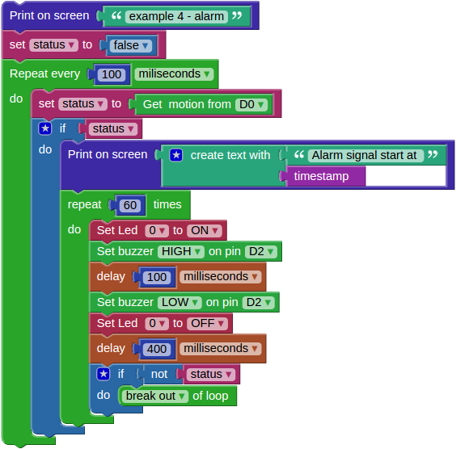
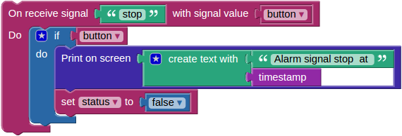
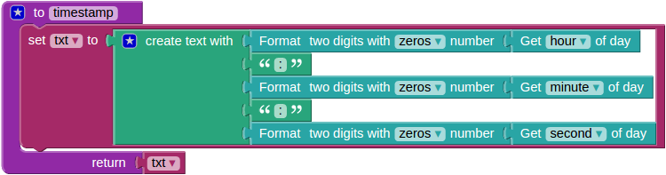

-----
Alarm
-----

This example is a combination of previous examples and is also introducing functions.
The PIR motion sensor will detect moving persons, while the LED and buzzer will be used to sound the alarm.
There is also an option to remotely disable the alarm by pressing an on-screen button.

~~~~~~
Wiring
~~~~~~

Components:

1. Red Pitaya
2. extension module
3. `Grove PIR Motion Sensor <http://www.seeedstudio.com/wiki/Grove_-_PIR_Motion_Sensor>`_
4. `Grove Buzzer <http://www.seeedstudio.com/wiki/Grove_-_Buzzer>`_

.. note:: 

    Extension module can be purchased from Red Pitaya `store <http://store.redpitaya.com/>`_. 
    
.. image:: wiring.png
   :alt: Wiring for Alarm

Connect the PIR Motion Sensor to the *CN12* connector and the buzzer to the *CN11* connector on the extension module.

~~~~~~~~~~~
Description
~~~~~~~~~~~

.. image:: pushbutton.png
   :alt: Dashboard blocks for Alarm

The main block contains a loop repeating 10 times each second.
Inside the loop the motion sensor is checked and its status is stored into the variable ``status``.
If motion is detected the program will start executing another loop,
which will sound the buzzer and blink a LED 60 times,
unless in the meantime the variable ``status`` changes to ``false``.

The second block is executed each time the *stop* button (*Switch* with the *push* option enabled under settings).
The purpose of this block is to stop the alarm, this is achieved by changing the value of the ``status`` variable to ``false``.

The third block is a function from *Program* > *Functions* > **to [] []**.
Functions are used to store code which is used in multiple places.
In this case the function is named ``timestamp``, since when executed,
it will return a string containing the current time.
If you look at the first two blocks, you will see one prints the alarm start time,
the other the alarm stop time, both use the same ``timestamp`` function to provide the time string.

The first two blocks are running at the same time,
the first one is checking for motion, the second is checking for button presses.
The variable ``status`` is used to share/pass information between them.

TODO: there seems to be some issues with concurrent execution and signals, therefore do expect problems.

~~~~~~~~~~~~~~~
Experimentation
~~~~~~~~~~~~~~~

By using a different loop type, you could change the alarm to sound until a button on screen is pressed,
without the 30 second timeout (60 repetitions each taking o.5 seconds).
