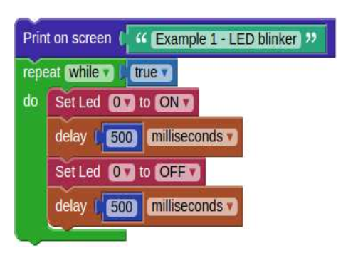

Visual Programing
#################

.. <https://owncloud.redpitaya.com/index.php/apps/files/?dir=%2FWEB%20page%2Fapps%2FVisual%20Programming

If you too are struggling to get your head around the complexity of programming languages – or indeed if you want to 
introduce children to electrical engineering – then Red Pitaya’s Visual Programming is definitely the answer. 
Obviously children don’t just become architects straight away; they play with building blocks, they mess around and 
have fun. The same is true of engineering, and if you will, Red Pitaya’s Visual Programming is the programming 
equivalent of Lego. Each block performs a basic function, you insert the block in the right place on the screen and 
your project performs the selected function. Simple as that. Not only does Visual Programming provide a hugely 
simplified process, but it also acts as a code translator. So that once you have inserted your block, you are able to 
see how that function would appear in six different programming languages. This feature really goes a long way 
towards demystifying the complex world of code languages and will undoubtedly help you, or your child, become a 
competent engineer. Here is a simple example on how to make a Blinking LED on your Red Pitaya. As you can see the 
Visual code is built from a few basic blocks:

 #. Repeat block – Will cause continuous executions of everything which is inside the block, i.e. while loop.
 #. Inside the Repeat block we have put two Set Led blocks for switching ON and OFF the LED.
 #. Between the ON and OFF states we have added some time delay so we can follow LEDs blinking.

.. image:: VP_Slika_01.png

Features
********

    - Remote programming of Red Pitaya via an intuitive WEB-based interface using blocks or other programming language
      (Python, C/C++, Java Script...)
    - Ability to create own dashboards with real time graphs, dials, meters, sliders, and buttons
    - Ability to control the program flow from a PC, smartphone or tablet
    - Ability to share measurements or send notifications to email or even social networks like Facebook and Twitter
    - Measures temperature, moisture, alcohol, water level, vibrations, UV light, sound, pressure, air quality detect 
      motion, and other
    - Controls actuators and indicators like LEDs, displays, motors or relays in order to control high load 
      devices*The last two features require the use of the Red Pitaya Sensor extension module & sensors
    - Programming with blocks is a very fun experience, but is also highly instructive and encourages 
      the user to begin thinking subconsciously like a real programmer. All of this is just the beginning of 
      the learning process. This format also enables users to watch and learn what the real programming 
      language code behind the graphical blocks looks like – and how to program using it.
 

Hardware – Extension module
***************************

Although the usage of the Visual Programming interface does not require any additional hardware except the STEMLab
board, getting started with electronics is way more fun and interesting when you have loads of sensors that you can
put to good use straight away. Whether you want to measure temperature, vibration, movement – or more – we have 
developed a new extension module compatible with Grove modules from Seeed®. The module facilitates a quick connection
of different sensors and actuators to the Red Pitaya. All you need is to select the desired module, find the correct 
connector and get going with your project. The Extension module, together with the Grove modules, is compatible with 
the new Visual Programing Interface. Using the interface, all of the digital and analog data (values) from the Grove 
sensors are directly translated into measurements of temperature, humidity and so on. Also the pin markings on the 
Extension module are correlated with the pin naming in Visual Programing. We have also placed Arduino shields headers 
on the Extension module.

.. image:: VP_Slika_02.png

The headers enable you to directly connect a variety of different Arduino Uno shields. You can find a wide range of 
Arduino Uno shields for all sorts of projects, so just find your desired shield and plug it into the extension module.
For this, unlike using Grove modules, you will need to read raw data from the analog or digital pins using the “Red 
Pitaya” section in the Visual Programing Interface. The Extension module can be powered from the external power supply
via a micro USB connector. A set of nine JUMPERS is used for reconnecting certain extension module connectors to 
different E1* or E2* pins or changing power supply settings. For example: With J1 and J3 you can set the source of
VCC- external or from Red Pitaya. A full schematic of the Extension module is available on our web page. Don’t forget
to check our videos with examples.

.. image:: VP_Slika_03.png

Sensors
*******

=========== ==============  =======================
Connectors                  Voltage levels
=========== ==============  =======================
Digital     D0,D2,D4,D6,D8  3.3V (not 5V tolerant) 
Analog      A0,A1,A2        0-3.3V 
I2C         I2C             3.3V
=========== ==============  =======================

.. image:: ext_module.png

========================================================================================    ==================
Sensor information                                                                          Where to connect?
========================================================================================    ==================
`Temperature sensor <http://wiki.seeedstudio.com/wiki/Grove_-_Temperature_Sensor>`_         Analog
`Motion sensor <http://wiki.seeedstudio.com/wiki/Grove_-_PIR_Motion_Sensor>`_               Digital
`Touch sensor <http://wiki.seeedstudio.com/wiki/Grove_-_Touch_Sensor>`_                     Digital
`Button <http://wiki.seeedstudio.com/wiki/Grove_-_Button>`_                                 Digital
Switch
Digital
`Tilt <http://wiki.seeedstudio.com/wiki/Grove_-_Tilt_Switch>`_                              Digital
`Potentiometer <http://wiki.seeedstudio.com/wiki/Grove_-_Rotary_Angle_Sensor>`_             Analog
`Light sensor <http://wiki.seeed.cc/Grove-Light_Sensor/>`_                                  Analog
`Air quality sensor <http://wiki.seeedstudio.com/wiki/Grove_-_Air_Quality_Sensor_v1.>`_     Analog
`Vibration sensor <http://wiki.seeedstudio.com/wiki/Grove_-_Piezo_Vibration_Sensor>`_       Analog
`Moisture sensor <http://wiki.seeedstudio.com/wiki/Grove_-_Moisture_Sensor>`_               Analog
`Water sensor <http://wiki.seeedstudio.com/wiki/Grove_-_Water_Sensor>`_                     Analog
`Alcohol sensor <http://wiki.seeedstudio.com/wiki/Grove_-_Alcohol_Sensor>`_                 Analog
Barometer ``not supported at the moment``                                                   i2c
`Sound sensor <http://wiki.seeed.cc/Grove-Sound_Sensor/>`_                                  Analog
`UV sensor <http://wiki.seeedstudio.com/wiki/Grove_-_UV_Sensor>`_                           Analog
Accelerometer ``not supported at the moment``                                               i2c
========================================================================================    ==================

========================================================================================    ==================
Actuators                                                                                   Where to connect?
========================================================================================    ==================
`Relay <http://wiki.seeedstudio.com/wiki/Grove_-_Relay>`_                                   Digital
========================================================================================    ==================

========================================================================================    ==================
Indicators                                                                                  Where to connect?
========================================================================================    ==================
`Buzzer <http://wiki.seeedstudio.com/wiki/Grove_-_Buzzer>`_                                 Digital
`LED <https://www.seeedstudio.com/grove-led-p-767.html?cPath=156_157>`_                     Digital
7 segment display                                                                           Digital pins
LED bar                                                                                     Digital pins
Groove LCD                                                                                  Digital pins
LCD                                                                                         Digital pins
========================================================================================    ==================

Examples
********

Blink LED  
---------

To light an LED, you click the Red Pitaya > Set LED block. The first entry in the block is used to choose one of the
eight yellow LEDs. The second entry specifies if the LED should be turned ‘ON’ or ‘OFF’. In our example the first Set 
LED block turns the LED ‘ON’, while the second turns it ‘OFF’.
There are Program > Timing > delay blocks after Set LED. The first delay specifies how long the LED will be shining, 
while the second delay specifies how long the LED will be dark. The Set LED and delay blocks are wrapped into a 
Program > Loops > ‘repeat while’ block. This will repeat the LED ‘ON’, delay, LED ‘OFF’, delay sequence indefinitely, 
thus causing the LED to blink.
You can set another LED to blink instead of LED ‘0’, by changing the first entry in both Set LED blocks to a different 
number. If the two blocks are set to control different LEDs, then one LED will always shine, and the other will always 
be dark. You can change the rhythm of the blinking by changing the values in the delay blocks. Try it and see what 
happens. You can also change everything else. In most cases, the program will not work. If this happens, just undo 
your changes, and try something else.

Let have a look how everything works:

.. TODO Embedded video (dodaj url do videa)

Alarm
-----

What you need:
   - STEMlab 125-14/10
   - PIR Motion Sensor
   - Buzzer Sensor

| **STEP 1**
| Connect the PIR Motion Sensor to the CN12 connector and the buzzer to the CN11 connector on the extension module.

.. image:: VP_Slika_05.png

| **STEP 2**
| The main block contains a loop repeating 10 times each second. Inside, the loop the motion sensor is checked and its 
  status is stored into the variable status. If motion is detected the program will start executing another loop, 
  which will sound the buzzer and blink an LED 60 times, unless in the meantime the variable status changes to false.
  
.. image:: VP_Slika_06.png  

| **STEP 3:**
| The third block is a function from Program > Functions > to [] []. Functions are used to store code which is used in
  multiple places. In this case the function is named timestamp, since when executed, it will return a string 
  containing the current time. If you look at the first two blocks, you will see that one prints the alarm start time,
  the other the alarm stop time, both use the same timestamp function to provide the time string.
  
.. image:: VP_Slika_07.png

The first two blocks are running at the same time, the first one is checking for motion, the second is checking for 
button presses. The variable status is used to share/pass information between them.

| **STEP 4:**
| Experimentation:
| By using a different loop type, you could change the alarm to sound until a button on screen is pressed, without the
  30 second timeout (60 repetitions each taking 0.5 seconds)

Let have a look how everything works:

.. TODO Embedded video (dodaj url)

.. TODO ali dodam poglavje "What do I need to run this application?" - manjkajo mi slike
