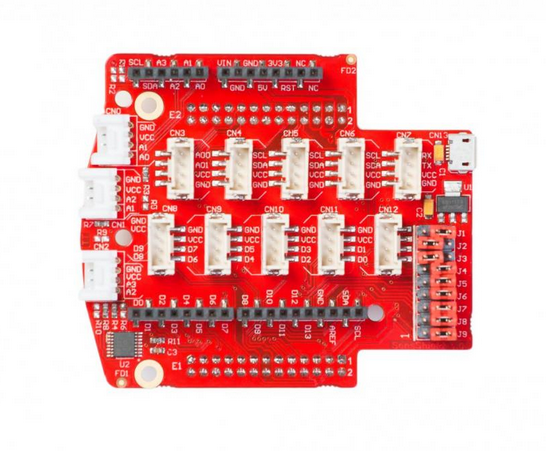

#################
Visual Programing
#################

.. <https://owncloud.redpitaya.com/index.php/apps/files/?dir=%2FWEB%20page%2Fapps%2FVisual%20Programming

If you too are struggling to get your head around the complexity of programming languages – or indeed if you want to 
introduce children to electrical engineering – then Red Pitaya’s Visual Programming is definitely the answer. 
Obviously children don’t just become architects straight away; they play with building blocks, they mess around and 
have fun. The same is true of engineering, and if you will, Red Pitaya’s Visual Programming is the programming 
equivalent of Lego. Each block performs a basic function, you insert the block in the right place on the screen and 
your project performs the selected function. Simple as that. Not only does Visual Programming provide a hugely 
simplified process, but it also acts as a code translator. So that once you have inserted your block, you are able to 
see how that function would appear in six different programming languages. This feature really goes a long way 
towards demystifying the complex world of code languages and will undoubtedly help you, or your child, become a 
competent engineer. Here is a simple example on how to make a Blinking LED on your Red Pitaya. As you can see the 
Visual code is built from a few basic blocks:

#. Repeat block – Will cause continuous executions of everything which is inside the block, i.e. while loop.
#. Inside the Repeat block we have put two Set Led blocks for switching ON and OFF the LED.
#. Between the ON and OFF states we have added some time delay so we can follow LEDs blinking.

.. image:: VP_webpage.png

********
Features
********

- Remote programming of Red Pitaya via an intuitive WEB-based interface using blocks or other programming language
  (Python, C/C++, Java Script...)
- Ability to create own dashboards with real time graphs, dials, meters, sliders, and buttons
- Ability to control the program flow from a PC, smartphone or tablet
- Ability to share measurements or send notifications to email or even social networks like Facebook and Twitter
- Measures temperature, moisture, alcohol, water level, vibrations, UV light, sound, pressure, air quality detect 
  motion, and other
- Controls actuators and indicators like LEDs, displays, motors or relays in order to control high load 
  devices*The last two features require the use of the Red Pitaya Sensor extension module & sensors
- Programming with blocks is a very fun experience, but is also highly instructive and encourages 
  the user to begin thinking subconsciously like a real programmer. All of this is just the beginning of 
  the learning process. This format also enables users to watch and learn what the real programming 
  language code behind the graphical blocks looks like – and how to program using it.
 
***************************
Hardware – Extension module
***************************

Although the usage of the Visual Programming interface does not require any additional hardware except the STEMLab
board, getting started with electronics is way more fun and interesting when you have loads of sensors that you can
put to good use straight away. Whether you want to measure temperature, vibration, movement – or more – we have 
developed a new extension module compatible with Grove modules from Seeed®. The module facilitates a quick connection
of different sensors and actuators to the Red Pitaya. All you need is to select the desired module, find the correct 
connector and get going with your project. The Extension module, together with the Grove modules, is compatible with 
the new Visual Programing Interface. Using the interface, all of the digital and analog data (values) from the Grove 
sensors are directly translated into measurements of temperature, humidity and so on. Also the pin markings on the 
Extension module are correlated with the pin naming in Visual Programing. We have also placed Arduino shields headers 
on the Extension module.

.. image:: VP_extension_module_and_sensors.png

The headers enable you to directly connect a variety of different Arduino Uno shields. You can find a wide range of 
Arduino Uno shields for all sorts of projects, so just find your desired shield and plug it into the extension module.
For this, unlike using Grove modules, you will need to read raw data from the analog or digital pins using the “Red 
Pitaya” section in the Visual Programing Interface. The Extension module can be powered from the external power supply
via a micro USB connector. A set of nine JUMPERS is used for reconnecting certain extension module connectors to 
different :ref:`E1 <E1>` or :ref:`E2 <E2>` pins or changing power supply settings. For example: With J1 and J3 you
can set the source of VCC- external or from Red Pitaya. A full schematic of the Extension module is available on our 
web page. Don’t forget to check our videos with examples.

.. image:: VP_sensors.png

==========
Connectors
==========

The black connectors on the sides are compatible with Arduino,
white connectors on the front provide analog inputs,
and there are two rows of gray connectors at the center
which provide digital I/O, UART, I2C or analog outputs.
On the bottom there are connectors to the Red Pitaya board.

~~~~~~~~~~~~~~~~~~~~~~~
Grove module connectors
~~~~~~~~~~~~~~~~~~~~~~~

This are dedicated connectors compatible with `Grove modules <http://www.seeedstudio.com/depot/category_products?themes_id=1417 "seeed Grove modules">`_.

There are six connector types available:

* **AI** Analog input (0-3.3V)
* **AO** Analog output
* **I2C** (3.3V)
* **UART** (3.3V)
* **DIO** Digital input/output (3.3V, not 5V tolerant)

+-------+------+------+------+------+------+------+------+------+------+------+------+------+------+
| conn. | CN0  | CN1  | CN2  | CN3  | CN4  | CN5  | CN6  | CN7  | CN8  | CN9  | CN10 | CN11 | CN12 |
+-------+------+------+------+------+------+------+------+------+------+------+------+------+------+
| type  | AI   | AI   | AI   | AO   | I2C  | I2C  | I2C  | UART | DIO  | DIO  | DIO  | DIO  | DIO  |
+=======+======+======+======+======+======+======+======+======+======+======+======+======+======+
| ``1`` | AI0  | AI1  | AI2  | AO0  | SCL  | SCL  | SCL  | RX   | IO8  | IO6  | IO4  | IO2  | IO0  |
+-------+------+------+------+------+------+------+------+------+------+------+------+------+------+
| ``2`` | AI1  | AI2  | AI3  | AO1  | SDA  | SDA  | SDA  | TX   | IO9  | IO7  | IO5  | IO3  | IO1  |
+-------+------+------+------+------+------+------+------+------+------+------+------+------+------+
| ``3`` | VCC  | VCC  | VCC  | VCC  | VCC  | VCC  | VCC  | VCC  | VCC  | VCC  | VCC  | VCC  | VCC  |
+-------+------+------+------+------+------+------+------+------+------+------+------+------+------+
| ``4`` | GND  | GND  | GND  | GND  | GND  | GND  | GND  | GND  | GND  | GND  | GND  | GND  | GND  |
+-------+------+------+------+------+------+------+------+------+------+------+------+------+------+

~~~~~~~~~~~~~~~~~~~~~~~~~~~~~~~~~~~~
Arduino shield compatible connectors
~~~~~~~~~~~~~~~~~~~~~~~~~~~~~~~~~~~~

This set of connectors is partially compatible with the Arduino shield connector.

+----------+-------+---------------+
| function |  pin  | comment       |
+==========+=======+===============+
| IO0      | ``1`` | D[0]          |
+----------+-------+---------------+
| IO1      | ``2`` | D[1]          |
+----------+-------+---------------+
| IO2      | ``3`` | D[2]          |
+----------+-------+---------------+
| IO3      | ``4`` | D[3]          |
+----------+-------+---------------+
| IO4      | ``5`` | D[4]          |
+----------+-------+---------------+
| IO5      | ``6`` | D[5]          |
+----------+-------+---------------+
| IO6      | ``7`` | D[6]          |
+----------+-------+---------------+
| IO7      | ``8`` | D[7]          |
+----------+-------+---------------+

+----------+--------+---------------+
| function |   pin  | comment       |
+==========+========+===============+
| IO8      |  ``1`` | D[8]          |
+----------+--------+---------------+
| IO9      |  ``2`` | D[9]          |
+----------+--------+---------------+
| IO10     |  ``3`` | D[10]         |
+----------+--------+---------------+
| IO11     |  ``4`` | D[11]         |
+----------+--------+---------------+
| IO12     |  ``5`` | D[12]         |
+----------+--------+---------------+
| IO13     |  ``6`` | D[13]         |
+----------+--------+---------------+
| GND      |  ``7`` |               |
+----------+--------+---------------+
| AREF     |  ``8`` | not connected |
+----------+--------+---------------+
| SDA      |  ``9`` | I2C_SDA       |
+----------+--------+---------------+
| SCL      | ``10`` | I2C_SCL       |
+----------+--------+---------------+

+----------+-------+---------------+
| function |  pin  | comment       |
+==========+=======+===============+
| A6       | ``1`` | not connected |
+----------+-------+---------------+
| A7       | ``2`` | not connected |
+----------+-------+---------------+
| Reset    | ``3`` | not connected |
+----------+-------+---------------+
| +3.3V    | ``4`` |               |
+----------+-------+---------------+
| +5.0V    | ``5`` |               |
+----------+-------+---------------+
| GND      | ``6`` |               |
+----------+-------+---------------+
| GND      | ``7`` |               |
+----------+-------+---------------+
| +VIN     | ``8`` | not connected |
+----------+-------+---------------+

*******
Sensors
*******

========================================================================================    ============
Sensor information                                                                          Connector
========================================================================================    ============
`Temperature sensor <http://wiki.seeedstudio.com/wiki/Grove_-_Temperature_Sensor>`_         AI
`Motion sensor <http://wiki.seeedstudio.com/wiki/Grove_-_PIR_Motion_Sensor>`_               DIO
`Touch sensor <http://wiki.seeedstudio.com/wiki/Grove_-_Touch_Sensor>`_                     DIO
`Button <http://wiki.seeedstudio.com/wiki/Grove_-_Button>`_                                 DIO
Switch
Digital
`Tilt <http://wiki.seeedstudio.com/wiki/Grove_-_Tilt_Switch>`_                              DIO
`Potentiometer <http://wiki.seeedstudio.com/wiki/Grove_-_Rotary_Angle_Sensor>`_             AI
`Light sensor <http://wiki.seeed.cc/Grove-Light_Sensor/>`_                                  AI
`Air quality sensor <http://wiki.seeedstudio.com/wiki/Grove_-_Air_Quality_Sensor_v1.>`_     AI
`Vibration sensor <http://wiki.seeedstudio.com/wiki/Grove_-_Piezo_Vibration_Sensor>`_       AI
`Moisture sensor <http://wiki.seeedstudio.com/wiki/Grove_-_Moisture_Sensor>`_               AI
`Water sensor <http://wiki.seeedstudio.com/wiki/Grove_-_Water_Sensor>`_                     AI
`Alcohol sensor <http://wiki.seeedstudio.com/wiki/Grove_-_Alcohol_Sensor>`_                 AI
Barometer ``not supported at the moment``                                                   I2C
`Sound sensor <http://wiki.seeed.cc/Grove-Sound_Sensor/>`_                                  AI
`UV sensor <http://wiki.seeedstudio.com/wiki/Grove_-_UV_Sensor>`_                           AI
Accelerometer ``not supported at the moment``                                               I2C
========================================================================================    ============

========================================================================================    ============
Actuators                                                                                   Connector
========================================================================================    ============
`Relay <http://wiki.seeedstudio.com/wiki/Grove_-_Relay>`_                                   DIO
========================================================================================    ============

========================================================================================    ============
Indicators                                                                                  Connector
========================================================================================    ============
`Buzzer <http://wiki.seeedstudio.com/wiki/Grove_-_Buzzer>`_                                 DIO
`LED <https://www.seeedstudio.com/grove-led-p-767.html?cPath=156_157>`_                     DIO
7 segment display                                                                           Digital pins
LED bar                                                                                     Digital pins
Groove LCD                                                                                  Digital pins
LCD                                                                                         Digital pins
========================================================================================    ============

********
Examples
********

.. toctree::
   :maxdepth: 6
   :numbered:
   
   visualExamples/example_1/example
   visualExamples/example_2/example
   visualExamples/example_3/example
   visualExamples/example_4/example
   visualExamples/example_5/example
