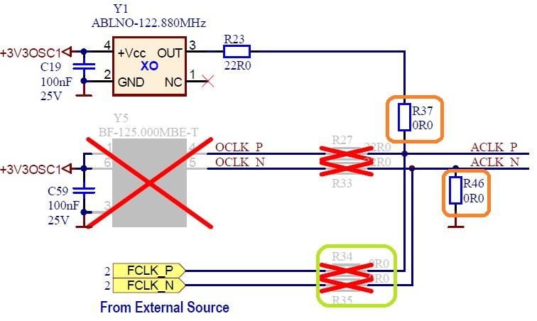
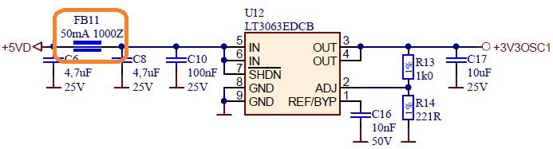
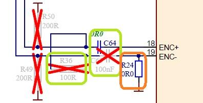
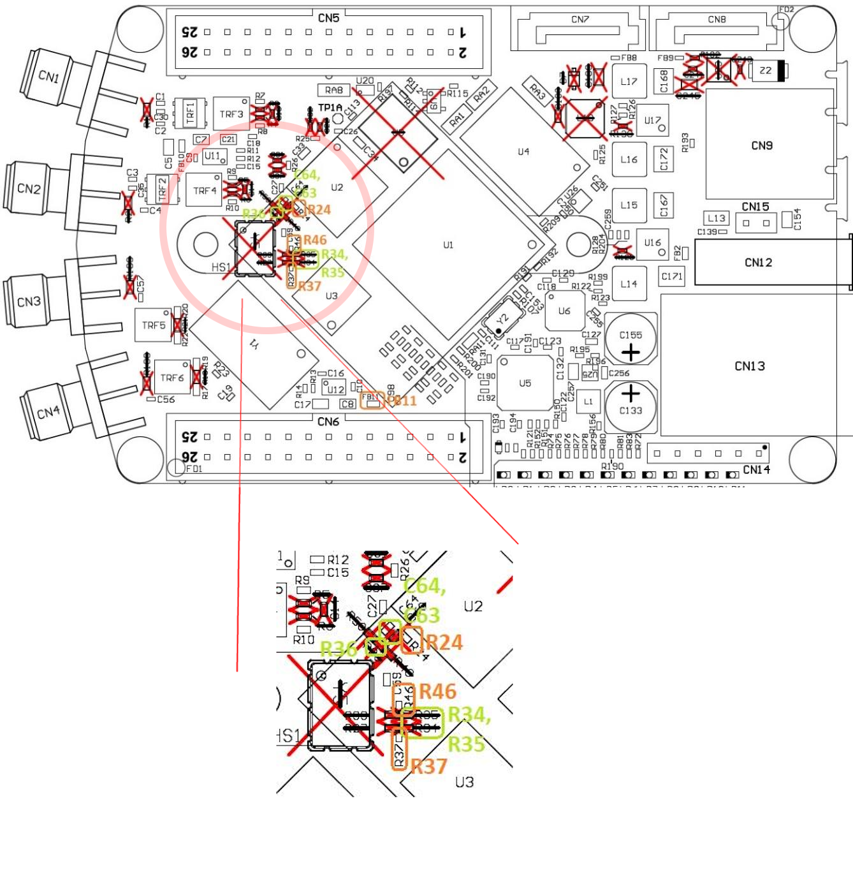

External ADC clock
##################

ADC clock can be provided by:
    * On board 125MHz XO (default)
    * From external source / through extension connector (instructions provided bellow)

Schematic:

Remove:
- R37, R46
Add:
- R34 = 0R, R35 = 0R

Remove:
- FB11

Remove:
- 0R on C64, R24
Add:
- C64 = 100nF, C63 = 100nF,
- R36 = 100R

