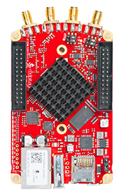
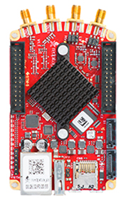
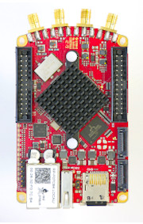
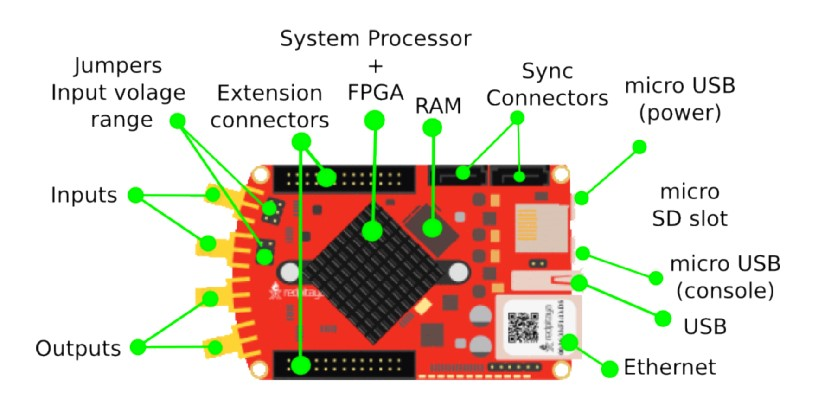

Red Pitaya boards comparison 
##############################################################

   

   

Red Pitaya is available in three versions, all offer the same functions and features with the difference in technical specification
of high-frequency inputs and outputs, RAM capacity some other differences (find more info in the comparison table bellow).
They are addressed to target different groups and / or needs. Where STEMlab 14 has 14bit input / output channels for
highly accurate measurement results in professional environment, STEMlab 10 has 10bit input / output channels and is perfect
for universities,students and makers, SDRlab 122-16 is tailored for SDR applications.

.. -> http://redpitaya.com/boards/stemlab-boards/

.. tabularcolumns:: |p{30mm}|p{40mm}|p{40mm}|p{40mm}|p{40mm}|

+--------------------+------------------------------------+------------------------------------+------------------------------------+------------------------------------+
| Basic                                                                                                                                                                  |
+====================+====================================+====================================+====================================+====================================+
|                    | STEMlab 125-10                     | STEMlab 125-14                     | SDRlab 122-16                      | SIGNALlab 250-12                   |
+--------------------+------------------------------------+------------------------------------+------------------------------------+------------------------------------+
| Processor          | Processor DUAL CORE ARM CORTEX A9  | Processor DUAL CORE ARM CORTEX A9  | Processor DUAL CORE ARM CORTEX A9  | Processor DUAL CORE ARM CORTEX A9  |
+--------------------+------------------------------------+------------------------------------+------------------------------------+------------------------------------+
| FPGA               | FPGA Xilinx Zynq 7010 SOC          | FPGA Xilinx Zynq 7010 SOC          | FPGA Xilinx Zynq 7020 SOC          | FPGA Xilinx Zynq 7020 SOC          |
+--------------------+------------------------------------+------------------------------------+------------------------------------+------------------------------------+
| RAM                | 256MB (2Gb)                        | 512MB (4Gb)                        | 512MB (4Gb)                        | 1Gb (8Gb)                          |
+--------------------+------------------------------------+------------------------------------+------------------------------------+------------------------------------+
| System memory      | Micro SD up to 32GB                | Micro SD up to 32GB                | Micro SD up to 32GB                | Micro SD up to 32GB                |
+--------------------+------------------------------------+------------------------------------+------------------------------------+------------------------------------+
| Console connection | USB to serial converter required   | micro USB                          | micro USB                          | USB-C                              |
+--------------------+------------------------------------+------------------------------------+------------------------------------+------------------------------------+
| Power connector    | Micro USB                          | Micro USB                          | Micro USB                          | Power Jack                         |
+--------------------+------------------------------------+------------------------------------+------------------------------------+------------------------------------+
| Power consumption  | 5V, 1,5A max                       | 5V, 2A max                         | 5V, 2A max                         | 24V, 0.5A max                      |
+--------------------+------------------------------------+------------------------------------+------------------------------------+------------------------------------+

.. tabularcolumns:: |p{30mm}|p{40mm}|p{40mm}|p{40mm}|p{40mm}|

+-----------------+----------------------+---------------------------------------+---------------------------------------+---------------------------------------+
| Connectivity                                                                                                                                                   |
+=================+======================+=======================================+=======================================+=======================================+
|                 | STEMlab 125-10       | STEMlab 125-14                        | SDRlab 122-16                         | SIGNALlab 250-12                      |
+-----------------+----------------------+---------------------------------------+---------------------------------------+---------------------------------------+
| Ethernet        | 1Gbit                | 1Gbit                                 | 1Gbit                                 | 1Gbit                                 |
+-----------------+----------------------+---------------------------------------+---------------------------------------+---------------------------------------+
| USB             | USB 2.0              | USB 2.0                               | USB 2.0                               | 2 x USB 2.0                           |
+-----------------+----------------------+---------------------------------------+---------------------------------------+---------------------------------------+
| WIFI            | requires WIFI dongle | requires WIFI dongle                  | requires WIFI dongle                  | requires WIFI dongle                  |
+-----------------+----------------------+---------------------------------------+---------------------------------------+---------------------------------------+
| Synchronisation | /                    | Daisy chain connector (up to 500 Mbps)| Daisy chain connector (up to 500 Mbps)| Daisy chain connector (up to 500 Mbps)|
+-----------------+----------------------+---------------------------------------+---------------------------------------+---------------------------------------+

.. tabularcolumns:: |p{30mm}|p{40mm}|p{40mm}|p{40mm}|p{40mm}|

+-----------------------------------+------------------------+------------------------+------------------------+------------------------------------+
| RF inputs                                                                                                                                         |
+===================================+========================+========================+========================+====================================+
|                                   | STEMlab 125-10         | STEMlab 125-14         | SDRlab 122-16          | SIGNALlab 250-12                   |
+-----------------------------------+------------------------+------------------------+------------------------+------------------------------------+
| RF input channels                 | 2                      | 2                      | 2                      | 2                                  |
+-----------------------------------+------------------------+------------------------+------------------------+------------------------------------+
| Sample rate                       | 125 MS/s               | 125 MS/s               | 122.88 MS/s            | 250 MS/s                           |
+-----------------------------------+------------------------+------------------------+------------------------+------------------------------------+
| ADC resolution                    | 10 bit                 | 14 bit                 | 16 bit                 | 12 bit                             |
+-----------------------------------+------------------------+------------------------+------------------------+------------------------------------+
| Input impedance                   | 1MOhm/10pF             | 1MOhm/10pF             | 50 Ohm                 | 1MOhm                              |
+-----------------------------------+------------------------+------------------------+------------------------+------------------------------------+
| Full scale voltage range          | ±1V (LV) and ±20V (HV) | ±1V (LV) and ±20V (HV) | 0.5Vpp/-2dBm           | +-1V / +-20V (software selectable) |
+-----------------------------------+------------------------+------------------------+------------------------+------------------------------------+
| Input coupling                    | DC                     | DC                     | AC                     | AC / DC (software selectable)      |
+-----------------------------------+------------------------+------------------------+------------------------+------------------------------------+
| Absolute max. Input voltage range | 30V                    | 30V                    | DC max 50V (AC-coupled)|                                    |
|                                   |                        |                        | 1 Vpp for RF           |                                    |
+-----------------------------------+------------------------+------------------------+------------------------+------------------------------------+
| Input ESD protection              | Yes                    | Yes                    | Yes                    |                                    |
+-----------------------------------+------------------------+------------------------+------------------------+------------------------------------+
| Overload protection               | Protection diodes      | Protection diodes      | DC voltage protection  |                                    |
+-----------------------------------+------------------------+------------------------+------------------------+------------------------------------+
| Bandwidth                         | DC-50MHz               | DC-60MHz               | 300 kHz - 550 MHz      | DC - 60MHz                         |
+-----------------------------------+------------------------+------------------------+------------------------+------------------------------------+

.. tabularcolumns:: |p{30mm}|p{40mm}|p{40mm}|p{40mm}|p{40mm}|

+-------------------------------+----------------+----------------+----------------------+------------------------------+
| RF outputs                                                                                                            |
+===============================+================+================+======================+==============================+
|                               | STEMlab 125-10 | STEMlab 125-14 | SDRlab 122-16        | SIGNALlab 250-12             |
+-------------------------------+----------------+----------------+----------------------+------------------------------+
| RF output channels            | 2              | 2              | 2                    | 2                            |
+-------------------------------+----------------+----------------+----------------------+------------------------------+
| Sample rate                   | 125 MS/s       | 125 MS/s       | 122.88 MS/s          | 250 MS/s                     |
+-------------------------------+----------------+----------------+----------------------+------------------------------+
| DAC resolution                | 10 bit         | 14 bit         | 14 bit               | 12 bit                       |
+-------------------------------+----------------+----------------+----------------------+------------------------------+
| Load impedance                | 50 Ohm         | 50 Ohm         | 50 Ohm               | 50 Ohm                       |
+-------------------------------+----------------+----------------+----------------------+------------------------------+
| Voltage range                 | ±1V            | ±1V            | 1Vpp/ +4 dBm         | +-2V / +-10V (Hi-Z load)     |
|                               |                |                |                      | (software selectable)        |
+-------------------------------+----------------+----------------+----------------------+------------------------------+
| Short circut protection       | Yes            | Yes            | N/A, RF transformer  |                              |
|                               |                |                | & AC-coupled         | Yes                          |
+-------------------------------+----------------+----------------+----------------------+------------------------------+
| Connector type                | SMA            | SMA            | SMA                  | BNC                          |
+-------------------------------+----------------+----------------+----------------------+------------------------------+
| Output slew rate              | 2V / 10ns      | 2V / 10ns      | N/A                  | 10V / 17ns                   |
+-------------------------------+----------------+----------------+----------------------+------------------------------+
| Bandwidth                     | DC-50MHz       | DC-60MHz       | 300 kHz - 60 MHz     | DC - 60MHz                   |
+-------------------------------+----------------+----------------+----------------------+------------------------------+
 
.. tabularcolumns:: |p{30mm}|p{40mm}|p{40mm}|p{40mm}|p{40mm}|

+------------------------------+-------------------+----------------+----------------+---------------------+
| Extension connector                                                                                      |
+==============================+===================+================+================+=====================+
|                              | STEMlab 125-10    | STEMlab 125-14 | SDRlab 122-16  | SIGNALlab 250-12    |
+------------------------------+-------------------+----------------+----------------+---------------------+
| Digital IOs                  | 16                | 16             | 16             | 16                  |
+------------------------------+-------------------+----------------+----------------+---------------------+
| Analog inputs                | 4                 | 4              | 4              | 4                   |
+------------------------------+-------------------+----------------+----------------+---------------------+
| Analog inputs voltage range  | 0-3,5V            | 0-3,5V         | 0-3,5V         | 0-3,5V              |
+------------------------------+-------------------+----------------+----------------+---------------------+
| Sample rate                  | 100kS/s           | 100kS/s        | 100kS/s        | 100kS/s             |
+------------------------------+-------------------+----------------+----------------+---------------------+
| Resolution                   | 12bit             | 12bit          | 12bit          | 12bit               |
+------------------------------+-------------------+----------------+----------------+---------------------+
| Analog outputs               | 4                 | 4              | 4              | 4                   |
+------------------------------+-------------------+----------------+----------------+---------------------+
| Analog outputs voltage range | 0-1,8V            | 0-1,8V         | 0-1,8V         | 0-1,8V              |
+------------------------------+-------------------+----------------+----------------+---------------------+
| Communication interfaces     | I2C, SPI, UART    | I2C, SPI, UART | I2C, SPI, UART | I2C, SPI, UART, USB |
+------------------------------+-------------------+----------------+----------------+---------------------+
| Available voltages           | +5V,+3,3V,-4V     | +5V,+3,3V,-4V  | +5V,+3,3V,-4V  | +5V,+3,3V,-4V       |
+------------------------------+-------------------+----------------+----------------+---------------------+
| external ADC clock           | N/A               |  yes           |  yes           | yes                 |
+------------------------------+-------------------+----------------+----------------+---------------------+

.. tabularcolumns:: |p{30mm}|p{40mm}|p{40mm}|p{40mm}|p{40mm}|

+------------------------------+------------------------------+------------------------------+------------------------------+-------------------------+
| Synchronisation                                                                                                                                     |
+==============================+==============================+==============================+==============================+=========================+
|                              | STEMlab 125-10               | STEMlab 125-14               | SDRlab 122-16                | SIGNALlab 250-12        |
+------------------------------+------------------------------+------------------------------+------------------------------+-------------------------+
| Trigger input                | through extension connector  | through extension connector  | through extension connector  | through BNC connector   |
+------------------------------+------------------------------+------------------------------+------------------------------+-------------------------+
| Daisy chain connection       | N/A                          | over SATA connection         | over SATA connection         | over SATA connection    |
+------------------------------+------------------------------+------------------------------+------------------------------+-------------------------+
| Ref. clock input             | N/A                          | N/A                          | N/A                          | through BNC connector   |
+------------------------------+------------------------------+------------------------------+------------------------------+-------------------------+
