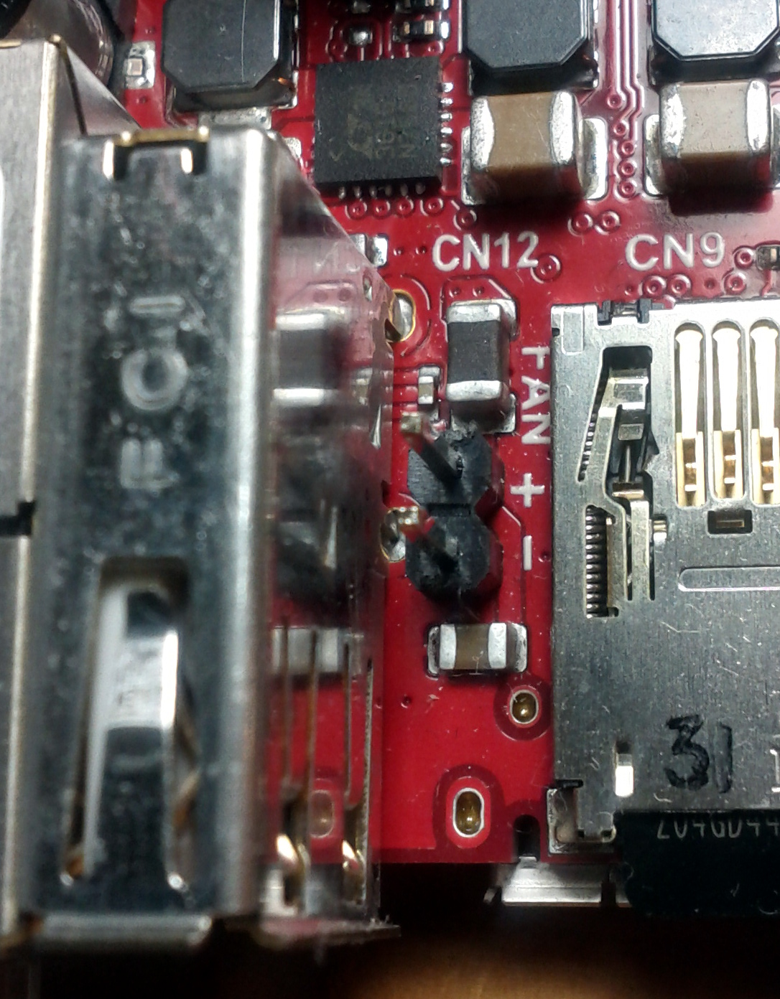
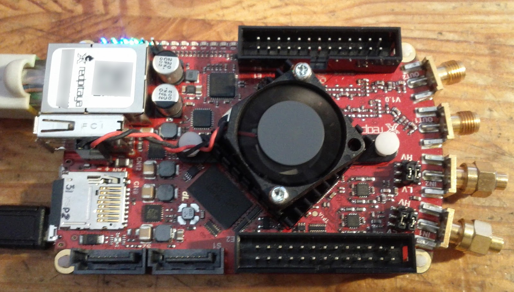
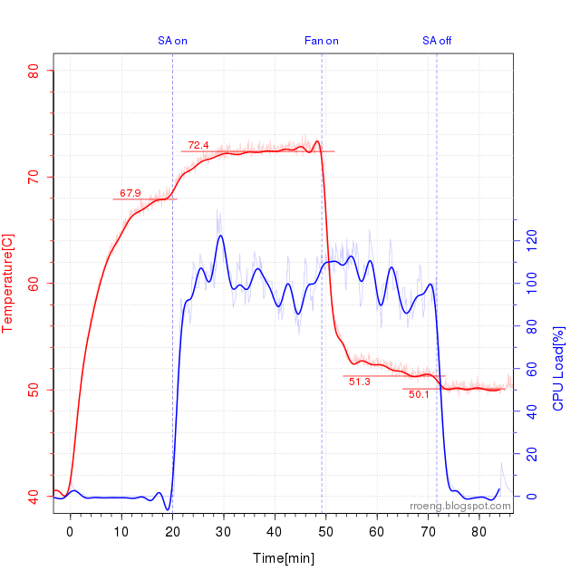

###############
Cooling options
###############

For additional cooling we recommend a 30mm or 25mm fan. You can utilize the power connector on the board to power
the fan, however please note that it supplies only 5 V. The power connector is located between micro-SD socket and 
the host USB connector.

    Red Pitaya power connector.
    
.. note::
 
    Power connector is a standard 2-pin 0.1" connector.
    
    Supplies only 5V.
    
********
Assembly
********

1. Replace fans 0.05" plug with a standard 2-pin 0.1" connector.
 
#. Connect the black wire to the negative terminal and the red wire to the positive terminal. Markings are visible
   in the picture above.
    
#.  Attaching the fan to the heat sink using two screws as shown in the picture bellow. 
 
    .. image:: cooling-screwon.jpg
    

    Red Pitaya with attached fan.

************
Measurements
************

   Temperature measured with the fan turned off and on combined with low and high CPU load.
    
