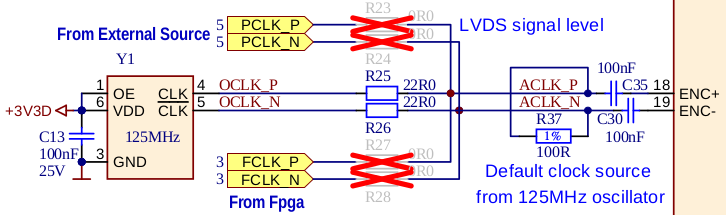
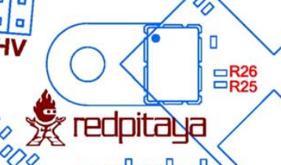
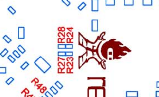

External ADC clock
##################

ADC clock can be provided by:
    * On board 125MHz XO (default)
    * From external source / through extension connector :ref:`E2 <E2>` (R25,R26 should be moved to location R23,R24)
    * Directly from FPGA (R25,R26 should be moved to location R27,R28)

Schematic:

Top side:

Bottom side:

