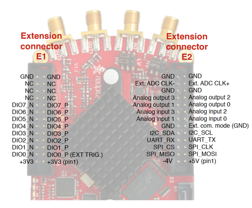
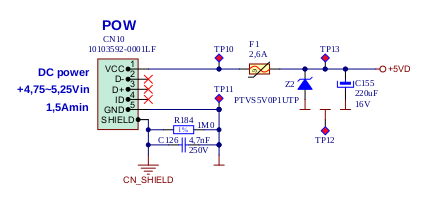

#########
Extension
#########

*******************
Extension connector
*******************

    - Connector: 2 x 26 pins IDC (M) 
    - Power supply: 
    - Available voltages: +5V, +3.3V, 3.3V 
    - Current limitations: 500 mA for +5V and +3.3V (to be shared between extension module and USB devices), 50 mA 
      for -3.3V supply. 

.. _E1:
    
======================
Extension connector E1
======================

- 3v3 power source
- 16 single ended or 8 differential digital I/Os with 3,3V logic levels

===  =========== =============== ======================== ==============
Pin  Description FPGA pin number FPGA pin description     Voltage levels
===  =========== =============== ======================== ==============
1    3V3  
2    3V3
3    DIO0_P      G17             IO_L16P_T2_35 (EXT TRIG) 3.3V
4    DIO0_N      G18             IO_L16N_T2_35            3.3V
5    DIO1_P      H16             IO_L13P_T2_MRCC_35       3.3V
6    DIO1_N      H17             IO_L13N_T2_MRCC_35       3.3V
7    DIO2_P      J18             IO_L14P_T2_AD4P_SRCC_35  3.3V
8    DIO2_N      H18             IO_L14N_T2_AD4N_SRCC_35  3.3V
9    DIO3_P      K17             IO_L12P_T1_MRCC_35       3.3V
10   DIO3_N      K18             IO_L12N_T1_MRCC_35       3.3V
11   DIO4_P      L14             IO_L22P_T3_AD7P_35       3.3V
12   DIO4_N      L15             IO_L22N_T3_AD7N_35       3.3V
13   DIO5_P      L16             IO_L11P_T1_SRCC_35       3.3V
14   DIO5_N      L17             IO_L11N_T1_SRCC_35       3.3V
15   DIO6_P      K16             IO_L24P_T3_AD15P_35      3.3V
16   DIO6_N      J16             IO_L24N_T3_AD15N_35      3.3V
17   DIO7_P      M14             IO_L23P_T3_35            3.3V
18   DIO7_N      M15             IO_L23N_T3_35            3.3V
19   NC
20   NC
21   NC
22   NC
23   NC
24   NC
25   GND
26   GND
===  =========== =============== ======================== ==============

All DIOx_y pins are LVCMOS33. abs. max. ratings are: min. –0.40V max. 3.3V + 0.55V <8 mA drive strength    

.. _E2:

======================
Extension connector E2
======================

    - +5V & -3V3 power source
    - SPI, UART, I2C
    - 4 x slow ADCs
    - 4 x slow DACs
    - Ext. clock for fast ADC
 
.. Table 6: Extension connector E2 pin description

===  ====================== =============== ==================== ==============
Pin  Description            FPGA pin number FPGA pin description Voltage levels
===  ====================== =============== ==================== ==============
1    +5V                                                                         
2    -3.4V (50mA)\ :sup:`1`                                                                         
3    SPI(MOSI)              E9              PS_MIO10_500         3.3V
4    SPI(MISO)              C6              PS_MIO11_500         3.3V
5    SPI(SCK)               D9              PS_MIO12_500         3.3V
6    SPI(CS#)               E8              PS_MIO13_500         3.3V
7    UART(TX)               C8              PS_MIO08             3.3V
8    UART(RX)               C5              PS_MIO09             3.3V
9    I2C(SCL)               B9              PS_MIO50_501         3.3V
10   I2C(SDA)               B13             PS_MIO51_501         3.3V
11   Ext com.mode                                                GND (default)
12   GND                                                       
13   Analog Input 0                                              0-3.5V
14   Analog Input 1                                              0-3.5V
15   Analog Input 2                                              0-3.5V
16   Analog Input 3                                              0-3.5V
17   Analog Output 0                                             0-1.8V
18   Analog Output 1                                             0-1.8V
19   Analog Output 2                                             0-1.8V
20   Analog Output 3                                             0-1.8V
21   GND                                                       
22   GND                                                       
23   Ext Adc CLK+                                                LVDS
24   Ext Adc CLK-                                                LVDS
25   GND                                                       
26   GND                                                       
===  ====================== =============== ==================== ==============

\ :sup:`1` Red Pitaya Version 1.0 has -3.3V on pin 2. Red Pitaya Version 1.1 has -3.4V on pin 2.
Schematics of extension connectors is shown in picture bellow.

**Notes:**

#. Input capacitance depends on jumper settings and may vary. 
#. A 50 Ω termination can be connected through an SMA tee in parallel to the input for measurements in a 50 Ω system. 
#. Crosstalk measured with high gain jumper setting on both channels. The SMA connectors not involved in the
   measurement are terminated.
#. Measurement referred to high gain jumper setting, with limited environmental noise, inputs and outputs terminated,
   output signals disabled, PCB grounded through SMA ground. The specified noise floor measurement is calculated from 
   the standard deviation of 16k contiguous samples at full rate. (Typically full bandwidth std(Vn) < 2 mV). Noise 
   floor specification does not treat separately spurious spectral components and represents time domain noise average 
   referred to a 1 Hz bandwidth. In presence of spurious components the actual noise floor would result lower.
#. Measurement referred at high gain jumper setting, inputs matched and outputs terminated, outputs signal disabled, 
   PCB grounded through SMA ground. 
#. Measurement referred to high gain jumper setting, inputs and outputs terminated, outputs signal disabled, PCB 
   grounded through SMA ground. 
#. Further corrections can be applied through more precise gain and DC offset calibration. 
#. Default software enables sampling at CPU dependent speed. The acquisition of sequence at 100 ksps rate requires the
   implementation of additional FPGA processing.
#. First order low pass filter implementation. Additional filtering can be externally applied according to application 
   requirements. 
#. The output channels are designed to drive 50 Ω loads. Terminate outputs when channels are not used. Connect 
   parallel 50 Ω load (SMA tee junction) in high impedance load applications. 
#. Measured at 10 dBm output power level 
#. Typical power level with 1 MHz sine is 9.5 dBm. Output power is subject to slew rate limitations. 
#. Detailed scheme available within documentation (Red_Pitaya_Schematics_v1.0.1.pdf) 
#. To avoid speed limitations on digital General Purpose Input / Output pins are directly connected to FPGA. FPGA
   decoupling and pin protection is to be addressed within extension module designs. User is responsible for pin 
   handling. 
#. The use of not approved power supply may deteriorate performance or damage the product. 
#. Heatsink must be installed and board must be operated on a flat surface without airflow obstructions. Operation at 
   higher ambient temperatures, lower pressure conditions or within enclosures to be addressed by means of adequate 
   ventilation. The operation of the product is automatically disabled at increased temperatures. 
#. Some parts may become hot during and after operation. Do not touch them. 
#. Measurement performance is specified within this range. 
#. Valid for low frequency signals. For input signals that contain frequency components beyond 1 kHz, the full scale
   value defines the maximum admissible input voltage.
#. Jumper settings are limited to the positions described in the user manual. Any other configuration or use of
   different jumper type may damage the product. 
#. SMA connectors on the cables connected to Red Pitaya must correspond to the standard MILC39012. It’s Important that
   central pin is of suitable length, otherwise the SMA connector installed in Red Pitaya will mechanically damage the
   SMA connector. Central pin of the SMA connector on Red Pitaya will loose contact to the board and the board will 
   not be possible to repair due to the mechanical damage (separation of the pad from the board). 
#. Jumpers are not symmetrical, they have latches. Always install jumpers with the latch on its outer side in order to
   avoid problems with hard to remove jumpers. 
#. Dimensions are rounded to the nearest millimeter. For exact dimensions, please see the Technical drawings and 
   product model. (Red_Pitaya_Dimensions_v1.0.1.pdf) 

Information furnished by Red Pitaya d.d. is believed to be accurate and reliable. However, no responsibility is 
assumed for its use. Contents may be subject to change without any notice. 

===============================
Auxiliary analog input channels
===============================
    
    - Number of channels: 4 
    - Nominal sampling rate: 100 ksps (H) 
    - ADC resolution 12 bits 
    - Connector: dedicated pins on IDC connector :ref:`E2 <E2>` (pins 13,14,15,16) 
    - Input voltage range: 0 to +3.5 V 
    - Input coupling: DC 

================================
Auxiliary analog output channels 
================================

    - Number of channels: 4 
    - Output type: Low pass filtered PWM (I) 
    - PWM time resolution: 4ns (1/250 MHz)
    - Connector: dedicated pins on IDC connector :ref:`E2 <E2>` (pins 17,18,19,20) v - Output voltage range: 0 to +1.8 V 
    - Output coupling: DC 

==================================================
General purpose digital input/output channels: (N) 
==================================================

    - Number of digital input/output pins: 16 
    - Voltage level: 3.3 V 
    - Direction: configurable 
    - Location: IDC connector E1 (pins 324 ) 
    
===============================================
Powering Red Pitaya through extension connector
===============================================

Red Pitaya can be also powered through pin1 of the extension connector :ref:`E2 <E2>`, but in such case external protection must
be provided by the user in order to protect the board!

Protection circuit between +5V that is provided over micro USB power connector and +5VD that is connected to pin1 of 
the extension connector :ref:`E2 <E2>`.

