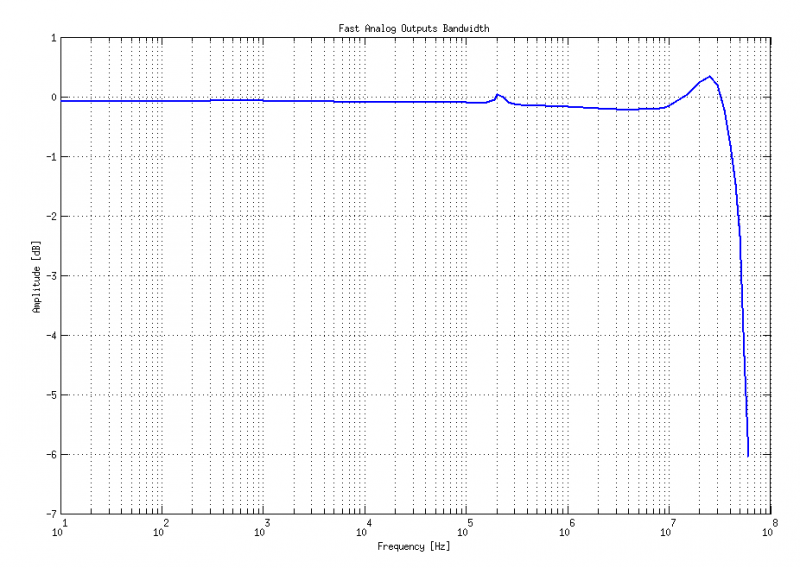

##############
Fast analog IO
##############

*************
Analog inputs
*************

* Number of channels: 2
* Bandwidth: 50 MHz (3 dB)
* Sample rate: 125 Msps 
* ADC resolution 14 bits
* Input coupling: DC
* Input noise level: < -119 dBm / Hz (D)
* Input impedance: 1 MΩ / 10pF (A,B)
* Full scale voltage: 2Vpp, (46 Vpp for lowgain jumper setting) (T,V) 
* Full scale voltage: 2Vpp, (46 Vpp for lowgain jumper setting) (T,V)
* DC offset error: <5 % FS (G) 
* gain error: < 3% (at high gain jumper setting), <10% (at low gain jumper setting) (G) 
* **Absolute maximum input voltage rating: 30 V (S) (1500 V ESD)**
* Overload protection: protection diodes (under the input voltage rating conditions) 

.. TODO http://wiki.redpitaya.com/index.php?title=Analog_frontend_-_Inputs

* Input channel isolation: typical performance 65 dB @ 10 kHz, 50 dB @ 100 kHz, 55 dB @ 1 M, 55 dB @ 10 MHz, 52 dB 
* @ 20 MHz, 48 dB @ 30 MHz, 44 dB @ 40 MHz, 40 dB @ 50 MHz. (C) 
* Harmonics 
* at -3 dBFS: typical performance <-45 dBc (E) 
* at -20 dBFS: typical performance <-60 dBc (E) 
* Spurious frequency components: Typically <-90 dBFS (F) 
* Connector type: SMA (U) 
* Frequency response is adjusted by digital compensation 

**************
Analog outputs
**************

* Number of channels: 2 
* Bandwidth: 50 MHz (3 dB) (K) 
* Sample rate: 125 Msps 
* DAC resolution: 14 bits 
* Output coupling: DC 
* Load impedance: 50 Ω (J) 
* Output slew rate limit: 200 V/us 
* Connector type: SMA (U) 
* DC offset error: < 5% FS (G) 
* Gain error: < 5% (G) 
* Full scale power: > 9 dBm (L) 
* Harmonics: typical performance: (at 8 dBm) 
* -51 dBc @ 1 MHz 
* -49 dBc @ 10 MHz 
* -48 dBc @ 20 MHz 
* -53 dBc @ 45 MHz 

***********************************
Analog inptus & outputs calibration
***********************************

Calibration processes can be performed using new *Oscilloscope&Signal generator* app
or using ``calib`` command line utility.
When performing calibration with the new Oscilloscope&Signal generator application
just select Settings->Calibration and follow instructions.

- Calibration using calib utility
    
Start your Red Pitaya and connect to it via Terminal.

.. code-block:: shell-session
   
   redpitaya> calib
 
    Usage: calib [OPTION]...
    
    OPTIONS:
     -r    Read calibration values from eeprom (to stdout).
     -w    Write calibration values to eeprom (from stdin).
     -f    Use factory address space.
     -d    Reset calibration values in eeprom with factory defaults.
     -v    Produce verbose output.
     -h    Print this info.

The EEPROM is a non-volatile memory, therefore the calibration coefficients
will not change during Red Pitaya power cycles,
nor will they change with software upgrades via Bazaar
or with manual modifications of the SD card content. 
Example of calibration parameters readout from EEPROM with verbose output:

.. code-block:: shell-session
   
   redpitaya> calib -r -v
   FE_CH1_FS_G_HI = 45870551      # IN1 gain coefficient for LV (± 1V range)  jumper configuration.
   FE_CH2_FS_G_HI = 45870551      # IN2 gain coefficient for LV (± 1V range)  jumper configuration.
   FE_CH1_FS_G_LO = 1016267064    # IN1 gain coefficient for HV (± 20V range) jumper configuration.
   FE_CH2_FS_G_LO = 1016267064    # IN2 gain coefficient for HV (± 20V range) jumper configuration.
   FE_CH1_DC_offs = 78            # IN1 DC offset  in ADC samples.
   FE_CH2_DC_offs = 25            # IN2 DC offset  in ADC samples.
   BE_CH1_FS = 42755331           # OUT1 gain coefficient.
   BE_CH2_FS = 42755331           # OUT2 gain coefficient.
   BE_CH1_DC_offs = -150          # OUT1 DC offset in DAC samples.
   BE_CH2_DC_offs = -150          # OUT2 DC offset in DAC samples.

Example of the same calibration parameters readout from EEPROM with non-verbose output, suitable for editing within 
scripts::

    redpitaya> calib -r
           45870551            45870551          1016267064          1016267064 

You can write changed calibration parameters using **calib -w** command:
1. Type calib -w in to command line (terminal)
2. Press enter
3. Paste or write new calibration parameters
4. Press enter

 
   Usage: calib [OPTION]...
   
   OPTIONS:
    -r    Read calibration values from eeprom (to stdout).
    -w    Write calibration values to eeprom (from stdin).
    -f    Use factory address space.
    -d    Reset calibration values in eeprom with factory defaults.
    -v    Produce verbose output.
    -h    Print this info.

The EEPROM is a non-volatile memory, therefore the calibration coefficients
will not change during Red Pitaya power cycles,
nor will they change with software upgrades via Bazaar
or with manual modifications of the SD card content. 
Example of calibration parameters readout from EEPROM with verbose output:

.. code-block:: shell-session
   
   redpitaya> calib -r -v
   FE_CH1_FS_G_HI = 45870551      # IN1 gain coefficient for LV (+/- 1V range)  jumper configuration.
   FE_CH2_FS_G_HI = 45870551      # IN2 gain coefficient for LV (+/- 1V range)  jumper configuration.
   FE_CH1_FS_G_LO = 1016267064    # IN1 gain coefficient for HV (+/- 20V range) jumper configuration.
   FE_CH2_FS_G_LO = 1016267064    # IN2 gain coefficient for HV (+/- 20V range) jumper configuration.
   FE_CH1_DC_offs = 78            # IN1 DC offset  in ADC samples.
   FE_CH2_DC_offs = 25            # IN2 DC offset  in ADC samples.
   BE_CH1_FS = 42755331           # OUT1 gain coefficient.
   BE_CH2_FS = 42755331           # OUT2 gain coefficient.
   BE_CH1_DC_offs = -150          # OUT1 DC offset in DAC samples.
   BE_CH2_DC_offs = -150          # OUT2 DC offset in DAC samples.

Example of the same calibration parameters readout from EEPROM with non-verbose output,
suitable for editing within scripts:

.. code-block:: shell-session
   
   redpitaya> calib -r
              45870551            45870551          1016267064          1016267064                  78                  25            42755331            42755331                -150                -150

You can write changed calibration parameters using ``calib -w`` command:

#. Type calib -w in to command line (terminal)
#. Press enter
#. Paste or write new calibration parameters
#. Press enter

.. code-block:: shell-session
   
   redpitaya> calib -w
      
              40000000           45870551          1016267064          1016267064                  78                  25            42755331            42755331                -150                -150

Should you bring the calibration vector to an undesired state,
you can always reset it to factory defaults using:

.. code-block:: shell-session
   
   redpitaya> calib -d

DC offset calibration parameter can be obtained
as average of acquired signal at grounded input.
Gains parameter can be calculated by using reference voltage source
and old version of an Oscilloscope application.
Start Oscilloscope app. connect ref. voltage to the desired input and take measurements.
Change gain calibration parameter using instructions above,
reload the Oscilloscope application and
make measurements again with new calibration parameters. 
Gain parameters can be optimized by repeating calibration and measurement step. 

In the table bellow typical results after calibration are shown. 

INPUTS
======

=========================== =============== ===========
Parameter                   Jumper settings Value
=========================== =============== ===========
DC GAIN ACCURACY @ 122 kS/s LV              0.2%
DC OFFSET @ 122 kS/s        LV              ± 0.5 mV
DC GAIN ACCURACY @ 122 kS/s HV              0.5%
DC OFFSET @ 122 kS/s        HV              ± 5 mV
=========================== =============== ===========

AC gain accuracy can be extracted form Frequency response - Bandwidth. 

.. image:: 800px-Bandwidth_of_Fast_Analog_Inputs.png

=======
OUTPUTS
=======

Calibration is performed in noise controlled environment. Inputs and outputs gains are calibrated with 0.02% and
0.003% DC reference voltage standards. Input gains calibration is performed in medium size timebase range. Red Pitaya
is non-shielded device and its inputs/outputs ground is not connected to the earth grounding as it is in case of 
classical Oscilloscopes. To achieve calibration results given below, Red Pitaya must be grounded and shielded.

.. Table: Typical specification after calibration

================= ==========
Parameter         Value
================= ==========
DC GAIN ACCURACY  0.4%
DC OFFSET         ± 4 mV
RIPPLE(@ 0.5V DC) 0.4 mVpp
================= ==========

AC gain accuracy can be extracted:

