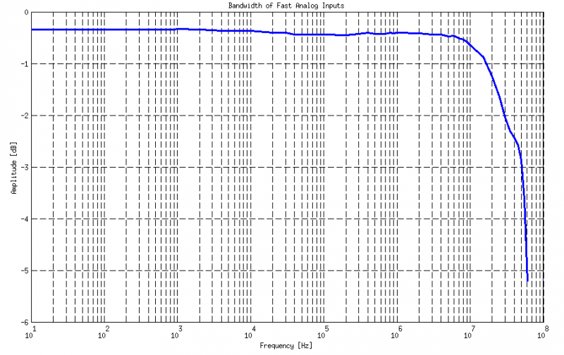

##############
Fast analog IO
##############

.. _anain:

*************
Analog inputs
*************

Red Pitaya board analog frontend features 2 fast analog inputs. 

**General Specifications:**
    
    1. Number of channels: 2
    #. Sample rate: 125 Msps 
    #. ADC resolution 14 bits 
    #. Input coupling: DC 
    #. **Absolute maximum input voltage rating: 30 V (S) (1500 V ESD)**
    #. Overload protection: protection diodes (under the input voltage rating conditions) 
    
    .. note::
    
       Valid for low frequency signals. For input signals that contain frequency components beyond 1 kHz, the full scale value defines the maximum admissible input voltage.
    
    7. Connector type: SMA
    
    .. note::
    
        SMA connectors on the cables connected to Red Pitaya must correspond to the standard MIL­C­39012. 
        It’s Important that central pin is of suitable length, otherwise the SMA connector installed in Red Pitaya will mechanically damage the SMA connector.
        Central pin of the SMA connector on Red Pitaya will loose contact to the board and the board will not be possible to repair due to the mechanical damage (separation of the pad from the board).
    
    8. Input stage of fast analog inputs can be used for two voltage ranges (±1V and ±20 V). 
    
    .. note::
    
        Voltage ranges are set by input jumpers as is shown here:
        
        Gain can be individually adjusted for both input channels. The adjustment is done by bridging the jumpers located behind the corresponding input SMA connector.
    
        .. image:: Jumper_settings.png 
            
        .. figure:: Jumper_settings_photo.png
            
            Jumper setting
    
        | Left setting (LV) adjusts to ± 1 V full scale.
        | Right setting (HV) adjusts to ± 20 V full scale.
    
    .. warning::
    
        Jumper settings are limited to the described positions. Any other configuration or use of different jumper
        type may damage the product.
        
        
    9. Input stage schematics is given in picture below.

        .. figure:: Fast_analog_inputs_sch.png
        
            Fast analog inputs schematics
            
    #. Fast analog inputs are **DC coupled**. Input impedance is given in picture below. 

       .. figure:: Input_impedance_of_fast_analog_inputs.png
       
            Input impedance of fast analog inputs
        
    #. Bandwidth: 50 MHz (3 dB)
    
        In the picture below the Frequency Response - Bandwidth of fast analog inputs is shown. Measurements are taken 
        using `Agilent 33250A <http://www.keysight.com/en/pd-1000000803%3Aepsg%3Apro-pn-33250A/function-arbitrary-waveform-generator-80-mhz?cc=US&lc=eng>`_ 
        Signal generator as reference. Measured signal is acquired using
        :ref:`Remote control (SCPI commands) <scpiCommand>`. Amplitude voltage is extracted from the acquired signal 
        and compared to the reference signal amplitude. Because of maximum sampling rate of 125MS/s when measuring 
        signals above 10 MHz we have used sin(x)/x interpolation to get more accurate results of Vpp voltage and with
        that more accurate measurements of analog bandwidth.When measuring signals above 10 MHz similar results should
        be obtained without interpolation or directly with an Oscilloscope application and P2P measurements. Notice:
        When making measurements without interpolation you need to extract maximum and minimum of the acquired signal
        using complete 16k buffer. When using P2P measurements on Oscilloscope you need to take maximum value shown as
        a measurement result. Example of sin(x)/x interpolation for 40 MHz signal is shown in picture bellow(right). 
        
        .. note::
        
            In picture only 10 samples of 16k buffer are shown to represent few periods of 40 MHz signal.
        
        .. figure:: Bandwidth_of_Fast_Analog_Inputs.png
        
        Bandwidth of fast analog inputs
        
        .. figure:: Sin(x)x_Interpolation.png   
        
        Sin(x)/x Interpolation
        
        .. TODO nebi mogl bit tole zamenjano? glej sliko
    
    #. Input noise 
        
        Measurement referred to high gain (LV +/- 1V) jumper setting, with limited environmental noise, inputs and outputs terminated, output signals disabled, PCB grounded through SMA ground.
        Measurements are performed on 16k continuous samples at full rate (125MS/s).
        (Typically full bandwidth std(Vn) < 0.5 mV).
        Noise spectrum shown in picture bellow(right) is calculated using FFT analysis on N=16384 samples sampled at Fs=125E6MS/s 
    
        .. figure:: Noise_distribution.png
        
           Noise distribution 
        
        .. figure:: Noise_level.png
        
            Noise level
        
    #. Input channel isolation: typical performance 65 dB @ 10 kHz, 50 dB @ 100 kHz,
       55 dB @ 1 M, 55 dB @ 10 MHz, 52 dB @ 20 MHz, 48 dB @ 30 MHz, 44 dB @ 40 MHz, 40 dB @ 50 MHz. (C) 
       Crosstalk measured with high gain jumper setting on both channels. The SMA connectors not involved in the measurement are terminated.
    
    #. Harmonics 
       
       - at -­3 dBFS: typical performance <-­45 dBc 
       - at ­-20 dBFS: typical performance <­-60 dBc 
       
       Measurement referred at LV jumper setting, inputs matched and outputs terminated, outputs signal disabled, PCB grounded through SMA ground.
    
    #. Spurious frequency components: Typically <­-90 dBFS 
    
       Measurement referred to LV jumper setting, inputs and outputs terminated, outputs signal disabled, PCB grounded through SMA ground.
       In pictures bellow typical performances of Red Pitaya fast analog inputs are shown. 
       For the reference signal generation we have used **Agilent 33250A Signal generator**. For the reference spectrum measurements of the generated signal we have used 
       **Agilent E4404B Spectrum analyzer**. Same signal is acquired with **Red Pitaya board and FFT analysis** is performed.
       Results are shown in figures bellow where Red Pitaya measurements are on right. Measurement referred to LV jumper setting, inputs and outputs terminated, outputs signal disabled, PCB grounded through SMA ground.

        .. figure:: Measurement_setup.png
            
            Measurement setup
    
    #. Reference signal: -20dBm, 2 MHz

       .. figure:: -20dBm_2MHz_RP_AG.png
       
            Reference Signal: -20dBm 2 MHz
    
    #. Reference signal: -20dBm, 10 MHz
       
       .. figure::   -20dBm_10MHz_RP_AG.png

            Reference Signal: -20dBm 10 MHz
            
    #. Reference signal: -20dBm, 30 MHz
      
       .. figure:: -20dBm_30MHz_RP_AG.png

            Reference Signal: -20dBm 30 MHz
            
    #. Reference signal: 0dBm, 2 MHz
  
       .. figure:: 0dBm_2MHz_RP_AG.png

            Reference Signal: 0dBm 2 MHz
            
    #. Reference signal: 0dBm, 10 MHz
  
       .. figure:: 0dBm_10MHz_RP_AG.png

            Reference Signal: 0dBm 10 MHz
            
    #. Reference signal: 0dBm, 30 MHz
  
       .. figure:: 0dBm_30MHz_RP_AG.png

            Reference Signal: 0dBm 30 MHz
            
    #. Reference signal: -3dBFS, 2 MHz
  
       .. figure:: -3dBFS_2MHZ_RP_AG.png

            Reference Signal: -3dBFS 2 MHz
            
    #. Reference signal: -3dBFS, 10 MHz
  
       .. figure:: -3dBFS_10MHZ_RP_AG.png

            Reference Signal: -3dBFS 10 MHz
            
    #. Reference signal: -3dBFS, 30 MHz
  
       .. figure:: -3dBFS_30MHZ_RP_AG.png
       
          Reference Signal: -3dBFS 30 MHz
            
       Due to natural distribution of the electrical characteristics of the analog inputs and outputs electronics, 
       their offsets and gains will differ slightly across various Red Pitaya boards and may change during time. The 
       calibration coefficients are stored in EEPROM on Red Pitaya and can be accessed and modified with the calib 
       utility:
    
    #. DC offset error: <5 % Full Scale 
    
    #. Gain error: < 3% (at LV jumper setting), <10% (at HV jumper setting) 
    
        Further corrections can be applied through more precise gain and DC offset :ref:`calibration <calib>`.  
        
.. _calib:

=========================
Analog inptus calibration
=========================

Calibration processes can be performed using the `Oscilloscope&Signal generator app <http://store.redpitaya.com/scopegenpro.html>`_.
or using **calib** :ref:`command line utility <clu>`. When performing calibration with the 
`Oscilloscope&Signal generator app <http://store.redpitaya.com/scopegenpro.html>`_ just select 
Settings->Calibration and follow instructions.

- Calibration using **calib** utility
    
Start your Red Pitaya and connect to it via a terminal.

.. code-block:: shell-session
   
   redpitaya> calib
 
    Usage: calib [OPTION]...
    
    OPTIONS:
     -r    Read calibration values from eeprom (to stdout).
     -w    Write calibration values to eeprom (from stdin).
     -f    Use factory address space.
     -d    Reset calibration values in eeprom with factory defaults.
     -v    Produce verbose output.
     -h    Print this info.

The EEPROM is a non-volatile memory, therefore the calibration coefficients
will not change during Red Pitaya power cycles,
nor will they change with software upgrades via Bazaar
or with manual modifications of the SD card content. 
Example of calibration parameters readout from EEPROM with verbose output:

.. code-block:: shell-session
   
   redpitaya> calib -r -v
   FE_CH1_FS_G_HI = 45870551      # IN1 gain coefficient for LV (± 1V range)  jumper configuration.
   FE_CH2_FS_G_HI = 45870551      # IN2 gain coefficient for LV (± 1V range)  jumper configuration.
   FE_CH1_FS_G_LO = 1016267064    # IN1 gain coefficient for HV (± 20V range) jumper configuration.
   FE_CH2_FS_G_LO = 1016267064    # IN2 gain coefficient for HV (± 20V range) jumper configuration.
   FE_CH1_DC_offs = 78            # IN1 DC offset  in ADC samples.
   FE_CH2_DC_offs = 25            # IN2 DC offset  in ADC samples.
   BE_CH1_FS = 42755331           # OUT1 gain coefficient.
   BE_CH2_FS = 42755331           # OUT2 gain coefficient.
   BE_CH1_DC_offs = -150          # OUT1 DC offset in DAC samples.
   BE_CH2_DC_offs = -150          # OUT2 DC offset in DAC samples.

Example of the same calibration parameters readout from EEPROM with non-verbose output, suitable for editing within 
scripts::

    redpitaya> calib -r
           45870551            45870551          1016267064          1016267064 

You can write changed calibration parameters using **calib -w** command:
1. Type calib -w in to command line (terminal)
2. Press enter
3. Paste or write new calibration parameters
4. Press enter

 
   Usage: calib [OPTION]...
   
   OPTIONS:
    -r    Read calibration values from eeprom (to stdout).
    -w    Write calibration values to eeprom (from stdin).
    -f    Use factory address space.
    -d    Reset calibration values in eeprom with factory defaults.
    -v    Produce verbose output.
    -h    Print this info.

The EEPROM is a non-volatile memory, therefore the calibration coefficients
will not change during Red Pitaya power cycles,
nor will they change with software upgrades via Bazaar
or with manual modifications of the SD card content. 
Example of calibration parameters readout from EEPROM with verbose output:

.. code-block:: shell-session
   
   redpitaya> calib -r -v
   FE_CH1_FS_G_HI = 45870551      # IN1 gain coefficient for LV (+/- 1V range)  jumper configuration.
   FE_CH2_FS_G_HI = 45870551      # IN2 gain coefficient for LV (+/- 1V range)  jumper configuration.
   FE_CH1_FS_G_LO = 1016267064    # IN1 gain coefficient for HV (+/- 20V range) jumper configuration.
   FE_CH2_FS_G_LO = 1016267064    # IN2 gain coefficient for HV (+/- 20V range) jumper configuration.
   FE_CH1_DC_offs = 78            # IN1 DC offset  in ADC samples.
   FE_CH2_DC_offs = 25            # IN2 DC offset  in ADC samples.
   BE_CH1_FS = 42755331           # OUT1 gain coefficient.
   BE_CH2_FS = 42755331           # OUT2 gain coefficient.
   BE_CH1_DC_offs = -150          # OUT1 DC offset in DAC samples.
   BE_CH2_DC_offs = -150          # OUT2 DC offset in DAC samples.

Example of the same calibration parameters readout from EEPROM with non-verbose output,
suitable for editing within scripts:

.. code-block:: shell-session
   
   redpitaya> calib -r
              45870551            45870551          1016267064          1016267064                  78                  25            42755331            42755331                -150                -150

You can write changed calibration parameters using ``calib -w`` command:

1. Type calib -w in to command line (terminal)
#. Press enter
#. Paste or write new calibration parameters
#. Press enter

.. code-block:: shell-session
   
   redpitaya> calib -w
      
              40000000           45870551          1016267064          1016267064                  78                  25            42755331            42755331                -150                -150

Should you bring the calibration vector to an undesired state,
you can always reset it to factory defaults using:

.. code-block:: shell-session
   
   redpitaya> calib -d

DC offset calibration parameter can be obtained
as average of acquired signal at grounded input.
Gains parameter can be calculated by using reference voltage source
and old version of an Oscilloscope application.
Start Oscilloscope app. connect ref. voltage to the desired input and take measurements.
Change gain calibration parameter using instructions above,
reload the Oscilloscope application and
make measurements again with new calibration parameters. 
Gain parameters can be optimized by repeating calibration and measurement step. 

In the table bellow typical results after calibration are shown. 

=========================== =============== ===========
Parameter                   Jumper settings Value
=========================== =============== ===========
DC GAIN ACCURACY @ 122 kS/s LV              0.2%
DC OFFSET @ 122 kS/s        LV              ± 0.5 mV
DC GAIN ACCURACY @ 122 kS/s HV              0.5%
DC OFFSET @ 122 kS/s        HV              ± 5 mV
=========================== =============== ===========

AC gain accuracy can be extracted form Frequency response - Bandwidth. 

*************
Analog output
*************

Red Pitaya board analog frontend features 2 fast analog output. 

**General Specifications:**

    #. RF outputs 
    #. Number of channels: 2 
    #. Sample rate: 125 Msps 
    #. DAC resolution: 14 bits 
    #. Output coupling: DC 
    #. Load impedance: 50 Ω 
        The output channels are designed to drive 50 Ω loads. Terminate outputs when channels are not used. Connect parallel 50 Ω load (SMA tee junction) in high impedance load applications.
    #. Full scale power: > 9 dBm 
        Typical power level with 1 MHz sine is 9.5 dBm. Output power is subject to slew rate limitations.
    #. Output slew rate limit: 200 V/us 
    #. Connector type: SMA 
       SMA connectors on the cables connected to Red Pitaya must correspond to the standard MIL­C­39012. It’s Important that central pin is of suitable length, otherwise the SMA connector installed in Red Pitaya will mechanically damage the SMA connector. Central pin of the SMA connector on Red Pitaya will loose contact to the board and the board will not be possible to repair due to the mechanical damage (separation of the pad from the board).
    
       .. figure:: Outputs.png
       
           Output channels Output voltage range: ± 1 V
        
       Output stage is shown in picture bellow.
    
       .. figure:: Outputs_stage.png
       
           Output channels schematics
           
    #. Impedance of the output channels (output amplifier and filter) is shown in figure bellow.
    
       .. figure:: Output_impedance.png
    
            Outputs impedance
            
    #. Bandwidth: 50 MHz (3 dB)
       Bandwidth measurements are shown in picture bellow. Measurements are taken with 
       `Agilent MSO7104B <http://www.keysight.com/en/pdx-x201799-pn-MSO7104B/mixed-signal-oscilloscope-1-ghz-4-analog-plus-16-digital-channels?pm=spc&nid=-32535.1150174&cc=SI&lc=eng>`_ 
       Oscilloscope for each frequency step (10Hz - 60MHz) of measured signal. 
       Red Pitaya board OUT1 is used with 0 dBm output power. Second output channel and both input channels are terminated with 50 Ohm termination.
       Red Pitaya board is grounded trough Oscilloscope ground. Oscilloscope input mus be set to 50 Ohm input impedance

       .. image:: Fast_Analog_Outputs_Bandwidt.png
       
    #. Harmonics: typical performance: (at ­8 dBm) 

       -­ -51 dBc @ 1 MHz 
       -­ -49 dBc @ 10 MHz 
       -­ -48 dBc @ 20 MHz 
       -­ -53 dBc @ 45 MHz 

    #. DC offset error: < 5% FS 
    #. Gain error: < 5% 
    
    Further corrections can be applied through more precise gain and DC offset calibration.

=========================
Analog output calibration
=========================

Calibration is performed in noise controlled environment. Inputs and outputs gains are calibrated with 0.02% and
0.003% DC reference voltage standards. Input gains calibration is performed in medium size timebase range. Red Pitaya
is non-shielded device and its inputs/outputs ground is not connected to the earth grounding as it is in case of 
classical Oscilloscopes. To achieve calibration results given below, Red Pitaya must be grounded and shielded.

.. Table: Typical specification after calibration

================= ==========
Parameter         Value
================= ==========
DC GAIN ACCURACY  0.4%
DC OFFSET         ± 4 mV
RIPPLE(@ 0.5V DC) 0.4 mVpp
================= ==========
