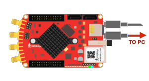

*************
Debug console
*************

The debug console can be used to follow the boot process:

1. FSBL (if debug mode is enabled)

   The serial console can also be used to see the output
   of other bare metal applications, for example the memory test.

2. U-Boot

   During the boot process U-Boot will show status and debug information.

   After FSBL starts U-Boot, there is a 3 second delay
   before U-Boot starts the Linux kernel.
   If during this time a key is pressed,
   U-boot will stop the boot process
   and give the user access to its shell.

3. Linux console

   During the boot process Linux will show status and debug information.

   When ``systemd`` reaches ``multi-user.target`` a login prompt will appear.

      User name: ``root``
      Password: ``root``

==============
Hardware setup
==============

.. note::

   For STEMLab 125-14 you need additional USB to microUSB cable,
   for STEMLab 125-10 additional serial to USB adapter.

.. image:: console-connector.png

Connect your Red Pitaya and PC with micro USB B to USB A cable and follow the instructions for your OS.

-------
Windows
-------

Download and install the `FTD driver <http://www.ftdichip.com/Drivers/VCP.htm>`_ to your PC. After installation, a 
new COM port will appear in the Device Manager you can use in Hyperterminal or another terminal utility to connect to 
Red Pitaya.

-----
Linux
-----

There is broad support for USB to serial converters in the Linux kernel,
so in most cases the converter will be detested soon after connecting it.

You can see the driver output in the kernel log using ``dmesg``:

.. code-block:: none
   :emphasize-lines: 11

   $ dmesg
   ...
   [95074.784075] usb 1-2.4.3: new full-speed USB device number 20 using ehci-pci
   [95074.885386] usb 1-2.4.3: New USB device found, idVendor=0403, idProduct=6015
   [95074.885399] usb 1-2.4.3: New USB device strings: Mfr=1, Product=2, SerialNumber=3
   [95074.885406] usb 1-2.4.3: Product: FT231X USB UART
   [95074.885411] usb 1-2.4.3: Manufacturer: FTDI
   [95074.885416] usb 1-2.4.3: SerialNumber: DN003P0Q
   [95074.890105] ftdi_sio 1-2.4.3:1.0: FTDI USB Serial Device converter detected
   [95074.890228] usb 1-2.4.3: Detected FT-X
   [95074.891157] usb 1-2.4.3: FTDI USB Serial Device converter now attached to ttyUSB0

The first board connected to your PC will create a device named ``/dev/ttyUSB0``.
If **N** USB to serial devices are connected, they will appear as
``/dev/ttyUSBn`` where **n** in in **{0, 1, ..., N-1}**.
To access this devices programs should be run with ``sudo``.

~~~~~~~~~~~
``minicom``
~~~~~~~~~~~

Minicom is a text-based modem control and terminal emulation program .
It is commonly used for setting up a remote serial console.

To configure ``minicom`` use the ``-s`` option.

.. code-block:: shell-session

   sudo minicom -s

A configuration menu will open.

.. code-block:: none

   +-----[configuration]------+
   | Filenames and paths      |
   | File transfer protocols  |
   | Serial port setup        |
   | Modem and dialing        |
   | Screen and keyboard      |
   | Save setup as dfl        |
   | Save setup as..          |
   | Exit                     |
   | Exit from Minicom        |
   +--------------------------+

Go to ``Serial port setup``, press **Enter** and setup the next options:

* Serial Device: ``/dev/ttyUSB0`` (device index ``0`` or a higher number)
* Bps/Par/Bits: ``115200 8N1`` (baud rate, byte length, parity and stop bits)
* Hardware/Software Flow Control: No (flow control should be disabled)

.. code-block:: none

   +-----------------------------------------------------------------------+
   | A -    Serial Device      : /dev/ttyUSB0                              |
   | B - Lockfile Location     : /var/lock                                 |
   | C -   Callin Program      :                                           |
   | D -  Callout Program      :                                           |
   | E -    Bps/Par/Bits       : 115200 8N1                                |
   | F - Hardware Flow Control : No                                        |
   | G - Software Flow Control : No                                        |
   |                                                                       |
   |    Change which setting?                                              |
   +-----------------------------------------------------------------------+

``minicom`` requires some special ``Control+a`` key sequences to operate.
Please see the `manual <https://linux.die.net/man/1/minicom>`_ for details.

~~~~~~~~~~
``screen``
~~~~~~~~~~

GNU ``screen`` is in general a terminal multiplexer.
It also supports connecting to a serial console,
and provides syntax to configure the serial connection
baud rate, byte length, parity and flow control, ...

Compared to ``minicom`` it provides better fonts,
better support for terminal window re-sizing, ...

.. code-block:: shell-session

   $ sudo screen /dev/ttyUSB1 115200 cs8

Similar to ``minicom``, ``screen`` requires some special ``Control+a`` key sequences to operate.
Please see the `manual <https://www.gnu.org/software/screen/manual/screen.html>`_ for details.

=======================
Reference boot sequence
=======================

You can compare this reference boot sequences against yours.

------
U-Boot
------

.. code-block:: none

   U-Boot 2016.01 (Nov 16 2016 - 12:23:28 +0100), Build: jenkins-redpitaya-master-156
   
   Model: Red Pitaya Board
   Board: Xilinx Zynq
   I2C:   ready
   DRAM:  ECC disabled 480 MiB
   I2C:EEPROM selection failed
   MMC:   sdhci@e0100000: 0
   In:    serial@e0000000
   Out:   serial@e0000000
   Err:   serial@e0000000
   Model: Red Pitaya Board
   Board: Xilinx Zynq
   Net:   ZYNQ GEM: e000b000, phyaddr 1, interface rgmii-id
   eth0: ethernet@e000b000
   Hit any key to stop autoboot:  0
   Running script from SD...
   Device: sdhci@e0100000
   Manufacturer ID: 19
   OEM: 4459
   Name: 00000
   Tran Speed: 25000000
   Rd Block Len: 512
   SD version 1.0   
   High Capacity: Yes
   Capacity: 3.7 GiB
   Bus Width: 4-bit 
   Erase Group Size: 512 Bytes
   reading u-boot.scr
   1203 bytes read in 17 ms (68.4 KiB/s)
   ## Executing script at 02000000
   Set devicetree and ramdisk high loading address to 0x20000000
   Loading from SD card (FAT file system) to memory
   Device: sdhci@e0100000
   Manufacturer ID: 19
   OEM: 4459
   Name: 00000
   Tran Speed: 25000000
   Rd Block Len: 512
   SD version 1.0   
   High Capacity: Yes
   Capacity: 3.7 GiB
   Bus Width: 4-bit 
   Erase Group Size: 512 Bytes
   reading u-boot.scr
   1203 bytes read in 17 ms (68.4 KiB/s)
   ## Executing script at 02000000
   Set devicetree and ramdisk high loading address to 0x20000000
   Loading from SD card (FAT file system) to memory
   Device: sdhci@e0100000
   Manufacturer ID: 19
   OEM: 4459
   Name: 00000
   Tran Speed: 25000000
   Rd Block Len: 512
   SD version 1.0   
   High Capacity: Yes
   Capacity: 3.7 GiB
   Bus Width: 4-bit 
   Erase Group Size: 512 Bytes
   reading uImage   
   4590664 bytes read in 404 ms (10.8 MiB/s)
   reading devicetree.dtb
   17342 bytes read in 19 ms (890.6 KiB/s)
   Booting Linux kernel with ramdisk and devicetree
   ## Booting kernel from Legacy Image at 02004000 ...
      Image Name:   Linux-4.4.0-xilinx
      Image Type:   ARM Linux Kernel Image (uncompressed)
      Data Size:    4590600 Bytes = 4.4 MiB
      Load Address: 00008000
      Entry Point:  00008000
      Verifying Checksum ... OK
   ## Flattened Device Tree blob at 04000000
      Booting using the fdt blob at 0x4000000
      Loading Kernel Image ... OK
      Loading Device Tree to 1d33c000, end 1d3433bd ... OK
 
