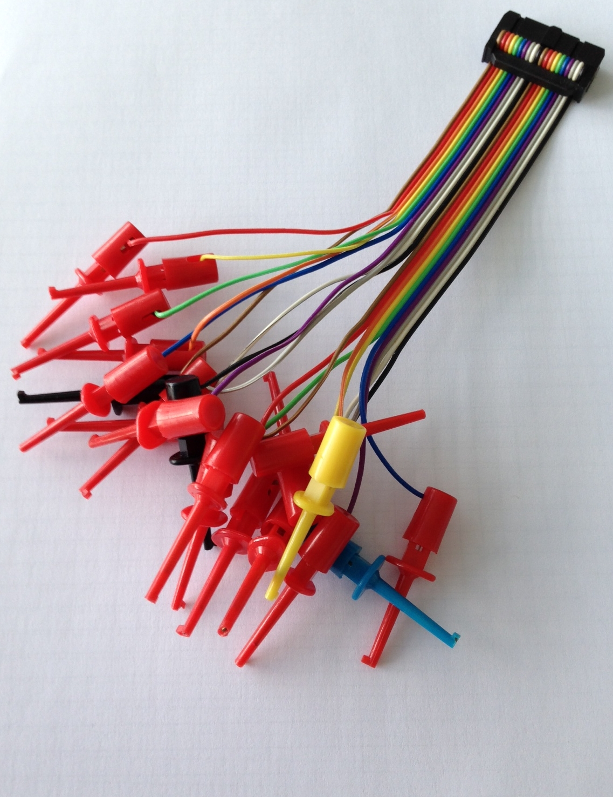
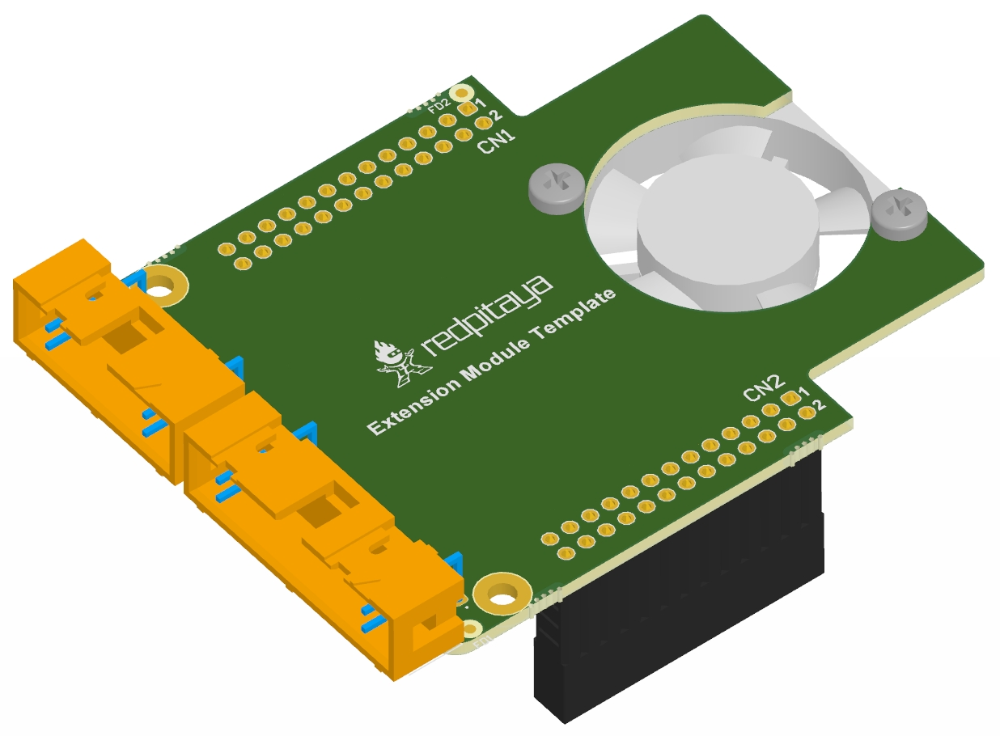

=========================
Extension module template
=========================

Red Pitaya software and hardware modules enabling the access to and control of auxiliary digital and analog signals

**Preliminary design specifications:**
    - 16 bidirectional digital I/O lines with individual direction control and 3-state outputs for flexible digital signal acquisition and generation
    - Up to 420 Mbps (voltage level dependent)
    - 16 k samples buffer
    - Advanced triggering schemes for sequence acquisition
    - Integrated level translator functionality for 1.2 V, 1.5V, 1.8V, 2.5V, 3.3V, 5V
    - FPGA ESD protection
    - Additional analog signal filtering
    - General purpose 7 segment numerical display and switches (main purpose: reference voltage setting)
    - Protocol analyser functionality: (to be defined)
    - Integration into Graphical User Interface
    - 4 input and 4 output analogue lines – extension of the analogue pins from Red Pitaya to the extension module

.. figure:: Render.jpg   

Figure: Proposal for hardware extension module template.

Figure: Connectivity option – 20 pins.

.. figure:: Schematics.png

Figure: Possible implementation of some functionality (`preliminary version <http://downloads.redpitaya.com/doc/Extension/Schematic_GPIO16_A_InformativeOnly.pdf>`_). 

Figure: Option - forced air flow.

External links:

  - `PDF 3D model <http://downloads.redpitaya.com/doc/Extension/RPEM_Template1_3Dmodel.pdf>`_
  - `3D STEP model <http://downloads.redpitaya.com/doc/Extension/RPEM_Template1_A_3D.step>`_
  - `Red Pitaya Extension Module Dimensions <http://downloads.redpitaya.com/doc/Extension/RPEM_Template1_Dimensions.pdf>`_
  - `PCB 3D image <http://downloads.redpitaya.com/doc/Extension/RPEM_Template1_Pcb3D.jpg>`_
  - `PCB 3D image top <http://downloads.redpitaya.com/doc/Extension/RPEM_Template1_PcbTop.jpg>`_
  - `GPIO16_A_Informative Schematic diagram <http://downloads.redpitaya.com/doc/Extension/Schematic_GPIO16_A_InformativeOnly.pdf>`_
  - `PCB option - forced air flow 3d image <http://downloads.redpitaya.com/doc/Extension/RPEM_Template2_Pcb3D.jpg>`_
  - `3D STEP option - forced air flow - model <http://downloads.redpitaya.com/doc/Extension/RPEM_Template2_A_3D.step>`_
  - `Altium project <http://downloads.redpitaya.com/doc/Extension/RPEM_Template.zip>`_