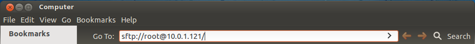
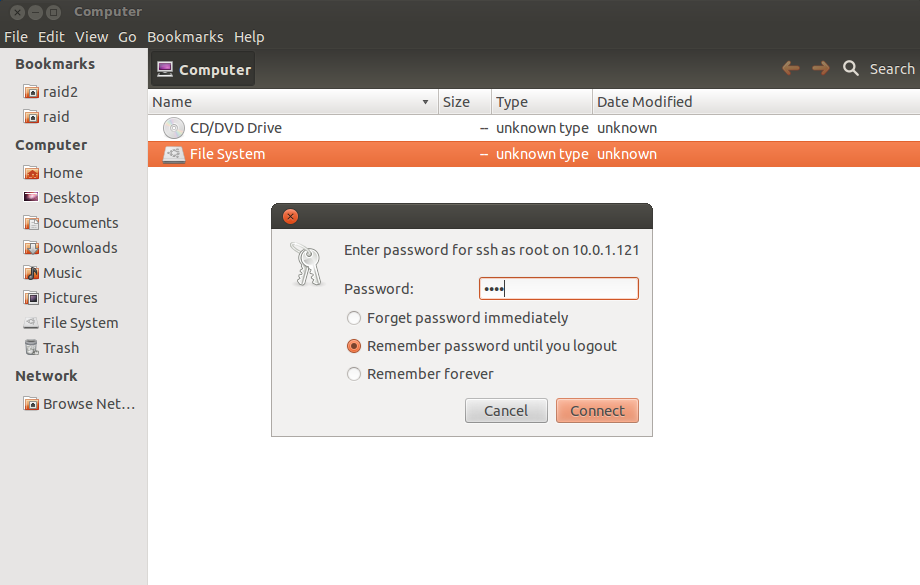
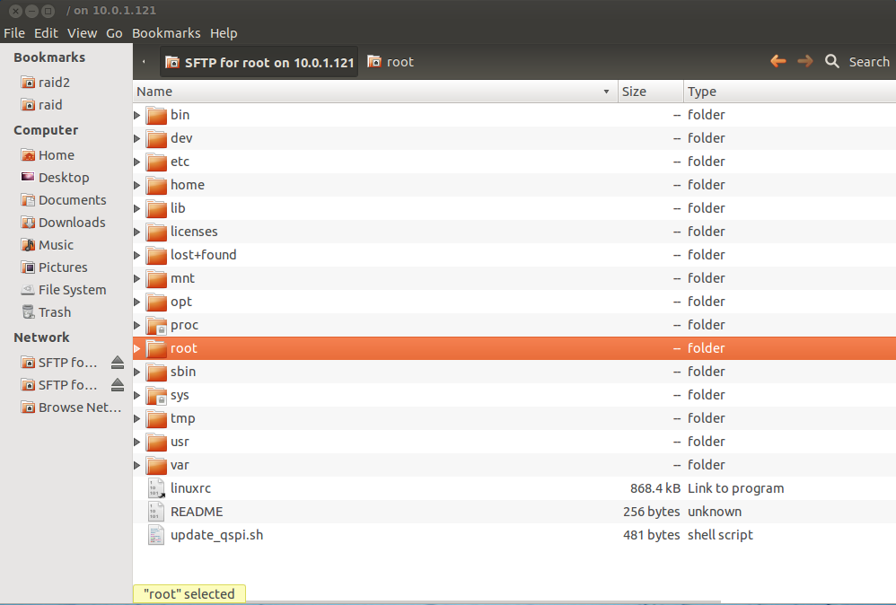
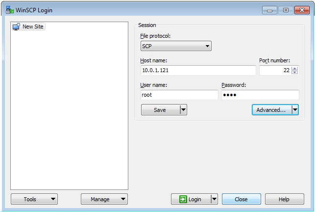
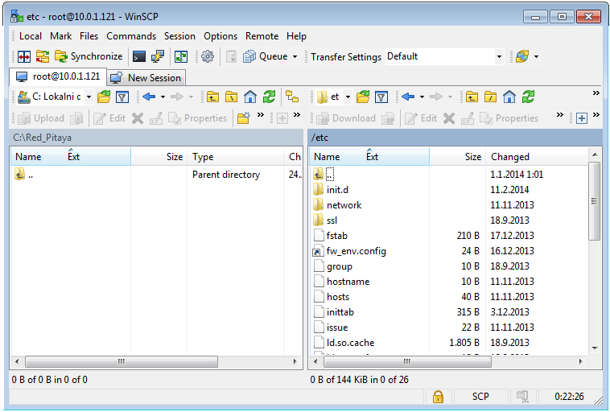
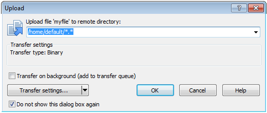

.. _clu:

######################
Command line utilities
######################

*********************************
Red Pitaya command line utilities
*********************************

.. Note::
   
   Command line utilities must not be used in parallel with a WEB application.

.. contents::
    :local:
    :backlinks: none
    :depth: 1   
    
========================
Signal generator utility
========================

The Red Pitaya signal generator can be controlled through the
`generate <https://github.com/RedPitaya/RedPitaya/tree/master/Test/generate>`_ command line utility, but be aware it
interferes with the GUI based Oscilloscope & Generator application. Usage instructions (see Table 7 as well):
 
.. code-block:: shell-session
    
   redpitaya> generate
    generate version 0.90-299-1278

    Usage: generate   channel amplitude frequency <type>

        channel     Channel to generate signal on [1, 2].
        amplitude   Peak-to-peak signal amplitude in Vpp [0.0 - 2.0].
        frequency   Signal frequency in Hz [0.0 - 6.2e+07].
        type        Signal type [sine, sqr, tri].

+-------------+----------+------------------------------+----------------------------------------------------------------+
| Parameters of Signal   generator utility                                                                               |
+-------------+----------+------------------------------+----------------------------------------------------------------+
| **Name**    | **Type** | **Range**                    | **Description**                                                |
+-------------+----------+------------------------------+----------------------------------------------------------------+
| channel     | int      | 1/ 2                         | Output channel selection                                       |
+-------------+----------+------------------------------+----------------------------------------------------------------+
| amplitude   | float    | 0 - 2 [V]                    | Maximal output signal is 2 V peak to peak                      |
+-------------+----------+------------------------------+----------------------------------------------------------------+
| freq        | float    | 0 - 62000000\ :sup:`1`  [Hz] | Frequency can be generated from 0 Hz (DC signal) on*.          |
+-------------+----------+------------------------------+----------------------------------------------------------------+
| <type>      | string   | sine / sqr / tri             | Optional parameter. Signal shape type (sine – sine wave signal,|
|             |          |                              | sqr – square signal, tri – triangular signal). If omitted, sine|
|             |          |                              | is used.                                                       |
+-------------+----------+------------------------------+----------------------------------------------------------------+

\ :sup:`1`  To generate smooth signals, not exceeding Back-End bandwidth, limitations are:
   - 62 MHz (62000000) for sine wave
   - 10 MHz (10000000) for square and triangular waves
   
The output can be disabled by setting the amplitude parameter to zero.

Example (2 Vpp square wave signal with 1 MHz on channel 1):
 
.. code-block:: shell-session
    
   redpitaya> generate 1 2 1000000 sqr

.. note::
    Signal generator output impedance is 50 Ω. If user wants to connect the output of the signal generator 
    (OUT1, OUT2) to the Red Pitaya input (IN1, IN2), 50 Ω terminations should be connected at the Red Pitaya inputs 
    through the T-type connector.
    
==========================
Signal acquisition utility
==========================

If acquire command is not working, it has to be compiled:
.. code-block:: shell-session
    cd /root/RedPitaya/Test/acquire
    make
    ./acquire

The signal from Red Pitaya can be acquired through the `acquire <https://github.com/RedPitaya/RedPitaya/tree/master/Test/acquire>`_
command line utility. It will return raw samples from the ADC buffer to standard output, with no calibration
compensation. Usage instructions (see Table 8 as well):

 
.. code-block:: shell-session
    
   redpitaya> acquire 
   acquire version 0.90-299-1278

   Usage: acquire  size <dec>

       size     Number of samples to acquire [0 - 16384].
       dec      Decimation [1,8,64,1024,8192,65536] (default=1).
        
        
+----------+----------+-----------------------------+------------------------------------------------------------+
| Parameters of Signal acquisition utility                                                                       |
+----------+----------+-----------------------------+------------------------------------------------------------+
| **Name** | **Type** | **Range**                   | **Description**                                            |
+----------+----------+-----------------------------+------------------------------------------------------------+
| size     | int      | 0 - 16384                   | The number of samples to read.                             |
+----------+----------+-----------------------------+------------------------------------------------------------+
| dec      | int      | 1, 8, 64, 1024, 8192, 16384 | Optional parameter. It specifies the decimation factor. If |
|          |          |                             | omitted, 1 is used (no decimation).                        |
+----------+----------+-----------------------------+------------------------------------------------------------+

Acquire utility will return the requested number of samples with decimation factor for both input channels (column 1 =
Channel1; column 2 = Channel2).

Example (acquire 1024 samples with decimation 8):

 
.. code-block:: shell-session
    
   redpitaya> acquire 1024 8
    -148     -81
    -143     -84
    -139     -88
    -134     -82
    ...
 
===================
Saving data buffers
===================

It is recommended to use an NFS share to store any temporary data (e.g. the measured signals using the acquire
utility). Use a standard mount command to mount your NFS share (example):
 
.. code-block:: shell-session
    
   redpitaya> mount -o nolock <ip_address>:/<path>  /mnt

The /opt file-system on Red Pitaya, representing the SD card, is mounted read-only. To save the data locally on Red 
Pitaya redirect the acquisition to a file in the /tmp directory. The /tmp directory resides in RAM and is therefore 
volatile (clears on reboot).
 
.. code-block:: shell-session
    
   redpitaya> acquire 1024 8 > /tmp/my_local_file

Alternatively, save the data directly to the NFS mount point:
 
.. code-block:: shell-session
    
   redpitaya> acquire 1024 8 > /mnt/my_remote_file

--------------------------
Copying data - Linux users
--------------------------

In case NFS share is not available, you can use secure copy:
 
.. code-block:: shell-session
    
   redpitaya> scp my_local_file <user>@<destination_ip>:/<path_to_directory>/

Alternatively Linux users can use graphical SCP/SFTP clients, such as Nautilus for example (explorer window). To 
access the address line, type [CTRL + L] and type in the following URL: sftp://root@<ip_address>

    
    Figure: Nautilus URL/address bar.
    
Type the Red Pitaya password (next Figure). The default Red Pitaya password for the root account is »root«. For 
changing the root password, refer to buildroot configuration - a mechanism for building the Red Pitaya root 
file-system, including the /etc/passwd file hosing the root password.

After logging in, the main screen will show the directory content of Red Pitaya’s root filesystem. Navigate to select your stored data and use the intuitive copy-paste and drag & drop principles to manipulate the files on Red Pitaya (see next Figure).

----------------------------
Copying data - Windows users
----------------------------

Windows users should use an SCP client such as `WinSCP <http://winscp.net/download/winscp518setup.exe>`_. Download and
install it, following its installation instructions. To log in to Red Pitaya, see example screen in next Figure.

    Figure: WinSCP login screen.

After logging in, the main screen will show the content of the Red Pitaya root filesystem. Navigate to select your
stored data and use the intuitive copy-paste and drag & drop principles to manipulate the files on Red Pitaya (see 
next Figure).

    Figure: Directory content on Red Pitaya.

Select the destination (local) directory to save the data file to (see next Figure).

    Figure: Select file copy destination.

==========================
Accessing system registers
==========================

The system registers can be accessed through the 
`monitor <https://github.com/RedPitaya/RedPitaya/tree/master/Test/monitor>`_ utility. Usage instructions:
 
.. code-block:: shell-session
    
    redpitaya> monitor 
    monitor version 0.90-299-1278

    Usage:
        read addr: address
        write addr: address value
        read analog mixed signals: -ams
        set slow DAC: -sdac AO0 AO1 AO2 AO3 [V]
        
Example (system register reading):
 
.. code-block:: shell-session
    
    redpitaya> monitor -ams 
    #ID                                                                    Desc                                                                                                                                        Raw                                                                    Val
    0                                                                    Temp(0C-85C)                                                                    a4f                                                                    51.634
    1                                                                    AI0(0-3.5V)                                                                    1                                                                    0.002
    2                                                                    AI1(0-3.5V)                                                                    13                                                                    0.033
    3                                                                    AI2(0-3.5V)                                                                    1                                                                    0.002
    4                                                                    AI3(0-3.5V)                                                                    2                                                                    0.003
    5                                                                    AI4(5V0)                                                                    669                                                                    4.898
    6                                                                    VCCPINT(1V0)                                                                    55c                                                                    1.005
    7                                                                    VCCPAUX(1V8)                                                                    9a9                                                                    1.812
    8                                                                    VCCBRAM(1V0)                                                                    55d                                                                    1.006
    9                                                                    VCCINT(1V0)                                                                    55b                                                                    1.004
    10                                                                    VCCAUX(1V8)                                                                    9ab                                                                    1.813
    11                                                                    VCCDDR(1V5)                                                                    809                                                                    1.507
    12                                                                    AO0(0-1.8V)                                                                    2b0000                                                                    0.496
    13                                                                    AO1(0-1.8V)                                                                    150000                                                                    0.242
    14                                                                    AO2(0-1.8V)                                                                    2b0000                                                                    0.496
    15                                                                    AO3(0-1.8V)                                                                    220000                                                                    0.392

The –ams switch provides access to analog mixed signals including Zynq SoC temperature, auxiliary analog input reading, power supply voltages and configured auxiliary analog output settings. The auxiliary analog outputs can be set through the monitor utility using the –sadc switch:
 
.. code-block:: shell-session
    
   redpitaya> monitor -sdac 0.9 0.8 0.7 0.6

============================================
Monitor utility for accessing FPGA registers
============================================

Red Pitaya signal processing is based on two computational engines: the FPGA and the dual core processor in order to
effectively split the tasks. Most of the high data rate signal processing is implemented within the FPGA building 
blocks. These blocks can be configured parametrically through registers. The FPGA registers are documented in the 
`RedPitaya HDL memory map <https://github.com/RedPitaya/RedPitaya/blob/master/FPGA/release1/doc/RedPitaya_HDL_memory_map.odt?raw=true>`_
document. The registers can be accessed using the described monitor utility. For example, the following sequence of
monitor commands checks, modifies and verifies the acquisition decimation parameter (at address 0x40100014):
 
.. code-block:: shell-session
    
    redpitaya> monitor 0x40100014 
    0x00000001
    redpitaya> 
    redpitaya> monitor 0x40100014 0x8
    redpitaya> monitor 0x40100014 
    0x00000008
    redpitaya>
    
.. note:: 
    
    The CPU algorithms communicate with FPGA through these registers. Therefore, the user should be aware of a 
    possible interference with Red Pitaya applications, reading or acting upon these same FPGA registers. For simple 
    tasks, however, the monitor utility can be used by high level scripts (Bash, Python, Matlab...) to communicate
    directly with FPGA if necessary.
    
