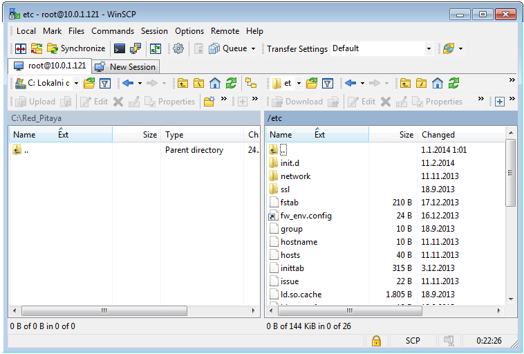

===================
Saving data buffers
===================

It is recommended to use an NFS share to store any temporary data (e.g. the measured signals using the acquire
utility). Use a standard mount command to mount your NFS share (example):
 
.. code-block:: shell-session
    
   redpitaya> mount -o nolock <ip_address>:/<path>  /mnt

The /opt file-system on Red Pitaya, representing the SD card, is mounted read-only. To save the data locally on Red 
Pitaya redirect the acquisition to a file in the /tmp directory. The /tmp directory resides in RAM and is therefore 
volatile (clears on reboot).
 
.. code-block:: shell-session
    
   redpitaya> acquire 1024 8 > /tmp/my_local_file

Alternatively, save the data directly to the NFS mount point:
 
.. code-block:: shell-session
    
   redpitaya> acquire 1024 8 > /mnt/my_remote_file

--------------------------
Copying data - Linux users
--------------------------

In case NFS share is not available, you can use secure copy:
 
.. code-block:: shell-session
    
   redpitaya> scp my_local_file <user>@<destination_ip>:/<path_to_directory>/

Alternatively Linux users can use graphical SCP/SFTP clients, such as Nautilus for example (explorer window). To 
access the address line, type [CTRL + L] and type in the following URL: sftp://root@<ip_address>

.. figure:: Nautilus_address_bar.png
    
    Figure: Nautilus URL/address bar.
    
Type the Red Pitaya password (next Figure). The default Red Pitaya password for the root account is »root«. For 
changing the root password, refer to buildroot configuration - a mechanism for building the Red Pitaya root 
file-system, including the /etc/passwd file hosing the root password.

.. image:: Nautilus_password_window.png

After logging in, the main screen will show the directory content of Red Pitaya’s root filesystem. Navigate to select your stored data and use the intuitive copy-paste and drag & drop principles to manipulate the files on Red Pitaya (see next Figure).

.. image:: Nautilus_root_fs.png

----------------------------
Copying data - Windows users
----------------------------

Windows users should use an SCP client such as `WinSCP <http://winscp.net/download/winscp518setup.exe>`_. Download and
install it, following its installation instructions. To log in to Red Pitaya, see example screen in next Figure.

.. figure:: WinSCP_login_screen.png

    Figure: WinSCP login screen.

After logging in, the main screen will show the content of the Red Pitaya root filesystem. Navigate to select your
stored data and use the intuitive copy-paste and drag & drop principles to manipulate the files on Red Pitaya (see 
next Figure).

    Figure: Directory content on Red Pitaya.

Select the destination (local) directory to save the data file to (see next Figure).

.. figure::  WinSCP_filesave.png

    Figure: Select file copy destination.