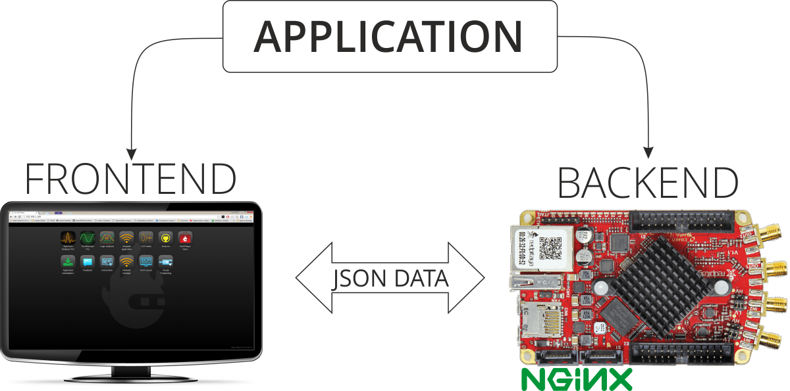
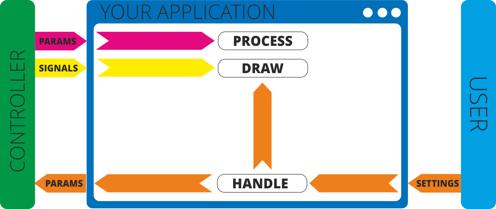

###############
System overview
###############

Almost all applications on Red Pitaya are made of two parts. We call them frontend and backend. You can see them on 
the picture below.

Everything that works in your browser and you can see it this is the frontend. This is the part that can visualise 
data on screen or change some parameters to adjust settings inside your applications. Other things that are connected
with hardware on Red Pitaya's board are calles backend. You can't see this application directly but this is the most 
important part of application which can help you to control hardware. Backend has ability to work with Digital PINS, 
control LEDs on board, load FPGA image, work with fast inputs and outputs and lots of other things.
Frontend and backend requires communication within each other. This is mostly done with Red Pitaya network APIs which 
are technically based on extended websocket connection. When you're writing your application you don't need to think 
about communication and data transfer. Our network APIs take care about data transfer. All you need is simply follow 
of some rules. You can read about this rules in How to 
:ref:`add a button to control LED <ABCLED>`.

********
Frontend
********

Frontend is that thing that you can see on your screen. We prefer to use high technologies for creating modern way 
looking applications with lots of possibilities. It's HTML5 for layout, CSS3 for element styles and JavaScript for
creating fast and reliable web applications. Using all these tools you can create lots of innovative applications.

Basic idea of frontend is to visualize data from Red Pitaya. And this should be it! You don't need to do lots of 
calculations inside UI. Let your Red Pitaya do this. So here is typical workflow of application:

    - User chanegs some settings in application in Web UI
    - Web UI may apply them immediately on the screen or
    - Web UI may send them to controller for some specific calculations on device, for changing device state or for 
      something else
    - Controller (= Backend) applies them to internal variabale and change device state (if necessary)
    - Controller does some calculation according algorithms and as result it can return
        - Change of some parameters
        - New signals
    - Controller sends parameters and signals to WebUI in JSON format
    - Web UI recieves these parameters signals and then applies them on the screen
    
*******
Backend
*******

In general backend is your Red Pitaya. But when we're talking about your application backend is controller of your
application. Controller is shared linux library with .so extension. It operates with specific memebers which are 
called Parameters and Signals. First of them are needed for handling state of important variables of your app. 
Another one are needed for collecting number of data inside one container. You can use lots of them at the same time. 
None of them are necessary, so if you don't need singlas in your application you may not use them.

  .. image:: Backend.png
  
System base on Nginx as fast platform for Web applications. Nginx allows us to load modules in runtime without 
restarting system.

Here is typical workflow of executing application:

    - Nginx always works as web server for providing Web UI.
    - When you click on your application in main menu Nginx will proceed with this steps:
        - It opens your application user interface
        - It loads specified FPGA image using APIs. If there was not any image specified it leaves current image. Make sure that you're using correct image when you're developing your own application
        - It loads controller of your application
        - When controller is loaded it starts WebSocket connection. Also it notifies UI that application was loaded. This means that JavaScript code can establish WebSocket connection
        - During application workflow JavaScript and Controller can send data in JSON format to each other
        - If controller needs to get some data from perefireal devices it can request this data from RedPitaya APIs
        - APIs can manipulate data inside FPGA
