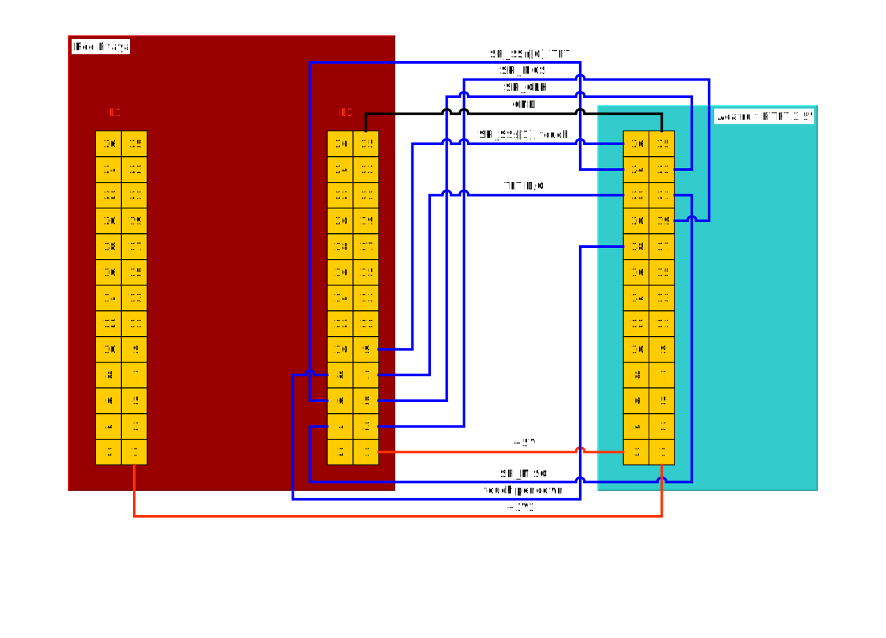

#######################################
Interfacing SPI TFT displays with touch
#######################################

This document describes how to connect a
SPI interface based TFT display with touch support
to the :ref:`E2 <E2>` connector, without the need for specific FPGA code.
The given setup has advantages and drawbacks.

**PROS:**

* It uses only ``MIO`` signals so it can be used with any FPGA image.
* Only extension connector :ref:`E2 <E2>` is used.
* SPI is not wired through the FPGA so maximum clock speeds can be used.

**CONS:**

* MIO signals shared with SPI, I2C and UART are consumed.
  So this interfaces can not be used for other purposes.
* On board I2C EEPROM cna not be accessed.
  This might cause issues in programs which store
  calibration data in the EEPROM.
* Backlight control is not supported.

**************
Hardware setup
**************

=======
pinctrl
=======

It is possible to reconfigure **Zynq** MIO signals using the ``pinctrl`` kernel driver.
This TFT display setup takes advantage of this by repurposing SPI, I2C and UART signals
on the :ref:`E2 <E2>` connector as SPI and GPIO signals which are required by the TFT display interface.

.. |tft-E2| replace:: ``tft-E2.dtsi``
.. _tft-E2: /fpga/dts/tft/tft-E2.dtsi

The reconfiguration is performed by including the |tft-E2|_ device tree.

+-----------------+-----+----------+--------+--------+----------+-----+-------------------+
| SPI TFT+touch   | MIO | function |    pin |  pin   | function | MIO | SPI TFT+touch     |
+=================+=====+==========+========+========+==========+=====+===================+
|                 |     | GND      | ``26`` | ``25`` | GND      |     | GND               |
+-----------------+-----+----------+--------+--------+----------+-----+-------------------+
|                 |     | ADC_CLK- | ``24`` | ``23`` | ADC_CLK+ |     |                   |
+-----------------+-----+----------+--------+--------+----------+-----+-------------------+
|                 |     | GND      | ``22`` | ``21`` | GND      |     |                   |
+-----------------+-----+----------+--------+--------+----------+-----+-------------------+
|                 |     | AO[3]    | ``20`` | ``19`` | AO[2]    |     |                   |
+-----------------+-----+----------+--------+--------+----------+-----+-------------------+
|                 |     | AO[1]    | ``18`` | ``17`` | AO[0]    |     |                   |
+-----------------+-----+----------+--------+--------+----------+-----+-------------------+
|                 |     | AI[3]    | ``16`` | ``15`` | AI[2]    |     |                   |
+-----------------+-----+----------+--------+--------+----------+-----+-------------------+
|                 |     | AI[1]    | ``14`` | ``13`` | AI[0]    |     |                   |
+-----------------+-----+----------+--------+--------+----------+-----+-------------------+
|                 |     | I2C_GND  | ``12`` | ``11`` | common   |     |                   |
+-----------------+-----+----------+--------+--------+----------+-----+-------------------+
| TFT RESETn      | 51  | I2C SDA  | ``10`` |  ``9`` | I2C_SCK  | 50  | SPI_SSs[1], touch |
+-----------------+-----+----------+--------+--------+----------+-----+-------------------+
| touch pendown   | 9   | UART_RX  |  ``8`` |  ``7`` | UART_TX  | 8   | TFT D/C           |
+-----------------+-----+----------+--------+--------+----------+-----+-------------------+
| SPI_SSn[0], TFT | 13  | SPI_CS   |  ``6`` |  ``5`` | SPI_CLK  | 12  | SPI_SCLK          |
+-----------------+-----+----------+--------+--------+----------+-----+-------------------+
| SPI_MISO        | 11  | SPI_MISO |  ``4`` |  ``3`` | SPI_MOSI | 10  | SPI_MOSI          |
+-----------------+-----+----------+--------+--------+----------+-----+-------------------+
|                 |     | -4V      |  ``2`` |  ``1`` | +5V      |     | +5V               |
+-----------------+-----+----------+--------+--------+----------+-----+-------------------+

Since some of the signals share the I2C bus which already contains an EEPROM,
there is a possibility there will be functional conflicts.
Although the probability of the I2C EEPROM going into an active state are low.
I2C devices only react after an I2C start condition is present on the bus.
The start condition requires both SDA and SCL signals to be low at the same time.
Here it is assumed TFT display RESETn (active low) will not be active
at the same time as the touch controller SPI SSn (active low) signal.

Attempts to access the I2C EEPROM will not interfere with the display,
but they will return a timeout.
This might (probably will) cause issues with applications
using the I2C EEPROM, for example calibration access from *Oscilloscope* app.

There is no MIO pin left for backlight control,
the easiest solution is to hard wire the display backlight pin to VCC.

===============
SPI clock speed
===============

Only a limited set of SPI clock speeds can be set depending on
the clock driving the SPI controller.
The SPI controller itself provides only power of 2 clock divider options.
See the `Zynq TRM <https://www.xilinx.com/support/documentation/user_guides/ug585-Zynq-7000-TRM.pdf>`_
(section *B.30 SPI Controller (SPI)* register ``BAUD_RATE_DIV``) for details.

The next table provides available frequencies for two SPI controller clock settings.
The maximum clock speed for this SPI controller is 50MHz.

+----------------------+------+------+------+------+-------+-------+-------+
| SPI controller clock | f/4  | f/8  | f/16 | f/32 | f/64  | f/128 | f/256 |
+======================+======+======+======+======+=======+=======+=======+
|             166.6MHz | 41.6 | 20.8 | 10.4 | 5.21 | 2.60  | 1.30  | 0.63  |
+----------------------+------+------+------+------+-------+-------+-------+
|             166.6MHz | 41.6 | 20.8 | 10.4 | 5.21 | 2.60  | 1.30  | 0.63  |
+----------------------+------+------+------+------+-------+-------+-------+
|             200.0MHz | 50.0 | 25.0 | 12.5 | 6.25 | 3.125 | 1.56  | 0.781 |
+----------------------+------+------+------+------+-------+-------+-------+

**************
Software setup
**************

.. |tft.sh| replace:: ``tft.sh``
.. _tft.sh: /OS/debian/tft.sh

Instructions for starting XFCE on the TFT display.
A script which can be used to generate an image with full support
is available on GitHub |tft.sh|_.

A set of Ubuntu/Debian packages should be installed:

.. code-block:: shell-session

   apt-get -y install \
     python3 python3-numpy build-essential libfftw3-dev python3-scipy \
     xfonts-base tightvncserver xfce4-panel xfce4-session xfwm4 xfdesktop4 \
     xfce4-terminal thunar gnome-icon-theme \
     xserver-xorg xinit xserver-xorg-video-fbdev

.. |99-fbdev.conf| replace:: ``/usr/share/X11/xorg.conf.d/99-fbdev.conf``
.. _99-fbdev.conf: /OS/debian/overlay/usr/share/X11/xorg.conf.d/99-fbdev.conf

An X11 configuration file should be added to the system |99-fbdev.conf|_:

.. literalinclude:: /OS/debian/overlay/etc/udev/rules.d/95-ads7846.rules

Over SSH start the X server:

.. code-block:: shell-session

   startx

************************
Tested/Supported devices
************************

The next table lists supported devices
and corresponding of device tree files
each supporting a set of displays depending on the used TFT and touch drivers.

+---------------+-------------------------------+-----------------------------------+-------------------------+
|               | specifications                | technical details                 | device tree             |
|               +------+------------+-----------+----------------+------------------+                         |
| screen name   | size | resolution | touch     | TFT controller | touch controller |                         |
+===============+======+============+===========+================+==================+=========================+
| |MI0283QT-2|_ | 2.8" | 240x320    |           | |ILI9341|_     | |ADS7846|_       | |tft-ili9341-ads7846|_  |
+---------------+------+------------+-----------+----------------+------------------+-------------------------+
| |PiTFT-35|_   | 3.5" | 480x320    | resistive | |HX8357D|_     | |STMPE610|_      | |tft-hx8357d-stmpe601|_ |
+---------------+------+------------+-----------+----------------+------------------+-------------------------+

========================
MI0283QT Adapter Rev 1.5
========================

.. |MI0283QT-2| replace:: MI0283QT Adapter Rev 1.5
.. _MI0283QT-2: https://github.com/watterott/MI0283QT-Adapter

.. |ILI9341| replace:: ILI9341
.. _ILI9341: https://cdn-shop.adafruit.com/datasheets/ILI9341.pdf

.. |ADS7846| replace:: ADS7846
.. _ADS7846: http://www.ti.com/lit/ds/symlink/ads7846.pdf

.. |tft-ili9341-ads7846| replace:: ``tft-ili9341-ads7846.dtsi``
.. _tft-ili9341-ads7846: /fpga/dts/tft/tft-ili9341-ads7846.dtsi

The device is powered by **+5V**,
and it generates 3.3V using an on board LDO.
Therefore all IO are 3.3V, so there are no conflicts.

Connector pinout based on the |MI0283QT-2|_
`schematic <https://github.com/watterott/MI0283QT-Adapter/blob/master/hardware/MI0283QT_v15.pdf>`_.

+-------------------+-----------+--------+--------+-----------+-------------------+
| SPI TFT+touch     |           |    pin |  pin   |           | SPI TFT+touch     |
+===================+===========+========+========+===========+===================+
|                   | ADS_VREF  | ``16`` | ``15`` | ADS_VBAT  |                   |
+-------------------+-----------+--------+--------+-----------+-------------------+
|                   | ADS_AUX   | ``14`` | ``13`` | ADS_IRQ   | touch pendown     |
+-------------------+-----------+--------+--------+-----------+-------------------+
| TFT D/C           | BUSY-RS   | ``12`` | ``11`` | A-ADS_CS  | SPI_SSs[1], touch |
+-------------------+-----------+--------+--------+-----------+-------------------+
| SPI_SCLK          | A-SCL     | ``10`` |  ``9`` | SDO       | SPI_MISO          |
+-------------------+-----------+--------+--------+-----------+-------------------+
| SPI_MOSI          | A-SDI     |  ``8`` |  ``7`` | A-LCD_CS  | SPI_SSn[0], TFT   |
+-------------------+-----------+--------+--------+-----------+-------------------+
| TFT RESETn        | A-LCD_RST |  ``6`` |  ``5`` | LCD_LED   | backlight         |
+-------------------+-----------+--------+--------+-----------+-------------------+
| +5V               | VCC       |  ``4`` |  ``3`` | VCC       |                   |
+-------------------+-----------+--------+--------+-----------+-------------------+
| GND               | GND       |  ``2`` |  ``1`` | GND       |                   |
+-------------------+-----------+--------+--------+-----------+-------------------+

Backlight control is not available on the :ref:`E2 <E2>` connector.
A simple solution is to connect the **LCD_LED** signal
to +5V VCC, this can be done with a simple jumper
between the two display connector pins.
Otherwise it would be possible to repurpose a LED on Red Pitaya.

.. |95-ads7846.rules| replace:: ``/etc/udev/rules.d/95-ads7846.rules``
.. _95-ads7846.rules: /OS/debian/overlay/etc/udev/rules.d/95-ads7846.rules

The |95-ads7846.rules|_ UDEV rule will create a symbolik link ``/dev/input/touchscreen``.

.. literalinclude:: /OS/debian/overlay/etc/udev/rules.d/95-ads7846.rules

===================
Adafruit PiTFT 3.5"
===================

.. |PiTFT-35| replace:: Adafruit PiTFT 3.5" Touch Screen for Raspberry Pi
.. _PiTFT-35: https://learn.adafruit.com/adafruit-pitft-3-dot-5-touch-screen-for-raspberry-pi

.. |PiTFTa-35| replace:: PiTFT - Assembled 480x320 3.5" TFT+Touchscreen for Raspberry Pi
.. _PiTFTa-35: https://www.adafruit.com/product/2097
.. _PiTFTa-35-img: https://cdn-learn.adafruit.com/assets/assets/000/019/744/original/adafruit_products_2097_quarter_ORIG.jpg

.. |PiTFTp-35| replace:: PiTFT Plus 480x320 3.5" TFT+Touchscreen for Raspberry Pi
.. _PiTFTp-35: https://www.adafruit.com/product/2441
.. _PiTFTp-35-img: https://cdn-shop.adafruit.com/970x728/2441-11.jpg

.. |HX8357D| replace:: HX8357D
.. _HX8357D: https://cdn-shop.adafruit.com/datasheets/HX8357-D_DS_April2012.pdf

.. |STMPE610| replace:: STMPE610
.. _STMPE610: https://cdn-shop.adafruit.com/datasheets/STMPE610.pdf

.. |tft-hx8357d-stmpe601| replace:: ``tft-hx8357d-stmpe601.dtsi``
.. _tft-hx8357d-stmpe601: /fpga/dts/tft/tft-hx8357d-stmpe601.dtsi

There are two versions of this display the older **Assembled**
(sometimes called **Original** and the newer **Plus**.

* |PiTFTa-35|_ (`high resolution image <PiTFTa-35-img_>`_)
* |PiTFTp-35|_ (`high resolution image <PiTFTp-35-img_>`_)

While the newer **Plus** version can be used out of the box,
The older **Assembled** requires hardware modifications,
for details `see below <assembled_hw_mods>`.

The device is powered by **+5V** (for backlight LED)
and **+3.3V** for TFT and touch controllers
(should be taken from the E1 connector on Red Pitaya).
Therefore all IO are 3.3V, so there are no conflicts.

Male connector pinout based on the |PiTFT-35|_
`schematic <https://cdn-learn.adafruit.com/assets/assets/000/019/763/original/adafruit_products_schem.png?1411058465>`__.

+-------------------+--------+--------+-------------------+
| SPI TFT+touch     |    pin |  pin   | SPI TFT+touch     |
+===================+========+========+===================+
| SPI_SSs[1], touch | ``26`` | ``25`` | GND               |
+-------------------+--------+--------+-------------------+
| SPI_SSn[0], TFT   | ``24`` | ``23`` | SPI_SCLK          |
+-------------------+--------+--------+-------------------+
| TFT D/C           | ``22`` | ``21`` | SPI_MISO          |
+-------------------+--------+--------+-------------------+
| GND               | ``20`` | ``19`` | SPI_MOSI          |
+-------------------+--------+--------+-------------------+
| touch pendown     | ``18`` | ``17`` |                   |
+-------------------+--------+--------+-------------------+
|                   | ``16`` | ``15`` |                   |
+-------------------+--------+--------+-------------------+
| GND               | ``14`` | ``13`` |                   |
+-------------------+--------+--------+-------------------+
|                   | ``12`` | ``11`` |                   |
+-------------------+--------+--------+-------------------+
|                   | ``10`` |  ``9`` | GND               |
+-------------------+--------+--------+-------------------+
|                   |  ``8`` |  ``7`` |                   |
+-------------------+--------+--------+-------------------+
| GND               |  ``6`` |  ``5`` |                   |
+-------------------+--------+--------+-------------------+
|                   |  ``4`` |  ``3`` |                   |
+-------------------+--------+--------+-------------------+
| +5V               |  ``2`` |  ``1`` | +3.3V             |
+-------------------+--------+--------+-------------------+

.. |95-stmpe.rules| replace:: ``/etc/udev/rules.d/95-stmpe.rules``
.. _95-stmpe.rules: /OS/debian/overlay/etc/udev/rules.d/95-stmpe.rules

The |95-stmpe.rules|_ UDEV rule will create a symbolic link ``/dev/input/touchscreen``.

.. literalinclude:: /OS/debian/overlay/etc/udev/rules.d/95-stmpe.rules

.. |99-calibration.conf| replace:: ``/etc/X11/xorg.conf.d/99-calibration.conf``
.. _99-calibration.conf: /OS/debian/overlay/etc/X11/xorg.conf.d/99-calibration.conf

A calibration file should be added to the system |99-calibration.conf|_:

.. literalinclude:: ../OS/debian/overlay/usr/share/X11/xorg.conf.d/99-fbdev.conf

-------------
Block diagram
-------------

    Graphical representation of how to connect Red Pitayas :ref:`E2 <E2>` connetor to the Adafruit PiTFT 3.5".

    Simplified graphical representation of Red Pitayas :ref:`E2 <E2>` connetor to the Adafruit PiTFT 3.5". For pin
    locations please look at the top picture.

.. _assembled_hw_mods:

----------------------------------------
Assembled version hardware modifications
----------------------------------------

~~~~~~~~~~~
Explanation
~~~~~~~~~~~

The device is powered by a single **+5V** supply,
and it generates 3.3V using an on board LDO.
So 3.3V interfaces between Red Pitaya and the display
have a different power source on each side.
Since the two power sources do not wake up at the same time
there is a race condition affecting touch controller
SPI interface configuration during power-up reset.
The LDO on the TFT board is faster then the switcher on Red Pitaya.

The |STMPE610|_ touch controller datasheet (section 5.2)
describes how CPOL/CPHA SPI configuration options depend
on the power up reset state of a pair configuration pins.

+------------------------------+------+---------------------------------+------+
| CPOL_N (I2C data/SPI CS pin) | CPOL | CPHA (I2C address/SPI MISO pin) | Mode |
+==============================+======+=================================+======+
| 1                            | 0    | 0                               | 0    |
+------------------------------+------+---------------------------------+------+
| 1                            | 0    | 1                               | 1    |
+------------------------------+------+---------------------------------+------+
| 0                            | 1    | 0                               | 2    |
+------------------------------+------+---------------------------------+------+
| 0                            | 1    | 1                               | 3    |
+------------------------------+------+---------------------------------+------+

On the original setup (before ``pinctrl`` device tree is applied)
for the E2 connector the touch chip SPI CS signal is used as I2C_SCK.
The SPI MISO pin is not affected by ``pinctrl`` changes.

There appears to be a race condition between:

1. the configuration read event timed by the STMPE610 power
   coming directly from the +3.3V LDO (5V USB power connector)
2. and waking up of the 3.3V power supply on Red Pitaya,
   which powers the pull up resistors on the I2C pins
   and FPGA pull-ups for the SPI MISO pin on the E2 connector

In most cases the LDO on the TFT board would wake
before the switcher on Red Pitaya, so the ``CPOL_N``
would be detected as ``0``, which inverts the SPI clock polarity.
As an unreliable fix, the ``spi-cpol`` attribute can be provided
in the `device tree </fpga/dts/tft/tft-hx8357d-stmpe601.dtsi#L31>`_.

.. note::

   It is not yet confirmed the power supply race condition is responsible
   for touch not working in certain setups, more testing might be necessary.

The provided oscilloscope image shows a 3.3V power up sequence
and its relation to SPI configuration signals.
It is evident configuration signals are stable.

Channels:

1. `CPHA` (the signal is low during power-up),
2. `CPOL_N` (the signal is linked to 3.3V with a pull-up and rising simultaneously),
3. 3.3V (it takes about 1.5ms to ramp up from 0V to 3.3V).

.. figure:: img/POR_SPI_config.png

~~~~~~~~~~~~~
Modifications
~~~~~~~~~~~~~

To avoid the power supply race condition,
the LDO on the **Assembled** TFT board can be disabled,
and instead +3.3V from Red Pitaya is used.
This makes the **Assembled** power supply similar to the **Plus** version.

The next modifications have to be done:

1. Remove the +3.3V LDO, or at least rise the power output pin off the board.
2. Connect pin 1 on the JP1 connector to a +3.3V power line.

The next image shows a TFT board with a rised LDO power output
and pin 1 on the JP1 connector connected to an unmounted resistor pad.

*************************
Debugging/Troubleshooting
*************************

================================
``pinctrl``, GPIO and interrupts
================================

To see current ``pinctrl`` settings try:

.. code-block:: shell-session

   $ cat /sys/kernel/debug/pinctrl/pinctrl-maps

To see the status of GPIO signals try:

.. code-block:: shell-session

   $ cat /sys/kernel/debug/gpio

To see the status of interrupts try:

.. code-block:: shell-session

   $ cat /proc/interrupts

=====
Touch
=====

``evtest`` can be used to see low level touch events (and keyboard/mouse):

.. code-block:: shell-session

   sudo apt-get install -y evtest
