###############
Prepare SD card
###############

1. Download the `Red Pitaya SD card image <http://downloads.redpitaya.com/downloads/red_pitaya_OS-stable.img.zip>`_.

   http://downloads.redpitaya.com/downloads/red_pitaya_OS-stable.img.zip
    
   .. image:: microSDcard-RP.png
      :width: 10%

   .. note::

      You can find older Red Pitaya OS images and Ecosystem zipfiles
      on our `download server <http://downloads.redpitaya.com/downloads/>`_.

      http://downloads.redpitaya.com/downloads/

   TODO: should the next two lines be removed?
   - FAQ: `Where can I find more about Red Pitaya OS releases? <http://blog.redpitaya.com/faq-page/#Software|32740>`_
   - FAQ: `Where can I find old Red Pitaya OS & application relases? <http://blog.redpitaya.com/faq-page/#Software|25467>`_
    
2. Unzip the SD card image.

3. Write the image onto a SD card. Instructions are available for various operating systems:

   * :ref:`Windows <windows>` (GUI),
   * :ref:`Linux <linux>` (:ref:`GUI <linux_gui>`/:ref:`CLI <linux_cli>`),
   * :ref:`macOS <macos>` (:ref:`GUI <macos_gui>`/:ref:`CLI <macos_cli>`).

   This instructions are based on similar instructions for
   `Raspberry Pi <https://www.raspberrypi.org/documentation/installation/installing-images/>`_.

4. Insert the SD card into Red Pitaya.

   .. image:: pitaya-quick-start-insert-sd-card.png

.. _windows:

*******
Windows
*******

1. Insert SD card into your PC or SD card reader.

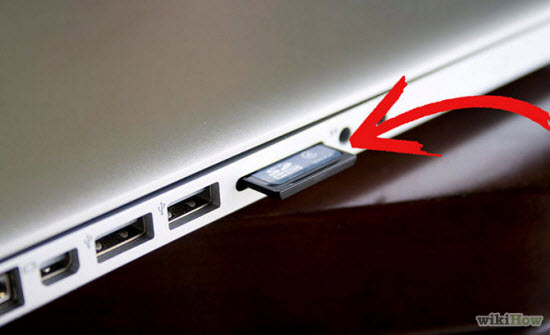

2. Download `Win32 Disk Imager <https://sourceforge.net/projects/win32diskimager/>`_ and extract it.

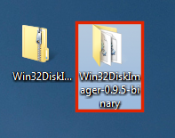

3. Open unzipped folder, right-click on the ``WinDisk32Imager``, and select **Run as Administrator**.

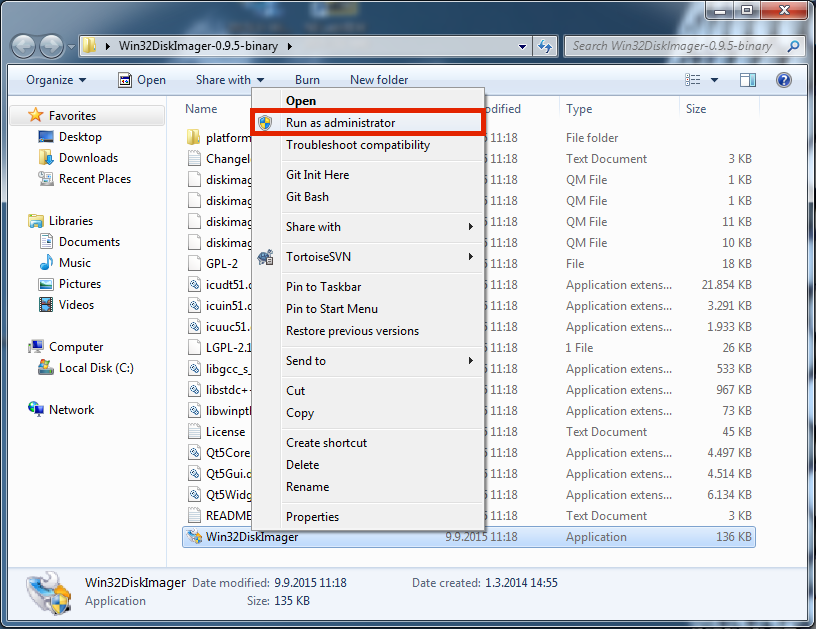

4. Under image file box select unzipped Red Pitaya image file.

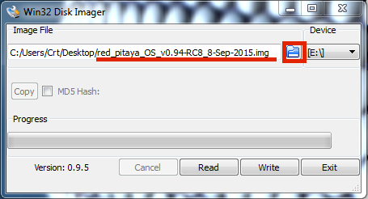

5. Under device box select the drive letter of the SD card.

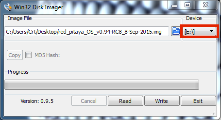

.. note::

   Be careful to select the correct drive; if you choose the wrong one you risk erasing data from the 
   computer's hard disk! You can easily see the drive letter (for example E:) by looking in the left column 
   of Windows Explorer.

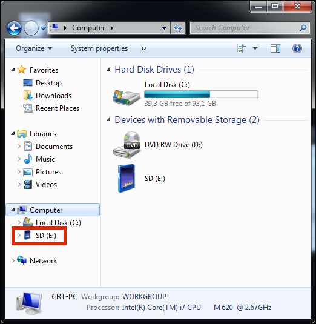

6. Click Write and wait for the write to complete.

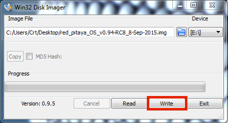

7. Exit the Imager.

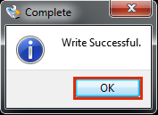

.. _linux:

*****
Linux
*****

.. _linux_gui:

=========================
Ubuntu using Image Writer
=========================

1. Right click on the extracted SD card image and select **Open With > Disk Image Writer**.

2. In the **Restore Disk Image** window select your SD card in the **Destination** pull down menu.
   Be carefull to select the correct device, use the size for orientation (for example 4GB SD card).

3. You will be asked to confirm your choice and enter a password.
   Additiona dialog windows will again show the selected destination drive,
   take the oportunity to think again if you choose the right device.

.. _linux_cli:

============
Command line
============

.. note::
   Please note that the use of the ``dd`` tool can overwrite any partition of your machine.
   If you specify the wrong device in the instructions below, you could delete your primary Linux partition.
   Please be careful.

1. Insert SD card into your PC or SD card reader.

3. Open the Terminal and check the available disks with ``df -h``.
   Our SD card is 4GB, it is named ``/dev/sdx`` and
   divided into two partitions ``/dev/sdx1`` and ``/dev/sdx2``.
   The drive mounted at ``/`` is your main drive,
   be carefull not to use it.

.. code-block:: shell-session

   $ df -h
   Filesystem      Size  Used Avail Use% Mounted on
   /dev/sdx1       118M   27M   92M  23% /media/somebody/CAD5-1E3D
   /dev/sdx2       3.2G 1013M  2.1G  33% /media/somebody/7b2d3ba8-95ed-4bf4-bd67-eb52fe65df55

4. Unmount all SD card partitions with ``umount /dev/sdxN``
   (make sure you replace N with the right numbers).

.. code-block:: shell-session

   $ sudo umount /dev/sdx1 /dev/sdx2

5. Write the image to the SD card with the following command.
   Replace the ``red_pitaya_image_file.img`` with
   the name of the unzipped Red Pitaya SD Card Image
   and replace ``/dev/device_name`` with the path to the SD card.

.. code-block:: shell-session

   $ sudo dd bs=1M if=red_pitaya_image_file.img of=/dev/device_name

6. Wait until the process has finished.

.. _macos:

*****
macOS
*****

.. _macos_gui:

===================
Using ApplePi-Baker
===================
    
1. Insert SD card into your PC or SD card reader.

2. Download `ApplePi-Baker <http://www.tweaking4all.com/software/macosx-software/macosx-apple-pi-baker/>`_ and extract it.

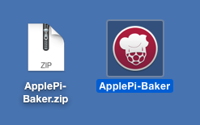

3. Press **crtl** key and click on *ApplePi-Baker* icon, then click *Open* in order to run it.

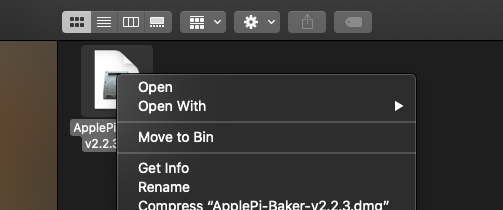

4. Enter your admin password and click OK.

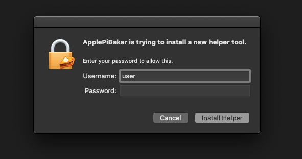

5. Select SD card drive. This can be recognized by the size of the card that is 4GB.

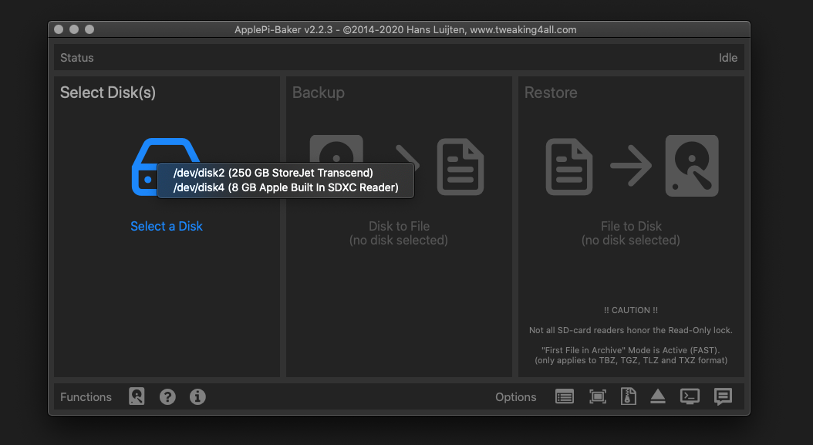

6. Select Red Pitaya OS image file.

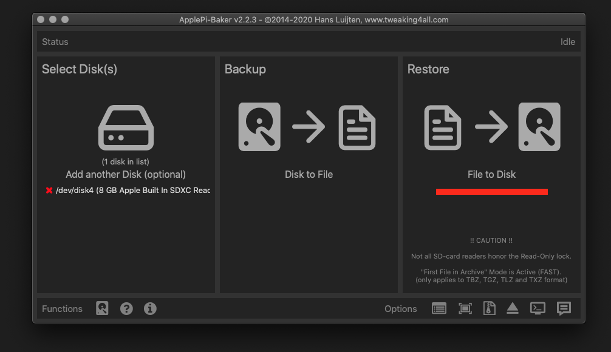

7. Click "Restore Backup" button in order to write image to SD card.

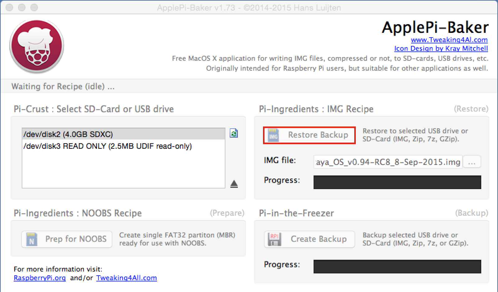

8. It's coffee time, application will show you Estimated Time for Accomplishment.

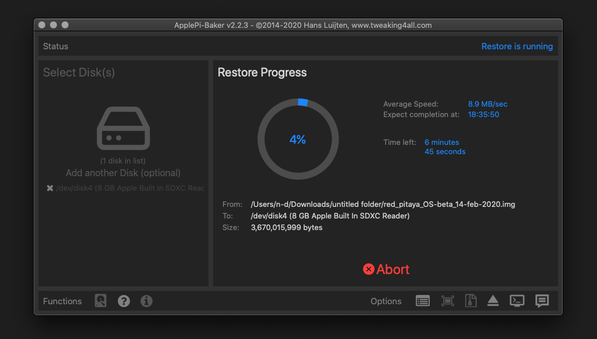

9. When operation is completed click "OK" and quit ApplePi-Baker.

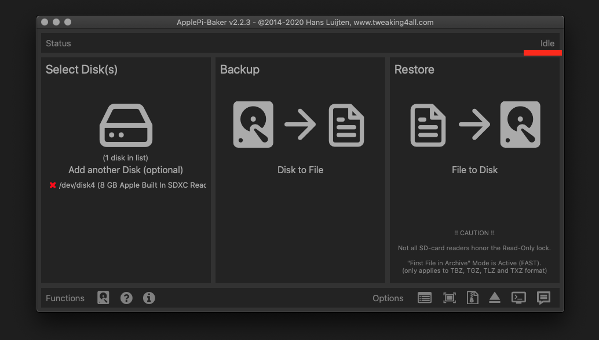

.. _macos_cli:

============
Command line
============

#. Insert SD card into your PC or SD card reader.

   .. image:: SDcard_insert.jpg

#. Click **cmd + space**, type **Disk Utility** into the search box and press enter.
   From the menu select your SD card and click on **Erase** button (be careful not to delete your disk!).

   .. image:: SDcard_macOS_DiskUtility.png

#. Click **cmd + space**, type in **Terminal** and press enter.
   In the terminal window type: ``cd``, press enter,
   then type: ``cd Desktop`` and press enter again.

#. Unmount the partition so that you will be allowed to overwrite the disk.
   In Terminal type: ``diskutil list`` and press enter.
   This will show you the list of all memory devices.

   .. image:: Screen-Shot-2015-08-07-at-16.59.50.png

   Unmount with: ``diskutil UnmountDisk /dev/diskn``
   (insert the number ``n`` of your disk correctly!)

   .. image:: Screen-Shot-2015-08-07-at-17.14.34.png

#. Type in: ``sudo dd bs=1m if=path_of_your_image.img of=/dev/rdiskn``
   (Remember to replace ``n`` with the number that you noted before!)
   (notice there is letter ``r`` in front of the disk name, use that as well!)

   .. image:: Screen-Shot-2015-08-07-at-17.14.45.png

#. Type in your password and wait a few minutes for the image to be written.

#. When the image is written, type: ``diskutil eject /dev/diskn`` and press enter.

#. Safely eject the SD card.
