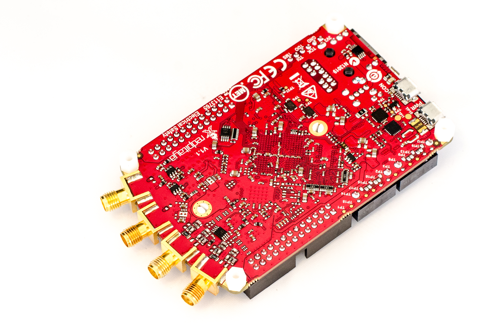

####################################
How to put Red Pitaya into alu case?
####################################

As an accessory for the Red PitayaThere are two different housings:

* the transparent plastic housing and
* the aluminum case.

The latter is particularly well placed to protect the board
against mechanical environmental influences and
shield against EMI radiation due to its nature.
In the aluminum case, we want to take a look here.

.. image:: rp_alucase.jpg

********
delivery
********

.. image:: rp_alucase_02.jpg

   Red Pitaya Aluminum Case: delivery

Delivered, the housing in a package in a typical Red Pitaya-style.
It includes:

* the enclosure itself,
* 4 screws that close the housing and hold the board,
* 4 rubber feet for secure positioning on the desk,
* a thermal pad (just barely be seen in the photo) and
* a transparent plastic rod, the light of red LED (Ready / CPU activity) transported to the finish.

******************
The case in detail
******************

A property that was, today, hardly anywhere is mentioned
and given the heat that the Red Pitaya generates, seems extremely useful,
I was a bit surprised: The entire case acts as a heat sink.

.. image:: rp_alucase_03.jpg

   Red Pitaya Aluminum Case: Interior

As can be seen well on the Interior,
is located in the upper part of the housing (right)
about 16x16x12mm large block (without the ribs measured),
which is to pass the heat to the housing.
On the lower part there are fits to a few air vents.

Else are all important recesses, which are needed for the connection,
and the expansion ports available to the **E1** and **E2** labeled.

.. image:: rp_alucase_04.jpg

.. image:: rp_alucase_05.jpg

Through the small slot on the right side, even the LEDs can still be seen - but without marking.

********
Assembly
********

To install the housing are a few more extra work needed.
First, the small plastic feet are removed.
This is quite easy by the clasp at the top is pressed with
a small pair of pliers and the foot pushes down.
When heat sink that works similarly.
Here pressing the clips together on the bottom
and pushes the holder gently towards top.
That's a little harder, because the plastic tabs
are a little larger than the holes, so be careful!
The heatsink is now bonded by the thermal grease or with the CPU.
With slight turning movements, however, can be easily lifted.

.. image:: rp_alucase_08.jpg

Next, the compound should be removed.
There are special solutions at any computer store.
I've taken `akasa TIM clean CPU and heatsink cleaner <http://indibit.de/recommends/akasa_timclean>`_.
Should just be anything suitable on hand,
goes certainly a damp cloth with a little alcohol.

Now the thermal pad is adhered to the CPU and the board into housing.
Do not forget the transparent plastic rod! From below the 4 screws screw, stick rubber feet, ready.

.. image:: rp_alucase.jpg
