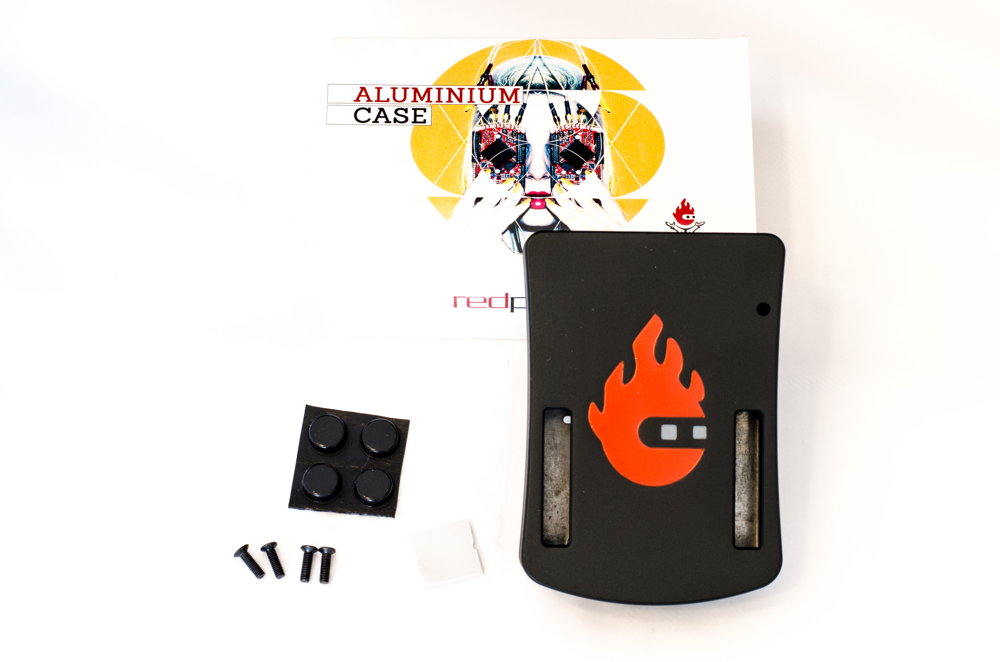
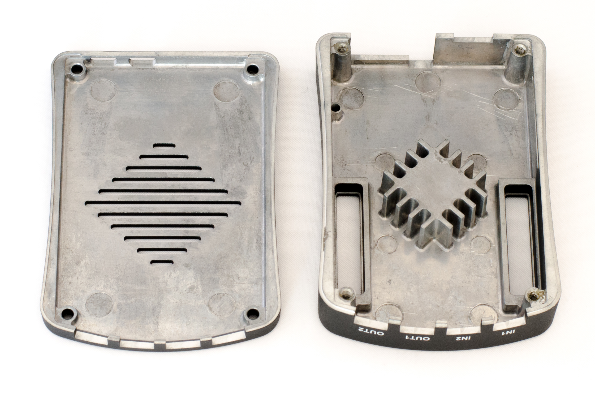
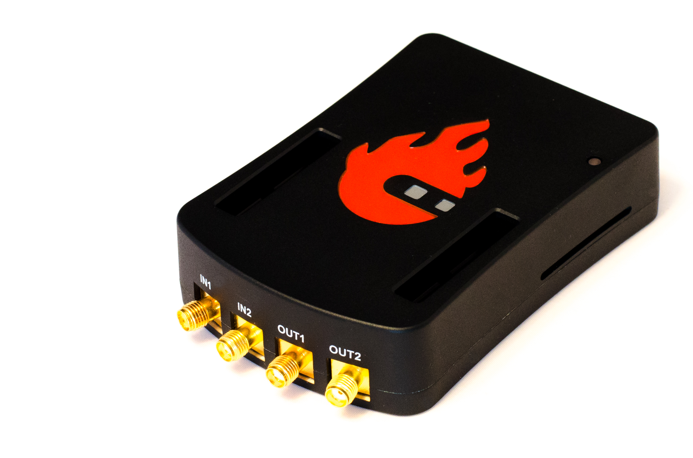
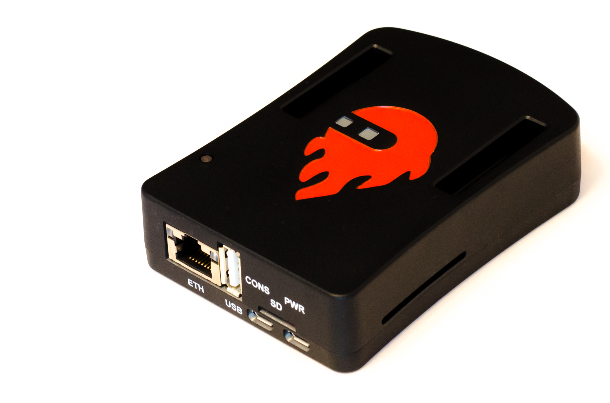
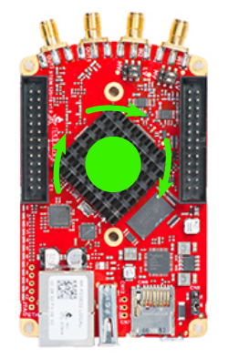
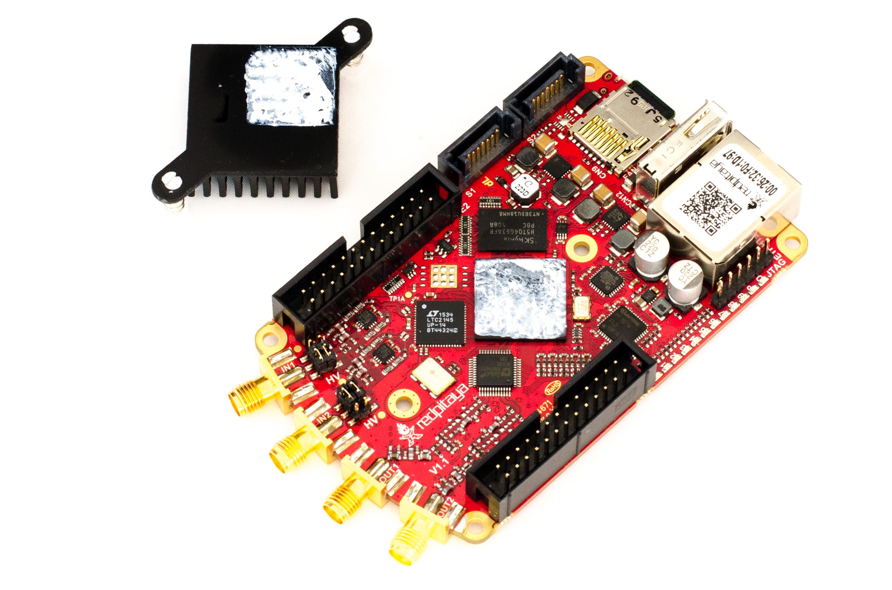
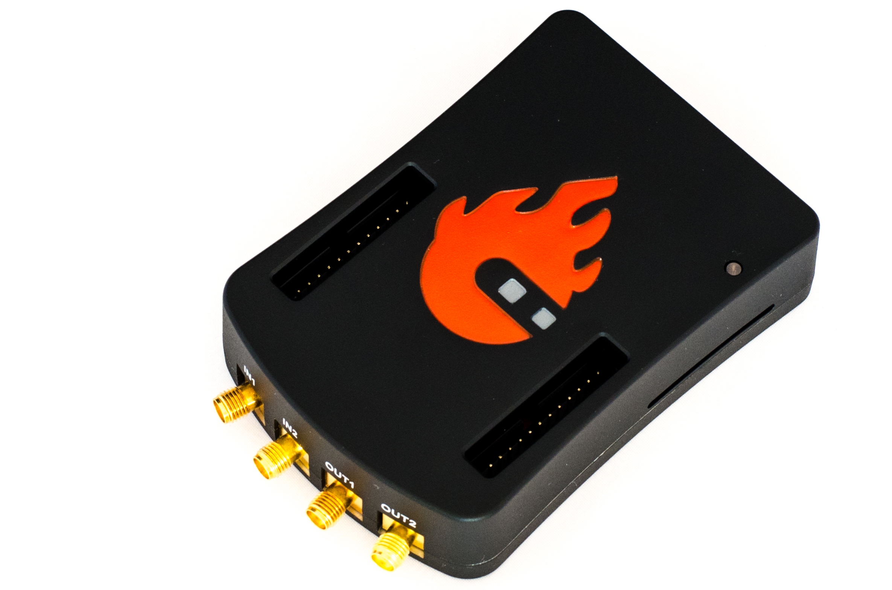

#################################
Red Pitaya Aluminum Case assembly
#################################

Regardless whether you bought your Red Pitaya aluminum case in a kit or as 
a separate add on, you will need to manually asembile it.

***************************************
Red Pitaya Aluminum Case assembly parts
***************************************

    
    Red Pitaya Aluminum Case asembly parts.
    
It includes:

    - 4 screws that close the housing and hold the board
    - 4 rubber feet for secure positioning on the desk
    - a thermal pad (just barely be seen in the photo)
    - a transparent plastic rod, the light of red LED (Ready / CPU activity) guided to the top of the caseing

    Interior of the Red Pitaya Aluminum Case.
    

On the Interior, there is a block located in the upper part of the housing (right)
which passes the heat to the housing, hence the entire case acts as a heat sink.

On the lower part there are fits to a few air vents (left).

Apertures in the case expose connections to the expansion ports **E1** and **E2**.

    
********
Assembly
********

1. Remove small plastic feet by pressing the clips at the top, with
   a small pair of pliers and push the feet down.
   
   .. figure:: rp_alucase_07.jpg

      Bottom of the Red Pitaya board showing the plastic feet.

#. For STEMlab 125 -14 repeat the procedure with the heat sink by pressing the clips together on the bottom
   and push the holder gently up.
   
#. The heat sink STEMlab 125 -10 is bonded with the FPGA, slightly turn the heat sink, as shown in
   the picture below, until it comes loose.
   

    
    Top of the Red Pitaya board showing the removed heat sink.

4. Remove the remainder of the thermal paste.

#. Place the Red Pitaya board into the bottom part of casing.

#. Turn the top part of the casing upside down and place the light guiding plastic.

#. Close it up with the bottom part of casing including the Red Pitaya board.
   Make sure that holes from the board and the caseing are aligned.

#. Screw the 4 screws.

#. Stick rubber feet.

