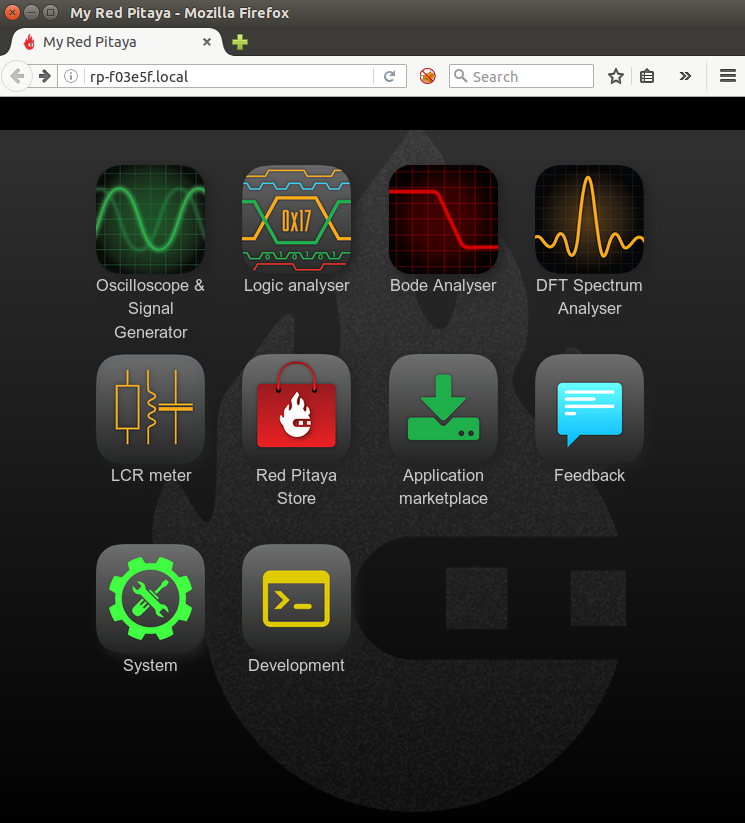

##########################
Connect to your Red Pitaya
##########################

.. TODO preveri slovnico

Red Pitaya STEMlab boards are network attachable devices focused
on simple connectivity and quick accessibility.
Having a graphical user interface for your Oscilloscope,
Signal Generator, LCR meter and other Red Pitaya applications,
directly on your PC without any limitations such are limited
commands or controls or any installation of additional
software will provide you with a unique working experience.

Red Pitaya STEMlab boards can be connected over:

#. Local Area Network (LAN) - Requires a DHCP server on your LAN router
#. Direct Ethernet cable connection - Requires additional setting on users PC and STEMlab board
#. Wireless Network client - Requires an additional WiFi dongle available at Red Pitaya store
#. Access Point Mode - STEMlab board creates its own WiFi network

*****
Wired
*****

.. _LAN:

========================
Local Area Network (LAN)
========================

This is the most common and recommended way of connecting and using your Red Pitaya STEMlab boards.
Your LAN network needs to have DHCP settings enabled which is the case in majority of the local networks,
with this, simple *plug and play* approach is enabled.
Having STEMlab board connected the local network will enable quick access
to all Red Pitaya applications using only your web browser.
Simply follow this 3 simple steps:

1. Connect power supply to the Red Pitaya STEMlab board
2. Connect STEMlab board to the router or direc to the PC Ethernet socket
3. Open your web browser and in the URL filed type: ``rp-xxxxxx.local/``
       
.. note::

   ``xxxxxx`` are the last 6 characters from MAC address of your STEMlab board.
   MAC address is written on the Ethernet connector.
    

    
   Figure 1: Connecting your STEMlab board to the LAN network.

After the **third step** you will get a Red Pitaya STEMlab main page as shown below.

   Figure 2: STEMlab main page user interface.
    
================================
Direct Ethernet cable connection
================================

If there are some restrictions for the user to have STEMlab boards
on the DHCP LAN network **permanently** there is
a possibility to directly connect to your STEMlab board.

**Direct Ethernet Connection** was enabled from the start but until now some additional settings on the user's PC (**static IP configuration**) 
were necessary in order to set connection correctly. 
This step has been eliminated with the NEW OS 0.97 (and newer) and the only step needed is to plug the ethernet cable from your PC to the STEMlab board. 

**Here is the procedure for Direct Ethernet Connection**

**Windows 7,8,10** (the Bonjour service must be installed for Win 7/8)

1. Connect the ethernet cable and wait 30 sec
2. Open the web browser and type **rp-xxxxxx.local/** in the URL field
   

**Linux / Ubuntu**

1. Open Network settings, Edit Connection and for LAN network under IPv4 Settings select Method **Share to other computers**
2. Connect the ethernet cable and wait 30 sec
3. Open the web browser and type **rp-xxxxxx.local/** in the URL field
   
    
**MAC**

1. Connect the ethernet cable and wait 30 sec
2. Open the web browser and type **rp-xxxxxx.local/** in the URL field
   

.. note::
     xxxxxx - last 6 chracters from the MAC address (on the ethernet connector)

.. warning::
      **If you experience some problem when using Direct Ethernet Connection described above, try to *disable WiFi* connection on *your 
      PC* (if it has been enabled) and *reset the STEMlab* board(power off/on). If the problem still persist you can try STATIC IP configuration described below.**

**Static IP configuration**

This type of connection requires additional settings on your PC and STEMlab board. 

.. note::

   This connection is also arranged via Network manager application so users should first
   have access to the LAN  (DHCP) network in order to arrange static IP on the STEMlab board. 
    
How to set direct Ethernet connection is described bellow.

First step in connecting STEMlab board directly to LAN network and setting a static IP on it. 

1. Use recommended connection described in **Local Area Network (LAN)** section.
   Once you are successfully connected to your STEMlab board,
   open Network Manager and chose ``Static`` option.
   Input the static IP and click **Apply**.

   .. image:: connect-11.png

2. Second step is to set a network setting on the PC.
   Here we give an example on the Ubuntu 14.04 but it is very similar on the other OS also.
   To set a direct connection with your PC follow next steps:
    
   1. Open network manager on your PC
   2. Add new Ethernet connection
      **(There is no need to create new network since you can set
      static IP settings on the existing network and skip all steps up to step 5.)**

   .. image:: connect-12.png

3. Select **Ethernet** connection and press **Create** button

   .. image:: connect-13.png

4. Select the name of the new Ethernet connections

   .. image:: connect-14.png

5. Select **Method – Manual**, Press **Add** button and insert:

   - static IP address of your PC (must be different from the IP address of the STEMlab board),  
   - Netmask (input: 255.255.255.0)
   - Getaway (can be left empty)
   - DNS servers (can be left empty) and click **Save** button.

   .. image:: connect-15.png 

.. note::

    Once you have this settings arranged,
    connect Ethernet cable between your STEMlab board and PC,
    open web browser, in the web browser URL field input
    chosen STEMlab board static IP (in our example ``192.168.0.15``)
    and press enter.

********
Wireless
********
    
===========================
Wireless Network Connection
===========================

This type of the connection will enable wireless connection
to the Red Pitaya STEMlab board via your local WiFi network.
In order to connect your STEMlab board to the same WiFi network
on which you have connected your PC/Laptop first you need to use LAN connection.
Access your STEMlab board via web browser and start Network Manager application.
Trough this application all network settings of the STEMlab board are manageable.
Simply select the desired WiFi network, input password and select connect.
Once you have arranged WiFi network you don't need LAN connection anymore and
after the restart of the STEMlab board it will connect to the preset WiFi network automatically.

.. note::
   Connecting the STEMlab via WiFi network the additional WiFi dongle is needed.
   WiFi dongle is available here [Link to RS or similar].    

Steps on how to connect your STEMlab board over WiFi network are described bellow:
 
1. Start your STEMlab web user interface (Use connection described in :ref:`Local Area Network (LAN) connection <LAN>`)
2. Open Network Manager application
3. Insert WiFi dongle in the USB plug on the STEMlab board.
   Recommended WIFI USB dongle is Edimax EW7811Un.
   In general all WIFI USB dongles that use RTL8188CUS chipset should work.
    
    .. image:: connect-5.png

4. When the USB WiFi dongle is plugged in, the system will recognize it and enabled additional settings.
5. Select Client Mode, Desired WiFi network,  Insert password and click Connect.

   .. image:: connect-6.png

6. When your STEMlab board is connected
   the IP address will be shown on the user interface.
   This IP address is only for WiFi connection.
   You can check the connection by inputting a WiFi IP address
   in the web browser URL field (press enter after inputting). 
   
   .. image:: connect-7.png   

Now you have WiFi connection established.
If you restart STEMlab board it will connect to selected network 
automatically (if selected network is available).
Also you can disconnect LAN connection and your board will be 
still available over the WiFi network i.e WiFi IP address.
    
.. note::
    
   WiFi networks are generally not robust and the full performances of the Red Pitaya application can be affected. 
        
=================
Access Point mode
=================

When there are no LAN or WiFi networks available, STEMlab can act as an access point.
This will allow you to connect your PC/Laptop, Tablet or smart phone to the STEMlab directly over WiFi.

.. note::

   To use STEMlab as an access point a `Raspberry Pi USB WiFi <https://www.raspberrypi.org/products/raspberry-pi-usb-wifi-dongle/>`_ dongle is needed.

Follow the steps bellow to enable Access Point and connect to it.

1. Start your STEMlab web user interface (Use connection described **Local Area Network (LAN) connection**)
2. Open Network Manager application
3. Input the name and password of the Access Point network to be created
   (Password name should be at least 8 characters long. Do not use special signs.)
4. Connect your PC/Laptop/Tablet/Phone to the network created by STEMlab board.
5. Input Access Point network IP address to the web browser URL field and press enter.
    
.. note::
   When Access Point is enabled on STEMlab, it will continue to boot in Access Point configuration, untill it is disabled 
   in the Network Manager.
   
.. note::
    
   IP address in Access Point mode is always the same: 192.168.128.1

