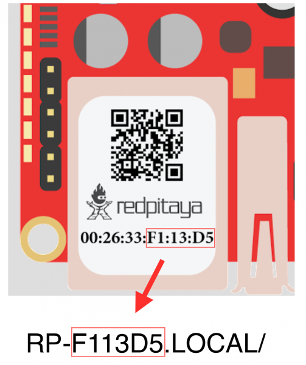

###############
Troubleshooting
###############

*******************
Upgrading to new OS
*******************

* licensing is not working
* status always shows offline
* OS version information is not updated
* other malfunctions of the OS and applications

Solution:

   Force refresh of the Red Pitaya application page

What if this doesn't help?

   Clear your browser cache and history.

************************
Connecting to Red Pitaya
************************

.. image:: blinking-all-led-on.png

#. First check the LEDs:

   If Green LED is not ON or it is blinking.
   Seems like something is wrong with the power supply or maybe it’s USB cable.
   Make sure that:

   * you have plugged the USB cable into the right USB connector on Red Pitaya
   * your power supply is 5V/2A
   * try to replace USB cable and also USB power supply

   If Green LED is ON, but Blue LED is not.
   In this case there is an error while loading Red Pitaya system from the SD card. Make sure that:

   * you have properly inserted Red Pitaya SD card and that it has properly installed Red Pitaya OS
   * try to use another SD card

   If Green and blue LEDs are on, but red and orange LEDs are not blinking.
   Red LED is indicating CPU heartbeat, while orange LED indicates access to SD card.
   Notice that this two LEDs always starts blinking 10s after green and blue LEDs are turned ON.

#. Make sure your Red Pitaya and computer are connected to same local network

#. If you are a Windows users make sure you have installed bonjur.

********************
Slow WIFI connection
********************

If your wireless connection with Red Pitaya works very slowly and
all the applications seems very unresponsive and are not running smoothly,
please check the following:

* check the wifi signal strength on your PC/tablet/smartphone
* check the wifi signal strength of your Red Pitaya.

    .. TODO dodaj link do direktorija
   #. Connect to your Red Pitaya via SSH connection. `How? <>`_

   #. Enter ``cat /proc/net/wireless`` command in order to get
      information about link quality and signal strength.

      .. image:: Screen-Shot-2015-09-26-at-20.28.27.png

      Link quality measures the number of packet errors that occur.
      The lower the number of packet errors, the higher this will be.
      Link quality goes from 0-100%.

      Level or signal strength is a simple measure of the amplitude of the signal that is received.
      The closer you are to the access point, the higher this will be.

* If you are in the area with many routers around you
  it might happen that more of them operate at the same wifi channel
  which drastically decreases data throughput and slows down connection.
  Here are the instructions how to
  `change your wifi router channel in order to optimize your wireless signal
  <http://www.howtogeek.com/howto/21132/change-your-wi-fi-router-channel-to-optimize-your-wireless-signal/>`_.
  For MAC users we recommend using diagnosed using Scan feature of
  `Wireless diagnostic <http://www.howtogeek.com/211034/troubleshoot-and-analyze-your-mac%E2%80%99s-wi-fi-with-the-wireless-diagnostics-tool/>`_
  tool in order to find best wifi channel.

**********************************************************************
Problems with upgradin OS, marketplace access or application unlocking
**********************************************************************

Make sure your Red Pitaya has access to the internet.

###
FAQ
###

******************************************************************
How can I make sure that my Red Pitaya has access to the internet?
******************************************************************

How can I make sure that my Red Pitaya has access to the internet?

1. Connect to your Red Pitaya over :ref:`SSH <ssh>`.
2. Make sure that you can ``ping google.com`` website:

   .. code-block:: shell-session

      root@rp-f03dee:~# ping -c 4 google.com
      PING google.com (216.58.212.142) 56(84) bytes of data.
      64 bytes from ams15s21-in-f142.1e100.net (216.58.212.142): icmp_seq=1 ttl=57 time=27.3 ms
      64 bytes from ams15s21-in-f142.1e100.net (216.58.212.142): icmp_seq=2 ttl=57 time=27.1 ms
      64 bytes from ams15s21-in-f142.1e100.net (216.58.212.142): icmp_seq=3 ttl=57 time=27.1 ms
      64 bytes from ams15s21-in-f142.1e100.net (216.58.212.142): icmp_seq=4 ttl=57 time=27.1 ms

      --- google.com ping statistics ---
      4 packets transmitted, 4 received, 0% packet loss, time 3004ms
      rtt min/avg/max/mdev = 27.140/27.212/27.329/0.136 ms

******************************************************************************************************
How can I make sure that Red Pitaya is connected to the same network as my computer/tablet/smartphone?
******************************************************************************************************

The most common answer would be:
Just make sure that your Red Pitaya and your PC/tablet/smartphone
are both connected to the same router or your smartphone hotspot.

In order to test it you can use a PC that is connected to
the same local network as your Red Pitaya and try the following:

1. Open terminal window.

   * **Windows**: Go to RUN, type in ``cmd`` and press enter.
   * **Linux**: Click on application button, type in ``Terminal`` and press enter.
   * **macOS**: Hit **cmd + space**, type in ``Terminal`` and press enter.

2. Enter ``arp -a`` command to list all devices in your local area network
   and try to find your Red Pitaya MAC address on the list.

   .. code-block:: shell-session

      $ arp -a
      ? (192.168.178.117) at 00:08:aa:bb:cc:dd [ether] on eth0
      ? (192.168.178.118) at 00:26:32:f0:3d:ee [ether] on eth0
      ? (192.168.178.105) at e8:01:23:45:67:8a [ether] on eth0

   .. note::

      If you have cable connection, then your MAC address
      is written on your Red Pitaya LAN connector.

   .. image:: MAC.png

   If you have established wireless connection,
   then you will most probably find the MAC address
   written on your wireless USB dongle.

3. Type your Red Pitaya IP into your WEB browser and connect to it.

   .. image:: Screen-Shot-2015-09-26-at-09.34.00.png

If your Red Pitaya is not listed on the list
of your local network devices in the local network,
then it is necessary to check that your Red Pitaya
is connected to your local network.

***********************************************************
How to discover my board’s IP address using its MAC number?
***********************************************************

Red Pitaya provides the Discovery tool for finding the
IP address of a board if you know its MAC address.
Follow the next steps to configure and use the tool:

#. log into `redpitaya.com <http://redpitaya.com/>`_ with your user account
#. click the `MY RP <https://store.redpitaya.com/customer/account/login/>`_ link
   in the right top corner to get to the board management page (including discovery)
#. click the `Add New Board <http://redpitaya.com/quick-start/>`_ link which will send you
   to the `Quick Start <http://redpitaya.com/quick-start/>`_ page
#. at the bottom of the quick start page enter your Red Pitaya MAC address and a name for the board then press **LET’S START**
#. now by visiting `MY RP <http://store.redpitaya.com/myequipment/list/>`_ you can see a list of your boards
   with their MAC and IP addresses and for each board a list of licensed applications

.. note::

   For now the old discovery should be still active,
   and should work if you use the old ``ecosystem.zip`` release.

***********************************************************
How to find Red Pitaya URL if it is not written on sticker.
***********************************************************

Red Pitaya URL is ``rp-xxxxxx.local`` where ``xxxxxx`` must be replaced
with last 6 digits of MAC address that is written on the sticker.

If RP MAC address is ``00:26:33:F1:13:D5``, last 6 digits are ``F113D5`` and URL is ``rp-f113d5.local``.

***********************************
How to solve connectivity problems?
***********************************

If **START** button is gray or clicking on it doesn’t connect you with your Red Pitaya,
please check the following:

*  Try to restart your Red Pitaya, wait for 60s and then refresh the
   `MY EQUIPMENT <http://store.redpitaya.com/myequipment/list/>`_ page.

   .. note::

      Last access time in the table should be updated each time
      Red Pitaya was successfully restarted and connected to the server.

*  If you are trying to establish wireless connection,
   please make sure you are using one of the supported WIFI dongles
*  Check if your PC/tablet/smartphone and Red Pitaya
   are both connected to the same local network. How?
*  Make sure that your Red Pitaya has access to the internet. How?

If your WIFI connection with Red Pitaya seems very slow please read this FAQ.

********************************************
Is Red Pitaya connected to my local network?
********************************************

1. Connect to your Red Pitaya to PC over serial console. How?

2. Type “ifconfig” and hit enter to check the status of your ethernet connection on Red Pitaya

   If you have connected to your Red Pitaya over wireless connection you should check the status of ``wlan0`` interface:

   .. image:: Screen-Shot-2015-09-26-at-18.09.15-1024x794.png

   If you have connected to your Red Pitaya over cable connection you should check ``eth0`` interface:

   .. image:: Screen-Shot-2015-09-26-at-18.14.35-1024x546.png

3. Type Red Pitaya IP to your WEB browser to see if you can connect to it

   .. image:: Screen-Shot-2015-09-26-at-09.34.00.png
