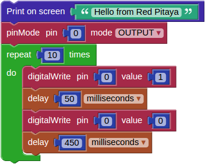

# Examples

## Example 1 - LED blink

Every developer facing a new toy (development board) starts with simple tasks, like lighting a LED.

To light a LED we need the *Red Pitaya* > **Set Led** block. The first entry in the block is used to choose one of the eight yellow LEDs. The second entry specifies if the LED should be turned 'ON' or 'OFF'. In the example the first *Set Led* block turns the led 'ON' while the second turns it 'OFF'.

There are *Program* > *Timing* > **delay** blocks after *Set Led*. The first delay specifies for how long the LED will be shining, while the second delay specifies for how long the LED will be dark.

*Set Led* an *delay* blocks are wrapped into a *Program* > *Loops* > **repeat** *while* block, this will repeat the LED 'ON', delay, LED 'OFF', delay sequence indefinitely, this causing the LED to blink.

### Experimentation

You can set another LED to blink instead of LED '0', by changing the first entry in both *Set Led* blocks to a different number. If the two blocks are set to control different LEDs, then one LED will always shine, and the other will always be dark.

You can change the rhythm of blinking by changing the values in *delay* blocks. Try it and see what happens.

You can also change everything else. In most cases, the program will not work. If this happens, just undo your changes, and try something else.

# Hardware

## Red Pitaya connectors

While it is possible to connect sensors and indicators directly to Red Pitaya *E1* and *E2* connectors, it is recommended to use shields. They enable the user to connect multiple peripherals without improvised wiring. It is also possible for developers to create their own custom shields.

### E1 connector

Connector E1 provides 16 *GPIO* (general purpose input/output) signals. All GPIO can be used to read sensor data, or drive indicators.

| function |  pin |  pin | function |
|----------|-----:|-----:|----------|
| GND      | '26' | '25' | GND      |
| NC       | '24' | '23' | NC       |
| NC       | '22' | '21' | NC       |
| NC       | '20' | '19' | NC       |
| DIO_N[7] | '18' | '17' | DIO_P[7] |
| DIO_N[6] | '16' | '15' | DIO_P[6] |
| DIO_N[5] | '14' | '13' | DIO_P[5] |
| DIO_N[4] | '12' | '11' | DIO_P[4] |
| DIO_N[3] | '10' | ' 9' | DIO_P[3] |
| DIO_N[2] | ' 8' | ' 7' | DIO_P[2] |
| DIO_N[1] | ' 6' | ' 5' | DIO_P[1] |
| DIO_N[0] | ' 4' | ' 3' | DIO_P[0] |
| +3.3V    | ' 2' | ' 1' | +3.3V    |

### E2 connector

Connector E2 provides 4 *AI* (analog input) signals, 4 *AO* (analog output) signals and signals for serial protocols *UART*, *SPI* and *I2C*. Analog inputs can be used to connect analog sensors. Analog outputs can be used to drive some indicators. Serial protocols can be used to connect more complex sensors, indicators and other peripherals.

| function |  pin |  pin | function |
|----------|-----:|-----:|----------|
| GND      | '26' | '25' | GND      |
| ADC_CLK- | '24' | '23' | ADC_CLK+ |
| GND      | '22' | '21' | GND      |
| AO[3]    | '20' | '19' | AO[2]    |
| AO[1]    | '18' | '17' | AO[0]    |
| AI[3]    | '16' | '15' | AI[2]    |
| AI[1]    | '14' | '13' | AI[0]    |
| I2C_GND  | '12' | '11' | common   |
| I2C SDA  | '10' | ' 9' | I2C_SCK  |
| UART_RX  | ' 8' | ' 7' | UART_TX  |
| SPI_CS   | ' 6' | ' 5' | SPI_CLK  |
| SPI_MISO | ' 4' | ' 3' | SPI_MOSI |
| -4V      | ' 2' | ' 1' | +5V      |

## Sensors and Indicators

Grove sensors from Seed
http://www.seeedstudio.com/

PIR Motion sensor
[[http://www.seeedstudio.com/wiki/Grove_-_PIR_Motion_Sensor]]

Buzzer
[[http://www.seeedstudio.com/wiki/Grove_-_Buzzer]]

Sound sensor
[[http://www.seeedstudio.com/wiki/Grove_-_Sound_Sensor]]

# Software

## Red Pitaya blocks

