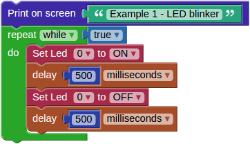
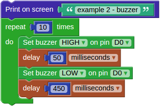
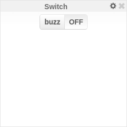
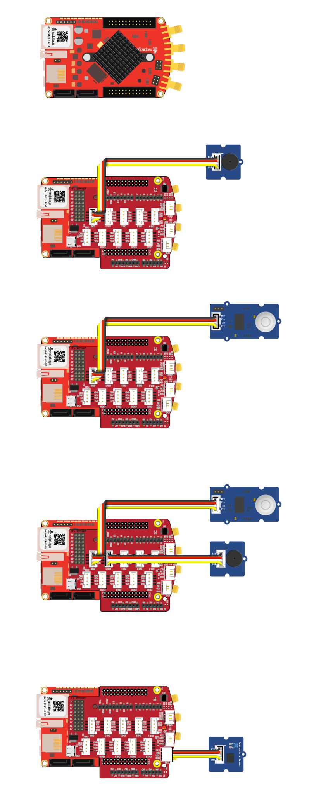
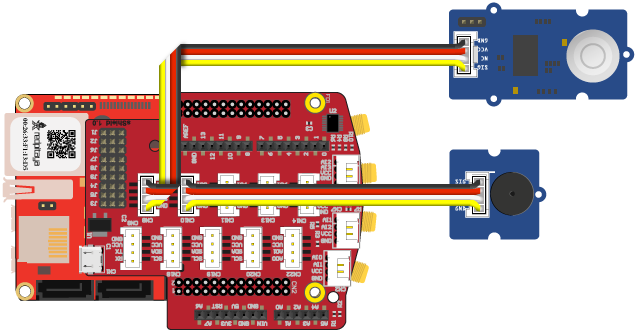
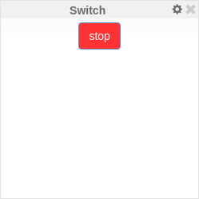
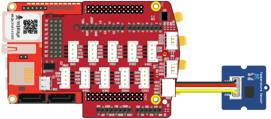

# Examples

TODO: add some generic wiring descriptions of the extension module.

## Example 1 - LED blink

Every developer facing a new toy (development board) starts with simple tasks, like lighting a LED.

### Wiring

Components:
1. Red Pitaya

This example does not require the extension module yet, there are 8 LEDs on the Red Pitaya board, which can be turn `ON` or `OFF`.

### Description

To light an LED we need the *Red Pitaya* > **Set [] Led on pin []** block. The first entry in the block is used to choose one of the eight yellow LEDs. The second entry specifies if the LED should be turned `ON` or `OFF`. In the example the first *Set Led* block turns the led `ON` while the second turns it `OFF`.

There are *Program* > *Timing* > **delay [] []** blocks after *Set Led*. The *delay* block provides a time delay of the specified amount of seconds/milliseconds. The first delay specifies for how long the LED will be shining, while the second delay specifies for how long the LED will be dark.

*Set Led* an *delay* blocks are wrapped into a *Program* > *Loops* > **repeat while [] []** block, this will repeat the LED `ON`, delay, LED `OFF`, delay sequence indefinitely, this causing the LED to blink.

### Experimentation

You can set another LED to blink instead of LED `0`, by changing the first entry in both *Set Led* blocks to a different number. If the two blocks are set to control different LEDs, then one LED will always shine, and the other will always be dark.

You can change the rhythm of blinking by changing the values in *delay* blocks. Try it and see what happens.

You can also change everything else. In most cases, the program will not work. If this happens, just undo your changes, and try something else.

## Example 2 - Buzzer

This example introduces the extension module, the Grove Buzzer, *Dashboard* block *Switch* and variables. We will be able to use an on screen switch is used to turn a buzzer `ON` and `OFF`.

### Wiring

Components:
1. Red Pitaya
2. extension module
3. [Grove Buzzer](http://www.seeedstudio.com/wiki/Grove_-_Buzzer)

Connect the extension module to Red Pitaya. Connect the Buzzer to the *CN12* connector on the extension module which is part of a group of connectors providing digital input/output signals.

### Description

To sound the buzzer we need *Indicators* > *Buzzer* > **Set buzzer [] on pin []** block. We can set it to `HIGH` (buzzing) or `LOW` (silent). We also have to specify to which data signal the buzzer is connected, in out example this is `D0`, the first of 16 digital IO (input/output) signals available on the *CN9* extension module connector.

The **Switch** block from the *Dashboard* generates a named signal each time it is toggled, additionally is sends the `ON` and `OFF` status after the change. To receive this signal the *Signal* > **On receive signal [] with signal value [] Do** block is used. The switch and the receiver must use the same signal name. When the switch is toggled the receiver will execute the code inside the block, but first it will set the variable `buzz_state` to the state of the switch. The *Program* > *Logic* > **if [] do [] else []** block is used to turn `HIGH` the buzzer only if the switch is set to `ON`, else the buzzer will be turned to `LOW`. 

### Experimentation

An important programming concept introduced in this example is a variable. Variables are used by programs to memorize numbers, ON/OFF states, text and many other things. When choosing a name for a variable, find something meaningful, so the name will remind you of the variables purpose. The same program can be used to control a LED, try to add a *Set Led* block, so it will shine while the buzzer is silent.

## Example 3 - PIR Motion Sensor

The previous examples only used indicators, LED and buzzer. This example is using an infra red sensor to detect motion, so the program knows, if somebody is moving in the sensors vicinity. The program will check for motion every second, and if the motion is detected it will report it by printing a line containing the current time on the screen.

### Wiring

Components:
1. Red Pitaya
2. extension module
3. [Grove PIR Motion Sensor](http://www.seeedstudio.com/wiki/Grove_-_PIR_Motion_Sensor)

Connect the PIR Motion Sensor to the *CN12* connector on the extension module.

### Description

An infinite loop with a 1 second delay at the end is used again. Inside the loop there is a *Program* > *Logic* > **if [] do []** block, which will execute its contents on the condition that the *Sensors* > *Motion sensor* > **get motion from []** will return true. This will happen each time somebody is moving in the vicinity of the sensor. The sensor can be attached to various connectors on the extension module, here the `D0` option is used as specified in the sensor block.

If the condition is true the *Program* > *Screen and keyboard* > **Write on screen []** block will be executed. A text block must be placed inside, here the *Program* > *Text* > **create text with [] [] ...** is used to concatenate several short text strings into one longer. The first string "Motion detected at: " is never changing so it is placed inside the *Program* > *Text* > **" "** block. We also wish to print the actual time (hour:minute:second), blocks for time strings can be found inside *Program* > *Date and Hour* > **get [] of day**.

### Experimentation

Similar to indicators, sensors can also be attached to different extension module connectors, here the `D0` connector (connector *CN12*) is used, you can try attaching to a different connector and changing the number. This will become handy, when a combination of multiple sensors indicators will be used and it will not be possible to attach them to the same connector. You should also try changing the printed text, for example adding the date.

## Example 4 - Alarm

This example is a combination of previous examples and is also introducing functions. The PIR motion sensor will detect moving persons, while the LED and buzzer will be used to sound the alarm. There is also an option to remotely disable the alarm by pressing an on-screen button.

### Wiring

Components:
1. Red Pitaya
2. extension module
3. [Grove PIR Motion Sensor](http://www.seeedstudio.com/wiki/Grove_-_PIR_Motion_Sensor)
4. [Grove Buzzer](http://www.seeedstudio.com/wiki/Grove_-_Buzzer)

Connect the PIR Motion Sensor to the *CN12* connector and the buzzer to the *CN11* connector on the extension module.

### Description

The main block contains a loop repeating 10 times each second. Inside the loop the motion sensor is checked and its status is stored into the variable `status`. If motion is detected the program will start executing another loop, which will sound the buzzer and blink a LED 60 times, unless in the meantime the variable `status` changes to `false`.

The second block is executed each time the *stop* button (*Switch* with the *push* option enabled under settings). The purpose of this block is to stop the alarm, this is achieved by changing the value of the `status` variable to `false`.

The third block is a function from *Program* > *Functions* > **to [] []**. Functions are used to store code which is used in multiple places. In this case the function is named `timestamp`, since when executed, it will return a string containing the current time. If you look at the first two blocks, you will see one prints the alarm start time, the other the alarm stop time, both use the same `timestamp` function to provide the time string.

The first two blocks are running at the same time, the first one is checking for motion, the second is checking for button presses. The variable `status` is used to share/pass information between them.

TODO: there seems to be some issues with concurrent execution and signals, therefore do expect problems.

### Experimentation

By using a different loop type, you could change the alarm to sound until a button on screen is pressed, without the 30 second timeout (60 repetitions each taking o.5 seconds).

## Example 5 - Temperature logger

This example shows how analog sensors can be used. The previous digital sensors only supported digital values like `ON/OFF`, `HIGH/LOW` or `1/0`. Analog sensor can provide a range of numbers like temperature, pressure, humidity, brightness, ... Another new feature described in this example is how to draw a graph of temperature changing over time.

### Wiring

Components:
1. Red Pitaya
2. extension module
3. [Grove Temperature Sensor V1.2](http://www.seeedstudio.com/wiki/Grove_-_Temperature_Sensor_V1.2)

Connect the Temperature Sensor V1.2 to the *CN0* connector on the extension module which is part of a group of connectors providing analog input signals.

### Description

### Experimentation

 

# Hardware

## Visual programming extension module connectors

The black connectors on the sides are compatible with Arduino, white connectors on the front provide analog inputs, and there are two rows of gray connectors at the center which provide digital I/O, UART, I2C or analog outputs. On the bottom there are connectors to the Red Pitaya board.

### Grove module connectors

This are dedicated connectors compatible with [Grove modules](http://www.seeedstudio.com/depot/category_products?themes_id=1417 "seeed Grove modules").

| pin | CN0  | CN1  | CN2  | CN3  | CN4  | CN5  | CN6  | CN7  | CN8  | CN9  | CN10 | CN11 | CN12 |
|-----|------|------|------|------|------|------|------|------|------|------|------|------|------|
| `1` | AI0  | AI1  | AI2  | AO0  | SCL  | SCL  | SCL  | RX   | IO8  | IO6  | IO4  | IO2  | IO0  |
| `2` | AI1  | AI2  | AI3  | AO1  | SDA  | SDA  | SDA  | TX   | IO9  | IO7  | IO5  | IO3  | IO1  |
| `3` | VCC  | VCC  | VCC  | VCC  | VCC  | VCC  | VCC  | VCC  | VCC  | VCC  | VCC  | VCC  | VCC  |
| `4` | GND  | GND  | GND  | GND  | GND  | GND  | GND  | GND  | GND  | GND  | GND  | GND  | GND  |
|     | AI   | AI   | AI   | AO   | I2C  | I2C  | I2C  | UART | DIO  | DIO  | DIO  | DIO  | DIO  |

### Arduino shield compatible connectors

This set of connectors is partially compatible with the Arduino shield connector.

| function | pin | comment       |
|----------|-----|---------------|
| IO0      | `1` | D[0]          |
| IO1      | `2` | D[1]          |
| IO2      | `3` | D[2]          |
| IO3      | `4` | D[3]          |
| IO4      | `5` | D[4]          |
| IO5      | `6` | D[5]          |
| IO6      | `7` | D[6]          |
| IO7      | `8` | D[7]          |

| function | pin | comment       |
|----------|-----|---------------|
| IO8      | `1` | D[8]          |
| IO9      | `2` | D[9]          |
| IO10     | `3` | D[10]         |
| IO11     | `4` | D[11]         |
| IO12     | `5` | D[12]         |
| IO13     | `6` | D[13]         |
| GND      | `7` |               |
| AREF     | `8` | not connected |
| SDA      | `9` | I2C_SDA       |
| SCL      |`10` | I2C_SCL       |

| function | pin | comment       |
|----------|-----|---------------|
| A0       | `1` | AI[0]         |
| A1       | `2` | AI[1]         |
| A2       | `3` | AI[2]         |
| A3       | `4` | AI[3]         |
| A4       | `5` | I2C_SDA       |
| A5       | `6` | I2C_SCL       |

| function | pin | comment       |
|----------|-----|---------------|
| A6       | `1` | not connected |
| A7       | `2` | not connected |
| Reset    | `3` | not connected |
| +3.3V    | `4` |               |
| +5.0V    | `5` |               |
| GND      | `6` |               |
| GND      | `7` |               |
| +VIN     | `8` | not connected |

### Connectors to Red Pitaya motherboard

While it is possible to connect sensors and indicators directly to Red Pitaya *E1* and *E2* connectors, it is recommended to use the extension module. It enables the user to connect multiple peripherals without improvised wiring. It is also possible for developers to create their own custom extensions.

#### Connector E1

Connector E1 provides 16 *GPIO* (general purpose input/output) signals. All GPIO can be used to read sensor data, or drive indicators.

| function |  pin |  pin | function |
|----------|-----:|-----:|----------|
| GND      | `26` | `25` | GND      |
| NC       | `24` | `23` | NC       |
| NC       | `22` | `21` | NC       |
| NC       | `20` | `19` | NC       |
| D[15]    | `18` | `17` | D[7]     |
| D[14]    | `16` | `15` | D[6]     |
| D[13]    | `14` | `13` | D[5]     |
| D[12]    | `12` | `11` | D[4]     |
| D[11]    | `10` | ` 9` | D[3]     |
| D[10]    | ` 8` | ` 7` | D[2]     |
| D[ 9]    | ` 6` | ` 5` | D[1]     |
| D[ 8]    | ` 4` | ` 3` | D[0]     |
| +3.3V    | ` 2` | ` 1` | +3.3V    |

#### connector E2

Connector E2 provides 4 *AI* (analog input) signals, 4 *AO* (analog output) signals and signals for serial protocols *UART*, *SPI* and *I2C*. Analog inputs can be used to connect analog sensors. Analog outputs can be used to drive some indicators. Serial protocols can be used to connect more complex sensors, indicators and other peripherals.

| function |  pin |  pin | function |
|----------|-----:|-----:|----------|
| GND      | `26` | `25` | GND      |
| ADC_CLK- | `24` | `23` | ADC_CLK+ |
| GND      | `22` | `21` | GND      |
| AO[3]    | `20` | `19` | AO[2]    |
| AO[1]    | `18` | `17` | AO[0]    |
| AI[3]    | `16` | `15` | AI[2]    |
| AI[1]    | `14` | `13` | AI[0]    |
| I2C_GND  | `12` | `11` | common   |
| I2C SDA  | `10` | ` 9` | I2C_SCK  |
| UART_RX  | ` 8` | ` 7` | UART_TX  |
| SPI_CS   | ` 6` | ` 5` | SPI_CLK  |
| SPI_MISO | ` 4` | ` 3` | SPI_MOSI |
| -4V      | ` 2` | ` 1` | +5V      |

## Sensors and Indicators

Grove sensors from Seed
http://www.seeedstudio.com/

PIR Motion sensor
http://www.seeedstudio.com/wiki/Grove_-_PIR_Motion_Sensor

Buzzer
http://www.seeedstudio.com/wiki/Grove_-_Buzzer

Sound sensor
http://www.seeedstudio.com/wiki/Grove_-_Sound_Sensor

Temperature Sensor V1.2
http://www.seeedstudio.com/wiki/Grove_-_Temperature_Sensor_V1.2

# Software

## Red Pitaya blocks

