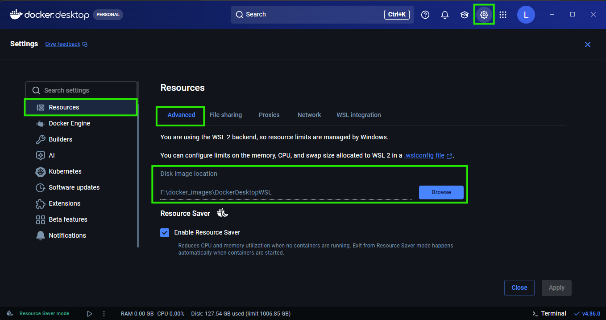

# Documentation: Docker Image for Vivado

## Overview

This project provides a Docker image `vivado:2025.1` for running AMD Vitis Unified Software Platform (Vivado).
The image is designed for headless usage in CI/CD pipelines for FPGA synthesis and development.

<br/>

---

## File Structure

| File | Purpose |
|------|---------|
| `Dockerfile.vivado` | Multi-stage Vivado image build |
| `install_config.txt` | Vivado installation configuration |

<br/>

---

## Requirements

To build the full image approximately 600 GB of space is required on the computer or an external disk of which:

- Roughly 120 GB is required for unpacking the Vivado archive.
- Around 450 GB is required for building the Docker image.

Once the build is finished, the temporary files can be deleted. This will bring the image size down to about 150 GB.

<br/>

---

## Build Preparation

### 1. Download the code

Download the RedPitaya/RedPitaya repository code and copy the "vivado_2025.1" directory to the chosen location of the Docker Image.

```bash
git clone https://github.com/RedPitaya/RedPitaya
```

<br/>

### 2. Install Docker

Install Docker or its desktop variation (Docker Desktop).

<br/>

### 3. Configure external disk (optional)

If you want to build the Docker image on an external disk:

- Linux - Adjust Docker and Contanerd service to enable building on an external drive
- Windows - Open settings in Docker Desktop and locate the "Resources" menu. Look for the "Disk image location" path under the "Advanced" tab.



Change the Disk image location path to the external disk. This will change the image build location from the system drive to the external drive.

<br/>

### 4. Obtaining Vivado Installer Files

Download the Vivado installer from the official AMD (formerly Xilinx) website. The current versions of Red Pitaya OS require Vitis 2025.1 for proper operation.

```bash
# Example for version 2025.1
wget https://www.amd.com/en/support/downloads/adaptive-socs-and-fpgas/development-tools/2025-1.html
```

<br/>

### 5. Extracting the Installer

Create a new directory named "vivado_installer" inside the build directory "vivado_2025.1". Extract the Vitis .tar image to the newly created "vivado_installer" directory.
Make sure that the **xsetup** file is located directly inside the vivado_installer. Any folders in between will result in build failure.

```bash
# Create directory for the installer
mkdir -p vivado_installer

# Extract the archive (replace with actual filename)
tar -xzf 3DFPGAs_AdaptiveSoCs_Unified_SDI_2025.1_0530_0145.tar -C vivado_installer

# Verify xsetup file exists
ls -la vivado_installer/xsetup
```

<br/>

### 6. Check the build directory

Ensure all files are in the same directory.

```bash
ls -la
# Should see:
# - install_config.txt
# - Dockerfile.vivado
# - vivado_installer/
```

Great, now we are ready to build the docker image.

<br/>

---

## Building the Docker Image

### Basic Build

**Linux**
```bash
export DOCKER_BUILDKIT=1
docker build -t vivado:2025.1 -f Dockerfile.vivado .
```

**Windows**

```bash
set DOCKER_BUILDKIT=1
docker build -t vivado:2025.1 -f Dockerfile.vivado .
```

<br/>
    
### Build with Platform Specification

**Linux**

```bash
# For AMD64 (x86_64)
export DOCKER_BUILDKIT=1
docker build --platform linux/amd64 -t vivado:2025.1 -f Dockerfile.vivado .
```

**Windows**

```bash
# For AMD64 (x86_64)
set DOCKER_BUILDKIT=1
docker build --platform linux/amd64 -t vivado:2025.1 -f Dockerfile.vivado .
```

<br/>

### Build Without Cache (Clean Build)**

**Linux**

```bash
export DOCKER_BUILDKIT=1
docker build --no-cache -t vivado:2025.1 -f Dockerfile.vivado .
```

**Windows**

```bash
set DOCKER_BUILDKIT=1
docker build --no-cache -t vivado:2025.1 -f Dockerfile.vivado .
```

<br/>

---

## Configuration and build file descriptions

### Vivado Installation Configuration

#### `install_config.txt` — Main Parameters

| Parameter | Value | Description |
|-----------|-------|-------------|
| `Edition` | Vitis Unified Software Platform | Software edition |
| `Destination` | `/opt/Xilinx` | Installation path |
| `Modules` | `Zynq-7000:1,DocNav:1` | Modules to install |

#### Installed Modules

The current configuration installs only:
- **Zynq-7000** — Zynq-7000 SoC support (enabled)
- **DocNav** — Documentation (enabled)

> **Note**: All other FPGA families (Virtex, Kintex, Artix, etc.) are disabled. If needed, uncomment the `Modules` line in `install_config.txt` and configure the required components by changing `:0` to `:1`.

<br/>

### Dockerfile: Build Details

#### Multi-stage Build

| Stage | Purpose |
|-------|---------|
| `builder` | Install Vivado from installer |
| `final` | Final image with minimal dependencies |

#### Builder Stage — Installed Packages

- `libncurses6`, `libncursesw6`, `libtinfo6` — library compatibility
- `libstdc++6`, `libc6-i386` — 32-bit compatibility
- `python3`, `python3-pip` — installer utilities
- `net-tools` — networking utilities
- `locales` — locale support

#### Symbolic Links for Compatibility

```bash
ln -s /lib/x86_64-linux-gnu/libtinfo.so.6 /lib/x86_64-linux-gnu/libtinfo.so.5
ln -s /lib/x86_64-linux-gnu/libncurses.so.6 /lib/x86_64-linux-gnu/libncurses.so.5
ln -s /lib/x86_64-linux-gnu/libncursesw.so.6 /lib/x86_64-linux-gnu/libncursesw.so.5
```

#### Locale Configuration

```bash
locale-gen en_US.UTF-8
update-locale LANG=en_US.UTF-8
```

#### Final Image Environment Variables

```dockerfile
ENV LANG=en_US.UTF-8 \
    LANGUAGE=en_US:en \
    LC_ALL=en_US.UTF-8
ENV XILINX_VIVADO=/opt/Xilinx/2025.1/Vivado
ENV PATH="${XILINX_VIVADO}/bin:${PATH}"
```

#### BuildKit Mounting Behavior

`--mount=type=bind` mounts in Docker BuildKit exist **only during the execution of the RUN command** and are automatically removed after completion. No explicit `umount` is required.

```dockerfile
# Mounts are available ONLY inside this RUN
RUN --mount=type=bind,source=vivado_installer,target=/tmp/vivado_installer,rw \
    --mount=type=bind,source=install_config.txt,target=/tmp/install_config.txt \
    cd /tmp/vivado_installer && \
    ./xsetup --batch Install --config /tmp/install_config.txt
# Mounts are automatically unmounted here
```

<br/>

---

## Creating a TAR Archive

### Export Image to TAR

```bash
docker save -o vivado-2025.1.tar vivado:2025.1
```

### Compress TAR File

```bash
gzip vivado-2025.1.tar
# Result: vivado-2025.1.tar.gz
```

### Quick Export with Compression (Single Command)

```bash
docker save vivado:2025.1 | gzip > vivado-2025.1.tar.gz
```

### Maximum Compression

```bash
docker save vivado:2025.1 | gzip -9 > vivado-2025.1.tar.gz
```

### View Image Information Before Export

```bash
# List images
docker images | grep vivado

# Detailed information
docker inspect vivado:2025.1

# Layer size
docker history vivado:2025.1
```

---

## Troubleshooting

### Locale Error: "cannot change locale (en_US.UTF-8)"

**Cause**: Required locale missing in the image.

**Solution**: Ensure `locales` package and locale generation are added to Dockerfile, or specify variables at runtime:

```bash
docker run -e LANG=en_US.UTF-8 -e LC_ALL=en_US.UTF-8 ...
```

<br/>

### Error: "libtinfo.so.5: cannot open shared object file"

**Cause**: Missing symbolic links to libraries.

**Solution**: Check for links:

```bash
docker run --rm vivado:2025.1 ls -la /lib/x86_64-linux-gnu/libtinfo.so*
```

<br/>

### Error: Vivado installer not found during build

**Cause**: Incorrect directory structure.

**Solution**:

```bash
ls -la vivado_installer/xsetup
# Should exist and be executable
chmod +x vivado_installer/xsetup
```

<br/>

### Vivado crashes at `launch_runs` (`Abnormal program termination`)

**Cause**: the Xilinx license manager `dlopen()`s `libudev` to derive the host
id, and its use of the library corrupts the heap under the glibc shipped in
Ubuntu 24.04. The crash happens inside `udev_enumerate_scan_devices`, reported
either as signal 11 or as `realloc(): invalid pointer` with signal 6. Mounting
the host's `/run/udev` into the container does not help.

**Solution**: make the library unloadable so the manager falls back to another
host id source:

```bash
docker run --rm \
  -v /dev/null:/lib/x86_64-linux-gnu/libudev.so.1:ro \
  ... \
  vivado:2025.1
```

<br/>

### `xsct` or `arm-none-eabi-gcc` not found

**Cause**: only `Vivado/bin` is on the image `PATH`.

**Solution**: add the other tool directories in the container:

```bash
export PATH=/opt/Xilinx/2025.1/Vitis/bin:\
/opt/Xilinx/2025.1/gnu/aarch32/lin/gcc-arm-none-eabi/bin:$PATH
```

<br/>

### Vivado won't start (X server required)

**Cause**: Attempting to run in GUI mode.

**Solution**: Use batch mode:

```bash
vivado -mode batch -source script.tcl
# or
vivado -mode tcl -source script.tcl
```

<br/>

### Insufficient memory during synthesis

**Solution**: Increase memory limits for the container:

```bash
docker run --memory="16g" --memory-swap="16g" \
  vivado:2025.1
```

<br/>

### TAR archive is too large

**Solution**: Use maximum compression and clean Docker cache before export:

```bash
docker system prune -a
docker save vivado:2025.1 | gzip -9 > image.tar.gz
```

<br/>

### Verify no mounts remain in final image

```bash
# Check that no mounts exist in the final image
docker run --rm vivado:2025.1 mount | grep /tmp
# Should be empty
```

<br/>

---

## Quick Reference Commands

| Action | Command |
|--------|---------|
| Build image | `docker build -t vivado:2025.1 .` |
| Build with BuildKit | `DOCKER_BUILDKIT=1 docker build -t vivado:2025.1 .` |
| Export to TAR.GZ | `docker save vivado:2025.1 \| gzip > vivado-2025.1.tar.gz` |
| Load from TAR.GZ | `gunzip -c vivado-2025.1.tar.gz \| docker load` |
| Interactive run | `docker run -it vivado:2025.1` |
| Interactive run with locale | `docker run -it -e LANG=en_US.UTF-8 -e LC_ALL=en_US.UTF-8 vivado:2025.1` |
| View logs | `docker logs <container-id>` |
| Stop container | `docker stop <container-id>` |
| Remove container | `docker rm <container-id>` |
| Remove image | `docker rmi vivado:2025.1` |
| Check locale | `docker run --rm vivado:2025.1 locale` |
| Check Vivado | `docker run --rm vivado-:2025.1 vivado -version` |
